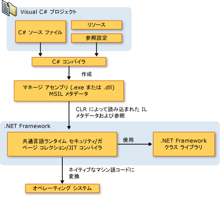

# C# 言語と .NET Framework の概要
C# は、タイプ セーフで洗練されたオブジェクト指向言語です。C# を使用すると、[!INCLUDE[dnprdnshort](~/includes/dnprdnshort-md.md)] で稼働する、安全で信頼性の高いさまざまなアプリケーションを構築できます。 C# を使用すると、Windows クライアント アプリケーション、XML Web サービス、分散コンポーネント、クライアント/サーバー アプリケーション、データベース アプリケーションなど、さまざまなアプリケーションを作成できます。 Visual C# には、高度なコード エディター、便利なユーザー インターフェイス デザイナー、統合デバッガーなど、C# 言語と [!INCLUDE[dnprdnshort](~/includes/dnprdnshort-md.md)] に基づいたアプリケーション開発をより簡単にする多数のツールが用意されています。  
  
> [!NOTE]
> Visual C# のドキュメントは、基本的なプログラミング概念を理解している方を対象に書かれています。 初心者である場合、Web で入手できる Visual C# Express が参考になります。 C# に関する書籍や Web リソースを利用して、実践的なプログラミング スキルを身に付けることもできます。  
  
## C# 言語  
 C# の構文は表現力が豊かですが、単純ですぐに覚えることができます。 C、C++、または Java に慣れていれば、C# の中かっこ ({}) 構文をすぐに理解できます。 これらの言語のいずれかを理解していると、一般に、C# での開発を短期間で始めることができます。 C# 構文では、C++ の複雑な部分が数多く簡略化され、null 許容値型、列挙体、デリゲート、ラムダ式、ダイレクト メモリ アクセスなど、Java にはない強力な機能が実装されました。 C# はジェネリック メソッドおよびジェネリック型をサポートしているため、タイプ セーフおよびパフォーマンスが向上し、反復子もサポートしているため、クライアント コードで簡単に使用できるカスタムの反復動作をコレクション クラスの実装側が定義できます。 [!INCLUDE[vbteclinqext](~/includes/vbteclinqext-md.md)] 式により、厳密に型指定されたクエリは高度な言語構成要素になります。  
  
 C# は、オブジェクト指向言語として、カプセル化、継承、およびポリモーフィズムの概念をサポートしています。 アプリケーションのエントリ ポイントである `Main` メソッドなど、変数とメソッドのすべてがクラス定義内でカプセル化されています。 親クラスから直接継承できるクラスは 1 つのみですが、クラスで実装できるインターフェイスの数は任意です。 親クラスの仮想メソッドをオーバーライドする場合、誤って再定義しないように、`override` キーワードを指定する必要があります。 C# の構造体はコンパクトなクラスのようなものです。インターフェイスを実装できるスタック割り当て型ですが、継承はサポートされていません。  
  
 C# には、基本的なオブジェクト指向の原則とは別に、次のように革新的な言語構成要素が用意されているため、ソフトウェア コンポーネントの開発が容易になります。  
  
-   メソッドのシグネチャをカプセル化する "*デリゲート*"。タイプ セーフなイベント通知を実行できます。  
  
-   プロパティ。プライベート メンバー変数へのアクセサーとして機能します。  
  
-   属性。実行時に型に関する宣言のメタデータを提供します。  
  
-   インライン XML ドキュメントのコメント。  
  
-   [!INCLUDE[vbteclinqext](~/includes/vbteclinqext-md.md)]。さまざまなデータ ソースを対象とする組み込みのクエリ機能を提供します。  
  
 COM オブジェクトやネイティブの Win32 DLL など、他の Windows ソフトウェアと対話するには、C# で "相互運用" というプロセスを使用します。 C# プログラムで相互運用機能を使用すると、ネイティブの C++ アプリケーションで実行できる機能をほぼすべて実行できます。 さらに、ダイレクト メモリ アクセスが必須の場合でも、ポインターと "unsafe" コードの概念がサポートされます。  
  
 C# のビルド処理は、C や C++ よりも単純で Java よりも柔軟です。 ヘッダー ファイルは分かれていません。また、メソッドや型を特定の順序で宣言する必要はありません。 C# のソース ファイルでは、クラス、構造体、インターフェイス、およびイベントをいくつでも定義できます。  
  
 その他に、C# の参照ドキュメントを紹介します。  
  
-   C# 言語の概略については、「[C# 言語仕様](../../csharp/language-reference/language-specification/index.md)」の第 1 章を参照してください。  
  
-   C# 言語の具体的な側面の詳細については、「[C# リファレンス](../../csharp/language-reference/index.md)」を参照してください。  
  
-   [!INCLUDE[vbteclinq](~/includes/vbteclinq-md.md)] の詳細については、「[LINQ (Language-Integrated Query)](../programming-guide/concepts/linq/index.md)」を参照してください。  

## .NET Framework のプラットフォーム アーキテクチャ  
 C# プログラムは、[!INCLUDE[dnprdnshort](~/includes/dnprdnshort-md.md)] で実行されます。これは、共通言語ランタイム (CLR: Common Language Runtime) と呼ばれる仮想実行システムや統合的なクラス ライブラリを備えた Windows の統合コンポーネントです。 CLR は、共通言語基盤 (CLI: Common Language Infrastructure) をサポートする Microsoft のシステムです。CLI は、複数の言語やライブラリをシームレスに連携する実行環境と開発環境を構築するための、基本的な国際規格です。  
  
 C# で記述したソース コードは、CLI 仕様に準拠する中間言語 (IL) にコンパイルされます。 IL コードおよびリソース (ビットマップや文字列など) は、アセンブリと呼ばれる実行可能ファイルのあるディスクに保存されます。アセンブリの拡張子は、一般的に .exe か .dll です。 アセンブリに含まれるマニフェストには、アセンブリの種類、バージョン、カルチャ、およびセキュリティ要件に関する情報が規定されています。  
  
 C# プログラムを実行すると、アセンブリが CLR に読み込まれ、マニフェストの情報に基づいてさまざまな処理が実行されます。 このとき、セキュリティ要件に一致すると、CLR で Just-In-Time (JIT) コンパイルが実行され、IL コードはネイティブのマシン語命令に変換されます。 CLR には、自動的なガベージ コレクション、例外処理、およびリソース管理に関するサービスも用意されています。 CLR で実行されるコードは、"マネージ コード" と呼ばれることがあります。反対に、特定のシステムを対象にしたネイティブのマシン語にコンパイルされたコードは、"アンマネージ コード" と呼ばれることがあります。 C# ソース コード ファイル、.NET Framework クラス ライブラリ、アセンブリ、および CLR について、コンパイル時間と実行時間の関係を次の図に示します。  
  
   
  
 言語の相互運用性は、[!INCLUDE[dnprdnshort](~/includes/dnprdnshort-md.md)] の主要機能です。 C# コンパイラで生成された IL コードは、共通型の仕様 (CTS: Common Type Specification) に準拠しています。このため、C# の IL コードは、Visual Basic、Visual C++ の .NET バージョンを始めとする、20 を超える CTS 準拠言語で生成されたコードと相互運用性があります。 1 つのアセンブリには、異なる .NET 言語で記述されたモジュールを複数含めることができます。また、同じ言語で記述されている場合と同様に、型を参照することもできます。  
  
 [!INCLUDE[dnprdnshort](~/includes/dnprdnshort-md.md)] には、実行時のサービス以外にも、4,000 クラスを超える多数のライブラリが用意されています。このライブラリは、ファイルの入出力、XML 解析のための文字列操作、Windows フォーム コントロールなど、役に立つさまざまな機能を備えた名前空間に構成されています。 C# アプリケーションでは、一般に、[!INCLUDE[dnprdnshort](~/includes/dnprdnshort-md.md)] クラス ライブラリを広範囲に使用して、一般的な "配管工事" のような作業を処理しています。  
  
 .NET Framework の詳細については、[Microsoft .NET Framework の概要](../../framework/get-started/overview.md)に関する記事を参照してください。  
  
## 参照  
 [C#](../../csharp/index.md) [Visual C# と Visual Basic の概要](/visualstudio/ide/getting-started-with-visual-csharp-and-visual-basic)
