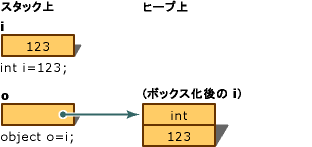
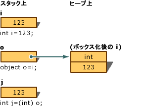

# <a name="boxing-and-unboxing-c-programming-guide"></a>ボックス化とボックス化解除 (C# プログラミング ガイド)
ボックス化とは、[値型](../../../csharp/language-reference/keywords/value-types.md)から `object` 型、またはその値型によって実装されている任意のインターフェイス型へ変換するプロセスのことです。 CLR により値型がボックス化されるとき、値は System.Object 内部にラップされ、マネージ ヒープに格納されます。 ボックス化解除すると、値型がオブジェクトから抽出されます。 ボックス化は暗黙的に行われ、ボックス化解除すると明示的になります。 ボックス化とボックス化解除の概念は、任意の型の値をオブジェクトとして扱うという C# の型システムの統一されたビューに基づいています。  
  
 次の例では、整数の変数 `i` を "*ボックス化*" し、オブジェクト `o` に代入しています。  
  
 [!code-csharp[csProgGuideTypes#14](../../../csharp/programming-guide/nullable-types/codesnippet/CSharp/boxing-and-unboxing_1.cs)]  
  
 次に、オブジェクト `o` は、次のようにボックス化解除し、整数の変数 `i` に代入できます。  
  
 [!code-csharp[csProgGuideTypes#15](../../../csharp/programming-guide/nullable-types/codesnippet/CSharp/boxing-and-unboxing_2.cs)]  
  
 次のコードは、C# でのボックス化の使用例です。  
  
 [!code-csharp[csProgGuideTypes#47](../../../csharp/programming-guide/nullable-types/codesnippet/CSharp/boxing-and-unboxing_3.cs)]  
  
## <a name="performance"></a>パフォーマンス  
 簡単な代入と比べて、ボックス化およびボックス化解除は負荷の大きいプロセスです。 値型をボックス化するときは、新しいオブジェクトを割り当てて構築する必要があります。 ボックス化ほどではありませんが、ボックス化解除に必要なキャストも大きな負荷がかかります。 詳しくは、「[パフォーマンス](https://msdn.microsoft.com/library/ms173196(VS.110).aspx)」をご覧ください。  
  
## <a name="boxing"></a>ボックス化  
 ボックス化は、値型をガベージ コレクション ヒープに格納するために使用します。 ボックス化とは、[値型](../../../csharp/language-reference/keywords/value-types.md)から `object` 型、またはその値型によって実装されている任意のインターフェイス型への暗黙の変換のことです。 値型をボックス化すると、オブジェクト インスタンスがヒープに割り当てられ、値が新しいオブジェクトにコピーされます。  
  
 値型の変数の宣言例を次に示します。  
  
 [!code-csharp[csProgGuideTypes#17](../../../csharp/programming-guide/nullable-types/codesnippet/CSharp/boxing-and-unboxing_4.cs)]  
  
 次のステートメントは、変数 `i` にボックス化を暗黙的に適用します。  
  
 [!code-csharp[csProgGuideTypes#18](../../../csharp/programming-guide/nullable-types/codesnippet/CSharp/boxing-and-unboxing_5.cs)]  
  
 このステートメントによって、ヒープ上にある `o` 型の値を参照するオブジェクト参照 `int` がスタック上に作成されます。 この値は、変数 `i` に割り当てられた値型の値のコピーです。 2 つの変数 `i` と `o` の違いを次の図に示します。  
  
   
ボックス化  
  
 次の例に示すように、明示的にボックス化を実行することもできますが、明示的なボックス化は不要です。  
  
 [!code-csharp[csProgGuideTypes#19](../../../csharp/programming-guide/nullable-types/codesnippet/CSharp/boxing-and-unboxing_6.cs)]  
  
## <a name="description"></a>説明  
 ここでは、ボックス化を使用して整数の変数 `i` をオブジェクト `o` に変換する例を示します。 変換後に、変数 `i` の値を `123` から `456` に変更します。 この例は、元の値型とボックス化されたオブジェクトが別個のメモリ位置を使用するため、それぞれ別々の値を格納できることを示しています。  
  
## <a name="example"></a>例  
 [!code-csharp[csProgGuideTypes#16](../../../csharp/programming-guide/nullable-types/codesnippet/CSharp/boxing-and-unboxing_7.cs)]  
  
## <a name="unboxing"></a>ボックス化解除  
 ボックス化解除とは、`object` 型から[値型](../../../csharp/language-reference/keywords/value-types.md)へ、またはインターフェイス型からそのインターフェイスを実装している値型への明示的な変換のことです。 ボックス化解除では、次の処理が行われます。  
  
-   オブジェクト インスタンスが、指定された値型のボックス化された値であることを確認します。  
  
-   インスタンスの値を値型の変数にコピーします。  
  
 次のステートメントに、ボックス化およびボックス化解除の両方を示します。  
  
 [!code-csharp[csProgGuideTypes#21](../../../csharp/programming-guide/nullable-types/codesnippet/CSharp/boxing-and-unboxing_8.cs)]  
  
 前のステートメントの結果は、次の図に示すとおりです。  
  
   
ボックス化解除  
  
 実行時に値型のボックス化解除を成功させるには、ボックス化解除の対象項目が、同じ値型のインスタンスのボックス化によって既に作成済みのオブジェクトへの参照である必要があります。 `null` をボックス化解除しようとすると <xref:System.NullReferenceException> が発生します。 互換性のない値型への参照をボックス化解除しようとすると、<xref:System.InvalidCastException> が発生します。  
  
## <a name="example"></a>例  
 次の例は、無効なボックス化解除の結果、`InvalidCastException` が発生する場合を示しています。 `try` と `catch` を使用すると、エラーの発生時にエラー メッセージが表示されます。  
  
 [!code-csharp[csProgGuideTypes#20](../../../csharp/programming-guide/nullable-types/codesnippet/CSharp/boxing-and-unboxing_9.cs)]  
  
 このプログラムの出力を以下に示します。  
  
 `Specified cast is not valid. Error: Incorrect unboxing.`  
  
 エラーを修正するには、次のステートメントを変更します。  
  
```  
int j = (short) o;  
```  
  
 この行を次のように変更します。  
  
```  
int j = (int) o;  
```  
  
 ステートメントを変更すると、変換が実行されて次の出力が得られます。  
  
 `Unboxing OK.`  
  
## <a name="c-language-specification"></a>C# 言語仕様  
 [!INCLUDE[CSharplangspec](~/includes/csharplangspec-md.md)]  
  
## <a name="related-sections"></a>関連項目  
 詳細情報  
  
-   [参照型](../../../csharp/language-reference/keywords/reference-types.md)  
  
-   [値型](../../../csharp/language-reference/keywords/value-types.md)  
  
## <a name="c-language-specification"></a>C# 言語仕様  
 [!INCLUDE[CSharplangspec](~/includes/csharplangspec-md.md)]  
  
## <a name="see-also"></a>参照  
 [C# プログラミング ガイド](../../../csharp/programming-guide/index.md)
