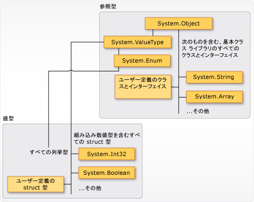

# <a name="types-c-programming-guide"></a>型 (C# プログラミング ガイド)
## <a name="types-variables-and-values"></a>型、変数、および値  
 C# は、厳密に型指定された言語です。 すべての変数および定数は、値に評価されるすべての式がそうであるように、型を持ちます。 すべてのメソッド シグネチャで、各入力パラメーターの型と戻り値の型が指定されます。 .NET クラス ライブラリでは、一連の組み込みの数値型が定義され、さらにファイル システム、ネットワーク接続、オブジェクトのコレクション、オブジェクトの配列、日付など、さまざまな論理構造を表すより複雑な型も定義されています。 一般的な C# プログラムでは、クラス ライブラリで定義されている型と、そのプログラムの問題領域に固有の概念をモデル化するユーザー定義の型が使用されます。  
  
 型には、次のような情報が保存されます。  
  
-   その型の変数が必要とする記憶領域。  
  
-   表すことができる最大値と最小値。  
  
-   含まれるメンバー (メソッド、フィールド、イベントなど)。  
  
-   継承元となった基本型。  
  
-   実行時に変数に割り当てられるメモリの場所。  
  
-   許可される演算の種類。  
  
 コンパイラは型情報を使用して、コード内で実行されるすべての演算が "*タイプ セーフ*" であることを確認します。 たとえば、[int](../../../csharp/language-reference/keywords/int.md) 型の変数を宣言すると、その変数は加算演算と減算演算で使用できます。 同じ演算を [bool](../../../csharp/language-reference/keywords/bool.md) 型の変数に対して実行しようとすると、コンパイラで次の例のようなエラーが発生します。  
  
 [!code-csharp[csProgGuideTypes#42](../../../csharp/programming-guide/nullable-types/codesnippet/CSharp/index_1.cs)]  
  
> [!NOTE]
>  C や C++ と異なり、C# では、[bool](../../../csharp/language-reference/keywords/bool.md) を [int](../../../csharp/language-reference/keywords/int.md) に変換することはできません。  
  
 コンパイラは、型情報を実行可能ファイル内にメタデータとして埋め込みます。 共通言語ランタイム (CLR: Common Language Runtime) は、実行時にこのメタデータを使用して、メモリの割り当て時および再要求時に、タイプ セーフであるかどうかを再度確認します。  
  
### <a name="specifying-types-in-variable-declarations"></a>変数宣言での型の指定  
 プログラム内で変数や定数を宣言するときは、その型を指定するか、[var](../../../csharp/language-reference/keywords/var.md) キーワードを使用して、コンパイラが型を推論できるようにする必要があります。 次の例では、組み込みの数値型と複雑なユーザー定義の型の両方を使用する変数宣言を示します。  
  
 [!code-csharp[csProgGuideTypes#36](../../../csharp/programming-guide/nullable-types/codesnippet/CSharp/index_2.cs)]  
  
 メソッドのパラメーターおよび戻り値の型は、メソッド シグネチャで指定します。 入力引数として [int](../../../csharp/language-reference/keywords/int.md) を使用する必要があり、戻り値として文字列を返すメソッドのシグネチャを次に示します。  
  
 [!code-csharp[csProgGuideTypes#35](../../../csharp/programming-guide/nullable-types/codesnippet/CSharp/index_3.cs)]  
  
 変数を宣言すると、新しい型を使用してその変数を再度宣言することはできず、宣言された型と互換性のない値をその変数に代入することはできません。 たとえば、[int](../../../csharp/language-reference/keywords/int.md) を宣言してから、それに [true](../../../csharp/language-reference/keywords/true-literal.md) のブール値を代入することはできません。 ただし、たとえば新しい変数に代入するときや、メソッドの引数として渡すときに、値を他の型に変換することは可能です。 データの損失を伴わない "*型変換*" は、コンパイラによって自動的に実行されます。 データの損失を伴う可能性のある変換には、ソース コードに *cast* を記述する必要があります。  
  
 詳細については、「[キャストと型変換](../../../csharp/programming-guide/types/casting-and-type-conversions.md)」を参照してください。  
  
## <a name="built-in-types"></a>組み込みの型  
 C# には、整数、浮動小数点値、ブール式、テキスト文字、10 進数値などのデータを表現するための標準的な組み込みの数値型が用意されています。 また、組み込みの `string` 型や `object` 型もあります。 これらの型は、すべての C# プログラムで使用できます。 組み込み型の詳細については、「[型のリファレンス表](../../../csharp/language-reference/keywords/reference-tables-for-types.md)」を参照してください。  
  
## <a name="custom-types"></a>カスタム型  
 独自のカスタム型を作成するには、[struct](../../../csharp/language-reference/keywords/struct.md)、[class](../../../csharp/language-reference/keywords/class.md)、[interface](../../../csharp/language-reference/keywords/interface.md)、および [enum](../../../csharp/language-reference/keywords/enum.md) の各構造体を使用します。 .NET クラス ライブラリ自体が、マイクロソフトによって提供された、ユーザーが独自のアプリケーションで使用できるカスタムの型のコレクションです。 既定では、クラス ライブラリで最も頻繁に使用される型は任意の C# プログラムで使用可能になっています。 その他の型は、その型が定義されているアセンブリへのプロジェクト参照を明示的に追加した場合にのみ使用可能になります。 コンパイラがアセンブリを参照できるようになると、そのアセンブリ内で宣言されている型の変数 (および定数) をソース コード内で宣言できるようになります。 詳細については、「[.NET クラス ライブラリ](../../../standard/class-library-overview.md)」を参照してください。  
  
## <a name="the-common-type-system"></a>共通型システム  
 .NET で型システムを使用する場合は、次の 2 つの基本事項を理解しておく必要があります。  
  
-   継承の原則がサポートされています。 他の型から型を派生させることができます。派生元の型は "*基本型*" と呼ばれます。 派生した型は、基本型のメソッド、プロパティ、およびその他のメンバーを (若干の制限付きで) 継承します。 基本型もなんらかの他の型から派生できます。この場合、派生した型はその継承階層内の両方の基本型のメンバーを継承します。 <xref:System.Int32?displayProperty=nameWithType> (C# のキーワードは [int](../../../csharp/language-reference/keywords/int.md)) などの組み込み数値型を含むすべての型は、最終的に <xref:System.Object?displayProperty=nameWithType> (C# のキーワードは [object](../../../csharp/language-reference/keywords/object.md)) という単一の基本型から派生します。 この一元化された型階層は、[共通型システム](../../../standard/base-types/common-type-system.md) (CTS) と呼ばれます。 C# での継承の詳細については、「[継承](../../../csharp/programming-guide/classes-and-structs/inheritance.md)」を参照してください。  
  
-   CTS の各型は、"*値型*" または "*参照型*" として定義されます。 これは、.NET クラス ライブラリのすべてのカスタムの型や、ユーザーが独自に定義した型にも当てはまります。 [struct](../../../csharp/language-reference/keywords/struct.md) キーワードを使用して定義した型は値型であり、すべての組み込み数値型は `structs` です。 [class](../../../csharp/language-reference/keywords/class.md) キーワードを使用して定義した型は、参照型です。 参照型と値型では、コンパイル時の規則や実行時の動作が異なります。  
  
 次の図は、CTS における値型と参照型の関係を示しています。  
  
   
CTS での値型と参照型  
  
> [!NOTE]
>  この図を見るとわかるように、最もよく使用される型はすべて <xref:System> 名前空間に属しています。 しかし、型が属している名前空間は、その型が値型と参照型のどちらであるかには関係ありません。  
  
### <a name="value-types"></a>値型  
 値型は、<xref:System.ValueType?displayProperty=nameWithType> の派生型である <xref:System.Object?displayProperty=nameWithType> から派生します。 <xref:System.ValueType?displayProperty=nameWithType> から派生した型は、CLR では特殊な動作をします。 値型の変数は、その値を直接含みます。つまり、変数がどのようなコンテキストで宣言されたとしても、必ずメモリがインラインで割り当てられます。 値型の変数には、独立したヒープ割り当てやガベージ コレクションのオーバーヘッドはありません。  
  
 値型には、[構造体](../../../csharp/language-reference/keywords/struct.md)と[列挙体](../../../csharp/language-reference/keywords/enum.md)の 2 つのカテゴリがあります。  
  
 組み込みの数値型は構造体であり、次のようにしてアクセスできるプロパティとメソッドを持ちます。  
  
```csharp  
// Static method on type Byte.  
byte b = Byte.MaxValue;  
```  
  
 ただし、宣言とそこへの値の代入は、あたかも単純な非集約型であるかのように行うことができます。  
  
```csharp  
byte num = 0xA;  
int i = 5;  
char c = 'Z';  
```  
  
 値型は、"*シール*" されています。たとえば <xref:System.Int32?displayProperty=nameWithType> から値型を派生させることはできません。構造体は <xref:System.ValueType?displayProperty=nameWithType> からしか継承できないため、任意のユーザー定義型または構造体を継承する構造体を定義することはできません。 ただし、構造体は 1 つ以上のインターフェイスを実装できます。 構造体型は、インターフェイス型にキャストできます。これを行うと、"*ボックス化*" 操作によって、構造体がマネージ ヒープ上の参照型オブジェクト内にラップされます。 ボックス化操作が発生するのは、入力パラメーターとして <xref:System.Object?displayProperty=nameWithType> を受け取るメソッドに値型を渡した場合です。 詳細については、「[ボックス化とボックス化解除](../../../csharp/programming-guide/types/boxing-and-unboxing.md)」を参照してください。  
  
 独自のカスタム値型を作成するには、[struct](../../../csharp/language-reference/keywords/struct.md) キーワードを使用します。 通常、構造体は、次の例に示すように、少数の関連する変数のコンテナーとして使用します。  
  
 [!code-csharp[csProgGuideObjects#1](../../../csharp/programming-guide/classes-and-structs/codesnippet/CSharp/index_4.cs)]  
  
 構造体の詳細については、「[Structs](../../../csharp/programming-guide/classes-and-structs/structs.md)」を参照してください。 .NET における値型の詳細については、「[値型](../../../csharp/language-reference/keywords/value-types.md)」を参照してください。  
  
 別の種類の値型として、[列挙体](../../../csharp/language-reference/keywords/enum.md)があります。 列挙体は、一連の名前付き整数定数を定義します。 たとえば、.NET クラス ライブラリの <xref:System.IO.FileMode?displayProperty=nameWithType> 列挙体には、ファイルを開く方法を指定する一連の名前付き整数定数が格納されています。 これは、次の例のように定義されます。  
 
 [!code-csharp[csProgGuideTypes#44](../../../csharp/programming-guide/nullable-types/codesnippet/CSharp/index_5.cs)]  
  
 定数 `System.IO.FileMode.Create` は、2 という値を持ちます。 しかし、人間がソース コードを読む場合は名前があるとわかりやすいため、このような場合は、リテラルの数値の定数を使用するよりも、列挙体を使用する方がよいと言えます。 詳細については、「<xref:System.IO.FileMode?displayProperty=nameWithType>」を参照してください。  
  
 すべての列挙体は、<xref:System.Enum?displayProperty=nameWithType> の派生型である <xref:System.ValueType?displayProperty=nameWithType> から派生します。 構造体に適用されるすべての規則が、列挙体にも適用されます。 詳細については、「[ 列挙型](../../../csharp/programming-guide/enumeration-types.md)」を参照してください。  
  
### <a name="reference-types"></a>参照型  
 [class](../../../csharp/language-reference/keywords/class.md)、[delegate](../../../csharp/language-reference/keywords/delegate.md)、配列、または [interface](../../../csharp/language-reference/keywords/interface.md) として定義された型は、"*参照型*" です。 参照型の変数を宣言した場合、実行時には、[new](../../../csharp/language-reference/keywords/new.md) 演算子によってオブジェクトが明示的に作成されるまで、この変数には [null](../../../csharp/language-reference/keywords/null.md) が格納されます。または、次の例に示すように `new` を使用して、別の場所で作成されたオブジェクトを割り当てることもできます。
  
```csharp  
MyClass mc = new MyClass();  
MyClass mc2 = mc;  
```  
   インターフェイスは、それを実装するクラス オブジェクトで一緒に初期化する必要があります。 `MyClass` が `IMyInterface` を実装している場合は、次の例のようにして `IMyInterface` のインスタンスを作成できます。  
  
```csharp  
IMyInterface iface = new MyClass();  
```  
  
 オブジェクトが作成されると、マネージ ヒープ上でメモリが割り当てられ、変数にはそのオブジェクトの場所への参照のみが格納されます。 マネージ ヒープを使用する型では、メモリの割り当て時と、CLR の自動メモリ管理機能 ("*ガベージ コレクション*") による再要求時の両方についてオーバーヘッドが発生します。 しかし、ガベージ コレクションも高度に最適化されるため、ほとんどのシナリオでは、パフォーマンス上の問題が発生することはありません。 ガベージ コレクションの詳細については、「[自動メモリ管理](../../../standard/automatic-memory-management.md)」を参照してください。  
  
 配列は、その要素が値型の場合でも、すべて参照型です。 配列は、<xref:System.Array?displayProperty=nameWithType> クラスから暗黙的に派生しますが、C# に用意されている次の例のような簡単な構文で宣言および使用します。  
  
 [!code-csharp[csProgGuideTypes#45](../../../csharp/programming-guide/nullable-types/codesnippet/CSharp/index_6.cs)]  
  
 参照型では、継承が全面的にサポートされています。 クラスの作成時には、[シール](../../../csharp/language-reference/keywords/sealed.md) クラスとして定義されているものを除く、他のすべてのインターフェイスまたはクラスから継承できます。また、作成したクラスから他のクラスを継承し、仮想メソッドをオーバーライドすることもできます。 独自のクラスを作成する方法の詳細については、「[クラスおよび構造体](../../../csharp/programming-guide/classes-and-structs/index.md)」を参照してください。 継承と仮想メソッドの詳細については、「[継承](../../../csharp/programming-guide/classes-and-structs/inheritance.md)」を参照してください。  
  
## <a name="types-of-literal-values"></a>リテラル値の型  
 C# では、リテラル値の型がコンパイラによって決定されます。 数値リテラルの型指定の方法を指定するには、その数値の末尾に文字を付加します。 たとえば、値 4.56 を float 型として扱うには、数値の後に "f" または "F" を付加して、`4.56f` のように指定します。 文字を付加しない場合、リテラルの型はコンパイラによって推論されます。 文字サフィックスによって指定できる型の詳細については、「[値型](../../../csharp/language-reference/keywords/value-types.md)」の各型のリファレンス ページを参照してください。  
  
 リテラルは型指定され、すべての型は最終的に <xref:System.Object?displayProperty=nameWithType> から派生するため、次のようなコードを記述してコンパイルできます。  
  
 [!code-csharp[csProgGuideTypes#37](../../../csharp/programming-guide/nullable-types/codesnippet/CSharp/index_7.cs)]  
  
## <a name="generic-types"></a>ジェネリック型  
 クライアント コードが型のインスタンスを作成したときに提供される実際の型 ("*具象型*") のプレースホルダーとして使用される 1 つまたは複数の "*型パラメーター*" で、型を宣言することもできます。 このような型は、*ジェネリック型*と呼ばれます。 たとえば、.NET の型 <xref:System.Collections.Generic.List%601?displayProperty=nameWithType> には、慣例により *T* という名前が与えられる 1 つの型パラメーターがあります。この型のインスタンスを作成するときには、たとえば文字列の場合なら、リストに含まれるオブジェクトの型を次のように指定します。  
 
```csharp
List<string> stringList = new List<string>();
stringList.Add("String example");
// compile time error adding a type other than a string:
stringList.Add(4);
```
 型パラメーターを使用することで、同じクラスを再利用して任意の型の要素を格納できます。このとき、各要素を[オブジェクト](../../../csharp/language-reference/keywords/object.md)に変換する必要はありません。 ジェネリック コレクション クラスが "*厳密に型指定されたコレクション*" と呼ばれるのは、コレクションの要素の固有の型をコンパイラが認識しているためで、たとえば、前の例の `stringList` オブジェクトに整数を追加しようとすると、コンパイル時にエラーが発生します。 詳細については、「[ジェネリック](../../../csharp/programming-guide/generics/index.md)」を参照してください。  
  
## <a name="implicit-types-anonymous-types-and-nullable-types"></a>暗黙の型、匿名型、および Null 許容型  
 前にも説明したとおり、ローカル変数 (クラスのメンバーではない) の型を暗黙的に指定するには、[var](../../../csharp/language-reference/keywords/var.md) キーワードを使用します。 変数の型はコンパイル時に決定されますが、その型はコンパイラによって指定されます。 詳細については、「[暗黙的に型指定されるローカル変数](../../../csharp/programming-guide/classes-and-structs/implicitly-typed-local-variables.md)」を参照してください。  
  
 場合によっては、メソッドの境界を越えて格納したり受け渡したりする予定のない単純な一連の関連値に名前付きの型を作成するのは便利ではないこともあります。 このような場合は、"*匿名型*" を作成できます。 詳細については、「[匿名型](../../../csharp/programming-guide/classes-and-structs/anonymous-types.md)」を参照してください。  
  
 値型には、通常、[null](../../../csharp/language-reference/keywords/null.md) 値を割り当てることができません。 しかし、型の後ろに `?` を付けることによって、null 値を設定できる値型を作成できます。 たとえば、`int?` は、[null](../../../csharp/language-reference/keywords/null.md) 値も設定できる `int` 型です。 CTS では、null 許容型は一般的な構造体型 <xref:System.Nullable%601?displayProperty=nameWithType> のインスタンスです。 Null 許容型は、数値が null になる可能性のあるデータベースとの間でデータを受け渡しする場合に、特に便利です。 詳細については、「[ull 許容型](../../../csharp/programming-guide/nullable-types/index.md)」を参照してください。  
  
## <a name="related-sections"></a>関連項目  
 詳細については、次のトピックを参照してください。  
  
-   [キャストと型変換](../../../csharp/programming-guide/types/casting-and-type-conversions.md)  
  
-   [ボックス化とボックス化解除](../../../csharp/programming-guide/types/boxing-and-unboxing.md)  
  
-   [dynamic 型の使用](../../../csharp/programming-guide/types/using-type-dynamic.md)  
  
-   [値型](../../../csharp/language-reference/keywords/value-types.md)  
  
-   [参照型](../../../csharp/language-reference/keywords/reference-types.md)  
  
-   [クラスと構造体](../../../csharp/programming-guide/classes-and-structs/index.md)  
  
-   [匿名型](../../../csharp/programming-guide/classes-and-structs/anonymous-types.md)  
  
-   [ジェネリック](../../../csharp/programming-guide/generics/index.md)  

## <a name="c-language-specification"></a>C# 言語仕様  
 [!INCLUDE[CSharplangspec](~/includes/csharplangspec-md.md)]  
  
## <a name="see-also"></a>参照  
 [C# リファレンス](../../../csharp/language-reference/index.md)  
 [C# プログラミング ガイド](../../../csharp/programming-guide/index.md)  
 [XML データ型の変換](../../../standard/data/xml/conversion-of-xml-data-types.md)  
 [整数型の一覧表](../../../csharp/language-reference/keywords/integral-types-table.md)
