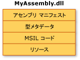
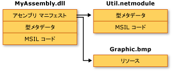

# アセンブリの内容
一般に、静的アセンブリは次の 4 つの要素から構成されます。  
  
-   アセンブリ メタデータを保持する[アセンブリ マニフェスト](../../../docs/framework/app-domains/assembly-manifest.md)。  
  
-   型メタデータ。  
  
-   型を実装する MSIL (Microsoft Intermediate Language) コード。  
  
-   一連のリソース。  
  
 このうち必須なのはアセンブリ マニフェストだけですが、アセンブリになんらかの機能を与えるには、型またはリソースのいずれかが必要になります。  
  
 アセンブリのこれらの要素は、いくつかの方法でグループ化できます。 1 つの方法として、次の図に示すように、すべての要素を 1 つの物理ファイルにまとめることができます。  
  
   
シングルファイル アセンブリ  
  
 別の方法として、1 つのアセンブリの要素を複数のファイルに分けることもできます。 この操作には、コンパイル済みコードのモジュール (.netmodule)、リソース (.bmp ファイルや .jpg ファイルなど)、アプリケーションで必要なその他のファイルなどを使用できます。 複数の言語で記述されたモジュールを組み合わせたり、使用頻度の低い型を必要なときにだけダウンロードされるモジュールに配置することでアプリケーションのダウンロードを最適化したりする場合は、マルチファイル アセンブリを作成します。  
  
 あるアプリケーションの開発において、特定のユーティリティ コードを独立したモジュールに配置し、サイズの大きいリソース ファイル (ここでは .bmp イメージ) を元のファイルに残しておく例を次の図に示します。 .NET Framework では、ファイルが参照される場合にだけそのファイルがダウンロードされます。参照頻度の低いコードをアプリケーションとは別のファイルに保存することで、コードのダウンロードが最適化されます。  
  
   
マルチファイル アセンブリ  
  
> [!NOTE]
>  マルチファイル アセンブリを構成する各ファイルは、ファイル システムによって物理的にリンクされるわけではありません。 これらのファイルはアセンブリ マニフェストによってリンクされ、共通言語ランタイムがこれらのファイルをまとめて管理します。  
  
 この例では、MyAssembly.dll に含まれるアセンブリ マニフェストに記述されているように、3 つのファイルがすべて 1 つのアセンブリに属しています。 ファイル システムにとっては、これらは 3 つの独立したファイルです。 Util.netmodule というファイルは、アセンブリ情報を含んでいないため、モジュールとしてコンパイルされています。 アセンブリの作成時に、アセンブリ マニフェストが MyAssembly.dll に追加され、その Util.netmodule および Graphic.bmp との関係が示されます。  
  
 ソース コードをデザインするときは、作成するアプリケーションの機能を 1 つのファイルにまとめるのか複数のファイルに分割するのか、分割する場合は機能をどのように分けるのかを明確に決める必要があります。 .NET Framework コードをデザインする場合も同様に、機能を 1 つのアセンブリにまとめるのか複数のアセンブリに分割するのか、分割する場合は機能をどのように分割するのかを決めておく必要があります。  
  
## 参照  
 [共通言語ランタイムのアセンブリ](../../../docs/framework/app-domains/assemblies-in-the-common-language-runtime.md)  
 [アセンブリ マニフェスト](../../../docs/framework/app-domains/assembly-manifest.md)  
 [アセンブリのセキュリティに関する考慮事項](../../../docs/framework/app-domains/assembly-security-considerations.md)
