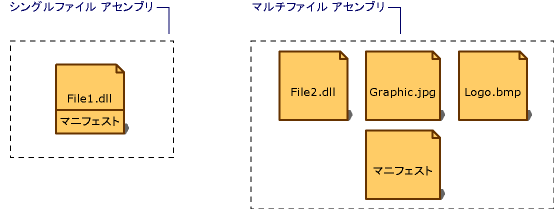

# アセンブリ マニフェスト
静的であるか動的であるかにかかわらず、すべてのアセンブリは、アセンブリ内の要素の相互関係を記述したデータのコレクションを含んでいます。 このアセンブリ メタデータは、アセンブリ マニフェストに格納されています。 アセンブリ マニフェストには、アセンブリのバージョン要件およびセキュリティ ID を指定するために必要なすべてのメタデータと、アセンブリのスコープを定義したり、リソースやクラスへの参照を解決したりするために必要なすべてのメタデータが格納されています。 アセンブリ マニフェストは、MSIL (Microsoft Intermediate Language) コードが記述されている PE ファイル (.exe または .dll)、またはアセンブリ マニフェスト情報だけを格納したスタンドアロンの PE ファイルに保存できます。  
  
 マニフェストを格納するさまざまな方法を次の図に示します。  
  
   
アセンブリの種類  
  
 関連付けられているファイルが 1 つだけのアセンブリの場合、マニフェストは PE ファイルに組み込まれ、シングルファイル アセンブリを形成します。 マルチファイル アセンブリを作成する場合は、スタンドアロンのマニフェスト ファイルか、またはそのアセンブリの PE ファイルのうちの 1 つに組み込んだマニフェストを使用します。  
  
 各アセンブリのマニフェストの機能は次のとおりです。  
  
-   アセンブリを構成するファイルを列挙します。  
  
-   アセンブリの型およびリソースへの参照を、それらの宣言と実装が格納されているファイルに割り当てる方法を制御します。  
  
-   そのアセンブリが依存するほかのアセンブリを列挙します。  
  
-   アセンブリのコンシューマーと、アセンブリの詳細な実装との間に間接的な関係を確立します。  
  
-   アセンブリを自己記述型にします。  
  
## アセンブリ マニフェストの内容  
 アセンブリ マニフェストに格納されている情報を次の表に示します。 アセンブリ名、バージョン番号、カルチャ、厳密な名前情報という最初の 4 項目は、アセンブリの識別子を構成します。  
  
|情報|説明|  
|-----------------|-----------------|  
|[アセンブリ名]|アセンブリの名前を指定するテキスト文字列。|  
|バージョン番号|メジャー バージョン番号、マイナー バージョン番号、リビジョン番号、およびビルド番号。 共通言語ランタイムは、これらの番号を使用してバージョン ポリシーを強制的に適用します。|  
|culture|アセンブリがサポートするカルチャや言語に関する情報。 この情報は、アセンブリをカルチャ固有または言語固有の情報を格納したサテライト アセンブリとして指定する場合にだけ使用します。 カルチャ情報を含むアセンブリは、自動的にサテライト アセンブリと見なされます。|  
|厳密な名前情報|アセンブリに厳密な名前が付いている場合の発行者からの公開キー。|  
|アセンブリ内のすべてのファイルのリスト|アセンブリに含まれている各ファイルのハッシュおよびファイル名。 アセンブリを構成するすべてのファイルは、アセンブリ マニフェストが含まれているファイルと同じディレクトリに配置する必要があります。|  
|型参照情報|型参照をその宣言と実装が格納されているファイルに割り当てるために、ランタイムが使用する情報。 この情報は、アセンブリからエクスポートされた型に対して使用されます。|  
|参照先アセンブリに関する情報|このアセンブリによって静的に参照されるほかのアセンブリのリスト。 参照される各アセンブリ (依存アセンブリ) について、その名前、アセンブリ メタデータ (バージョン、カルチャ、オペレーティング システムなど)、アセンブリに厳密な名前が付いている場合は公開キーなどが示されます。|  
  
 アセンブリ マニフェストの一部の情報は、コード内でアセンブリ属性を使用することで、追加または変更できます。 バージョン情報や、商標、著作権、製品名、会社名、補足バージョンなどの情報属性は変更できます。 アセンブリ属性の完全なリストについては、「[Setting Assembly Attributes](../../../docs/framework/app-domains/set-assembly-attributes.md)」 (アセンブリ属性の設定) を参照してください。  
  
## 参照  
 [アセンブリの内容](../../../docs/framework/app-domains/assembly-contents.md)  
 [アセンブリのバージョン管理](../../../docs/framework/app-domains/assembly-versioning.md)  
 [サテライト アセンブリの作成](../../../docs/framework/resources/creating-satellite-assemblies-for-desktop-apps.md)  
 [厳密な名前付きアセンブリ](../../../docs/framework/app-domains/strong-named-assemblies.md)
