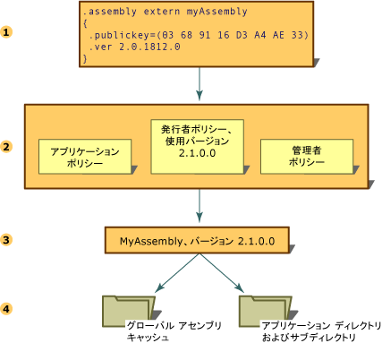

# アセンブリのバージョン管理
共通言語ランタイムを使用するアセンブリのバージョン管理は、すべてアセンブリ レベルで行われます。 アセンブリの特定のバージョン、および依存する各アセンブリのバージョンは、アセンブリのマニフェストに記録されます。 ランタイムの既定のバージョン ポリシーは、構成ファイル (アプリケーション構成ファイル、発行者ポリシー ファイル、コンピューター管理者の構成ファイル) に指定した明示的なバージョン ポリシーでオーバーライドされない限り、アプリケーションが作成およびテストされた時点のバージョンの場合にだけそのアプリケーションを実行します。  
  
> [!NOTE]
>  バージョン管理は、厳密な名前付きのアセンブリに対してだけ実行されます。  
  
 ランタイムは、アセンブリ バインディング要求を解決するために、いくつかの手順を実行します。  
  
1.  元のアセンブリ参照を確認し、バインド先のアセンブリのバージョンを確認します。  
  
2.  バージョン ポリシーを適用するために利用できる構成ファイルをすべてチェックします。  
  
3.  元のアセンブリ参照と、構成ファイルで指定されているリダイレクトから正しいアセンブリを判断し、呼び出し元のアセンブリにバインドされるバージョンを判断します。  
  
4.  グローバル アセンブリ キャッシュと、構成ファイルで指定されたコードベースをチェックした後、「[ランタイムがアセンブリを検索する方法](../../../docs/framework/deployment/how-the-runtime-locates-assemblies.md)」に説明されているプローブ規則を使用して、アプリケーションのディレクトリとサブディレクトリをチェックします。  
  
 これらの手順を次の図に示します。  
  
   
アセンブリ バインディング要求の解決  
  
 アプリケーションの設定の詳細については、「[アプリの構成](../../../docs/framework/configure-apps/index.md)」を参照してください。 バインド ポリシーの詳細については、「[ランタイムがアセンブリを検索する方法](../../../docs/framework/deployment/how-the-runtime-locates-assemblies.md)」を参照してください。  
  
## バージョン情報  
 各アセンブリは、次の 2 種類の形でバージョン情報を表示します。  
  
-   アセンブリのバージョン番号。アセンブリ名やカルチャ情報と共に、アセンブリの識別子を構成します。 この番号は、バージョン ポリシーを強制適用するためにランタイムで使用され、実行時の型解決プロセスで重要な役割を果たします。  
  
-   補足バージョン。これは、情報の提供だけを目的とした、追加のバージョン情報を表す文字列です。  
  
### アセンブリのバージョン番号  
 各アセンブリの識別子には、バージョン番号が含まれています。 そのため、バージョン番号が異なる 2 つのアセンブリは、ランタイムでは、まったく異なるアセンブリと見なされます。 このバージョン番号は、次に示す形式の 4 つの部分から成る文字列として表されます。  
  
 \<*メジャー バージョン*>.\<*マイナー バージョン*>.\<*ビルド番号*>.\<*改訂番号*>  
  
 たとえばバージョン 1.5.1254.0 の場合、1 はメジャー バージョン、5 はマイナー バージョン、1254 はビルド番号、0 はリビジョン番号を表します。  
  
 バージョン番号は、アセンブリ名や公開キーなどのほかの識別子情報や、アプリケーションに関連付けられているほかの複数のアセンブリの関係や識別子に関する情報と共に、アセンブリ マニフェストに保存されます。  
  
 アセンブリの作成時に、開発ツールによって、アセンブリ マニフェストで参照される各アセンブリについての依存情報が記録されます。 ランタイムは、これらのバージョン番号と、管理者、アプリケーション、または発行者が設定した構成情報を組み合わせて使用し、参照先アセンブリの正しいバージョンを読み込みます。  
  
 バージョン管理の目的のため、ランタイムでは、通常の名前の付いたアセンブリと、厳密な名前の付いたアセンブリが区別されます。 バージョンのチェックは、厳密な名前付きのアセンブリに対してだけ実行されます。  
  
 バージョン バインド ポリシーの指定については、「[アプリの構成](../../../docs/framework/configure-apps/index.md)」を参照してください。 ランタイムがバージョン情報を使用して特定のアセンブリを見つけ出す方法については、「[ランタイムがアセンブリを検索する方法](../../../docs/framework/deployment/how-the-runtime-locates-assemblies.md)」を参照してください。  
  
### アセンブリの補足バージョン  
 補足バージョンは、情報の提供だけを目的として、追加のバージョン情報をアセンブリに追加するための文字列です。この情報は実行時には使用されません。 補足バージョンはテキスト ベースで、その製品のマーケティング資料、パッケージ、あるいは製品名に対応するものであり、実行時には使用されません。 たとえば、補足バージョンの例は "共通言語ランタイム バージョン 1.0" や "NET Control SP 2" などになります。 Microsoft Windows のファイル プロパティ ダイアログの [バージョン] タブでは、この情報は [製品バージョン] という項目に表示されます。  
  
> [!NOTE]
>  任意のテキストを指定できますが、文字列がアセンブリのバージョン番号で使用されている形式でなかったり、形式が正しくてもワイルドカードを含んでいたりすると、コンパイルで警告メッセージが表示されます。 この警告は、実行には影響を与えません。  
  
 補足バージョンは、カスタム属性 <xref:System.Reflection.AssemblyInformationalVersionAttribute?displayProperty=nameWithType> を使って表されます。 補足バージョン属性の詳細については、「[アセンブリ属性の設定](../../../docs/framework/app-domains/set-assembly-attributes.md)」を参照してください。  
  
## 参照  
 [ランタイムがアセンブリを検索する方法](../../../docs/framework/deployment/how-the-runtime-locates-assemblies.md)  
 [アプリの構成](../../../docs/framework/configure-apps/index.md)  
 [アセンブリ属性の設定](../../../docs/framework/app-domains/set-assembly-attributes.md)  
 [共通言語ランタイムのアセンブリ](../../../docs/framework/app-domains/assemblies-in-the-common-language-runtime.md)
