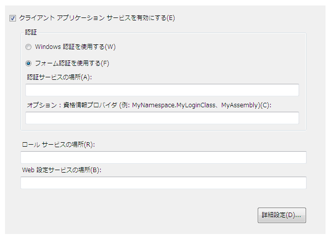
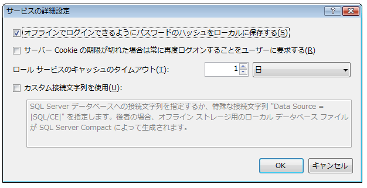

# <a name="how-to-configure-client-application-services"></a><span data-ttu-id="1d529-102">方法 : クライアント アプリケーション サービスを構成する</span><span class="sxs-lookup"><span data-stu-id="1d529-102">How to: Configure Client Application Services</span></span>
<span data-ttu-id="1d529-103">このトピックでは、Visual Studio **プロジェクト デザイナー**を使用して、クライアント アプリケーション サービスを有効にし、構成する方法について説明します。</span><span class="sxs-lookup"><span data-stu-id="1d529-103">This topic describes how to use the Visual Studio **Project Designer** to enable and configure client application services.</span></span> <span data-ttu-id="1d529-104">クライアント アプリケーション サービスを使用してユーザーを検証し、既存の [!INCLUDE[ajax_current_short](../../../includes/ajax-current-short-md.md)] アプリケーション サービスからユーザーのロールおよび設定を取得することができます。</span><span class="sxs-lookup"><span data-stu-id="1d529-104">You can use client application services to validate users and retrieve user roles and settings from an existing [!INCLUDE[ajax_current_short](../../../includes/ajax-current-short-md.md)] application service.</span></span> <span data-ttu-id="1d529-105">構成した後に、「[クライアント アプリケーション サービスの概要](../../../docs/framework/common-client-technologies/client-application-services-overview.md)」に記載されているように、アプリケーション コード内で有効にされているサービスにアクセスできます。</span><span class="sxs-lookup"><span data-stu-id="1d529-105">After configuration, you can access the enabled services in your application code as described in [Client Application Services Overview](../../../docs/framework/common-client-technologies/client-application-services-overview.md).</span></span> <span data-ttu-id="1d529-106">[!INCLUDE[ajax_current_short](../../../includes/ajax-current-short-md.md)] アプリケーション サービスの詳細については、「[ASP.NET アプリケーション サービスの概要](http://msdn.microsoft.com/library/1162e529-0d70-44b2-b3ab-83e60c695013)」を参照してください。</span><span class="sxs-lookup"><span data-stu-id="1d529-106">For more information about the [!INCLUDE[ajax_current_short](../../../includes/ajax-current-short-md.md)] application services, see [ASP.NET Application Services Overview](http://msdn.microsoft.com/library/1162e529-0d70-44b2-b3ab-83e60c695013).</span></span>  
  
 <span data-ttu-id="1d529-107">クライアント アプリケーション サービスは、**プロジェクト デザイナー**の **[サービス]** ページで有効にし、構成することができます。</span><span class="sxs-lookup"><span data-stu-id="1d529-107">You can enable and configure client application services on the **Services** page of the **Project Designer**.</span></span> <span data-ttu-id="1d529-108">**[サービス]** ページは、プロジェクトの App.config ファイル内の値を更新します。</span><span class="sxs-lookup"><span data-stu-id="1d529-108">The **Services** page updates values in your project's App.config file.</span></span> <span data-ttu-id="1d529-109">**プロジェクト デザイナー**にアクセスするには、**[プロジェクト]** メニューの **[プロパティ]** を使用します。</span><span class="sxs-lookup"><span data-stu-id="1d529-109">To access the **Project Designer**, use the **Properties** command on the **Project** menu.</span></span> <span data-ttu-id="1d529-110">**[サービス]** ページの詳細については、「[Services Page, Project Designer](https://msdn.microsoft.com/library/bb398109)」([サービス] ページ (プロジェクト デザイナー)) を参照してください。</span><span class="sxs-lookup"><span data-stu-id="1d529-110">For more information about the **Services** page, see [Services Page, Project Designer](https://msdn.microsoft.com/library/bb398109).</span></span>  
  
 <span data-ttu-id="1d529-111">次の手順では、クライアント アプリケーション サービスの基本構成を実行する方法について説明します。</span><span class="sxs-lookup"><span data-stu-id="1d529-111">The following procedure describes how to perform basic configuration for client application services.</span></span> <span data-ttu-id="1d529-112">高度な構成オプションについては、以降のセクションで説明します。</span><span class="sxs-lookup"><span data-stu-id="1d529-112">Advanced configuration options are described in later sections.</span></span>  
  
### <a name="to-configure-client-application-services"></a><span data-ttu-id="1d529-113">クライアント アプリケーション サービスを構成するには</span><span class="sxs-lookup"><span data-stu-id="1d529-113">To configure client application services</span></span>  
  
1.  <span data-ttu-id="1d529-114">**ソリューション エクスプ ローラー**で、プロジェクト ノードを選択し、**[プロジェクト]** メニューの **[プロパティ]** をクリックします。</span><span class="sxs-lookup"><span data-stu-id="1d529-114">In **Solution Explorer**, select a project node and then on the **Project** menu, click **Properties**.</span></span>  
  
     <span data-ttu-id="1d529-115">**プロジェクト デザイナー**が表示されます。</span><span class="sxs-lookup"><span data-stu-id="1d529-115">The **Project Designer** appears.</span></span>  
  
2.  <span data-ttu-id="1d529-116">**[サービス]** タブをクリックします。次の図に示すように、**[サービス]** ページが表示されます。</span><span class="sxs-lookup"><span data-stu-id="1d529-116">Click the **Services** tab. The **Services** page appears, as shown in the following illustration.</span></span>  
  
     <span data-ttu-id="1d529-117">![プロジェクト デザイナーの [サービス] タブ](../../../docs/framework/common-client-technologies/media/casdesigner.png "casdesigner")</span><span class="sxs-lookup"><span data-stu-id="1d529-117"></span></span>  
  
3.  <span data-ttu-id="1d529-118">**[サービス]** ページで、**[クライアント アプリケーション サービスを有効にする]** を選択します。</span><span class="sxs-lookup"><span data-stu-id="1d529-118">On the **Services** page, select **Enable client application services**.</span></span>  
  
    > [!NOTE]
    >  <span data-ttu-id="1d529-119">クライアント アプリケーション サービスには完全版の .NET Framework が必要です。クライアント アプリケーション サービスは、.NET Framework Client Profile ではサポートされません。</span><span class="sxs-lookup"><span data-stu-id="1d529-119">Client application services require the full version of the .NET Framework, and are not supported in the .NET Framework Client Profile.</span></span> <span data-ttu-id="1d529-120">**[クライアント アプリケーション サービスを有効にする]** チェック ボックスが無効になっている場合、**[ターゲット フレームワーク]** が .NET Framework 3.5 以降に設定されていることを確認します。</span><span class="sxs-lookup"><span data-stu-id="1d529-120">If the **Enable client application services** check box is disabled, verify that the **Target framework** is set to the .NET Framework 3.5 or later.</span></span> <span data-ttu-id="1d529-121">C# で **[ターゲット フレームワーク]** の設定を表示するには、プロジェクト デザイナーを開き、**[アプリケーション]** ページをクリックします。</span><span class="sxs-lookup"><span data-stu-id="1d529-121">To view the **Target framework** setting in C#, open the Project Designer and then click the **Application** page.</span></span> <span data-ttu-id="1d529-122">Visual Basic で **[ターゲット フレームワーク]** の設定を表示するには、プロジェクト デザイナーを開き、**[コンパイル]** ページをクリックして、**[詳細コンパイル オプション]** をクリックします。</span><span class="sxs-lookup"><span data-stu-id="1d529-122">To view the **Target framework** setting in Visual Basic, open the Project Designer, click the **Compile** page, and then click **Advanced Compile Options**.</span></span>  
  
4.  <span data-ttu-id="1d529-123">独自のログイン コントロールまたはダイアログ ボックスを提供する場合は **[フォーム認証を使用する]** を選択し、オペレーティング システムによって付与された ID を使用する場合は **[Windows 認証を使用する]** を選択します。</span><span class="sxs-lookup"><span data-stu-id="1d529-123">Select **Use Forms authentication** if you plan to provide your own login controls or dialog box, or select **Use Windows authentication** to use the identity supplied by the operating system.</span></span> <span data-ttu-id="1d529-124">詳細については、「[クライアント アプリケーション サービスの概要](../../../docs/framework/common-client-technologies/client-application-services-overview.md)」を参照してください。</span><span class="sxs-lookup"><span data-stu-id="1d529-124">For more information, see [Client Application Services Overview](../../../docs/framework/common-client-technologies/client-application-services-overview.md).</span></span>  
  
    > [!NOTE]
    >  <span data-ttu-id="1d529-125">**[Windows 認証を使用する]** を選択すると、SQL Server Compact データベースを使用するために、クライアント アプリケーション サービスが自動的に構成されます。</span><span class="sxs-lookup"><span data-stu-id="1d529-125">If you select **Use Windows authentication**, client application services will automatically be configured to use a SQL Server Compact database.</span></span> <span data-ttu-id="1d529-126">これは次のセクションで説明するように、**[サービスの詳細設定]** ダイアログ ボックスに示されます。</span><span class="sxs-lookup"><span data-stu-id="1d529-126">This is indicated in the **Advanced Settings for Services** dialog box as described in the next section.</span></span> <span data-ttu-id="1d529-127">**[フォーム認証を使用する]** を選択すると、**[カスタム接続文字列を使用する]** の設定は自動的にオフになりません。</span><span class="sxs-lookup"><span data-stu-id="1d529-127">If you then select **Use Forms authentication**, the **Use custom connection string** setting will not be cleared automatically.</span></span> <span data-ttu-id="1d529-128">これにより、[!INCLUDE[ssEW](../../../includes/ssew-md.md)] データベースが Windows 認証で使用するために既に生成されている場合、エラーが発生することがあります。</span><span class="sxs-lookup"><span data-stu-id="1d529-128">This could result in errors if the [!INCLUDE[ssEW](../../../includes/ssew-md.md)] database has already been generated for use with Windows authentication.</span></span> <span data-ttu-id="1d529-129">これらのエラーを修正するには、**[サービスの詳細設定]** ダイアログ ボックスの **[カスタム接続文字列を使用する]** の設定をオフにします。</span><span class="sxs-lookup"><span data-stu-id="1d529-129">To fix these errors, clear the **Use custom connection string** setting in the **Advanced Settings for Services** dialog box.</span></span>  
  
5.  <span data-ttu-id="1d529-130">**[フォーム認証を使用する]** を選択した場合は、**[認証サービスの場所]** ボックスで、ファイル名を含まないサービス ホストの URL を指定します。</span><span class="sxs-lookup"><span data-stu-id="1d529-130">If you selected **Use Forms authentication**, in the **Authentication service location** box, specify the URL of the service host, not including the file name.</span></span> <span data-ttu-id="1d529-131">デザイナーは、構成ファイルに値を書き込むときに、自動的に標準のファイル名 (Authentication_JSON_AppService.axd) を追加します。</span><span class="sxs-lookup"><span data-stu-id="1d529-131">The designer will automatically append the standard file name (Authentication_JSON_AppService.axd) when it writes the value to the configuration file.</span></span>  
  
6.  <span data-ttu-id="1d529-132">必要に応じて、**[フォーム認証を使用する]** を選択した場合は、**[資格情報プロバイダー]** ボックスに値を指定することができます。</span><span class="sxs-lookup"><span data-stu-id="1d529-132">Optionally, if you selected **Use Forms authentication**, you can specify a value in the **Credentials provider** box.</span></span> <span data-ttu-id="1d529-133">資格情報プロバイダーは、<xref:System.Web.ClientServices.Providers.IClientFormsAuthenticationCredentialsProvider> インターフェイスを実装する必要があります。</span><span class="sxs-lookup"><span data-stu-id="1d529-133">The credentials provider must implement the <xref:System.Web.ClientServices.Providers.IClientFormsAuthenticationCredentialsProvider> interface.</span></span> <span data-ttu-id="1d529-134">資格情報プロバイダーを使用すると、他のアプリケーション コードからログイン ユーザー インターフェイスを分離できます。</span><span class="sxs-lookup"><span data-stu-id="1d529-134">By using a credentials provider, you can separate your login user interface from your other application code.</span></span> <span data-ttu-id="1d529-135">これにより、複数のアプリケーションで使用する単一のログイン ダイアログ ボックスを作成することができます。</span><span class="sxs-lookup"><span data-stu-id="1d529-135">This enables you to create a single login dialog box for use in multiple applications.</span></span> <span data-ttu-id="1d529-136">詳細については、「[方法: クライアント アプリケーション サービスでユーザーのログインを実装する](../../../docs/framework/common-client-technologies/how-to-implement-user-login-with-client-application-services.md)」を参照してください。</span><span class="sxs-lookup"><span data-stu-id="1d529-136">For more information, see [How to: Implement User Login with Client Application Services](../../../docs/framework/common-client-technologies/how-to-implement-user-login-with-client-application-services.md).</span></span>  
  
     <span data-ttu-id="1d529-137">資格情報プロバイダーを指定する場合は、アセンブリ修飾型名としてを指定する必要があります。</span><span class="sxs-lookup"><span data-stu-id="1d529-137">If you specify a credentials provider, you must specify it as an assembly-qualified type name.</span></span> <span data-ttu-id="1d529-138">詳細については、「<xref:System.Type.AssemblyQualifiedName%2A?displayProperty=nameWithType>」および「[アセンブリ名](../../../docs/framework/app-domains/assembly-names.md)」を参照してください。</span><span class="sxs-lookup"><span data-stu-id="1d529-138">For more information, see <xref:System.Type.AssemblyQualifiedName%2A?displayProperty=nameWithType> and [Assembly Names](../../../docs/framework/app-domains/assembly-names.md).</span></span> <span data-ttu-id="1d529-139">最も単純な形式で、アセンブリ修飾型名は、次のようになります。</span><span class="sxs-lookup"><span data-stu-id="1d529-139">In its simplest form, an assembly-qualified type name looks similar to the following example:</span></span>  
  
    ```  
    MyNamespace.MyLoginClass, MyAssembly  
    ```  
  
7.  <span data-ttu-id="1d529-140">**[ロール サービスの場所]** および **[Web 設定サービスの場所]** テキスト ボックスで、ファイル名を含まない、各サービスのサービスの場所を指定します。</span><span class="sxs-lookup"><span data-stu-id="1d529-140">In the **Roles service location** and **Web settings service location** text boxes, specify the service location for each service, not including the file name.</span></span> <span data-ttu-id="1d529-141">デザイナーは、構成ファイルに値を書き込むときに、自動的に標準的なファイル名 (Role_JSON_AppService.axd および Profile_JSON_AppService.axd) を追加します。</span><span class="sxs-lookup"><span data-stu-id="1d529-141">The designer will automatically append the standard file names (Role_JSON_AppService.axd and Profile_JSON_AppService.axd) when it writes the value to the configuration file.</span></span>  
  
8.  <span data-ttu-id="1d529-142">必要に応じて、**[詳細設定]** をクリックして、ローカル キャッシュ動作などの詳細設定を変更します。</span><span class="sxs-lookup"><span data-stu-id="1d529-142">Optionally, click **Advanced** to modify advanced settings, such as the local caching behavior.</span></span> <span data-ttu-id="1d529-143">詳細については、次の手順を参照してください。</span><span class="sxs-lookup"><span data-stu-id="1d529-143">For more information, see the next procedure.</span></span>  
  
## <a name="advanced-configuration"></a><span data-ttu-id="1d529-144">詳細構成</span><span class="sxs-lookup"><span data-stu-id="1d529-144">Advanced Configuration</span></span>  
 <span data-ttu-id="1d529-145">次の手順では、あまり一般的ではないシナリオでクライアント アプリケーション サービスを構成する方法について説明します。</span><span class="sxs-lookup"><span data-stu-id="1d529-145">The following procedures describe how to configure client application services for less common scenarios.</span></span> <span data-ttu-id="1d529-146">たとえば、これらの構成オプションは、公共の場所で使用したり、ローカル データ キャッシュとして暗号化された SQL Server Compact データベースを使用するために使用したりできます。</span><span class="sxs-lookup"><span data-stu-id="1d529-146">For example, you can use these configuration options for applications deployed in public locations, or to use an encrypted SQL Server Compact database as the local data cache.</span></span>  
  
#### <a name="to-configure-advanced-settings-for-client-application-services"></a><span data-ttu-id="1d529-147">クライアント アプリケーション サービスの詳細設定を構成するには</span><span class="sxs-lookup"><span data-stu-id="1d529-147">To configure advanced settings for client application services</span></span>  
  
1.  <span data-ttu-id="1d529-148">**プロジェクト デザイナー**の **[サービス]** ページで、**[詳細設定]** をクリックします。</span><span class="sxs-lookup"><span data-stu-id="1d529-148">On the **Services** page of the **Project Designer**, click **Advanced**.</span></span>  
  
     <span data-ttu-id="1d529-149">次の図に示すように、**[サービスの詳細設定]** ダイアログ ボックスが表示されます。</span><span class="sxs-lookup"><span data-stu-id="1d529-149">The **Advanced Settings for Services** dialog box appears, as shown in the following illustration.</span></span> <span data-ttu-id="1d529-150">このダイアログ ボックスの詳細については、「[[サービスの詳細設定] ダイアログ ボックス](/visualstudio/ide/reference/advanced-settings-for-services-dialog-box)」を参照してください。</span><span class="sxs-lookup"><span data-stu-id="1d529-150">For more information about this dialog box, see [Advanced Settings for Services Dialog Box](/visualstudio/ide/reference/advanced-settings-for-services-dialog-box).</span></span>  
  
     <span data-ttu-id="1d529-151">![[サービスの詳細設定] ダイアログ ボックス](../../../docs/framework/common-client-technologies/media/casdialog.png "casdialog")</span><span class="sxs-lookup"><span data-stu-id="1d529-151"></span></span>  
  
2.  <span data-ttu-id="1d529-152">**[オフラインでログインできるようにパスワードのハッシュをローカルに保存する]** をオンまたはオフにします。</span><span class="sxs-lookup"><span data-stu-id="1d529-152">Select or clear **Save password hash locally to enable offline login**.</span></span> <span data-ttu-id="1d529-153">このオプションを選択すると、ユーザーのパスワードの暗号化された形式がローカルでキャッシュされます。</span><span class="sxs-lookup"><span data-stu-id="1d529-153">When you select this option, an encrypted form of the user's password will be cached locally.</span></span> <span data-ttu-id="1d529-154">これは、アプリケーションにオフライン モードを実装する場合に便利です。</span><span class="sxs-lookup"><span data-stu-id="1d529-154">This is useful if you implement offline mode for your application.</span></span> <span data-ttu-id="1d529-155">このオプションを選択すると、<xref:System.Web.ClientServices.ConnectivityStatus.IsOffline%2A> プロパティが `true` に設定されている場合でもユーザーを検証できます。</span><span class="sxs-lookup"><span data-stu-id="1d529-155">With this option selected, you can validate users even when the <xref:System.Web.ClientServices.ConnectivityStatus.IsOffline%2A> property has been set to `true`.</span></span>  
  
3.  <span data-ttu-id="1d529-156">**[サーバー Cookie の期限が切れた場合は常に再度ログオンすることをユーザーに要求する]** をオンまたはオフにします。</span><span class="sxs-lookup"><span data-stu-id="1d529-156">Select or clear **Require users to log on again whenever the server cookie expires**.</span></span> <span data-ttu-id="1d529-157">認証 Cookie はリモート サービスで構成され、ユーザーのログインがアクティブであり続ける期間を示します。</span><span class="sxs-lookup"><span data-stu-id="1d529-157">The authentication cookie is configured on the remote service, and indicates how long a user's login will remain active.</span></span> <span data-ttu-id="1d529-158">Cookie を構成する方法の詳細については、「[authentication の forms 要素 (ASP.NET 設定スキーマ)](http://msdn.microsoft.com/library/8163b8b5-ea6c-46c8-b5a9-c4c3de31c0b3)」の「`timeout` 属性」を参照してください。</span><span class="sxs-lookup"><span data-stu-id="1d529-158">For more information about how to configure the cookie, see the `timeout` attribute in [forms Element for authentication (ASP.NET Settings Schema)](http://msdn.microsoft.com/library/8163b8b5-ea6c-46c8-b5a9-c4c3de31c0b3).</span></span>  
  
     <span data-ttu-id="1d529-159">このオプションを選択した場合、認証 Cookie の有効期限が切れた後にリモート ロールまたは Web 設定サービスにアクセスしようとすると、<xref:System.Net.WebException> がスローされます。</span><span class="sxs-lookup"><span data-stu-id="1d529-159">If you select this option, attempting to access the remote roles or Web settings services after the authentication cookie has expired will throw a <xref:System.Net.WebException>.</span></span> <span data-ttu-id="1d529-160">この例外を処理し、ログイン ダイアログ ボックスを表示して、ユーザーを再検証することができます。</span><span class="sxs-lookup"><span data-stu-id="1d529-160">You can handle this exception and display a login dialog box to revalidate users.</span></span> <span data-ttu-id="1d529-161">この動作の例は、「[チュートリアル: クライアント アプリケーション サービスの使用](../../../docs/framework/common-client-technologies/walkthrough-using-client-application-services.md)」を参照してください。</span><span class="sxs-lookup"><span data-stu-id="1d529-161">For an example of this behavior, see [Walkthrough: Using Client Application Services](../../../docs/framework/common-client-technologies/walkthrough-using-client-application-services.md).</span></span> <span data-ttu-id="1d529-162">このオプションは、公共の場所に配置されたアプリケーションで、使用後にアプリケーションを実行中のままにしているユーザーが無期限に認証されないようにするのに便利です。</span><span class="sxs-lookup"><span data-stu-id="1d529-162">This option is useful for applications deployed in public locations to make sure that users who leave the application running after use will not remain authenticated indefinitely.</span></span>  
  
     <span data-ttu-id="1d529-163">このオプションをオフにし、認証 Cookie の有効期限が切れた後にリモート サービスへのアクセスを試行すると、ユーザーが自動的に再検証されます。</span><span class="sxs-lookup"><span data-stu-id="1d529-163">If you clear this option and attempt to access the remote services after the authentication cookie has expired, users will be revalidated automatically.</span></span>  
  
4.  <span data-ttu-id="1d529-164">**[ロール サービスのキャッシュのタイムアウト]** の値を指定します。</span><span class="sxs-lookup"><span data-stu-id="1d529-164">Specify a value for **Role service cache timeout**.</span></span> <span data-ttu-id="1d529-165">この時間間隔は、ロールが頻繁に更新される場合は小さい値に設定し、ロールが頻繁に更新されない場合はより大きい値に設定します。</span><span class="sxs-lookup"><span data-stu-id="1d529-165">Set this time interval to a small value when roles are updated frequently or to a larger value when roles are updated infrequently.</span></span> <span data-ttu-id="1d529-166">オフライン モードを実装する場合は、時間間隔を大きい値に設定して、ロール情報が、アプリケーションがオフラインのときに期限切れにならないようにします。</span><span class="sxs-lookup"><span data-stu-id="1d529-166">If you implement offline mode, set the time interval to a large value to prevent the role information from expiring while the application is offline.</span></span>  
  
     <span data-ttu-id="1d529-167"><xref:System.Web.Security.RolePrincipal.IsInRole%2A> メソッドを呼び出すと、ロール プロバイダーがキャッシュされたロール値またはロール サービスにアクセスします。</span><span class="sxs-lookup"><span data-stu-id="1d529-167">The role provider accesses the cached role values or the roles service when you call the <xref:System.Web.Security.RolePrincipal.IsInRole%2A> method.</span></span> <span data-ttu-id="1d529-168">プログラムによってキャッシュをリセットし、強制的にこのメソッドがリモート サービスにアクセスするようにするには、<xref:System.Web.ClientServices.Providers.ClientRoleProvider.ResetCache%2A> メソッドを呼び出します。</span><span class="sxs-lookup"><span data-stu-id="1d529-168">To programmatically reset the cache and force this method to access the remote service, call the <xref:System.Web.ClientServices.Providers.ClientRoleProvider.ResetCache%2A> method.</span></span>  
  
5.  <span data-ttu-id="1d529-169">**[カスタム接続文字列を使用する]** をオンまたはオフにします。</span><span class="sxs-lookup"><span data-stu-id="1d529-169">Select or clear **Use custom connection string**.</span></span> <span data-ttu-id="1d529-170">詳細については、次の手順を参照してください。</span><span class="sxs-lookup"><span data-stu-id="1d529-170">For more information, see the next procedure.</span></span>  
  
#### <a name="to-configure-client-application-services-to-use-a-database-for-the-local-cache"></a><span data-ttu-id="1d529-171">ローカル キャッシュ用データベースを使用するようにクライアント アプリケーション サービスを構成するには</span><span class="sxs-lookup"><span data-stu-id="1d529-171">To configure client application services to use a database for the local cache</span></span>  
  
1.  <span data-ttu-id="1d529-172">**プロジェクト デザイナー**の **[サービス]** ページで、**[詳細設定]** をクリックします。</span><span class="sxs-lookup"><span data-stu-id="1d529-172">On the **Services** page of the **Project Designer**, click **Advanced**.</span></span>  
  
     <span data-ttu-id="1d529-173">**[サービスの詳細設定]** ダイアログ ボックスが表示されます。</span><span class="sxs-lookup"><span data-stu-id="1d529-173">The **Advanced Settings for Services** dialog box appears.</span></span>  
  
2.  <span data-ttu-id="1d529-174">**[カスタム接続文字列を使用する]** を選択します。</span><span class="sxs-lookup"><span data-stu-id="1d529-174">Select **Use custom connection string**.</span></span>  
  
     <span data-ttu-id="1d529-175">テキスト ボックスに `Data Source = |SQL/CE|` の既定値が表示されます。</span><span class="sxs-lookup"><span data-stu-id="1d529-175">The default value of `Data Source = |SQL/CE|` appears in the text box.</span></span>  
  
3.  <span data-ttu-id="1d529-176">SQL Server Compact データベースを生成して使用するには、接続文字列の既定値を保持します。</span><span class="sxs-lookup"><span data-stu-id="1d529-176">To generate and use a SQL Server Compact database, keep the default connection string value.</span></span> <span data-ttu-id="1d529-177">Visual Studio はデータベース ファイルを生成し、<xref:System.Windows.Forms.Application.UserAppDataPath%2A?displayProperty=nameWithType> プロパティで指定されるディレクトリにそれを格納します。</span><span class="sxs-lookup"><span data-stu-id="1d529-177">Visual Studio will generate a database file and put it in the directory indicated by the <xref:System.Windows.Forms.Application.UserAppDataPath%2A?displayProperty=nameWithType> property.</span></span>  
  
4.  <span data-ttu-id="1d529-178">暗号化された [!INCLUDE[ssEW](../../../includes/ssew-md.md)] データベースを生成し、使用するには、次の例に示すように、接続文字列に `password` および `encrypt database` 値を追加します。</span><span class="sxs-lookup"><span data-stu-id="1d529-178">To generate and use an encrypted [!INCLUDE[ssEW](../../../includes/ssew-md.md)] database, add `password` and `encrypt database` values to the connection string as shown in the following example.</span></span>  
  
    > [!NOTE]
    >  <span data-ttu-id="1d529-179">必ず、強力なパスワードを指定してください。</span><span class="sxs-lookup"><span data-stu-id="1d529-179">Be sure to specify a strong password.</span></span> <span data-ttu-id="1d529-180">データベースが生成された後は、パスワードを変更することはできません。</span><span class="sxs-lookup"><span data-stu-id="1d529-180">You cannot change the password after the database is generated.</span></span>  
  
    ```  
    Data Source = |SQL/CE|;password=<password>;encrypt database=true  
    ```  
  
5.  <span data-ttu-id="1d529-181">独自の SQL Server データベースを使用するには、独自の接続文字列を指定します。</span><span class="sxs-lookup"><span data-stu-id="1d529-181">To use your own SQL Server database, specify your own connection string.</span></span> <span data-ttu-id="1d529-182">有効な接続文字列の形式の詳細については、SQL Server のドキュメントを参照してください。</span><span class="sxs-lookup"><span data-stu-id="1d529-182">For information about valid connection string formats, see the SQL Server documentation.</span></span> <span data-ttu-id="1d529-183">このデータベースは自動的には生成されません。</span><span class="sxs-lookup"><span data-stu-id="1d529-183">This database is not generated automatically.</span></span> <span data-ttu-id="1d529-184">接続文字列は、次の SQL ステートメントを使用して作成できる既存のデータベースを参照する必要があります。</span><span class="sxs-lookup"><span data-stu-id="1d529-184">The connection string must refer to an existing database that you can create using the following SQL statements.</span></span>  
  
    ```  
    CREATE TABLE ApplicationProperties (PropertyName nvarchar(256),  
        PropertyValue nvarchar(256))  
    CREATE TABLE UserProperties (PropertyName nvarchar(256),  
        PropertyValue nvarchar(256))  
    CREATE TABLE Roles (UserName nvarchar(256),   
        RoleName nvarchar(256))  
    CREATE TABLE Settings (PropertyName nvarchar(256),   
        PropertyStoredAs nvarchar(1), PropertyValue nvarchar(2048))  
    ```  
  
## <a name="using-custom-providers"></a><span data-ttu-id="1d529-185">カスタム プロバイダーの使用</span><span class="sxs-lookup"><span data-stu-id="1d529-185">Using Custom Providers</span></span>  
 <span data-ttu-id="1d529-186">既定では、クライアント アプリケーション サービスの機能は、<xref:System.Web.ClientServices.Providers?displayProperty=nameWithType> 名前空間のプロバイダーを使用します。</span><span class="sxs-lookup"><span data-stu-id="1d529-186">By default, the client application services feature uses the providers in the <xref:System.Web.ClientServices.Providers?displayProperty=nameWithType> namespace.</span></span> <span data-ttu-id="1d529-187">**プロジェクト デザイナー**の **[サービス]** ページを使用してアプリケーションを構成すると、これらのプロバイダーへの参照が App.config ファイルに追加されます。</span><span class="sxs-lookup"><span data-stu-id="1d529-187">When you configure your application by using the **Services** page of the **Project Designer**, references to these providers are added to your App.config file.</span></span> <span data-ttu-id="1d529-188">これらの既定のプロバイダーは、サーバー上の対応するプロバイダーにアクセスします。</span><span class="sxs-lookup"><span data-stu-id="1d529-188">These default providers access corresponding providers on the server.</span></span> <span data-ttu-id="1d529-189">Web サービスは、多くの場合、<xref:System.Web.Security.SqlMembershipProvider> や <xref:System.Web.Security.SqlRoleProvider> などのプロバイダーからユーザー データにアクセスするように構成されます。</span><span class="sxs-lookup"><span data-stu-id="1d529-189">Web services are often configured to access user data through providers such as <xref:System.Web.Security.SqlMembershipProvider> and <xref:System.Web.Security.SqlRoleProvider>.</span></span>  
  
 <span data-ttu-id="1d529-190">カスタム サービス プロバイダーを使用する場合は、通常、サーバーにアクセスするすべてのクライアント アプリケーションに影響を与えるようにサーバー側のプロバイダーを変更します。</span><span class="sxs-lookup"><span data-stu-id="1d529-190">If you want to use custom service providers, you will typically change the providers on the server side so that they affect all client applications that access the server.</span></span> <span data-ttu-id="1d529-191">ただし、クライアント側で既定以外のプロバイダーを使用することもできます。</span><span class="sxs-lookup"><span data-stu-id="1d529-191">However, you do have the option of using non-default providers on the client side.</span></span> <span data-ttu-id="1d529-192">次の手順に示すように、プロジェクトの App.config ファイルでカスタム認証またはロール プロバイダーを指定できます。</span><span class="sxs-lookup"><span data-stu-id="1d529-192">You can specify custom authentication or roles providers in your project's App.config file, as shown in the following procedure.</span></span> <span data-ttu-id="1d529-193">カスタム認証とロール プロバイダーを作成する方法については、「[メンバーシップ プロバイダーを実装する](http://msdn.microsoft.com/library/d8658b8e-c962-4f64-95e1-4acce35e4582)」と「[ロール プロバイダーを実装する](http://msdn.microsoft.com/library/851671ce-bf9b-43f2-aba4-bc9d28b11c7d)」を参照してください。</span><span class="sxs-lookup"><span data-stu-id="1d529-193">For information about how to create custom authentication and role providers, see [Implementing a Membership Provider](http://msdn.microsoft.com/library/d8658b8e-c962-4f64-95e1-4acce35e4582) and [Implementing a Role Provider](http://msdn.microsoft.com/library/851671ce-bf9b-43f2-aba4-bc9d28b11c7d).</span></span> <span data-ttu-id="1d529-194">また、カスタム設定プロバイダーを使用するには、プロジェクトの `Settings` クラス (C# では `Properties.Settings.Default` として、Visual Basic では `My.Settings` としてアクセス) を変更します。</span><span class="sxs-lookup"><span data-stu-id="1d529-194">You can also use a custom settings provider by modifying your project's `Settings` class (accessed as `Properties.Settings.Default` in C# and `My.Settings` in Visual Basic).</span></span> <span data-ttu-id="1d529-195">詳細については、「[アプリケーション設定アーキテクチャ](../../../docs/framework/winforms/advanced/application-settings-architecture.md)」を参照してください。</span><span class="sxs-lookup"><span data-stu-id="1d529-195">For more information, see [Application Settings Architecture](../../../docs/framework/winforms/advanced/application-settings-architecture.md).</span></span>  
  
#### <a name="to-configure-client-application-services-to-use-non-default-providers"></a><span data-ttu-id="1d529-196">既定以外のプロバイダーを使用するようにクライアント アプリケーション サービスを構成するには</span><span class="sxs-lookup"><span data-stu-id="1d529-196">To configure client application services to use non-default providers</span></span>  
  
1.  <span data-ttu-id="1d529-197">既定以外の認証またはロール サービス プロバイダーを使用するには、最初に、**[サービス]** ページを使用して、他のすべての構成設定を完了します。</span><span class="sxs-lookup"><span data-stu-id="1d529-197">To use a non-default authentication or roles service provider, first complete all other configuration settings by using the **Services** page.</span></span>  
  
2.  <span data-ttu-id="1d529-198">**プロジェクト デザイナー**を閉じます。</span><span class="sxs-lookup"><span data-stu-id="1d529-198">Close the **Project Designer**.</span></span> <span data-ttu-id="1d529-199">これは、**[サービス]** ページが、設定を変更しない場合でも自動的に App.config ファイルを更新するため、必要となります。</span><span class="sxs-lookup"><span data-stu-id="1d529-199">This is necessary because the **Services** page will automatically update your App.config file even if you do not modify any settings.</span></span> <span data-ttu-id="1d529-200">この手順で説明するように、App.config ファイルを手動で変更し、**[サービス]** ページに戻ると、変更内容はリセットされます。</span><span class="sxs-lookup"><span data-stu-id="1d529-200">If you manually modify your App.config file as described in this procedure and then return to the **Services** page, your modifications will be reset.</span></span>  
  
3.  <span data-ttu-id="1d529-201">**ソリューション エクスプローラー**で、App.config をダブルクリックします。</span><span class="sxs-lookup"><span data-stu-id="1d529-201">In **Solution Explorer**, double-click App.config.</span></span>  
  
     <span data-ttu-id="1d529-202">アプリケーションの構成ファイルがテキスト エディターで開きます。</span><span class="sxs-lookup"><span data-stu-id="1d529-202">The application configuration file opens in the text editor.</span></span>  
  
4.  <span data-ttu-id="1d529-203">`<providers>` または `<membership>` 要素内の `<roleManager>` 要素を見つけます。</span><span class="sxs-lookup"><span data-stu-id="1d529-203">Find the `<providers>` element within the `<membership>` or `<roleManager>` element.</span></span> <span data-ttu-id="1d529-204">これらの要素は `<system.web>` 要素の子要素です。</span><span class="sxs-lookup"><span data-stu-id="1d529-204">These elements are children of the `<system.web>` element.</span></span> <span data-ttu-id="1d529-205">`<membership>` 要素を使用して認証プロバイダーを指定し、`<roleManager>` 要素を使用してロール プロバイダーを指定します。</span><span class="sxs-lookup"><span data-stu-id="1d529-205">The `<membership>` element is used to specify authentication providers, and the `<roleManager>` element is used to specify role providers.</span></span>  
  
5.  <span data-ttu-id="1d529-206">`<add>` 要素の子要素として `<providers>` 要素を追加します。</span><span class="sxs-lookup"><span data-stu-id="1d529-206">Add an `<add>` element as a child of the `<providers>` element.</span></span> <span data-ttu-id="1d529-207">次の例に示すように、`name` および `type` 属性を指定する必要があります。</span><span class="sxs-lookup"><span data-stu-id="1d529-207">You must specify `name` and `type` attributes as shown in the following example.</span></span> <span data-ttu-id="1d529-208">`type` 属性値はアセンブリ修飾型の名前である必要があります。</span><span class="sxs-lookup"><span data-stu-id="1d529-208">The `type` attribute value must be an assembly-qualified type name.</span></span> <span data-ttu-id="1d529-209">詳細については、「<xref:System.Type.AssemblyQualifiedName%2A?displayProperty=nameWithType>」および「[アセンブリ名](../../../docs/framework/app-domains/assembly-names.md)」を参照してください。</span><span class="sxs-lookup"><span data-stu-id="1d529-209">For more information, see <xref:System.Type.AssemblyQualifiedName%2A?displayProperty=nameWithType> and [Assembly Names](../../../docs/framework/app-domains/assembly-names.md).</span></span>  
  
    ```xml  
    <add name="MyCustomRoleProvider" type="MyNamespace.MyRoleProvider, MyAssembly" />  
    ```  
  
6.  <span data-ttu-id="1d529-210">`defaultProvider` または `<membership>` 要素の `<roleManager>` 属性を変更して、前の手順で追加した `<add>` 要素から名前の値を指定します。</span><span class="sxs-lookup"><span data-stu-id="1d529-210">Modify the `defaultProvider` attribute of the `<membership>` or `<roleManager>` element to specify the name value from the `<add>` element that you added in the previous step.</span></span>  
  
    ```xml  
    <roleManager enabled="true" defaultProvider="MyCustomRoleProvider">  
    ```  
  
## <a name="see-also"></a><span data-ttu-id="1d529-211">参照</span><span class="sxs-lookup"><span data-stu-id="1d529-211">See Also</span></span>  
 [<span data-ttu-id="1d529-212">クライアント アプリケーション サービス</span><span class="sxs-lookup"><span data-stu-id="1d529-212">Client Application Services</span></span>](../../../docs/framework/common-client-technologies/client-application-services.md)  
 [<span data-ttu-id="1d529-213">クライアント アプリケーション サービスの概要</span><span class="sxs-lookup"><span data-stu-id="1d529-213">Client Application Services Overview</span></span>](../../../docs/framework/common-client-technologies/client-application-services-overview.md)  
 <span data-ttu-id="1d529-214">[[サービス] ページ (プロジェクト デザイナー)](https://msdn.microsoft.com/library/bb398109)</span><span class="sxs-lookup"><span data-stu-id="1d529-214">[Services Page, Project Designer](https://msdn.microsoft.com/library/bb398109)</span></span>  
 <span data-ttu-id="1d529-215">[[サービスの詳細設定] ダイアログ ボックス](/visualstudio/ide/reference/advanced-settings-for-services-dialog-box)</span><span class="sxs-lookup"><span data-stu-id="1d529-215">[Advanced Settings for Services Dialog Box](/visualstudio/ide/reference/advanced-settings-for-services-dialog-box)</span></span>  
 [<span data-ttu-id="1d529-216">方法: クライアント アプリケーション サービスでユーザーのログインを実装する</span><span class="sxs-lookup"><span data-stu-id="1d529-216">How to: Implement User Login with Client Application Services</span></span>](../../../docs/framework/common-client-technologies/how-to-implement-user-login-with-client-application-services.md)  
 [<span data-ttu-id="1d529-217">チュートリアル : クライアント アプリケーション サービスの使用</span><span class="sxs-lookup"><span data-stu-id="1d529-217">Walkthrough: Using Client Application Services</span></span>](../../../docs/framework/common-client-technologies/walkthrough-using-client-application-services.md)  
 [<span data-ttu-id="1d529-218">メンバシップ プロバイダの実装</span><span class="sxs-lookup"><span data-stu-id="1d529-218">Implementing a Membership Provider</span></span>](http://msdn.microsoft.com/library/d8658b8e-c962-4f64-95e1-4acce35e4582)  
 [<span data-ttu-id="1d529-219">ロール プロバイダの実装</span><span class="sxs-lookup"><span data-stu-id="1d529-219">Implementing a Role Provider</span></span>](http://msdn.microsoft.com/library/851671ce-bf9b-43f2-aba4-bc9d28b11c7d)  
 [<span data-ttu-id="1d529-220">アプリケーション設定アーキテクチャ</span><span class="sxs-lookup"><span data-stu-id="1d529-220">Application Settings Architecture</span></span>](../../../docs/framework/winforms/advanced/application-settings-architecture.md)  
 [<span data-ttu-id="1d529-221">SQL Server 向けアプリケーション サービス データベースの作成と構成</span><span class="sxs-lookup"><span data-stu-id="1d529-221">Creating and Configuring the Application Services Database for SQL Server</span></span>](http://msdn.microsoft.com/library/ab894e83-7e2f-4af8-a116-b1bff8f815b2)
