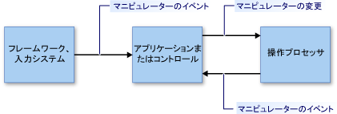

# 操作と慣性の概要Manipulations and Inertia Overview
"*操作*" では、"*マニピュレーター*" を使用して、ユーザー インターフェイス (UI) 要素の移動、回転、サイズ変更を行えます。*Manipulations* enable users to move, rotate, and resize user interface (UI) elements by using *manipulators*. マニピュレーターは、マウス、または (タッチ対応のシナリオの場合) スタイラスや指を意味します。A manipulator represents a mouse or (in a touch-enabled scenario) a stylus or a finger.  
  
 "*慣性*" は、要素上で摩擦力をシミュレートして、動いている UI 要素の実際の動作をエミュレートします。*Inertia* emulates real-world behavior for UI elements that are in motion by simulating friction forces on the elements. これにより、要素は (直線運動と角運動の両方で) 徐々に動作の速度を遅らせてから停止します。This enables elements to gradually slow their movement (both linear and angular) before coming to a stop. この記事では、.NET Framework の操作と慣性の概要を説明します。This article provides an introduction to manipulations and inertia for the .NET Framework.  
  
## 操作Manipulations  
 操作では、マニピュレーターのコレクションを複合オブジェクトとして扱います。A manipulation treats a collection of manipulators as a composite object. アプリケーションは、個々 のコンポーネントではなく複合オブジェクトへの変更を追跡できます。An application can track the changes to the composite object instead of the individual components.  
  
 次の図の画像を考えてください。Consider the image in the following illustration. ユーザーは 2 つのマニピュレーターを使用して、画像の移動、回転、拡大/縮小を行えます。A user can use two manipulators to move, rotate, and scale the image. 各マニピュレーターへの変更は、他のマニピュレーターと一緒に解釈されます。The changes to each manipulator are interpreted together with the other manipulators.  
  
 たとえば、画像に 2 つのマニピュレーター (1 および 2) があり、マニピュレーター 1 を +Y 方向 (下) に移動する場合、画像への変更はマニピュレーター 2 で何が発生するかによって変わります。For example, if you have two manipulators (1 and 2) on the image, and you move manipulator 1 in a +Y direction (down), the change to the image depends on what happens to manipulator 2. マニピュレーター 2 も +Y 方向 (下) に移動する場合、画像は +Y 方向に移動します。If manipulator 2 also moves in the +Y direction (down), the image simply moves in the +Y direction. しかし、マニピュレーター 2 が変更しない場合、または -Y 方向 (上) に移動する場合は、画像は小さくなるか回転します。But if manipulator 2 does not change, or it moves in a -Y direction (up), the image is made smaller or rotated.  
  
   
  
 2 つのマニピュレーターによって操作されている画像An image being manipulated by two manipulators  
  
 操作の処理には、マニピュレーターのサブセットを監視し、個別にではなく一緒に動作するかのように解釈するフレームワークがあります。Manipulation processing provides a framework that monitors a subset of manipulators and interprets them as if they are acting together, instead of independently. 複数の操作プロセッサのオブジェクトを同時に作成することができ、アプリケーションで UI 要素ごとに 1 つのオブジェクトが操作されます。You can create several manipulation processor objects simultaneously, one for each UI element to be manipulated in an application. 操作プロセッサには、[.NET イベント](http://msdn.microsoft.com/library/17sde2xt.aspx)を通じて、どの入力デバイスを観察するかが通知され、それは操作を報告します。A manipulation processor is informed of which input devices to observe and it reports manipulations through [.NET events](http://msdn.microsoft.com/library/17sde2xt.aspx).  
  
 操作プロセッサには、操作する特定の要素に関する情報はありません。A manipulation processor does not have information about the particular element that is being manipulated. アプリケーションは、アプリケーション固有の要素への変更を個別に適用します。An application separately applies the changes to an application-specific element. たとえば、アプリケーションは画像に変換を適用したり、新しい場所に、または新しいサイズや向きに再描画して表示したりします。For example, an application applies transformations to an image or redraws it to display it at its new location or with a new size or orientation.  
  
 操作は 2 次元 (2-D) の[アフィン変換](http://msdn.microsoft.com/library/ms533810\(VS.85\).aspx)用に設計されています。Manipulations are designed for two-dimensional (2-D) [affine transformations](http://msdn.microsoft.com/library/ms533810\(VS.85\).aspx). アフィン変換には、変換、回転、拡大/縮小などがあります。These transformations include translate, rotate, and scale.  
  
### 操作のパーツParts of a Manipulation  
 操作は、<xref:System.Windows.Input.Manipulations.Manipulator2D> オブジェクトのコレクションです。A manipulation is a collection of <xref:System.Windows.Input.Manipulations.Manipulator2D> objects. この集約的な操作は、最初の場所と楕円で表されます。This aggregate manipulation is represented by an origin point and an ellipse. 最初の場所は、要素を操作しているすべてのマニピュレーターの平均位置です。The origin point is the average position of all manipulators that are manipulating an element. 楕円は、始点から各 <xref:System.Windows.Input.Manipulations.Manipulator2D> オブジェクトまでの平均距離である半径です。The ellipse has a radius that is the average distance from the origin to each of the <xref:System.Windows.Input.Manipulations.Manipulator2D> objects.  
  
 ![操作の一部。] (../../../docs/framework/common-client-technologies/media/manipulation-definition.png "Manipulation_Definition")  
  
 2 つのマニピュレーター (1 と 2)、始点、および楕円によって操作を指定します。Two manipulators (1 and 2), an origin, and an ellipse specify a manipulation  
  
 マニピュレーターは UI 要素に対して追加、移動、または削除を行い、アプリケーションは <xref:System.Windows.Input.Manipulations.ManipulationProcessor2D.ProcessManipulators%2A> メソッドを呼び出して <xref:System.Windows.Input.Manipulations.ManipulationProcessor2D> オブジェクトを更新します。As manipulators are added, moved, or removed for a UI element, an application updates the <xref:System.Windows.Input.Manipulations.ManipulationProcessor2D> object by calling the <xref:System.Windows.Input.Manipulations.ManipulationProcessor2D.ProcessManipulators%2A> method. 最初に操作が開始するとき、 <xref:System.Windows.Input.Manipulations.ManipulationProcessor2D.Started> イベントが発生します。When the manipulation first begins, the <xref:System.Windows.Input.Manipulations.ManipulationProcessor2D.Started> event is raised.  
  
> [!NOTE]
>  操作の処理は、フレームベースの環境の更新で使用すると、より効率的です。Manipulation processing is more efficient when used in a frame-based update environment. Microsoft XNA アプリケーションで操作の処理を使用する場合は問題ありません。これは、XNA フレームワークが [Game.Update](http://msdn.microsoft.com/library/microsoft.xna.framework.game.update.aspx) メソッドを使用してフレームベースの更新を行っているためです。When using manipulation processing in a Microsoft XNA application, this is not a concern because the XNA framework provides frame-based updates using the [Game.Update](http://msdn.microsoft.com/library/microsoft.xna.framework.game.update.aspx) method. 別の環境 (WinForms など) では、操作を収集し、定期的にバッチとして <xref:System.Windows.Input.Manipulations.ManipulationProcessor2D.ProcessManipulators%2A> メソッドに送信するために、独自のフレームベースのロジックを用意する必要がある場合があります。In another environment (such as WinForms), you might need to provide your own frame-based logic to collect manipulations and periodically send them to the <xref:System.Windows.Input.Manipulations.ManipulationProcessor2D.ProcessManipulators%2A> method as a batch.  
  
 マニピュレーターの数またはその場所が変化すると、<xref:System.Windows.Input.Manipulations.ManipulationProcessor2D.Delta> イベントが発生します。As the number of manipulators or their position change, the <xref:System.Windows.Input.Manipulations.ManipulationProcessor2D.Delta> event is raised. <xref:System.Windows.Input.Manipulations.ManipulationProcessor2D.Delta> イベント ハンドラーに渡される <xref:System.Windows.Input.Manipulations.Manipulation2DDeltaEventArgs> オブジェクトのプロパティでは、始点、スケール、回転、および最後のイベント以降に発生した変換の変化を指定します。Properties of the <xref:System.Windows.Input.Manipulations.Manipulation2DDeltaEventArgs> object that is passed to the <xref:System.Windows.Input.Manipulations.ManipulationProcessor2D.Delta> event handler specify changes in origin, scale, rotation, and translation that have occurred since the last event. マニピュレーターが移動したときや、マニピュレーターが追加または削除されたときには、操作の始点が変化します。The origin of the manipulation changes when manipulators move, and when manipulators are added or removed. 変換値では、操作での X 方向および Y 方向の移動量を指定します。Translation values specify how much X or Y movement the manipulation includes.  
  
 新しい値を使用して、アプリケーションは UI 要素を再描画します。Using the new values, an application redraws the UI element.  
  
   
  
 マニピュレーター 1 が移動して始点を変化させるManipulator 1 moves and causes the origin to change  
  
 操作に関連付けられている最後のマニピュレーターが <xref:System.Windows.Input.Manipulations.ManipulationProcessor2D> オブジェクトから削除されると、<xref:System.Windows.Input.Manipulations.ManipulationProcessor2D.Completed> イベントが発生します。When the last manipulator that is associated with the manipulation is removed from the <xref:System.Windows.Input.Manipulations.ManipulationProcessor2D> object, the <xref:System.Windows.Input.Manipulations.ManipulationProcessor2D.Completed> event is raised.  
  
### 操作の処理モデルThe Manipulation Processing Model  
 操作プロセッサは、直接使用モデルを使用します。A manipulation processor uses a direct-usage model. この単純なモデルでは、アプリケーションは操作プロセッサに入力イベントの詳細を渡す必要があります。With this simple model, an application must pass any input event details to the manipulation processor. 入力イベントは、マウス デバイス、スタイラス、指など、任意の入力プリミティブによって発生することがあります。An input event might be raised by any input primitive, such as a mouse device, a stylus, or a finger. このプロセスでは、直接フィルター処理メカニズムと単純な使用モデルを提供しているため、アプリケーションは、必要なときに入力イベントをバッチ処理することができます。This process provides a direct filtering mechanism and a simple usage model, so the application can batch input events when it is necessary.  
  
 アプリケーションが操作の処理に入力プリミティブを含めるようにするには、入力プリミティブの内容から <xref:System.Windows.Input.Manipulations.Manipulator2D> 構造体を作成してから、<xref:System.Windows.Input.Manipulations.ManipulationProcessor2D.ProcessManipulators%2A> メソッドを使用してその構造体を操作プロセッサに渡します。For an application to include an input primitive in the manipulation process, it creates a <xref:System.Windows.Input.Manipulations.Manipulator2D> structure from the details of the input primitive, and passes the structure to the manipulation processor using the <xref:System.Windows.Input.Manipulations.ManipulationProcessor2D.ProcessManipulators%2A> method. 操作プロセッサは、適切な方法でビジュアル コンポーネントを更新するためにアプリケーションが処理する必要のあるイベントを発生させます。The manipulation processor then raises events, which the application must handle to update the visual component in an appropriate way.  
  
   
  
 操作の処理モデルThe manipulation processing model  
  
## 慣性Inertia  
 慣性プロセッサを使用すると、アプリケーションは、実際の動作をシミュレートすることで、UI 要素の位置、向き、その他のプロパティを推定できます。The inertia processor enables applications to extrapolate location, orientation, and other properties of a UI element by simulating real-world behavior.  
  
 たとえば、ユーザーが要素をフリックすると、要素は引き続き動き、減速し、徐々に停止します。For instance, when a user flicks an element, it can continue moving, decelerate, and then slowly stop. 慣性プロセッサは、2-D のアフィン値 (始点、スケール、変換、回転) を指定した減速率で指定した時間をかけて変化させることで、この動作を実行します。The inertia processor implements this behavior by causing the affine 2-D values (origin, scale, translation, and rotation) to change over a specified time at a specified deceleration rate.  
  
 操作の処理と同様、慣性プロセッサには、特定の UI 要素に関する情報はありません。As with manipulation processing, an inertia processor does not have information about any particular UI element. <xref:System.Windows.Input.Manipulations.InertiaProcessor2D> オブジェクトで発生するイベントに対応して、アプリケーションは、アプリケーション固有の要素への変更を個別に適用します。In response to events that are raised on an <xref:System.Windows.Input.Manipulations.InertiaProcessor2D> object, an application separately applies the changes to an application-specific element.  
  
 慣性の処理と操作の処理は、多くの場合、一緒に使用されます。Inertia processing and manipulation processing are often used together. これらのインターフェイスは類似しており、発生するイベントは (場合によって) 同一です。Their interfaces are similar, and the events that they raise are (in some cases) identical. 一般に、UI 要素の操作が完了すると、慣性の処理が開始します。Generally, inertia processing begins when the manipulation of the UI element is completed. これは、<xref:System.Windows.Input.Manipulations.ManipulationProcessor2D.Completed> イベントをリッスンして、そのイベント ハンドラーから慣性の処理を開始することで実現します。This is accomplished by listening to the <xref:System.Windows.Input.Manipulations.ManipulationProcessor2D.Completed> event and starting the inertia processing from that event handler.  
  
## 参照See Also  
 <xref:System.Windows.Input.Manipulations>
