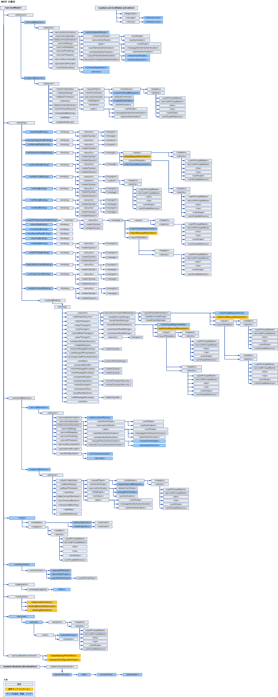

# WCF 構成スキーマ
[!INCLUDE[indigo1](../../../../../includes/indigo1-md.md)] 構成要素を使用して、[!INCLUDE[indigo2](../../../../../includes/indigo2-md.md)] のサービス アプリケーションとクライアント アプリケーションを構成できます。  [構成エディター ツール \(SvcConfigEditor.exe\)](../../../../../docs/framework/wcf/configuration-editor-tool-svcconfigeditor-exe.md) を使用して、クライアントとサービスの構成ファイルを作成および変更できます。  構成ファイルは XML として書式設定されているので、テキスト エディターを使用して手動で編集する場合は、XML について理解している必要があります。  理解しないで編集すると、XML 要素タグや属性が見つからないなどの問題が発生する可能性があります。  問題の原因は、XML 要素タグと属性が大文字と小文字を区別することによります。  
  
 [!INCLUDE[indigo2](../../../../../includes/indigo2-md.md)] 構成システムは、<xref:System.Configuration> 名前空間に基づいています。  したがって、<xref:System.Configuration> 名前空間によって提供される、構成ロック、暗号化、マージなどのすべての標準機能を使用して、アプリケーションとその構成のセキュリティを強化できます。  これらの概念の詳細については、次のトピックを参照してください。  
  
 [保護された構成を使用した構成情報の暗号化](http://go.microsoft.com/fwlink/?LinkId=95337)  
  
 [構成設定のロック](http://go.microsoft.com/fwlink/?LinkId=95338)  
  
 このセクションでは、各構成項目のすべての可能な値についてと各構成項目が他の WCF 構成要素とやり取りする方法について説明します。  次のマップは、WCF 構成スキーマを示します。  
  
   
  
> [!CAUTION]
>  潜在的なセキュリティ上の脅威を避けるために、アプリケーション構成ファイル \(app.config\) の [!INCLUDE[indigo2](../../../../../includes/indigo2-md.md)] 構成セクションは、適切なアクセス制御リスト \(ACL\) を使用して保護する必要があります。  たとえば、適切なユーザーだけが、アプリケーション バインドのセキュリティ設定、またはサービスの構成ファイルのサービス モデル セクションにアクセスまたは変更できるようにする必要があります。  
  
## このセクションの内容  
 [\<system.serviceModel\>](../../../../../docs/framework/configure-apps/file-schema/wcf/system-servicemodel.md)  
 `ServiceModel` 要素について説明します。  
  
 [\<system.serviceModel.activation\>](../../../../../docs/framework/configure-apps/file-schema/wcf/system-servicemodel-activation.md)  
 SMSvcHost.exe ツールを構成します。  
  
 [\<system.runtime.serialization\>](../../../../../docs/framework/configure-apps/file-schema/wcf/system-runtime-serialization.md)  
 <xref:System.Runtime.Serialization.DataContractSerializer> などのシリアライザーの使用時にオプションを設定するための最上位の要素。  
  
## 関連項目  
 [Configuring Windows Communication Foundation Applications](http://msdn.microsoft.com/ja-jp/13cb368e-88d4-4c61-8eed-2af0361c6d7a)  
 [!INCLUDE[indigo2](../../../../../includes/indigo2-md.md)] のサービスとクライアントを構成する方法について説明します。