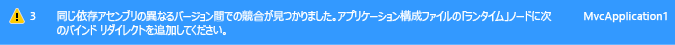

# <a name="how-to-enable-and-disable-automatic-binding-redirection"></a><span data-ttu-id="0fe40-102">方法: 自動バインディング リダイレクトを有効/無効にする</span><span class="sxs-lookup"><span data-stu-id="0fe40-102">How to: Enable and Disable Automatic Binding Redirection</span></span>
<span data-ttu-id="0fe40-103">[!INCLUDE[vs_dev12](../../../includes/vs-dev12-md.md)]以降では、[!INCLUDE[net_v451](../../../includes/net-v451-md.md)]を対象とするアプリをコンパイルするときに、アセンブリの統一をオーバーライドするために、アプリ構成ファイルにバインド リダイレクトが自動的に追加される場合があります。</span><span class="sxs-lookup"><span data-stu-id="0fe40-103">Starting with [!INCLUDE[vs_dev12](../../../includes/vs-dev12-md.md)], when you compile apps that target the [!INCLUDE[net_v451](../../../includes/net-v451-md.md)], binding redirects may be automatically added to the app configuration file to override assembly unification.</span></span> <span data-ttu-id="0fe40-104">アプリの構成ファイルで手動でバインド リダイレクトを指定している場合でも、アプリまたはそのコンポーネントが同じアセンブリの複数バージョンを参照している場合、バインド リダイレクトが追加されます。</span><span class="sxs-lookup"><span data-stu-id="0fe40-104">Binding redirects are added if your app or its components reference more than one version of the same assembly, even if you manually specify binding redirects in the configuration file for your app.</span></span> <span data-ttu-id="0fe40-105">自動バインド リダイレクト機能は、[!INCLUDE[net_v451](../../../includes/net-v451-md.md)] を対象とする従来のデスクトップ アプリと Web アプリに影響します。ただし、Web アプリに対する動作は若干異なります。</span><span class="sxs-lookup"><span data-stu-id="0fe40-105">The automatic binding redirection feature affects traditional desktop apps and web apps that target the [!INCLUDE[net_v451](../../../includes/net-v451-md.md)], although the behavior is slightly different for a web app.</span></span> <span data-ttu-id="0fe40-106">以前のバージョンの .NET Framework を対象とする既存のアプリがある場合は、自動バインド リダイレクトを有効にできます。また、手動で作成したバインド リダイレクトを保持する場合は、この機能を無効にできます。</span><span class="sxs-lookup"><span data-stu-id="0fe40-106">You can enable automatic binding redirection if you have existing apps that target previous versions of the .NET Framework, or you can disable this feature if you want to keep manually authored binding redirects.</span></span>  
  
## <a name="disabling-automatic-binding-redirects-in-desktop-apps"></a><span data-ttu-id="0fe40-107">デスクトップ アプリでの自動バインド リダイレクトの無効化</span><span class="sxs-lookup"><span data-stu-id="0fe40-107">Disabling automatic binding redirects in desktop apps</span></span>  
 <span data-ttu-id="0fe40-108">自動バインド リダイレクトは、[!INCLUDE[net_v451](../../../includes/net-v451-md.md)] 以上のバージョンを対象とする従来のデスクトップ アプリで、既定で有効になっています。</span><span class="sxs-lookup"><span data-stu-id="0fe40-108">Automatic binding redirects are enabled by default for traditional desktop apps that target the [!INCLUDE[net_v451](../../../includes/net-v451-md.md)] and later versions.</span></span> <span data-ttu-id="0fe40-109">バインド リダイレクトは、アプリケーションがコンパイルされ、発生する可能性のあるアセンブリの統一をオーバーライドするときに、出力構成ファイル (app.config) に追加されます。</span><span class="sxs-lookup"><span data-stu-id="0fe40-109">The binding redirects are added to the output configuration (app.config) file when the app is compiled and overrides the assembly unification that might otherwise take place.</span></span> <span data-ttu-id="0fe40-110">ソース app.config ファイルは変更されません。</span><span class="sxs-lookup"><span data-stu-id="0fe40-110">The source app.config file is not modified.</span></span> <span data-ttu-id="0fe40-111">アプリのプロジェクト ファイルを変更して、この機能を無効にできます。</span><span class="sxs-lookup"><span data-stu-id="0fe40-111">You can disable this feature by modifying the project file for the app.</span></span>  
  
#### <a name="to-disable-automatic-binding-redirects"></a><span data-ttu-id="0fe40-112">自動バインド リダイレクトを無効にするには</span><span class="sxs-lookup"><span data-stu-id="0fe40-112">To disable automatic binding redirects</span></span>  
  
1.  <span data-ttu-id="0fe40-113">Visual studio でプロジェクトを選択**ソリューション エクスプ ローラー**を選択し**ファイル エクスプ ローラーでフォルダーを開く**ショートカット メニューからです。</span><span class="sxs-lookup"><span data-stu-id="0fe40-113">In Visual Studio, select the project in **Solution Explorer**, and then choose **Open Folder in File Explorer** from the shortcut menu.</span></span>  
  
2.  <span data-ttu-id="0fe40-114">エクスプローラーで、プロジェクト ファイル (.csproj または .vbproj) を検索し、メモ帳で開きます。</span><span class="sxs-lookup"><span data-stu-id="0fe40-114">In File Explorer, find the project (.csproj or .vbproj) file, and open it in Notepad.</span></span>  
  
3.  <span data-ttu-id="0fe40-115">プロジェクト ファイルで、次のプロパティ エントリを検索します。</span><span class="sxs-lookup"><span data-stu-id="0fe40-115">In the project file, find the following property entry:</span></span>  
  
     `<AutoGenerateBindingRedirects>true</AutoGenerateBindingRedirects>`  
  
4.  <span data-ttu-id="0fe40-116">`true` を `false` に変更します。</span><span class="sxs-lookup"><span data-stu-id="0fe40-116">Change `true` to `false`:</span></span>  
  
     `<AutoGenerateBindingRedirects>false</AutoGenerateBindingRedirects>`  
  
## <a name="enabling-automatic-binding-redirects-manually"></a><span data-ttu-id="0fe40-117">自動バインド リダイレクトの手動での有効化</span><span class="sxs-lookup"><span data-stu-id="0fe40-117">Enabling automatic binding redirects manually</span></span>  
 <span data-ttu-id="0fe40-118">自動バインド リダイレクトは、.NET Framework の旧バージョンを対象とする既存のアプリで有効にするか、またはリダイレクトの追加を確認するメッセージが自動的に表示されない場合に有効にできます。</span><span class="sxs-lookup"><span data-stu-id="0fe40-118">You can enable automatic binding redirects in existing apps that target older versions of the .NET Framework, or in cases where you are not automatically prompted to add a redirect.</span></span> <span data-ttu-id="0fe40-119">新しいバージョンのフレームワークを対象としているが、リダイレクトの追加を確認するメッセージが自動的に表示されない場合は、ビルド出力でアセンブリを再マップすることが推奨されることがあります。</span><span class="sxs-lookup"><span data-stu-id="0fe40-119">If you are targeting a newer version of the framework but do not get automatically prompted to add a redirect, you will likely get   build output that suggests you remap assemblies.</span></span>  
  
#### <a name="to-manually-add-an-automatic-binding-redirect-property"></a><span data-ttu-id="0fe40-120">自動バインド リダイレクトのプロパティを手動で追加するには</span><span class="sxs-lookup"><span data-stu-id="0fe40-120">To manually add an automatic binding redirect property</span></span>  
  
1.  <span data-ttu-id="0fe40-121">Visual studio でプロジェクトを選択**ソリューション エクスプ ローラー**を選択し**ファイル エクスプ ローラーでフォルダーを開く**ショートカット メニューからです。</span><span class="sxs-lookup"><span data-stu-id="0fe40-121">In Visual Studio, select the project in **Solution Explorer**, and then choose **Open Folder in File Explorer** from the shortcut menu.</span></span>  
  
2.  <span data-ttu-id="0fe40-122">エクスプローラーで、プロジェクト ファイル (.csproj または .vbproj) を検索し、メモ帳で開きます。</span><span class="sxs-lookup"><span data-stu-id="0fe40-122">In File Explorer, find the project (.csproj or .vbproj) file, and open it in Notepad.</span></span>  
  
3.  <span data-ttu-id="0fe40-123">次の要素を最初の構成プロパティ グループに追加 (下にある、 \<PropertyGroup > タグ)。</span><span class="sxs-lookup"><span data-stu-id="0fe40-123">Add the following element to the first configuration property group (under the \<PropertyGroup> tag):</span></span>  
  
     `<AutoGenerateBindingRedirects>true</AutoGenerateBindingRedirects>`  
  
     <span data-ttu-id="0fe40-124">要素が挿入されたプロジェクト ファイルの例を次に示します。</span><span class="sxs-lookup"><span data-stu-id="0fe40-124">The following shows an example project file with the element inserted.</span></span>  
  
    ```xml  
    <?xml version="1.0" encoding="utf-8"?>  
    <Project ToolsVersion="12.0" DefaultTargets="Build" xmlns="http://schemas.microsoft.com/developer/msbuild/2003">  
      <Import Project="$(MSBuildExtensionsPath)\$(MSBuildToolsVersion)\Microsoft.Common.props" Condition="Exists('$(MSBuildExtensionsPath)\$(MSBuildToolsVersion)\Microsoft.Common.props')" />  
      <PropertyGroup>  
        <Configuration Condition=" '$(Configuration)' == ''     ">Debug</Configuration>  
        <Platform Condition=" '$(Platform)' == '' ">AnyCPU</Platform>  
        <ProjectGuid>{123334}</ProjectGuid>  
        ...  
        <AutoGenerateBindingRedirects>true</AutoGenerateBindingRedirects>  
      </PropertyGroup>  
    ...  
    </Project>  
    ```  
  
4.  <span data-ttu-id="0fe40-125">アプリをコンパイルします。</span><span class="sxs-lookup"><span data-stu-id="0fe40-125">Compile your app.</span></span>  
  
## <a name="enabling-automatic-binding-redirects-in-web-apps"></a><span data-ttu-id="0fe40-126">Web アプリでの自動バインド リダイレクトの有効化</span><span class="sxs-lookup"><span data-stu-id="0fe40-126">Enabling automatic binding redirects in web apps</span></span>  
 <span data-ttu-id="0fe40-127">自動バインド リダイレクトは、Web アプリでは異なる方法で実装されます。</span><span class="sxs-lookup"><span data-stu-id="0fe40-127">Automatic binding redirects are implemented differently for web apps.</span></span> <span data-ttu-id="0fe40-128">ソースの構成 (web.config) ファイルを Web アプリ用に変更する必要があるため、バインド リダイレクトは構成ファイルに自動的に追加されません。</span><span class="sxs-lookup"><span data-stu-id="0fe40-128">Because the source configuration (web.config) file must be modified for web apps, binding redirects are not automatically added to the configuration file.</span></span> <span data-ttu-id="0fe40-129">ただし、Visual Studio によってバインドの競合が通知されるため、バインド リダイレクトを追加して競合を解決できます。</span><span class="sxs-lookup"><span data-stu-id="0fe40-129">However, Visual Studio notifies you of binding conflicts, and you can add binding redirects to resolve the conflicts.</span></span> <span data-ttu-id="0fe40-130">バインド リダイレクトを追加するかどうかの確認メッセージは常に表示されるため、明示的に Web アプリのこの機能を無効にする必要はありません。</span><span class="sxs-lookup"><span data-stu-id="0fe40-130">Because you are always prompted to add binding redirects, you do not need to explicitly disable this feature for a web app.</span></span>  
  
#### <a name="to-add-binding-redirects-to-a-webconfig-file"></a><span data-ttu-id="0fe40-131">web.config ファイルにバインド リダイレクトを追加するには</span><span class="sxs-lookup"><span data-stu-id="0fe40-131">To add binding redirects to a web.config file</span></span>  
  
1.  <span data-ttu-id="0fe40-132">Visual Studio で、アプリをコンパイルし、ビルドの警告を確認します。</span><span class="sxs-lookup"><span data-stu-id="0fe40-132">In Visual Studio, compile the app, and check for build warnings.</span></span>  
  
     <span data-ttu-id="0fe40-133"></span><span class="sxs-lookup"><span data-stu-id="0fe40-133"></span></span>  
  
2.  <span data-ttu-id="0fe40-134">アセンブリ バインドの競合がある場合、警告が表示されます。</span><span class="sxs-lookup"><span data-stu-id="0fe40-134">If there are assembly binding conflicts, a warning appears.</span></span> <span data-ttu-id="0fe40-135">警告をダブルクリックします </span><span class="sxs-lookup"><span data-stu-id="0fe40-135">Double-click the warning.</span></span> <span data-ttu-id="0fe40-136">(キーボード: 警告とキーを押して選択**Enter**)。</span><span class="sxs-lookup"><span data-stu-id="0fe40-136">(Keyboard: Select the warning and press **Enter**.)</span></span>  
  
     <span data-ttu-id="0fe40-137">自動的にソース web.config ファイルに必要なバインド リダイレクトを追加できるダイアログ ボックスが表示されます。</span><span class="sxs-lookup"><span data-stu-id="0fe40-137">A dialog box that enables you to automatically add the necessary binding redirects to the source web.config file appears.</span></span>  
  
     <span data-ttu-id="0fe40-138"></span><span class="sxs-lookup"><span data-stu-id="0fe40-138"></span></span>  
  
## <a name="see-also"></a><span data-ttu-id="0fe40-139">関連項目</span><span class="sxs-lookup"><span data-stu-id="0fe40-139">See Also</span></span>  
 [<span data-ttu-id="0fe40-140">\<bindingRedirect > 要素</span><span class="sxs-lookup"><span data-stu-id="0fe40-140">\<bindingRedirect> Element</span></span>](../../../docs/framework/configure-apps/file-schema/runtime/bindingredirect-element.md)  
 [<span data-ttu-id="0fe40-141">アセンブリ バージョンのリダイレクト</span><span class="sxs-lookup"><span data-stu-id="0fe40-141">Redirecting Assembly Versions</span></span>](../../../docs/framework/configure-apps/redirect-assembly-versions.md)
