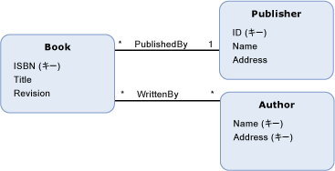
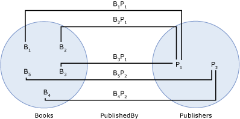

# 関連付けセット
*アソシエーション セット*の論理コンテナー[アソシエーション](../../../../docs/framework/data/adonet/association-type.md)同じ型のインスタンス。 アソシエーション セットは、データ モデリング構造ではなく、データ構造やリレーションシップを表しません。 アソシエーション セットは、アソシエーション インスタンスをグループ化してデータ ストアにマップするための、ホスト環境またはストレージ環境 (共通言語ランタイムや SQL Server データベースなど) の構造を提供します。  
  
 アソシエーション セットが内で定義されている、[エンティティ コンテナー](../../../../docs/framework/data/adonet/entity-container.md)の論理的なグループは[エンティティ セット](../../../../docs/framework/data/adonet/entity-set.md)とアソシエーション セット。  
  
 アソシエーション セットの定義には、次の情報が含まれます。  
  
-   アソシエーション セット名。 (必須)  
  
-   インスタンスを含むアソシエーション。 (必須)  
  
-   2 つ[アソシエーション セット end](../../../../docs/framework/data/adonet/association-set-end.md)です。  
  
## 例  
 下のダイアグラムは、`PublishedBy` および `WrittenBy` という 2 つのアソシエーションの概念モデルを示しています。 このダイアグラムにはアソシエーション セットに関する情報が示されていませんが、次のダイアグラムはこのモデルに基づくアソシエーション セットとエンティティ セットの例を示しています。  
  
   
  
 次の例は、上の概念モデルに基づくアソシエーション セット(`PublishedBy`) と 2 つのエンティティ セット (`Books` および `Publishers`) を示しています。 Bi、`Books`エンティティ セットのインスタンスを表し、`Book`実行時にエンティティ型。 同様に、Pj を表す、`Publisher`インスタンス、`Publishers`エンティティ セット。 BiPj がのインスタンスを表し、`PublishedBy`のアソシエーション、`PublishedBy`アソシエーション セット。  
  
   
  
 [ADO.NET Entity Framework](../../../../docs/framework/data/adonet/ef/index.md)概念スキーマ定義言語と呼ばれるドメイン固有言語 (DSL) を使用して ([CSDL](../../../../docs/framework/data/adonet/ef/language-reference/csdl-specification.md)) 概念モデルを定義します。 次の CSDL は、上のダイアグラムの各アソシエーションに対して 1 つのアソシエーション セットを持つエンティティ コンテナーを定義しています。 各アソシエーション セットの名前とアソシエーションは、XML 属性で定義しています。  
  
 [!code-xml[EDM_Example_Model#EntityContainerExample](../../../../samples/snippets/xml/VS_Snippets_Data/edm_example_model/xml/books.edmx#entitycontainerexample)]  
  
 関連付けのない 2 つのアソシエーション セットの共有と同じくらいごとに複数の関連付けセットを定義することは、[アソシエーション セット end](../../../../docs/framework/data/adonet/association-set-end.md)です。 次の CSDL は、`WrittenBy` アソシエーションの 2 つのアソシエーション セットを含むエンティティ コンテナーを定義しています。 `Book` エンティティ型と `Author` エンティティ型には複数のエンティティ セットが定義され、同じアソシエーション セット End を共有するアソシエーション セットがないことに注意してください。  
  
 [!code-xml[EDM_Example_Model#MultipleAssociationSets](../../../../samples/snippets/xml/VS_Snippets_Data/edm_example_model/xml/books3.edmx#multipleassociationsets)]  
  
## 関連項目  
 [Entity Data Model キーの概念](../../../../docs/framework/data/adonet/entity-data-model-key-concepts.md)  
 [Entity Data Model](../../../../docs/framework/data/adonet/entity-data-model.md)  
 [外部キーのプロパティ](../../../../docs/framework/data/adonet/foreign-key-property.md)
