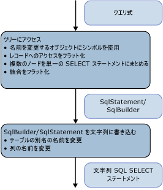

# <a name="architecture-and-design"></a><span data-ttu-id="a93d7-102">アーキテクチャとデザイン</span><span class="sxs-lookup"><span data-stu-id="a93d7-102">Architecture and Design</span></span>
<span data-ttu-id="a93d7-103">SQL 生成モジュール、[サンプル プロバイダー](http://go.microsoft.com/fwlink/?LinkId=180616)コマンド ツリーを表す式ツリー上のビジターとして実装されます。</span><span class="sxs-lookup"><span data-stu-id="a93d7-103">The SQL generation module in the [Sample Provider](http://go.microsoft.com/fwlink/?LinkId=180616) is implemented as a visitor on the expression tree that represents the command tree.</span></span> <span data-ttu-id="a93d7-104">生成は、式ツリーを介した単一のパスで行われます。</span><span class="sxs-lookup"><span data-stu-id="a93d7-104">The generation is done in a single pass over the expression tree.</span></span>  
  
 <span data-ttu-id="a93d7-105">ツリーのノードはボトムアップ方式で処理されます。</span><span class="sxs-lookup"><span data-stu-id="a93d7-105">The nodes of the tree are processed from the bottom up.</span></span> <span data-ttu-id="a93d7-106">まず、中間構造として SqlSelectStatement または SqlBuilder が生成され、どちらも ISqlFragment を実装します。</span><span class="sxs-lookup"><span data-stu-id="a93d7-106">First, an intermediate structure is produced: SqlSelectStatement or SqlBuilder, both implementing ISqlFragment.</span></span> <span data-ttu-id="a93d7-107">次に、文字列である SQL ステートメントがその構造から生成されます。</span><span class="sxs-lookup"><span data-stu-id="a93d7-107">Next, the string SQL statement is produced from that structure.</span></span> <span data-ttu-id="a93d7-108">中間構造には 2 つの理由があります。</span><span class="sxs-lookup"><span data-stu-id="a93d7-108">There are two reasons for the intermediate structure:</span></span>  
  
-   <span data-ttu-id="a93d7-109">論理上、SQL SELECT ステートメントは順序を無視して挿入されます。</span><span class="sxs-lookup"><span data-stu-id="a93d7-109">Logically, a SQL SELECT statement is populated out of order.</span></span> <span data-ttu-id="a93d7-110">FROM 句に参加するノードは、WHERE 句、GROUP BY 句、および ORDER BY 句に参加するノードの前にアクセスされます。</span><span class="sxs-lookup"><span data-stu-id="a93d7-110">The nodes that participate in the FROM clause are visited before the nodes that participate in the WHERE, GROUP BY, and the ORDER BY clause.</span></span>  
  
-   <span data-ttu-id="a93d7-111">別名の名前を変更するには、名前の変更中に競合が発生しないように、使用されているすべての別名を識別する必要があります。</span><span class="sxs-lookup"><span data-stu-id="a93d7-111">To rename aliases, you must identify all used aliases to avoid collisions during renaming.</span></span> <span data-ttu-id="a93d7-112">SqlBuilder で名前変更の選択を遅らせるには、Symbol オブジェクトを使用して、名前変更の候補となる列を表します。</span><span class="sxs-lookup"><span data-stu-id="a93d7-112">To defer the renaming choices in SqlBuilder, use Symbol objects to represent the columns that are candidates for renaming.</span></span>  
  
 <span data-ttu-id="a93d7-113"></span><span class="sxs-lookup"><span data-stu-id="a93d7-113"></span></span>  
  
 <span data-ttu-id="a93d7-114">最初のフェーズでは、式ツリーにアクセスしている間、式が SqlSelectStatement にグループ化され、結合がフラット化され、結合の別名がフラット化されます。</span><span class="sxs-lookup"><span data-stu-id="a93d7-114">In the first phase, while visiting the expression tree, expressions are grouped into SqlSelectStatements, joins are flattened, and join aliases are flattened.</span></span> <span data-ttu-id="a93d7-115">この段階では、Symbol オブジェクトは、名前変更が可能な列または入力の別名を表します。</span><span class="sxs-lookup"><span data-stu-id="a93d7-115">During this pass, Symbol objects represent columns or input aliases that may be renamed.</span></span>  
  
 <span data-ttu-id="a93d7-116">2 番目のフェーズでは、実際の文字列を生成している間、別名の名前が変更されます。</span><span class="sxs-lookup"><span data-stu-id="a93d7-116">In the second phase, while producing the actual string, aliases are renamed.</span></span>  
  
## <a name="data-structures"></a><span data-ttu-id="a93d7-117">データ構造</span><span class="sxs-lookup"><span data-stu-id="a93d7-117">Data Structures</span></span>  
 <span data-ttu-id="a93d7-118">このセクションで説明で使用される型、[サンプル プロバイダー](http://go.microsoft.com/fwlink/?LinkId=180616) SQL ステートメントの作成に使用することです。</span><span class="sxs-lookup"><span data-stu-id="a93d7-118">This section discusses the types used in the [Sample Provider](http://go.microsoft.com/fwlink/?LinkId=180616) that you use to build a SQL statement.</span></span>  
  
### <a name="isqlfragment"></a><span data-ttu-id="a93d7-119">ISqlFragment</span><span class="sxs-lookup"><span data-stu-id="a93d7-119">ISqlFragment</span></span>  
 <span data-ttu-id="a93d7-120">このセクションでは、ISqlFragment インターフェイスを実装するクラスについて説明します。このインターフェイスは、2 つの目的を達成します。</span><span class="sxs-lookup"><span data-stu-id="a93d7-120">This section covers the classes that implement the ISqlFragment interface, which serves two purposes:</span></span>  
  
-   <span data-ttu-id="a93d7-121">すべてのビジター メソッドに共通する戻り値の型です。</span><span class="sxs-lookup"><span data-stu-id="a93d7-121">A common return type for all the visitor methods.</span></span>  
  
-   <span data-ttu-id="a93d7-122">最終的な SQL 文字列を作成するためのメソッドを指定します。</span><span class="sxs-lookup"><span data-stu-id="a93d7-122">Gives a method to write the final SQL string.</span></span>  
  
```  
internal interface ISqlFragment {  
   void WriteSql(SqlWriter writer, SqlGenerator sqlGenerator);  
}  
```  
  
#### <a name="sqlbuilder"></a><span data-ttu-id="a93d7-123">SqlBuilder</span><span class="sxs-lookup"><span data-stu-id="a93d7-123">SqlBuilder</span></span>  
 <span data-ttu-id="a93d7-124">SqlBuilder は、StringBuilder と同様に、最終的な SQL 文字列の収集デバイスです。</span><span class="sxs-lookup"><span data-stu-id="a93d7-124">SqlBuilder is a gathering device for the final SQL string, similar to StringBuilder.</span></span> <span data-ttu-id="a93d7-125">これは、最終的な SQL を構成する文字列、および文字列に変換できる ISqlFragment で構成されます。</span><span class="sxs-lookup"><span data-stu-id="a93d7-125">It consists of the strings that make up the final SQL, along with ISqlFragments that can be converted into strings.</span></span>  
  
```  
internal sealed class SqlBuilder : ISqlFragment {  
   public void Append(object s)  
   public void AppendLine()  
   public bool IsEmpty  
}  
```  
  
#### <a name="sqlselectstatement"></a><span data-ttu-id="a93d7-126">SqlSelectStatement</span><span class="sxs-lookup"><span data-stu-id="a93d7-126">SqlSelectStatement</span></span>  
 <span data-ttu-id="a93d7-127">SqlSelectStatement は、"SELECT... の図形の正規 SQL SELECT ステートメント</span><span class="sxs-lookup"><span data-stu-id="a93d7-127">SqlSelectStatement represents a canonical SQL SELECT statement of the shape "SELECT …</span></span> <span data-ttu-id="a93d7-128">差出人。</span><span class="sxs-lookup"><span data-stu-id="a93d7-128">FROM  ..</span></span> <span data-ttu-id="a93d7-129">どこ。</span><span class="sxs-lookup"><span data-stu-id="a93d7-129">WHERE …</span></span> <span data-ttu-id="a93d7-130">グループ化してください.</span><span class="sxs-lookup"><span data-stu-id="a93d7-130">GROUP BY …</span></span> <span data-ttu-id="a93d7-131">ORDER BY"です。</span><span class="sxs-lookup"><span data-stu-id="a93d7-131">ORDER BY".</span></span>  
  
 <span data-ttu-id="a93d7-132">各 SQL 句は StringBuilder によって表されます。</span><span class="sxs-lookup"><span data-stu-id="a93d7-132">Each of the SQL clauses is represented by a StringBuilder.</span></span> <span data-ttu-id="a93d7-133">また、Distinct が指定されているかどうか、およびステートメントが最上位かどうかを追跡します。</span><span class="sxs-lookup"><span data-stu-id="a93d7-133">In addition, it tracks whether Distinct has been specified and whether the statement is topmost.</span></span> <span data-ttu-id="a93d7-134">ステートメントが最上位ではなく、ステートメントに TOP 句も含まれていない場合は、ORDER BY 句は省略されます。</span><span class="sxs-lookup"><span data-stu-id="a93d7-134">If the statement is not topmost, the ORDER BY clause is omitted unless the statement also has a TOP clause.</span></span>  
  
 <span data-ttu-id="a93d7-135">FromExtents には、SELECT ステートメントの入力のリストが格納されます。</span><span class="sxs-lookup"><span data-stu-id="a93d7-135">FromExtents contains the list of inputs for the SELECT statement.</span></span> <span data-ttu-id="a93d7-136">通常、これに含まれる要素は 1 つだけです。</span><span class="sxs-lookup"><span data-stu-id="a93d7-136">There is usually just one element in this.</span></span> <span data-ttu-id="a93d7-137">結合のための SELECT ステートメントには、一時的に、複数の要素が含まれる場合があります。</span><span class="sxs-lookup"><span data-stu-id="a93d7-137">SELECT statements for joins may temporarily have more than one element.</span></span>  
  
 <span data-ttu-id="a93d7-138">SELECT ステートメントが結合ノードによって作成されると、SqlSelectStatement は、AllJoinExtents の結合でフラット化されたすべてのエクステントのリストを保持します。</span><span class="sxs-lookup"><span data-stu-id="a93d7-138">If the SELECT statement is created by a Join node, SqlSelectStatement maintains a list of all the extents that have been flattened in the join in AllJoinExtents.</span></span> <span data-ttu-id="a93d7-139">OuterExtents は SqlSelectStatement の外部参照を表し、入力の別名の名前変更に使用されます。</span><span class="sxs-lookup"><span data-stu-id="a93d7-139">OuterExtents represents outer references of the SqlSelectStatement and is used for input alias renaming.</span></span>  
  
```  
internal sealed class SqlSelectStatement : ISqlFragment {  
   internal bool IsDistinct { get, set };  
   internal bool IsTopMost  
  
   internal List<Symbol> AllJoinExtents { get, set };  
   internal List<Symbol> FromExtents { get};  
   internal Dictionary<Symbol, bool> OuterExtents { get};  
  
   internal TopClause Top { get, set };  
  
   internal SqlBuilder Select {get};  
   internal SqlBuilder From  
   internal SqlBuilder Where  
   internal SqlBuilder GroupBy  
   public SqlBuilder OrderBy  
}  
```  
  
#### <a name="topclause"></a><span data-ttu-id="a93d7-140">TopClause</span><span class="sxs-lookup"><span data-stu-id="a93d7-140">TopClause</span></span>  
 <span data-ttu-id="a93d7-141">TopClause は SqlSelectStatement の TOP 式を表します。</span><span class="sxs-lookup"><span data-stu-id="a93d7-141">TopClause represents the TOP expression in a SqlSelectStatement.</span></span> <span data-ttu-id="a93d7-142">TopCount プロパティは、選択する必要がある TOP 行の数を示します。</span><span class="sxs-lookup"><span data-stu-id="a93d7-142">The TopCount property indicates how many TOP rows should be selected.</span></span>  <span data-ttu-id="a93d7-143">WithTies が true の場合、TopClause は DbLimitExpession から作成されています。</span><span class="sxs-lookup"><span data-stu-id="a93d7-143">When WithTies is true, the TopClause was built from a DbLimitExpession.</span></span>  
  
```  
class TopClause : ISqlFragment {  
   internal bool WithTies {get}  
   internal ISqlFragment TopCount {get}  
   internal TopClause(ISqlFragment topCount, bool withTies)  
   internal TopClause(int topCount, bool withTies)  
}  
```  
  
### <a name="symbols"></a><span data-ttu-id="a93d7-144">Symbols</span><span class="sxs-lookup"><span data-stu-id="a93d7-144">Symbols</span></span>  
 <span data-ttu-id="a93d7-145">Symbol 関連のクラスおよびシンボル テーブルは、入力の別名の名前変更、結合の別名のフラット化、および列の別名の名前変更を実行します。</span><span class="sxs-lookup"><span data-stu-id="a93d7-145">The Symbol-related classes and the symbol table perform input alias renaming, join alias flattening, and column alias renaming.</span></span>  
  
 <span data-ttu-id="a93d7-146">Symbol クラスは、エクステント、入れ子になった SELECT ステートメント、または列を表します。</span><span class="sxs-lookup"><span data-stu-id="a93d7-146">The Symbol class represents an extent, a nested SELECT statement, or a column.</span></span> <span data-ttu-id="a93d7-147">Symbol クラスは、使用後に名前を変更できるように、実際の別名の代わりに使用されます。また、Symbol クラスが表す成果物の追加情報も伝達します (型も同様です)。</span><span class="sxs-lookup"><span data-stu-id="a93d7-147">It is used instead of an actual alias to allow for renaming after it has been used and it also carries additional information for the artifact it represents (like the type).</span></span>  
  
```  
class Symbol : ISqlFragment {  
   internal Dictionary<string, Symbol> Columns {get}  
   internal bool NeedsRenaming {get, set}  
   internal bool IsUnnest {get, set}   //not used  
  
   public string Name{get}  
   public string NewName {get,set}  
   internal TypeUsage Type {get, set}  
  
   public Symbol(string name, TypeUsage type)  
}  
```  
  
 <span data-ttu-id="a93d7-148">Name には、表されるエクステント、入れ子になった SELECT ステートメント、または列の元の別名が格納されます。</span><span class="sxs-lookup"><span data-stu-id="a93d7-148">Name stores the original alias for the represented extent, nested SELECT statement, or a column.</span></span>  
  
 <span data-ttu-id="a93d7-149">NewName には、SQL SELECT ステートメントで使用される別名が格納されます。</span><span class="sxs-lookup"><span data-stu-id="a93d7-149">NewName stores the alias that will be used in the SQL SELECT statement.</span></span> <span data-ttu-id="a93d7-150">最初は Name に設定され、最終的な文字列クエリを生成する際に必要な場合のみ、名前が変更されます。</span><span class="sxs-lookup"><span data-stu-id="a93d7-150">It is originally set to Name, and only renamed if needed when generating the final string query.</span></span>  
  
 <span data-ttu-id="a93d7-151">Type は、エクステントおよび入れ子になった SELECT ステートメントを表すシンボルの場合のみ有効です。</span><span class="sxs-lookup"><span data-stu-id="a93d7-151">Type is only useful for symbols representing extents and nested SELECT statements.</span></span>  
  
#### <a name="symbolpair"></a><span data-ttu-id="a93d7-152">SymbolPair</span><span class="sxs-lookup"><span data-stu-id="a93d7-152">SymbolPair</span></span>  
 <span data-ttu-id="a93d7-153">SymbolPair クラスは、レコードのフラット化に対処します。</span><span class="sxs-lookup"><span data-stu-id="a93d7-153">The SymbolPair class addresses record flattening.</span></span>  
  
 <span data-ttu-id="a93d7-154">プロパティ式 D(v, "j3.j2.j1.a.x") を考えてみます。この式では、v は VarRef、j1、j2、j3 は結合、a はエクステント、x は列です。</span><span class="sxs-lookup"><span data-stu-id="a93d7-154">Consider a property expression D(v, "j3.j2.j1.a.x") where v is a VarRef, j1, j2, j3 are joins, a is an extent, and x is a columns.</span></span>  
  
 <span data-ttu-id="a93d7-155">これは、最終的に {j'}.{x'} に変換する必要があります。</span><span class="sxs-lookup"><span data-stu-id="a93d7-155">This has to be translated eventually into {j'}.{x'}.</span></span> <span data-ttu-id="a93d7-156">ソース フィールドが表す最も外側の SqlStatement は、結合式 (j2 など) を表します。つまり、これは常に Join シンボルです。</span><span class="sxs-lookup"><span data-stu-id="a93d7-156">The source field represents the outermost SqlStatement, representing a join expression (say j2); this is always a Join symbol.</span></span> <span data-ttu-id="a93d7-157">列フィールドは、非結合シンボルで停止するまで、ある結合シンボルから次の結合シンボルに移動します。</span><span class="sxs-lookup"><span data-stu-id="a93d7-157">The column field moves from one join symbol to the next until it stops at a non-join symbol.</span></span> <span data-ttu-id="a93d7-158">これは、DbPropertyExpression にアクセスすると返されますが、SqlBuilder に追加されることはありません。</span><span class="sxs-lookup"><span data-stu-id="a93d7-158">This is returned when visiting a DbPropertyExpression but is never added to a SqlBuilder.</span></span>  
  
```  
class SymbolPair : ISqlFragment {  
   public Symbol Source;  
   public Symbol Column;  
   public SymbolPair(Symbol source, Symbol column)  
}  
```  
  
#### <a name="joinsymbol"></a><span data-ttu-id="a93d7-159">JoinSymbol</span><span class="sxs-lookup"><span data-stu-id="a93d7-159">JoinSymbol</span></span>  
 <span data-ttu-id="a93d7-160">Join シンボルは、結合または結合入力を含む入れ子になった SELECT ステートメントを表す Symbol です。</span><span class="sxs-lookup"><span data-stu-id="a93d7-160">A Join symbol is a Symbol that represents a nested SELECT statement with a join or a join input.</span></span>  
  
```  
internal sealed class JoinSymbol : Symbol {  
   internal List<Symbol> ColumnList {get, set}  
   internal List<Symbol> ExtentList {get}  
   internal List<Symbol> FlattenedExtentList {get, set}  
   internal Dictionary<string, Symbol> NameToExtent {get}  
   internal bool IsNestedJoin {get, set}  
  
   public JoinSymbol(string name, TypeUsage type, List<Symbol> extents)  
}  
```  
  
 <span data-ttu-id="a93d7-161">このシンボルが SQL SELECT ステートメントを表す場合、ColumnList は SELECT 句内の列のリストを表します。</span><span class="sxs-lookup"><span data-stu-id="a93d7-161">ColumnList represents the list of columns in the SELECT clause if this symbol represents a SQL SELECT statement.</span></span> <span data-ttu-id="a93d7-162">ExtentList は、SELECT 句内のエクステントのリストです。</span><span class="sxs-lookup"><span data-stu-id="a93d7-162">ExtentList is the list of extents in the SELECT clause.</span></span> <span data-ttu-id="a93d7-163">結合により最上位で複数のエクステントがフラット化された場合、FlattenedExtentList はそのエクステントを追跡し、エクステントの別名が正しく変更されたことを確認します。</span><span class="sxs-lookup"><span data-stu-id="a93d7-163">If the join has multiple extents flattened at the top level, FlattenedExtentList tracks the extents to ensure that extent aliases are renamed correctly.</span></span>  
  
 <span data-ttu-id="a93d7-164">NameToExtent は、ExtentList 内のすべてのエクステントをディクショナリとして使用します。</span><span class="sxs-lookup"><span data-stu-id="a93d7-164">NameToExtent has all the extents in ExtentList as a dictionary.</span></span> <span data-ttu-id="a93d7-165">IsNestedJoin は、JoinSymbol が通常の結合シンボルか、対応する SqlSelectStatement を持つ結合シンボルかを判断するために使用します。</span><span class="sxs-lookup"><span data-stu-id="a93d7-165">IsNestedJoin is used to determine whether a JoinSymbol is an ordinary join symbol or one that has a corresponding SqlSelectStatement.</span></span>  
  
 <span data-ttu-id="a93d7-166">すべてのリストは、正確に設定されると、参照または列挙に使用されます。</span><span class="sxs-lookup"><span data-stu-id="a93d7-166">All the lists are set exactly once and then used for lookups or enumeration.</span></span>  
  
#### <a name="symboltable"></a><span data-ttu-id="a93d7-167">SymbolTable</span><span class="sxs-lookup"><span data-stu-id="a93d7-167">SymbolTable</span></span>  
 <span data-ttu-id="a93d7-168">SymbolTable は、変数名を Symbol に解決するために使用されます。</span><span class="sxs-lookup"><span data-stu-id="a93d7-168">SymbolTable is used to resolve variable names to Symbols.</span></span> <span data-ttu-id="a93d7-169">SymbolTable は、各スコープの新しいエントリを持つスタックとして実装されます。</span><span class="sxs-lookup"><span data-stu-id="a93d7-169">SymbolTable is implemented as a stack with a new entry for each scope.</span></span> <span data-ttu-id="a93d7-170">Lookup は、エントリが見つかるまでスタックの最上位から最下位まで検索します。</span><span class="sxs-lookup"><span data-stu-id="a93d7-170">Lookups search from the top of the stack to the bottom until an entry is found.</span></span>  
  
```  
internal sealed class SymbolTable {  
   internal void EnterScope()  
   internal void ExitScope()  
   internal void Add(string name, Symbol value)  
   internal Symbol Lookup(string name)  
}  
```  
  
 <span data-ttu-id="a93d7-171">SQL 生成モジュールのインスタンス 1 つにつき、SymbolTable は 1 つしかありません。</span><span class="sxs-lookup"><span data-stu-id="a93d7-171">There is only one SymbolTable per one instance of the Sql Generation module.</span></span> <span data-ttu-id="a93d7-172">各リレーショナル ノードでは、スコープへの出入りが行われます。</span><span class="sxs-lookup"><span data-stu-id="a93d7-172">Scopes are entered and exited for each relational node.</span></span> <span data-ttu-id="a93d7-173">前のスコープ内のすべてのシンボルは、同じ名前の他のシンボルによって非表示になっている場合を除いて、後のスコープに表示されます。</span><span class="sxs-lookup"><span data-stu-id="a93d7-173">All symbols in earlier scopes are visible to later scopes unless hidden by other symbols with the same name.</span></span>  
  
### <a name="global-state-for-the-visitor"></a><span data-ttu-id="a93d7-174">ビジターのグローバル状態</span><span class="sxs-lookup"><span data-stu-id="a93d7-174">Global State for the Visitor</span></span>  
 <span data-ttu-id="a93d7-175">別名と列の名前変更を支援するために、クエリ ツリーを最初に通過する際に使用されたすべての列名 (AllColumnNames) とすべてのエクステントの別名 (AllExtentNames) のリストを保持します。</span><span class="sxs-lookup"><span data-stu-id="a93d7-175">To assist in renaming of aliases and columns, maintain a list of all the column names (AllColumnNames) and extent aliases (AllExtentNames) that have been used in the first pass over the query tree.</span></span>  <span data-ttu-id="a93d7-176">シンボル テーブルは、変数名を Symbol に解決します。</span><span class="sxs-lookup"><span data-stu-id="a93d7-176">The symbol table resolves variable names to Symbols.</span></span> <span data-ttu-id="a93d7-177">IsVarRefSingle は、検証目的でのみ使用されるため、必ずしも必要ではありません。</span><span class="sxs-lookup"><span data-stu-id="a93d7-177">IsVarRefSingle is only used for verification purposes, it is not strictly necessary.</span></span>  
  
 <span data-ttu-id="a93d7-178">CurrentSelectStatement および IsParentAJoin を介して使用される 2 つのスタックは、親ノードから子ノードに "parameters" を渡すために使用されます。これは、ビジター パターンによってパラメーターを渡すことができないためです。</span><span class="sxs-lookup"><span data-stu-id="a93d7-178">The two stacks used via CurrentSelectStatement and IsParentAJoin are used to pass "parameters" from parent to child nodes, since the visitor pattern does not allow us to pass parameters.</span></span>  
  
```  
internal Dictionary<string, int> AllExtentNames {get}  
internal Dictionary<string, int> AllColumnNames {get}  
SymbolTable symbolTable = new SymbolTable();  
bool isVarRefSingle = false;  
  
Stack<SqlSelectStatement> selectStatementStack;  
private SqlSelectStatement CurrentSelectStatement{get}  
  
Stack<bool> isParentAJoinStack;  
private bool IsParentAJoin{get}  
```  
  
## <a name="common-scenarios"></a><span data-ttu-id="a93d7-179">一般的なシナリオ</span><span class="sxs-lookup"><span data-stu-id="a93d7-179">Common Scenarios</span></span>  
 <span data-ttu-id="a93d7-180">このセクションでは、一般的なプロバイダー シナリオについて説明します。</span><span class="sxs-lookup"><span data-stu-id="a93d7-180">This section discusses common provider scenarios.</span></span>  
  
### <a name="grouping-expression-nodes-into-sql-statements"></a><span data-ttu-id="a93d7-181">SQL ステートメントへの式ノードのグループ化</span><span class="sxs-lookup"><span data-stu-id="a93d7-181">Grouping Expression Nodes into SQL Statements</span></span>  
 <span data-ttu-id="a93d7-182">ボトムアップ方式でツリーにアクセスしたときに最初のリレーショナル ノード (通常は DbScanExpression エクステント) が見つかった場合に SqlSelectStatement が作成されます。</span><span class="sxs-lookup"><span data-stu-id="a93d7-182">A SqlSelectStatement is created when the first relational node is encountered (typically a DbScanExpression extent) when visiting the tree from the bottom up.</span></span> <span data-ttu-id="a93d7-183">入れ子になったクエリをできるだけ少なくして SQL SELECT ステートメントを生成するには、その SqlSelectStatement でできるだけ多くの親ノードを集計します。</span><span class="sxs-lookup"><span data-stu-id="a93d7-183">To produce a SQL SELECT statement with as few nested queries as possible, aggregate as many of its parent nodes as possible in that SqlSelectStatement.</span></span>  
  
 <span data-ttu-id="a93d7-184">特定の (リレーショナル) ノードを現在の SqlSelectStatement (入力にアクセスしたときに返される SqlSelectStatement) に追加できるかどうか、または新しいステートメントを開始する必要があるかどうかの決定は、IsCompatible メソッドによって計算され、SqlSelectStatement に既に含まれるノードに依存します。これは、指定されたノードの下にあったノードによって異なります。</span><span class="sxs-lookup"><span data-stu-id="a93d7-184">The decision of whether a given (relational) node can be added to the current SqlSelectStatement (the one returned when visiting the input) or if a new statement needs to be started is computed by the method IsCompatible and depends on what is already in the SqlSelectStatement, which depends on what nodes were below the given node.</span></span>  
  
 <span data-ttu-id="a93d7-185">通常、連結が検討されているノードが空ではない句の後に SQL ステートメントの句が評価される場合、そのノードを現在のステートメントに追加することはできません。</span><span class="sxs-lookup"><span data-stu-id="a93d7-185">Typically, if SQL statement clauses are evaluated after clauses where the nodes being considered for merging are not empty, the node cannot be added to the current statement.</span></span> <span data-ttu-id="a93d7-186">たとえば、次のノードが Filter の場合、そのノードを現在の SqlSelectStatement に組み込むことができるのは、次の条件に当てはまる場合のみです。</span><span class="sxs-lookup"><span data-stu-id="a93d7-186">For example, if the next node is a Filter, that node can be incorporated into the current SqlSelectStatement only if the following is true:</span></span>  
  
-   <span data-ttu-id="a93d7-187">SELECT リストが空の場合。</span><span class="sxs-lookup"><span data-stu-id="a93d7-187">The SELECT list is empty.</span></span> <span data-ttu-id="a93d7-188">SELECT リストが空ではない場合、SELECT リストはフィルターの前のノードによって生成されているため、述語はその SELECT リストによって生成された列を参照できます。</span><span class="sxs-lookup"><span data-stu-id="a93d7-188">If the SELECT list is not empty, the select list was produced by a node preceding the filter and the predicate may refer to columns produced by that SELECT list.</span></span>  
  
-   <span data-ttu-id="a93d7-189">GROUPBY が空の場合。</span><span class="sxs-lookup"><span data-stu-id="a93d7-189">The GROUPBY is empty.</span></span> <span data-ttu-id="a93d7-190">GROUPBY が空ではない場合、フィルターを追加すると、グループ化の前にフィルター処理することになりますが、これは正しい処理ではありません。</span><span class="sxs-lookup"><span data-stu-id="a93d7-190">If the GROUPBY is not empty, adding the filter would mean filtering before grouping, which is not correct.</span></span>  
  
-   <span data-ttu-id="a93d7-191">TOP 句が空の場合。</span><span class="sxs-lookup"><span data-stu-id="a93d7-191">The TOP clause is empty.</span></span> <span data-ttu-id="a93d7-192">TOP 句が空ではない場合、フィルターを追加すると、TOP を実行する前にフィルター処理することになりますが、これは正しい処理ではありません。</span><span class="sxs-lookup"><span data-stu-id="a93d7-192">If the TOP clause is not empty, adding the filter would mean filtering before doing TOP, which is not correct.</span></span>  
  
 <span data-ttu-id="a93d7-193">これは、DbConstantExpression や算術式のような非リレーショナル ノードには当てはまりません。非リレーショナル ノードは、常に既存の SqlSelectStatement に含まれているためです。</span><span class="sxs-lookup"><span data-stu-id="a93d7-193">This does not apply to non-relational nodes like DbConstantExpression or arithmetic expressions, because these are always included as part of an existing SqlSelectStatement.</span></span>  
  
 <span data-ttu-id="a93d7-194">また、結合ツリーのルート (結合の親を持たない結合ノード) が見つかると、新しい SqlSelectStatement が開始されます。</span><span class="sxs-lookup"><span data-stu-id="a93d7-194">Also, when encountering the root of join tree (a join node that does not have a join parent), a new SqlSelectStatement is started.</span></span> <span data-ttu-id="a93d7-195">左辺スパイン結合の子はすべて、その SqlSelectStatement に集計されます。</span><span class="sxs-lookup"><span data-stu-id="a93d7-195">All of its left spine join children are aggregated into that SqlSelectStatement.</span></span>  
  
 <span data-ttu-id="a93d7-196">新しい SqlSelectStatement が開始され、現在の SqlSelectStatement が入力に追加されるたびに、投影列 (SELECT 句) が存在しない場合はこの列を追加することによって、現在の SqlSelectStatement を完了することが必要になる場合があります。</span><span class="sxs-lookup"><span data-stu-id="a93d7-196">Whenever a new SqlSelectStatement is started, and the current one is added to the input, the current SqlSelectStatement may need to be completed by adding projection columns (a SELECT clause) if one does not exist.</span></span> <span data-ttu-id="a93d7-197">これを行うには、AddDefaultColumns メソッドを使用します。このメソッドは、SqlSelectStatement の FromExtents を参照し、FromExtents が表すエクステントのリストによってスコープに取り込まれるすべての列を、投影された列のリストに追加します。</span><span class="sxs-lookup"><span data-stu-id="a93d7-197">This is done with the method AddDefaultColumns, which looks at the FromExtents of the SqlSelectStatement and adds all the columns that the list of extents represented by FromExtents brings in scope to the list of projected columns.</span></span> <span data-ttu-id="a93d7-198">これが実行されるのは、その時点で、他のノードが参照している列が不明なためです。</span><span class="sxs-lookup"><span data-stu-id="a93d7-198">This is done, because at that point, it is unknown which columns are referenced by the other nodes.</span></span> <span data-ttu-id="a93d7-199">これは、後で使用できる列のみを投影するように最適化できます。</span><span class="sxs-lookup"><span data-stu-id="a93d7-199">This can be optimized to only project the columns that can later be used.</span></span>  
  
### <a name="join-flattening"></a><span data-ttu-id="a93d7-200">結合のフラット化</span><span class="sxs-lookup"><span data-stu-id="a93d7-200">Join Flattening</span></span>  
 <span data-ttu-id="a93d7-201">IsParentAJoin プロパティは、特定の結合をフラット化できるかどうかを判断するのに役立ちます。</span><span class="sxs-lookup"><span data-stu-id="a93d7-201">The IsParentAJoin property helps determine whether a given join can be flattened.</span></span> <span data-ttu-id="a93d7-202">特に、IsParentAJoin は、結合の左側の子、および結合への即時入力となる各 DbScanExpression に対してのみ `true` を返します。この場合、その子ノードでは、後で親で使用されるのと同じ SqlSelectStatement が再利用されます。</span><span class="sxs-lookup"><span data-stu-id="a93d7-202">In particular, IsParentAJoin returns `true` only for the left child of a join and for each DbScanExpression that is an immediate input to a join, in which case that child node reuses the same SqlSelectStatement that the parent would later use.</span></span> <span data-ttu-id="a93d7-203">詳細については、「結合式」を参照してください。</span><span class="sxs-lookup"><span data-stu-id="a93d7-203">For more information, see "Join Expressions".</span></span>  
  
### <a name="input-alias-redirecting"></a><span data-ttu-id="a93d7-204">入力の別名のリダイレクト</span><span class="sxs-lookup"><span data-stu-id="a93d7-204">Input Alias Redirecting</span></span>  
 <span data-ttu-id="a93d7-205">入力の別名のリダイレクトは、シンボル テーブルによって行われます。</span><span class="sxs-lookup"><span data-stu-id="a93d7-205">Input alias redirecting is accomplished with the symbol table.</span></span>  
  
 <span data-ttu-id="a93d7-206">入力の別名のリダイレクトを説明するための最初の例を参照してください[コマンド ツリーのベスト プラクティスから SQL を生成する](../../../../../docs/framework/data/adonet/ef/generating-sql-from-command-trees-best-practices.md)です。</span><span class="sxs-lookup"><span data-stu-id="a93d7-206">To explain input alias redirecting, refer to the first example in [Generating SQL from Command Trees - Best Practices](../../../../../docs/framework/data/adonet/ef/generating-sql-from-command-trees-best-practices.md).</span></span>  <span data-ttu-id="a93d7-207">この例では、"a" を投影の "b" にリダイレクトする必要がありました。</span><span class="sxs-lookup"><span data-stu-id="a93d7-207">There "a" needed to be redirected to "b" in the projection.</span></span>  
  
 <span data-ttu-id="a93d7-208">SqlSelectStatement オブジェクトが作成されると、ノードへの入力であるエクステントが SqlSelectStatement の From プロパティに配置されます。</span><span class="sxs-lookup"><span data-stu-id="a93d7-208">When a SqlSelectStatement object is created, the extent that is the input to the node is put in the From property of the SqlSelectStatement.</span></span> <span data-ttu-id="a93d7-209">Symbol (<symbol_b>) は、入力バインディング名 ("b") に基づいて作成され、エクステントおよび "AS  " +  <symbol_b> が From 句に追加されることを表します。</span><span class="sxs-lookup"><span data-stu-id="a93d7-209">A Symbol (<symbol_b>) is created based on the input binding name ("b") to represent that extent and "AS  " +  <symbol_b> is appended to the From Clause.</span></span>  <span data-ttu-id="a93d7-210">シンボルは FromExtents プロパティにも追加されます。</span><span class="sxs-lookup"><span data-stu-id="a93d7-210">The symbol is also added to the FromExtents property.</span></span>  
  
 <span data-ttu-id="a93d7-211">シンボルはシンボル テーブルにも追加され、入力バインディング名がシンボルにリンクされます ("b", <symbol_b>)。</span><span class="sxs-lookup"><span data-stu-id="a93d7-211">The symbol is also added to the symbol table to link the input binding name to it ("b", <symbol_b>).</span></span>  
  
 <span data-ttu-id="a93d7-212">後続のノードが SqlSelectStatement を再利用する場合、シンボル テーブルにエントリが追加され、その入力バインディング名がそのシンボルにリンクされます。</span><span class="sxs-lookup"><span data-stu-id="a93d7-212">If a subsequent node reuses that SqlSelectStatement, it adds an entry to the symbol table to link its input binding name to that symbol.</span></span> <span data-ttu-id="a93d7-213">例では、入力バインディング名が"a"の DbProjectExpression は、SqlSelectStatement を再利用し、追加 ("a"、 \< symbol_b >) をテーブルにします。</span><span class="sxs-lookup"><span data-stu-id="a93d7-213">In our example, the DbProjectExpression with the input binding name of "a" would reuse the SqlSelectStatement and add ("a", \< symbol_b>) to the table.</span></span>  
  
 <span data-ttu-id="a93d7-214">SqlSelectStatement を再利用しているノードの入力バインディング名を式で参照すると、その参照は、シンボル テーブルを使用して、リダイレクトされた正しいシンボルに解決されます。</span><span class="sxs-lookup"><span data-stu-id="a93d7-214">When expressions reference the input binding name of the node that is reusing the SqlSelectStatement, that reference is resolved using the symbol table to the correct redirected symbol.</span></span> <span data-ttu-id="a93d7-215">"a" を表す DbVariableReferenceExpression にアクセスしているときに "a.x" から "a" に解決されると、Symbol <symbol_b> に解決されます。</span><span class="sxs-lookup"><span data-stu-id="a93d7-215">When "a" from "a.x" is resolved while visiting the DbVariableReferenceExpression representing "a" it will resolve to the Symbol <symbol_b>.</span></span>  
  
### <a name="join-alias-flattening"></a><span data-ttu-id="a93d7-216">結合の別名のフラット化</span><span class="sxs-lookup"><span data-stu-id="a93d7-216">Join Alias Flattening</span></span>  
 <span data-ttu-id="a93d7-217">結合の別名のフラット化は、「DbPropertyExpression」で説明されているように、DbPropertyExpression にアクセスするときに行われます。</span><span class="sxs-lookup"><span data-stu-id="a93d7-217">Join alias flattening is achieved when visiting a DbPropertyExpression as described in the section titled DbPropertyExpression.</span></span>  
  
### <a name="column-name-and-extent-alias-renaming"></a><span data-ttu-id="a93d7-218">列名およびエクステントの別名の名前変更</span><span class="sxs-lookup"><span data-stu-id="a93d7-218">Column Name and Extent Alias Renaming</span></span>  
 <span data-ttu-id="a93d7-219">列名とエクステントの別名の名前変更に関する問題を解決するには、「SQL 生成の 2 番目のフェーズ: 文字列コマンドの生成」で説明されている、生成の 2 番目のフェーズで別名に置換されるシンボルを使用します。</span><span class="sxs-lookup"><span data-stu-id="a93d7-219">The issue of column name and extent alias renaming is addressed by using symbols that only get substituted with aliases in the second phase of the generation described in the section titled Second Phase of SQL Generation: Generating the String Command.</span></span>  
  
## <a name="first-phase-of-the-sql-generation-visiting-the-expression-tree"></a><span data-ttu-id="a93d7-220">SQL 生成の最初のフェーズ: 式ツリーへのアクセス</span><span class="sxs-lookup"><span data-stu-id="a93d7-220">First Phase of the SQL Generation: Visiting the Expression Tree</span></span>  
 <span data-ttu-id="a93d7-221">このセクションでは、SQL 生成の最初のフェーズについて説明します。このフェーズでは、クエリを表す式にアクセスするときに、中間構造 SqlSelectStatement または SqlBuilder が生成されます。</span><span class="sxs-lookup"><span data-stu-id="a93d7-221">This section describes the first phase of SQL generation, when the expression representing the query is visited and an intermediate structure is produced, either a SqlSelectStatement or a SqlBuilder.</span></span>  
  
 <span data-ttu-id="a93d7-222">このセクションでは、さまざまな式ノード カテゴリにアクセスする際の原則、および特定の式の型にアクセスする際の詳細について説明します。</span><span class="sxs-lookup"><span data-stu-id="a93d7-222">This section describes the principles of visiting different expression node categories, and details of visiting specific expression types.</span></span>  
  
### <a name="relational-non-join-nodes"></a><span data-ttu-id="a93d7-223">リレーショナル (非結合) ノード</span><span class="sxs-lookup"><span data-stu-id="a93d7-223">Relational (Non-Join) Nodes</span></span>  
 <span data-ttu-id="a93d7-224">非結合ノードをサポートする式の型を次に示します。</span><span class="sxs-lookup"><span data-stu-id="a93d7-224">The following expression types support non-join nodes:</span></span>  
  
-   <span data-ttu-id="a93d7-225">DbDistinctExpression</span><span class="sxs-lookup"><span data-stu-id="a93d7-225">DbDistinctExpression</span></span>  
  
-   <span data-ttu-id="a93d7-226">DbFilterExpression</span><span class="sxs-lookup"><span data-stu-id="a93d7-226">DbFilterExpression</span></span>  
  
-   <span data-ttu-id="a93d7-227">DbGroupByExpression</span><span class="sxs-lookup"><span data-stu-id="a93d7-227">DbGroupByExpression</span></span>  
  
-   <span data-ttu-id="a93d7-228">DbLimitExpession</span><span class="sxs-lookup"><span data-stu-id="a93d7-228">DbLimitExpession</span></span>  
  
-   <span data-ttu-id="a93d7-229">DbProjectExpression</span><span class="sxs-lookup"><span data-stu-id="a93d7-229">DbProjectExpression</span></span>  
  
-   <span data-ttu-id="a93d7-230">DbSkipExpression</span><span class="sxs-lookup"><span data-stu-id="a93d7-230">DbSkipExpression</span></span>  
  
-   <span data-ttu-id="a93d7-231">DbSortExpression</span><span class="sxs-lookup"><span data-stu-id="a93d7-231">DbSortExpression</span></span>  
  
 <span data-ttu-id="a93d7-232">これらのノードへのアクセスは、次のパターンに従います。</span><span class="sxs-lookup"><span data-stu-id="a93d7-232">Visiting these nodes follows the following pattern:</span></span>  
  
1.  <span data-ttu-id="a93d7-233">リレーショナル入力にアクセスし、結果の SqlSelectStatement を取得します。</span><span class="sxs-lookup"><span data-stu-id="a93d7-233">Visit the relational input and get the resulting SqlSelectStatement.</span></span> <span data-ttu-id="a93d7-234">リレーショナル ノードへの入力は次のいずれかになります。</span><span class="sxs-lookup"><span data-stu-id="a93d7-234">The input to a relational node could be one of the following:</span></span>  
  
    -   <span data-ttu-id="a93d7-235">エクステントを含むリレーショナル ノード (DbScanExpression など)。</span><span class="sxs-lookup"><span data-stu-id="a93d7-235">A relational node, including an extent (a DbScanExpression, for example).</span></span> <span data-ttu-id="a93d7-236">このようなノードにアクセスすると、SqlSelectStatement が返されます。</span><span class="sxs-lookup"><span data-stu-id="a93d7-236">Visiting such a node returns a SqlSelectStatement.</span></span>  
  
    -   <span data-ttu-id="a93d7-237">集合演算式 (UNION ALL など)。</span><span class="sxs-lookup"><span data-stu-id="a93d7-237">A set operation expression (UNION ALL, for example).</span></span> <span data-ttu-id="a93d7-238">結果は、角かっこで囲み、新しい SqlSelectStatement の FROM 句に配置する必要があります。</span><span class="sxs-lookup"><span data-stu-id="a93d7-238">The result has to be wrapped in brackets and put in the FROM clause of a new SqlSelectStatement.</span></span>  
  
2.  <span data-ttu-id="a93d7-239">入力によって生成された SqlSelectStatement に現在のノードを追加できるかどうかを確認します。</span><span class="sxs-lookup"><span data-stu-id="a93d7-239">Check whether the current node can be added to the SqlSelectStatement produced by the input.</span></span> <span data-ttu-id="a93d7-240">これについては、「SQL ステートメントへの式ノードのグループ化」で説明しています。</span><span class="sxs-lookup"><span data-stu-id="a93d7-240">The section titled Grouping Expressions into SQL Statements describes this.</span></span> <span data-ttu-id="a93d7-241">追加できない場合は、次の操作を行います。</span><span class="sxs-lookup"><span data-stu-id="a93d7-241">If not,</span></span>  
  
    -   <span data-ttu-id="a93d7-242">現在の SqlSelectStatement オブジェクトを表示します。</span><span class="sxs-lookup"><span data-stu-id="a93d7-242">Pop the current SqlSelectStatement object.</span></span>  
  
    -   <span data-ttu-id="a93d7-243">新しい SqlSelectStatement オブジェクトを作成し、表示された SqlSelectStatement を新しい SqlSelectStatement オブジェクトの FROM として追加します。</span><span class="sxs-lookup"><span data-stu-id="a93d7-243">Create a new SqlSelectStatement object and add the popped SqlSelectStatement as the FROM of the new SqlSelectStatement object.</span></span>  
  
    -   <span data-ttu-id="a93d7-244">スタックの先頭に新しいオブジェクトを配置します。</span><span class="sxs-lookup"><span data-stu-id="a93d7-244">Put the new object on top of the stack.</span></span>  
  
3.  <span data-ttu-id="a93d7-245">入力式バインディングを入力から正しいシンボルにリダイレクトします。</span><span class="sxs-lookup"><span data-stu-id="a93d7-245">Redirect the input expression binding to the correct symbol from the input.</span></span> <span data-ttu-id="a93d7-246">この情報は、SqlSelectStatement オブジェクトに保持されます。</span><span class="sxs-lookup"><span data-stu-id="a93d7-246">This information is maintained in the SqlSelectStatement object.</span></span>  
  
4.  <span data-ttu-id="a93d7-247">新しい SymbolTable スコープを追加します。</span><span class="sxs-lookup"><span data-stu-id="a93d7-247">Add a new SymbolTable scope.</span></span>  
  
5.  <span data-ttu-id="a93d7-248">式の非入力部分 (投影や述語など) にアクセスします。</span><span class="sxs-lookup"><span data-stu-id="a93d7-248">Visit the non-input part of the expression (for example, Projection and Predicate).</span></span>  
  
6.  <span data-ttu-id="a93d7-249">グローバル スタックに追加されたすべてのオブジェクトを表示します。</span><span class="sxs-lookup"><span data-stu-id="a93d7-249">Pop all the objects added to the global stacks.</span></span>  
  
 <span data-ttu-id="a93d7-250">SQL で DbSkipExpression に相当するものはありません。</span><span class="sxs-lookup"><span data-stu-id="a93d7-250">DbSkipExpression not have a direct equivalent in SQL.</span></span> <span data-ttu-id="a93d7-251">論理上、次のように変換されます。</span><span class="sxs-lookup"><span data-stu-id="a93d7-251">Logically, it is translated into:</span></span>  
  
```  
SELECT Y.x1, Y.x2, ..., Y.xn  
FROM (  
   SELECT X.x1, X.x2, ..., X.xn, row_number() OVER (ORDER BY sk1, sk2, ...) AS [row_number]   
   FROM input as X   
   ) as Y  
WHERE Y.[row_number] > count   
ORDER BY sk1, sk2, ...  
```  
  
### <a name="join-expressions"></a><span data-ttu-id="a93d7-252">結合式</span><span class="sxs-lookup"><span data-stu-id="a93d7-252">Join Expressions</span></span>  
 <span data-ttu-id="a93d7-253">次の式は結合式と見なされ、VisitJoinExpression メソッドによって一般的な方法で処理されます。</span><span class="sxs-lookup"><span data-stu-id="a93d7-253">The following are considered join expressions and they are processed in a common way, by the VisitJoinExpression method:</span></span>  
  
-   <span data-ttu-id="a93d7-254">DbApplyExpression</span><span class="sxs-lookup"><span data-stu-id="a93d7-254">DbApplyExpression</span></span>  
  
-   <span data-ttu-id="a93d7-255">DbJoinExpression</span><span class="sxs-lookup"><span data-stu-id="a93d7-255">DbJoinExpression</span></span>  
  
-   <span data-ttu-id="a93d7-256">DbCrossJoinExpression</span><span class="sxs-lookup"><span data-stu-id="a93d7-256">DbCrossJoinExpression</span></span>  
  
 <span data-ttu-id="a93d7-257">アクセスする手順を次に示します。</span><span class="sxs-lookup"><span data-stu-id="a93d7-257">The following are the visit steps:</span></span>  
  
 <span data-ttu-id="a93d7-258">まず、子にアクセスする前に、IsParentAJoin を呼び出し、結合ノードが左スパインに沿った結合の子であるかどうかを確認します。</span><span class="sxs-lookup"><span data-stu-id="a93d7-258">First, before visiting the children, IsParentAJoin is invoked to check whether the join node is a child of a join along a left spine.</span></span> <span data-ttu-id="a93d7-259">false が返された場合は、新しい SqlSelectStatement が開始されます。</span><span class="sxs-lookup"><span data-stu-id="a93d7-259">If it returns false, a new SqlSelectStatement is started.</span></span> <span data-ttu-id="a93d7-260">その意味で、結合にアクセスする方法はその他のノードとは異なります。これは、親 (結合ノード) によって、子が使用する可能性のある SqlSelectStatement が作成されるためです。</span><span class="sxs-lookup"><span data-stu-id="a93d7-260">In that sense, joins are visited differently from the rest of the nodes, as the parent (the join node) creates the SqlSelectStatement for the children to possibly use.</span></span>  
  
 <span data-ttu-id="a93d7-261">次に、入力を 1 つずつ処理します。</span><span class="sxs-lookup"><span data-stu-id="a93d7-261">Second, process the inputs one at a time.</span></span> <span data-ttu-id="a93d7-262">入力ごとに、次の手順を実行します。</span><span class="sxs-lookup"><span data-stu-id="a93d7-262">For each input:</span></span>  
  
1.  <span data-ttu-id="a93d7-263">入力にアクセスします。</span><span class="sxs-lookup"><span data-stu-id="a93d7-263">Visit the input.</span></span>  
  
2.  <span data-ttu-id="a93d7-264">ProcessJoinInputResult を呼び出して、入力にアクセスした結果の後処理を実行します。ProcessJoinInputResult は、結合式の子にアクセスした後にシンボル テーブルを保持し、場合によっては、子によって生成された SqlSelectStatement を終了します。</span><span class="sxs-lookup"><span data-stu-id="a93d7-264">Post process the result of visiting the input by invoking ProcessJoinInputResult, which is responsible for maintaining the symbol table after visiting a child of a join expression and possibly finishing the SqlSelectStatement produced by the child.</span></span> <span data-ttu-id="a93d7-265">子の結果は次のいずれかになります。</span><span class="sxs-lookup"><span data-stu-id="a93d7-265">The child's result could be one of the following:</span></span>  
  
    -   <span data-ttu-id="a93d7-266">親が追加される SqlSelectStatement とは別の SqlSelectStatement。</span><span class="sxs-lookup"><span data-stu-id="a93d7-266">A SqlSelectStatement different from the one to which the parent will be added.</span></span> <span data-ttu-id="a93d7-267">この場合、既定の列を追加して完了する必要があります。</span><span class="sxs-lookup"><span data-stu-id="a93d7-267">In such case, it may need to be completed by adding default columns.</span></span> <span data-ttu-id="a93d7-268">入力が Join だった場合、新しい結合シンボルを作成する必要があります。</span><span class="sxs-lookup"><span data-stu-id="a93d7-268">If the input was a Join, you need to create a new join symbol.</span></span> <span data-ttu-id="a93d7-269">それ以外の場合は、標準のシンボルを作成します。</span><span class="sxs-lookup"><span data-stu-id="a93d7-269">Otherwise, create a normal symbol.</span></span>  
  
    -   <span data-ttu-id="a93d7-270">エクステント (DbScanExpression など)。この場合、エクステントは親の SqlSelectStatement の入力のリストに追加されます。</span><span class="sxs-lookup"><span data-stu-id="a93d7-270">An extent (a DbScanExpression, for example), in which case it is simply added to the list of inputs of the parent’s SqlSelectStatement.</span></span>  
  
    -   <span data-ttu-id="a93d7-271">SqlSelectStatement 以外。この場合、角かっこで囲まれています。</span><span class="sxs-lookup"><span data-stu-id="a93d7-271">Not a SqlSelectStatement, in which case it is wrapped with brackets.</span></span>  
  
    -   <span data-ttu-id="a93d7-272">親が追加されるのと同じ SqlSelectStatement。</span><span class="sxs-lookup"><span data-stu-id="a93d7-272">The same SqlSelectStatement to which the parent is added.</span></span> <span data-ttu-id="a93d7-273">この場合、FromExtents リスト内のシンボルは、すべてのシンボルを表す新しい 1 つの JoinSymbol に置き換える必要があります。</span><span class="sxs-lookup"><span data-stu-id="a93d7-273">In such case, the symbols in the FromExtents list need to be replaced with a single new JoinSymbol representing them all.</span></span>  
  
    -   <span data-ttu-id="a93d7-274">最初の 3 つの場合、AS 句を追加してシンボル テーブルを更新するために AddFromSymbol が呼び出されます。</span><span class="sxs-lookup"><span data-stu-id="a93d7-274">For the first three cases, AddFromSymbol is called to add the AS clause, and update the symbol table.</span></span>  
  
 <span data-ttu-id="a93d7-275">その後、結合条件がある場合は、その条件にアクセスします。</span><span class="sxs-lookup"><span data-stu-id="a93d7-275">Third, the join condition (if any) is visited.</span></span>  
  
### <a name="set-operations"></a><span data-ttu-id="a93d7-276">セット操作</span><span class="sxs-lookup"><span data-stu-id="a93d7-276">Set Operations</span></span>  
 <span data-ttu-id="a93d7-277">集合演算 DbUnionAllExpression、DbExceptExpression、および DbIntersectExpression は、VisitSetOpExpression メソッドによって処理されます。</span><span class="sxs-lookup"><span data-stu-id="a93d7-277">The set operations DbUnionAllExpression, DbExceptExpression, and DbIntersectExpression are processed by the method VisitSetOpExpression.</span></span> <span data-ttu-id="a93d7-278">次の構造の SqlBuilder が作成されます。</span><span class="sxs-lookup"><span data-stu-id="a93d7-278">It creates a SqlBuilder of the shape</span></span>  
  
```xml  
<leftSqlSelectStatement> <setOp> <rightSqlSelectStatement>  
```  
  
 <span data-ttu-id="a93d7-279">ここで\<leftSqlSelectStatement > および\<rightSqlSelectStatement > は Sqlselectstatement の各、入力にアクセスして取得および\<setOp > (UNION ALL など)、対応する操作は、します。</span><span class="sxs-lookup"><span data-stu-id="a93d7-279">Where \<leftSqlSelectStatement> and \<rightSqlSelectStatement> are SqlSelectStatements obtained by visiting each of the inputs, and \<setOp> is the corresponding operation (UNION ALL for example).</span></span>  
  
### <a name="dbscanexpression"></a><span data-ttu-id="a93d7-280">DbScanExpression</span><span class="sxs-lookup"><span data-stu-id="a93d7-280">DbScanExpression</span></span>  
 <span data-ttu-id="a93d7-281">(別の結合の左側の子である結合への入力として) 結合コンテキストにアクセスすると、DbScanExpression は対応するターゲット (定義クエリ、テーブル、またはビュー) のターゲット SQL と共に SqlBuilder を返します。</span><span class="sxs-lookup"><span data-stu-id="a93d7-281">If visited in a join context (as an input to a join that is a left child of another join), DbScanExpression returns a SqlBuilder with the target SQL for the corresponding target, which is either a defining query, table, or a view.</span></span> <span data-ttu-id="a93d7-282">それ以外の場合は、対応するターゲットに対応するように設定された FROM フィールドを使用して新しい SqlSelectStatement が作成されます。</span><span class="sxs-lookup"><span data-stu-id="a93d7-282">Otherwise, a new SqlSelectStatement is created with the FROM field set to correspond to the corresponding target.</span></span>  
  
### <a name="dbvariablereferenceexpression"></a><span data-ttu-id="a93d7-283">DbVariableReferenceExpression</span><span class="sxs-lookup"><span data-stu-id="a93d7-283">DbVariableReferenceExpression</span></span>  
 <span data-ttu-id="a93d7-284">DbVariableReferenceExpression にアクセスすると、シンボル テーブル内の参照に基づいてその変数参照式に対応する Symbol が返されます。</span><span class="sxs-lookup"><span data-stu-id="a93d7-284">The visit of a DbVariableReferenceExpression returns the Symbol corresponding to that variable reference expression based on a look up in the symbol table.</span></span>  
  
### <a name="dbpropertyexpression"></a><span data-ttu-id="a93d7-285">DbPropertyExpression</span><span class="sxs-lookup"><span data-stu-id="a93d7-285">DbPropertyExpression</span></span>  
 <span data-ttu-id="a93d7-286">結合の別名のフラット化は、DbPropertyExpression にアクセスするときに識別および処理されます。</span><span class="sxs-lookup"><span data-stu-id="a93d7-286">Join alias flattening is identified and processed when visiting a DbPropertyExpression.</span></span>  
  
 <span data-ttu-id="a93d7-287">Instance プロパティは最初にアクセスされると、結果は Symbol、JoinSymbol、または SymbolPair になります。</span><span class="sxs-lookup"><span data-stu-id="a93d7-287">The Instance property is first visited and the result is a Symbol, a JoinSymbol, or a SymbolPair.</span></span> <span data-ttu-id="a93d7-288">この 3 つのケースを処理する方法を次に示します。</span><span class="sxs-lookup"><span data-stu-id="a93d7-288">Here is how these three cases are handled:</span></span>  
  
-   <span data-ttu-id="a93d7-289">JoinSymbol が返された場合、その NameToExtent プロパティには、必要なプロパティのシンボルが格納されます。</span><span class="sxs-lookup"><span data-stu-id="a93d7-289">If a JoinSymbol is returned, than its NameToExtent property contains a symbol for the needed property.</span></span> <span data-ttu-id="a93d7-290">結合シンボルが入れ子になった結合を表す場合、新しい Symbol のペアが結合シンボルと共に返され、インスタンスの別名として使用されるシンボルと、さらに解決するために実際のプロパティを表すシンボルを追跡します。</span><span class="sxs-lookup"><span data-stu-id="a93d7-290">If the join symbol represents a nested join, a new Symbol pair is returned with the join symbol to track the symbol that would be used as the instance alias, and the symbol representing the actual property for further resolving.</span></span>  
  
-   <span data-ttu-id="a93d7-291">SymbolPair が返され、その Column 部分が結合シンボルである場合、結合シンボルが再び返されますが、現在のプロパティ式で表されるプロパティを指すように列プロパティが更新されます。</span><span class="sxs-lookup"><span data-stu-id="a93d7-291">If a SymbolPair is returned and the Column part is a join symbol, a join symbol is again returned, but now the column property is updated to point to the property represented by the current property expression.</span></span> <span data-ttu-id="a93d7-292">それ以外の場合は、別名として SymbolPair ソース、および列として現在のプロパティのシンボルを含む SqlBuilder が返されます。</span><span class="sxs-lookup"><span data-stu-id="a93d7-292">Otherwise a SqlBuilder is returned with the SymbolPair source as the alias, and the symbol for the current property as the column.</span></span>  
  
-   <span data-ttu-id="a93d7-293">Symbol が返された場合、Visit メソッドは、別名としてそのインスタンス、および列名としてプロパティ名を含む SqlBuilder メソッドを返します。</span><span class="sxs-lookup"><span data-stu-id="a93d7-293">If a Symbol is returned, the Visit method returns a SqlBuilder method with that instance as the alias, and the property name as column name.</span></span>  
  
### <a name="dbnewinstanceexpression"></a><span data-ttu-id="a93d7-294">DbNewInstanceExpression</span><span class="sxs-lookup"><span data-stu-id="a93d7-294">DbNewInstanceExpression</span></span>  
 <span data-ttu-id="a93d7-295">DbProjectExpression の Projection プロパティとして使用する場合、DbNewInstanceExpression は、投影された列を表すためにコンマで区切った引数のリストを生成します。</span><span class="sxs-lookup"><span data-stu-id="a93d7-295">When used as the Projection property of DbProjectExpression, DbNewInstanceExpression produces a comma-separated list of the arguments to represent the projected columns.</span></span>  
  
 <span data-ttu-id="a93d7-296">DbNewInstanceExpression が、コレクションの戻り値の型を格納しており、引数として指定される式の新しいコレクションを定義している場合、次の 3 つのケースは個別に処理されます。</span><span class="sxs-lookup"><span data-stu-id="a93d7-296">When DbNewInstanceExpression has a collection return type, and defines a new collection of the expressions provided as arguments, the following three cases are handled separately:</span></span>  
  
-   <span data-ttu-id="a93d7-297">DbNewInstanceExpression に唯一の引数として DbElementExpression が使用されている場合、次のように変換されます。</span><span class="sxs-lookup"><span data-stu-id="a93d7-297">If DbNewInstanceExpression has DbElementExpression as the only argument, it is translated as follows:</span></span>  
  
    ```  
    NewInstance(Element(X)) =>  SELECT TOP 1 …FROM X  
    ```  
  
 <span data-ttu-id="a93d7-298">DbNewInstanceExpression に引数がない (空のテーブルを表す) 場合、DbNewInstanceExpression は次のように変換されます。</span><span class="sxs-lookup"><span data-stu-id="a93d7-298">If DbNewInstanceExpression has no arguments (represents an empty table), DbNewInstanceExpression is translated into:</span></span>  
  
```  
SELECT CAST(NULL AS <primitiveType>) as X  
FROM (SELECT 1) AS Y WHERE 1=0  
```  
  
 <span data-ttu-id="a93d7-299">それ以外の場合、DbNewInstanceExpression は引数の全体結合ラダーを作成します。</span><span class="sxs-lookup"><span data-stu-id="a93d7-299">Otherwise DbNewInstanceExpression builds a union-all ladder of the arguments:</span></span>  
  
```  
SELECT <visit-result-arg1> as X  
UNION ALL SELECT <visit-result-arg2> as X  
UNION ALL …  
UNION ALL SELECT <visit-result-argN> as X  
```  
  
### <a name="dbfunctionexpression"></a><span data-ttu-id="a93d7-300">DbFunctionExpression</span><span class="sxs-lookup"><span data-stu-id="a93d7-300">DbFunctionExpression</span></span>  
 <span data-ttu-id="a93d7-301">正規関数と組み込み関数は同じように処理されます。そのため、これらの関数に特別な処理 (TRIM(string) の LTRIM(RTRIM(string)) へのマップなど) が必要な場合は、適切なハンドラーが呼び出されます。</span><span class="sxs-lookup"><span data-stu-id="a93d7-301">Canonical and built-in functions are processed the same way: if they need special handling (TRIM(string) to  LTRIM(RTRIM(string), for example), the appropriate handler is invoked.</span></span> <span data-ttu-id="a93d7-302">それ以外の場合、これらの関数は FunctionName(arg1, arg2, ..., argn) に変換されます。</span><span class="sxs-lookup"><span data-stu-id="a93d7-302">Otherwise they are translated to FunctionName(arg1, arg2, ..., argn).</span></span>  
  
 <span data-ttu-id="a93d7-303">特別な処理が必要な関数、およびその関数の適切なハンドラーを追跡するには、ディクショナリを使用します。</span><span class="sxs-lookup"><span data-stu-id="a93d7-303">Dictionaries are used to keep track of which functions need special handling and their appropriate handlers.</span></span>  
  
 <span data-ttu-id="a93d7-304">ユーザー定義関数は NamespaceName.FunctionName(arg1, arg2, ..., argn) に変換されます。</span><span class="sxs-lookup"><span data-stu-id="a93d7-304">User-defined functions are tanslated to NamespaceName.FunctionName(arg1, arg2, ..., argn).</span></span>  
  
### <a name="dbelementexpression"></a><span data-ttu-id="a93d7-305">DbElementExpression</span><span class="sxs-lookup"><span data-stu-id="a93d7-305">DbElementExpression</span></span>  
 <span data-ttu-id="a93d7-306">DbElementExpression にアクセスするメソッドは、スカラー サブクエリを表すために使用されると DbElementExpression にアクセスする場合にのみ呼び出されます。</span><span class="sxs-lookup"><span data-stu-id="a93d7-306">The method that visits DbElementExpression is only invoked for visiting a DbElementExpression when used to represent a scalar subquery.</span></span> <span data-ttu-id="a93d7-307">したがって、DbElementExpression は、完全な SqlSelectStatement に変換され、その周囲に角かっこを追加します。</span><span class="sxs-lookup"><span data-stu-id="a93d7-307">Therefore, DbElementExpression translates into a complete SqlSelectStatement and adds brackets around it.</span></span>  
  
### <a name="dbquantifierexpression"></a><span data-ttu-id="a93d7-308">DbQuantifierExpression</span><span class="sxs-lookup"><span data-stu-id="a93d7-308">DbQuantifierExpression</span></span>  
 <span data-ttu-id="a93d7-309">式の型 (Any または All) に応じて、DbQuantifierExpression は次のように変換されます。</span><span class="sxs-lookup"><span data-stu-id="a93d7-309">Depending on the expression type (Any or All), DbQuantifierExpression is translated it as:</span></span>  
  
```  
Any(input, x) => Exists(Filter(input,x))  
All(input, x) => Not Exists(Filter(input, not(x))  
```  
  
### <a name="dbnotexpression"></a><span data-ttu-id="a93d7-310">DbNotExpression</span><span class="sxs-lookup"><span data-stu-id="a93d7-310">DbNotExpression</span></span>  
 <span data-ttu-id="a93d7-311">場合によっては、入力式を使用して DbNotExpression の変換を折りたたむことができます。</span><span class="sxs-lookup"><span data-stu-id="a93d7-311">In some cases it is possible to collapse the translation of DbNotExpression with its input expression.</span></span> <span data-ttu-id="a93d7-312">次に例を示します。</span><span class="sxs-lookup"><span data-stu-id="a93d7-312">For example:</span></span>  
  
```  
Not(IsNull(a)) =>  "a IS NOT NULL"  
Not(All(input, x) => Not (Not Exists(Filter(input, not(x))) => Exists(Filter(input, not(x))  
```  
  
 <span data-ttu-id="a93d7-313">2 番目の折りたたみが行われるのは、All 型の DbQuantifierExpression を変換するときにプロバイダーによって非効率が生じたためです。</span><span class="sxs-lookup"><span data-stu-id="a93d7-313">The reason the second collapse is performed is because inefficiencies were introduced by the provider when translating DbQuantifierExpression of type All.</span></span> <span data-ttu-id="a93d7-314">したがって、Entity Framework は単純化を実行できませんでした。</span><span class="sxs-lookup"><span data-stu-id="a93d7-314">Thus the Entity Framework could not have done the simplification.</span></span>  
  
### <a name="dbisemptyexpression"></a><span data-ttu-id="a93d7-315">DbIsEmptyExpression</span><span class="sxs-lookup"><span data-stu-id="a93d7-315">DbIsEmptyExpression</span></span>  
 <span data-ttu-id="a93d7-316">DbIsEmptyExpression は次のように変換されます。</span><span class="sxs-lookup"><span data-stu-id="a93d7-316">DbIsEmptyExpression is translated as:</span></span>  
  
```  
IsEmpty(inut) = Not Exists(input)  
```  
  
## <a name="second-phase-of-sql-generation-generating-the-string-command"></a><span data-ttu-id="a93d7-317">SQL 生成の 2 番目のフェーズ: 文字列コマンドの生成</span><span class="sxs-lookup"><span data-stu-id="a93d7-317">Second Phase of SQL Generation: Generating the String Command</span></span>  
 <span data-ttu-id="a93d7-318">文字列 SQL コマンドを生成すると、SqlSelectStatement によって、シンボルの実際の別名が生成されます。これにより、列名とエクステントの別名の名前変更に関する問題が解決されます。</span><span class="sxs-lookup"><span data-stu-id="a93d7-318">When generating a string SQL command, the SqlSelectStatement produces actual aliases for the symbols, which addresses the issue of column name and extent alias renaming.</span></span>  
  
 <span data-ttu-id="a93d7-319">エクステントの別名の名前変更は、SqlSelectStatement オブジェクトを文字列に書き込むときに行われます。</span><span class="sxs-lookup"><span data-stu-id="a93d7-319">Extent alias renaming occurs while writing the SqlSelectStatement object into a string.</span></span> <span data-ttu-id="a93d7-320">まず、外部エクステントで使用されるすべての別名のリストを作成します。</span><span class="sxs-lookup"><span data-stu-id="a93d7-320">First create a list of all the aliases used by the outer extents.</span></span> <span data-ttu-id="a93d7-321">FromExtents (または null 以外の場合は AllJoinExtents) 内の各シンボルは、外部エクステントのいずれかと衝突する場合に名前が変更されます。</span><span class="sxs-lookup"><span data-stu-id="a93d7-321">Each symbol in the FromExtents (or AllJoinExtents if it is non-null), gets renamed if it collides with any of the outer extents.</span></span> <span data-ttu-id="a93d7-322">名前の変更が必要な場合は、AllExtentNames で収集されたエクステントと競合することはありません。</span><span class="sxs-lookup"><span data-stu-id="a93d7-322">If renaming is needed, it will not conflict with any of the extents collected in AllExtentNames.</span></span>  
  
 <span data-ttu-id="a93d7-323">列の名前変更は、Symbol オブジェクトを文字列に書き込むときに行われます。</span><span class="sxs-lookup"><span data-stu-id="a93d7-323">Column renaming occurs while writing a Symbol object to a string.</span></span> <span data-ttu-id="a93d7-324">最初のフェーズの AddDefaultColumns は、特定の列のシンボルの名前を変更する必要があるかどうかを判断します。</span><span class="sxs-lookup"><span data-stu-id="a93d7-324">AddDefaultColumns in the first phase has determined if a certain column symbol has to be renamed.</span></span> <span data-ttu-id="a93d7-325">2 番目のフェーズでは、生成された名前が AllColumnNames で使用される名前と競合しないことを確認するために、名前の変更のみが行われます。</span><span class="sxs-lookup"><span data-stu-id="a93d7-325">In the second phase only the rename occurs making sure that the name produced does not conflict with any name used in AllColumnNames</span></span>  
  
 <span data-ttu-id="a93d7-326">エクステントの別名と列の両方について一意の名前を生成するには、<existing_name>_n を使用します。n はまだ使用されていない最小の別名です。</span><span class="sxs-lookup"><span data-stu-id="a93d7-326">To produce unique names both for extent aliases and for columns, use <existing_name>_n where n is the smallest alias that has not been used yet.</span></span> <span data-ttu-id="a93d7-327">すべての別名のグローバル リストを使用すると、連鎖名前変更の必要性が高くなります。</span><span class="sxs-lookup"><span data-stu-id="a93d7-327">The global list of all aliases increases the need for cascading renames.</span></span>  
  
## <a name="see-also"></a><span data-ttu-id="a93d7-328">関連項目</span><span class="sxs-lookup"><span data-stu-id="a93d7-328">See Also</span></span>  
 [<span data-ttu-id="a93d7-329">サンプル プロバイダーでの SQL 生成</span><span class="sxs-lookup"><span data-stu-id="a93d7-329">SQL Generation in the Sample Provider</span></span>](../../../../../docs/framework/data/adonet/ef/sql-generation-in-the-sample-provider.md)
