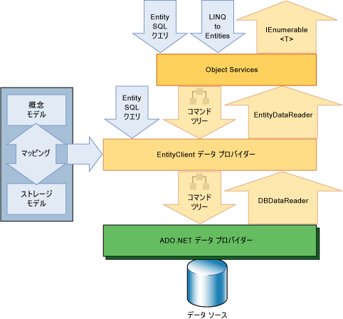

# エンティティ フレームワークの概要
[!INCLUDE[adonet_ef](../../../../../includes/adonet-ef-md.md)] は、データ指向のソフトウェア アプリケーション開発をサポートする ADO.NET のテクノロジ セットです。  データ指向のアプリケーションの設計者と開発者はこれまで、2 つの大きく異なる目的を達成するために苦労してきました。  解決すべきビジネス上の問題のエンティティ、リレーションシップ、およびロジックをモデル化する一方で、データの格納と取得に使用するデータ エンジンに取り組む必要もあるからです。  データは複数のストレージ システムにまたがる場合があり、それぞれに独自のプロトコルが存在します。単一のストレージ システムを使用するアプリケーションであっても、ストレージ システムの要件と効率的で保守しやすいアプリケーション コードの記述要件のバランスを取る必要があります。  
  
 [!INCLUDE[adonet_ef](../../../../../includes/adonet-ef-md.md)] を使用することで、開発者は、顧客や顧客の住所など、ドメイン固有のオブジェクトおよびプロパティの形式でデータを扱うことができます。そのデータが格納されている、基になるデータベース テーブルや列を意識する必要はありません。[!INCLUDE[adonet_ef](../../../../../includes/adonet-ef-md.md)] を使用すると、開発者はデータを操作するときに高い抽象化レベルで作業ができ、従来のアプリケーションよりコードの少ないデータ指向アプリケーションの作成と保守が可能になります。  [!INCLUDE[adonet_ef](../../../../../includes/adonet-ef-md.md)] は [!INCLUDE[dnprdnshort](../../../../../includes/dnprdnshort-md.md)] のコンポーネントであるため、[!INCLUDE[dnprdnshort](../../../../../includes/dnprdnshort-md.md)] バージョン 3.5 SP1 以降がインストールされていれば、どのコンピューターでも [!INCLUDE[adonet_ef](../../../../../includes/adonet-ef-md.md)] アプリケーションを実行できます。  
  
 このトピックの以降のセクションでは、[!INCLUDE[adonet_ef](../../../../../includes/adonet-ef-md.md)] の詳細について説明します。  
  
-   [モデルの活用](#LifeToModels)  
  
-   [データへのオブジェクトのマッピング](#MappingObjectsToData)  
  
-   [エンティティ データに対するアクセスと変更](#AccessingData)  
  
-   [データ プロバイダー](#DataProviders)  
  
-   [Entity Data Model ツール](#Tools)  
  
-   [詳細情報](#LearnMore)  
  
   
## モデルの活用  
 アプリケーションやサービスを構築するとき、従来からの一般的な設計アプローチは、アプリケーションまたはサービスをドメイン モデル、論理モデル、および物理モデルの 3 つの部分に分割する方法です。  ドメイン モデルでは、モデル化の対象となるシステムに存在するエンティティとリレーションシップを定義します。  リレーショナル データベースの論理モデルでは、外部キー制約を用いながらエンティティおよびリレーションシップをテーブルとして正規化します。  物理モデルでは、パーティション分割やインデックス化などのストレージ情報を指定することで、特定のデータ エンジンの機能に対応します。  
  
 物理モデルは、パフォーマンスを向上させるためにデータベース管理者が調整しますが、アプリケーション コードを記述するプログラマは、主に SQL クエリを記述したりストアド プロシージャを呼び出したりすることによって論理モデルを扱うことに専念します。  ドメイン モデルは通常、アプリケーションの要件を収集して伝達するためのツールとして使用されます。プロジェクトの初期段階でのみ表示および検討され、その後ほとんど使用されないのが一般的です。  概念モデルの作成を省略し、実際にリレーショナル データベースのテーブル、列、およびキーを指定することから開始する開発チームも多く存在します。  
  
 [!INCLUDE[adonet_ef](../../../../../includes/adonet-ef-md.md)] では、開発者がドメイン モデル \([!INCLUDE[adonet_ef](../../../../../includes/adonet-ef-md.md)] では*概念*モデルとも呼ばれる\) 内のエンティティとリレーションシップにクエリを実行し、[!INCLUDE[adonet_ef](../../../../../includes/adonet-ef-md.md)] がそれらの操作をデータ ソース固有のコマンドに変換するという形で、モデルが活用されます。  これにより、特定のデータ ソースへの依存関係をアプリケーションにハードコーディングしなくても済みます。  
  
 Code First を使用すると、概念モデルはコードのストレージ モデルにマッピングされます。  [!INCLUDE[adonet_ef](../../../../../includes/adonet-ef-md.md)] では、オブジェクトの種類と定義する追加の構成に基づいて概念モデルを推論できます。  マッピング メタデータは、ドメインの種類を定義した方法とコードで指定する追加の構成情報の組み合わせに基づいて実行時に生成されます。  [!INCLUDE[adonet_ef](../../../../../includes/adonet-ef-md.md)] は、メタデータに基づいて必要に応じてデータベースを生成します。  詳細については、「[概念モデルの作成とマッピング](http://go.microsoft.com/fwlink/?LinkID=235382)」を参照してください。  
  
 Entity Data Model ツールでの作業時には、概念モデル、ストレージ モデル、およびこの 2 者間のマッピングは、XML ベースのスキーマで表され、名前の拡張子が同じファイルで定義されます。  
  
-   概念モデルは概念スキーマ定義言語 \(CSDL\) で定義されます。  CSDL は、[Entity Data Model](../../../../../docs/framework/data/adonet/entity-data-model.md) の [!INCLUDE[adonet_ef](../../../../../includes/adonet-ef-md.md)] の実装です。  ファイル拡張子は .csdl です。  
  
-   ストア スキーマ定義言語ファイル \(SSDL\) はストレージ モデル \(論理モデルとも呼ばれる\) を定義します。  ファイル拡張子は .ssdl です。  
  
-   マッピング仕様言語ファイル \(MSL\) はストレージ モデルと概念モデルの間のマッピングを定義します。  ファイル拡張子は .msl です。  
  
 ストレージ モデルとマッピングは、概念モデル、データ クラス、またはアプリケーション コードを変更することなく、必要に応じて変更できます。  ストレージ モデルはプロバイダー固有なので、データ ソースの違いを意識することなく一貫した概念モデルを扱うことができます。  
  
 [!INCLUDE[adonet_ef](../../../../../includes/adonet-ef-md.md)] は、これらのモデル ファイルとマッピング ファイルを使用して、概念モデルのエンティティとリレーションシップに対する作成、読み取り、更新、削除などの操作を、データ ソースの同等の操作に変換します。  [!INCLUDE[adonet_ef](../../../../../includes/adonet-ef-md.md)] は、概念モデルのエンティティをデータ ソースのストアド プロシージャにマップする操作もサポートしています。  詳細については、「[CSDL、SSDL、および MSL 仕様](../../../../../docs/framework/data/adonet/ef/language-reference/csdl-ssdl-and-msl-specifications.md)」を参照してください。  
  
   
## データへのオブジェクトのマッピング  
 オブジェクト指向プログラミングには、データ ストレージ システムと対話するという難題があります。  クラスの編成はリレーショナル データベース テーブルの編成に似ている場合がありますが、完全に一致するわけではありません。  正規化された複数のテーブルと単一のクラスが対応する場合も多く、クラス間のリレーションシップとテーブル間のリレーションシップとで表現方法が異なる場合もあります。  たとえば、販売注文の顧客を表すために、`Order` クラスは `Customer` クラスのインスタンスへの参照が含まれているプロパティを使用する一方で、データベースの `Order` テーブル行には `Customer` テーブルの主キー値に対応する値がある外部キー列 \(または列セット\) が含まれている場合があります。  `Customer` クラスには `Order` クラスのインスタンスのコレクションが含まれている `Orders` という名前のプロパティがありますが、データベースの `Customer` テーブルに同等の列がない場合などです。  [!INCLUDE[adonet_ef](../../../../../includes/adonet-ef-md.md)] は、この方法でリレーションシップを表すか、データベースで表されるリレーションシップに似せるかの柔軟性を開発者に与えます。  
  
 既存のソリューションでは、"インピーダンスのミスマッチ" とよく呼ばれるこの差異を、オブジェクト指向のクラスやプロパティをリレーショナル テーブルやリレーショナル列にマップするだけで埋めようとしてきました。  [!INCLUDE[adonet_ef](../../../../../includes/adonet-ef-md.md)] では、この従来の方法を使用せずに、論理モデルのリレーショナル テーブル、列、および外部キー制約を概念モデルのエンティティとリレーションシップにマップします。  これにより、さらに柔軟にオブジェクトを定義して論理モデルを最適化することが可能になります。  [!INCLUDE[adonet_edm](../../../../../includes/adonet-edm-md.md)] ツールでは、概念モデルに基づく拡張可能なデータ クラスが生成されます。  このクラスは、開発者が追加するメンバーで拡張できる部分クラスです。  既定では、特定の概念モデルに対して生成されるクラスは、エンティティをオブジェクトとして具体化したり変更を追跡したり保存したりするサービスを提供する基本クラスから派生します。  開発者はこのようなクラスを使用して、エンティティとリレーションシップを、アソシエーションによって関連付けられたオブジェクトとして操作できます。  また、開発者は、概念モデルに生成されるクラスをカスタマイズすることもできます。詳細については、「[オブジェクトの使用](../../../../../docs/framework/data/adonet/ef/working-with-objects.md)」を参照してください。  
  
   
## エンティティ データに対するアクセスと変更  
 [!INCLUDE[adonet_ef](../../../../../includes/adonet-ef-md.md)] は単なるオブジェクト リレーショナル マッピング ソリューションではなく、基本的には、概念モデルのエンティティとリレーションシップとして表されるデータにアプリケーションからアクセスして変更できるようにするためのものです。[!INCLUDE[adonet_ef](../../../../../includes/adonet-ef-md.md)] はモデル ファイルとマッピング ファイルの情報を使用して、概念モデルで表されるエンティティ型に対するオブジェクト クエリをデータ ソース固有のクエリに変換します。  クエリ結果は、[!INCLUDE[adonet_ef](../../../../../includes/adonet-ef-md.md)] が管理するオブジェクトに具体化されます。  [!INCLUDE[adonet_ef](../../../../../includes/adonet-ef-md.md)] は、概念モデルにクエリを実行してオブジェクトを返す方法として以下の機能を提供しています。  
  
-   [!INCLUDE[linq_entities](../../../../../includes/linq-entities-md.md)]。概念モデルで定義されているエンティティ型に対してクエリを実行するための統合言語クエリ \(LINQ\) をサポートしています。  詳細については、「[LINQ to Entities](../../../../../docs/framework/data/adonet/ef/language-reference/linq-to-entities.md)」を参照してください。  
  
-   [!INCLUDE[esql](../../../../../includes/esql-md.md)]。ストレージに依存しない SQL 言語。概念モデルのエンティティを直接操作し、[!INCLUDE[adonet_edm](../../../../../includes/adonet-edm-md.md)] の概念をサポートしています。  [!INCLUDE[esql](../../../../../includes/esql-md.md)] はオブジェクト クエリと、EntityClient プロバイダーを使用して実行されるクエリの両方で使用されます。  詳細については、「[Entity SQL の概要](../../../../../docs/framework/data/adonet/ef/language-reference/entity-sql-overview.md)」を参照してください。  
  
 [!INCLUDE[adonet_ef](../../../../../includes/adonet-ef-md.md)] には、EntityClient データ プロバイダーが含まれています。  このプロバイダーは接続を管理し、エンティティ クエリをデータ ソース固有のクエリに変換し、[!INCLUDE[adonet_ef](../../../../../includes/adonet-ef-md.md)] がエンティティ データをオブジェクトに具体化するために使用するデータ リーダーを返します。  オブジェクトの具体化が不要であれば、アプリケーションで [!INCLUDE[esql](../../../../../includes/esql-md.md)] クエリを実行して返された読み取り専用のデータ リーダーを使用できるようにすると、EntityClient プロバイダーを標準の [!INCLUDE[vstecado](../../../../../includes/vstecado-md.md)] データ プロバイダーと同様に使用することもできます。  詳細については、「[Entity Framework 用の EntityClient プロバイダー](../../../../../docs/framework/data/adonet/ef/entityclient-provider-for-the-entity-framework.md)」を参照してください。  
  
 次の図は、データにアクセスするための [!INCLUDE[adonet_ef](../../../../../includes/adonet-ef-md.md)] アーキテクチャを示しています。  
  
   
  
 [!INCLUDE[adonet_edm](../../../../../includes/adonet-edm-md.md)] ツールは、概念モデルのエンティティ コンテナーを表す `System.Data.Objects.ObjectContext` または `System.Data.Entity.DbContext` から派生したクラスを生成できます。  このオブジェクト コンテキストは、変更の追跡や ID、同時実行、およびリレーションシップの管理などの機能を提供します。  また、このクラスは、データ ソースに挿入、更新、および削除を書き込む `SaveChanges` メソッドも公開します。  このような変更は、クエリと同様に、システムによって自動的に生成されるコマンドで行うことも、特定のストアド プロシージャを使用するように指定することもできます。  
  
   
## データ プロバイダー  
 `EntityClient` プロバイダーは、概念エンティティおよびリレーションシップに従ってデータにアクセスし、[!INCLUDE[vstecado](../../../../../includes/vstecado-md.md)] プロバイダー モデルを拡張します。  [!INCLUDE[esql](../../../../../includes/esql-md.md)] を使用するクエリを実行します。  [!INCLUDE[esql](../../../../../includes/esql-md.md)] は、`EntityClient` がデータベースと通信する基盤となるクエリ言語を提供します。  詳細については、「[Entity Framework 用の EntityClient プロバイダー](../../../../../docs/framework/data/adonet/ef/entityclient-provider-for-the-entity-framework.md)」を参照してください。  
  
 更新された [!INCLUDE[adonet_ef](../../../../../includes/adonet-ef-md.md)] の SqlClient Data Provider は、正規コマンド ツリーをサポートしています。  詳細については、「[Entity Framework 用 SqlClient](../../../../../docs/framework/data/adonet/ef/sqlclient-for-the-entity-framework.md)」を参照してください。  
  
   
## Entity Data Model ツール  
 [!INCLUDE[adonet_ef](../../../../../includes/adonet-ef-md.md)] ランタイムに加えて、[!INCLUDE[vs_current_long](../../../../../includes/vs-current-long-md.md)] にはマッピング ツールとモデリング ツールが含まれています。  詳細については、「[モデリングとマッピング](../../../../../docs/framework/data/adonet/ef/modeling-and-mapping.md)」を参照してください。  
  
   
## 詳細情報  
 [!INCLUDE[adonet_ef](../../../../../includes/adonet-ef-md.md)] の詳細については、次のトピックを参照してください。  
  
 [はじめに](../../../../../docs/framework/data/adonet/ef/getting-started.md)  
 簡単な [!INCLUDE[adonet_ef](../../../../../includes/adonet-ef-md.md)] アプリケーションの作成方法を示す[Quickstart](http://msdn.microsoft.com/ja-jp/0bc534be-789f-4819-b9f6-76e51d961675) を使用して簡単に実行する方法について説明します。  
  
 [Entity Framework の用語](../../../../../docs/framework/data/adonet/ef/terminology.md)  
 Entity Data Model と [!INCLUDE[adonet_ef](../../../../../includes/adonet-ef-md.md)] で使用されている用語や [!INCLUDE[adonet_ef](../../../../../includes/adonet-ef-md.md)] のドキュメントで使用されている用語を多数定義しています。  
  
 [Entity Framework のリソース](../../../../../docs/framework/data/adonet/ef/resources.md)  
 概念に関するトピックへのリンクや [!INCLUDE[adonet_ef](../../../../../includes/adonet-ef-md.md)] アプリケーションの構築に関する外部トピックおよびリソースへのリンクを示します。  
  
## 参照  
 [ADO.NET Entity Framework](../../../../../docs/framework/data/adonet/ef/index.md)