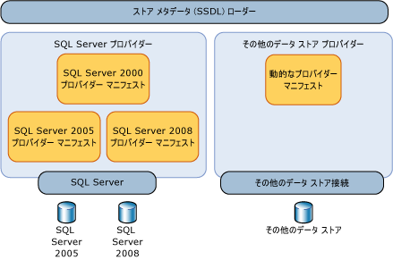
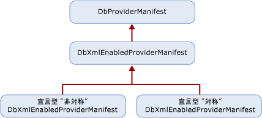

# <a name="provider-manifest-specification"></a><span data-ttu-id="0a50f-102">プロバイダー マニフェストの仕様</span><span class="sxs-lookup"><span data-stu-id="0a50f-102">Provider Manifest Specification</span></span>
<span data-ttu-id="0a50f-103">ここでは、データ ストア プロバイダーでデータ ストアの型および関数がどのようにサポートされているかについて説明します。</span><span class="sxs-lookup"><span data-stu-id="0a50f-103">This section discusses how a data store provider can support the types and functions in the data store.</span></span>  
  
 <span data-ttu-id="0a50f-104">Entity Services は、特定のデータ ストア プロバイダーとは別に動作しますが、データ プロバイダーでモデル、マッピング、およびクエリと基になるデータ ストアの対話方法を明示的に定義できるようにします。</span><span class="sxs-lookup"><span data-stu-id="0a50f-104">Entity Services operates independently of a specific data store provider yet still allows a data provider to explicitly define how models, mappings, and queries interact with an underlying data store.</span></span> <span data-ttu-id="0a50f-105">抽象化レイヤーがない場合、Entity Services が対象とするのは、特定のデータ ストアまたはデータ プロバイダーのみです。</span><span class="sxs-lookup"><span data-stu-id="0a50f-105">Without a layer of abstraction, Entity Services could only be targeted at a specific data store or data provider.</span></span>  
  
 <span data-ttu-id="0a50f-106">プロバイダーでサポートされる型は、基になるデータベースによって直接的または間接的にサポートされています。</span><span class="sxs-lookup"><span data-stu-id="0a50f-106">Types that the provider supports are directly or indirectly supported by the underlying database.</span></span> <span data-ttu-id="0a50f-107">これらの型は、必ずしも正確なストア型であるとは限りませんが、プロバイダーで [!INCLUDE[adonet_ef](../../../../../includes/adonet-ef-md.md)] のサポートに使用される型です。</span><span class="sxs-lookup"><span data-stu-id="0a50f-107">These types are not necessarily the exact store types, but the types the provider uses to support the [!INCLUDE[adonet_ef](../../../../../includes/adonet-ef-md.md)].</span></span> <span data-ttu-id="0a50f-108">プロバイダー/ストア型は、Entity Data Model (EDM) 用語で記述されます。</span><span class="sxs-lookup"><span data-stu-id="0a50f-108">Provider/store types are described in the Entity Data Model (EDM) terms.</span></span>  
  
 <span data-ttu-id="0a50f-109">データ ストアによってサポートされる関数のパラメーターと戻り値の型は、EDM 用語で指定されます。</span><span class="sxs-lookup"><span data-stu-id="0a50f-109">Parameter and return types for the functions supported by the data store are specified in EDM terms.</span></span>  
  
## <a name="requirements"></a><span data-ttu-id="0a50f-110">要件</span><span class="sxs-lookup"><span data-stu-id="0a50f-110">Requirements</span></span>  
 <span data-ttu-id="0a50f-111">[!INCLUDE[adonet_ef](../../../../../includes/adonet-ef-md.md)] およびデータ ストアでは、データが失われたり切り捨てられたりすることなく、既知の型でデータを受け渡しできることが必要です。</span><span class="sxs-lookup"><span data-stu-id="0a50f-111">The [!INCLUDE[adonet_ef](../../../../../includes/adonet-ef-md.md)] and the data store need to be able to pass data back and forth in known types without any data loss or truncation.</span></span>  
  
 <span data-ttu-id="0a50f-112">プロバイダー マニフェストは、データ ストアへの接続を開くことなく、デザイン時にツールで読み込むことができる必要があります。</span><span class="sxs-lookup"><span data-stu-id="0a50f-112">The provider manifest must be loadable by tools at design time without having to open a connection to the data store.</span></span>  
  
 <span data-ttu-id="0a50f-113">[!INCLUDE[adonet_ef](../../../../../includes/adonet-ef-md.md)]大文字と小文字が区別が、基になるデータ ストアができない可能性があります。</span><span class="sxs-lookup"><span data-stu-id="0a50f-113">The [!INCLUDE[adonet_ef](../../../../../includes/adonet-ef-md.md)] is case sensitive, but the underlying data store may not be.</span></span> <span data-ttu-id="0a50f-114">マニフェストで定義および使用されている EDM 成果物 (識別子や型名など) では、[!INCLUDE[adonet_ef](../../../../../includes/adonet-ef-md.md)] の大文字と小文字の区別を使用する必要があります。</span><span class="sxs-lookup"><span data-stu-id="0a50f-114">When EDM artifacts (identifiers and type names, for example) are defined and used in the manifest, they must use the [!INCLUDE[adonet_ef](../../../../../includes/adonet-ef-md.md)] case sensitivity.</span></span> <span data-ttu-id="0a50f-115">大文字と小文字が区別されるデータ ストア要素がプロバイダー マニフェストに含まれる場合、その大文字と小文字の区別はプロバイダー マニフェストで保持する必要があります。</span><span class="sxs-lookup"><span data-stu-id="0a50f-115">If data store elements that may be case sensitive appear in the provider manifest, that casing needs to be maintained in the provider manifest.</span></span>  
  
 <span data-ttu-id="0a50f-116">[!INCLUDE[adonet_ef](../../../../../includes/adonet-ef-md.md)] では、すべてのデータ プロバイダーに対応するプロバイダー マニフェストが必要です。</span><span class="sxs-lookup"><span data-stu-id="0a50f-116">The [!INCLUDE[adonet_ef](../../../../../includes/adonet-ef-md.md)] requires a provider manifest for all data providers.</span></span> <span data-ttu-id="0a50f-117">プロバイダーがないプロバイダーを使用しようとする場合のマニフェスト、[!INCLUDE[adonet_ef](../../../../../includes/adonet-ef-md.md)]エラーが表示されます。</span><span class="sxs-lookup"><span data-stu-id="0a50f-117">If you try to use a provider that does not have a provider manifest with the [!INCLUDE[adonet_ef](../../../../../includes/adonet-ef-md.md)], you will get an error.</span></span>  
  
 <span data-ttu-id="0a50f-118">プロバイダーとの対話で例外が発生したときに [!INCLUDE[adonet_ef](../../../../../includes/adonet-ef-md.md)] によってスローされる例外の種類を次の表に示します。</span><span class="sxs-lookup"><span data-stu-id="0a50f-118">The following table describes the kinds of exceptions the [!INCLUDE[adonet_ef](../../../../../includes/adonet-ef-md.md)] would throw when exceptions arise through provider interaction:</span></span>  
  
|<span data-ttu-id="0a50f-119">懸案事項</span><span class="sxs-lookup"><span data-stu-id="0a50f-119">Issue</span></span>|<span data-ttu-id="0a50f-120">例外</span><span class="sxs-lookup"><span data-stu-id="0a50f-120">Exception</span></span>|  
|-----------|---------------|  
|<span data-ttu-id="0a50f-121">プロバイダーで DbProviderServices の GetProviderManifest がサポートされていない。</span><span class="sxs-lookup"><span data-stu-id="0a50f-121">The Provider does not support GetProviderManifest in DbProviderServices.</span></span>|<span data-ttu-id="0a50f-122">ProviderIncompatibleException</span><span class="sxs-lookup"><span data-stu-id="0a50f-122">ProviderIncompatibleException</span></span>|  
|<span data-ttu-id="0a50f-123">プロバイダー マニフェストが見つからないため、プロバイダー マニフェストを取得しようとすると、プロバイダーから `null` が返される。</span><span class="sxs-lookup"><span data-stu-id="0a50f-123">Missing provider manifest: the provider returns `null` when attempting to retrieve the provider manifest.</span></span>|<span data-ttu-id="0a50f-124">ProviderIncompatibleException</span><span class="sxs-lookup"><span data-stu-id="0a50f-124">ProviderIncompatibleException</span></span>|  
|<span data-ttu-id="0a50f-125">無効なプロバイダー マニフェストにより、プロバイダー マニフェストを取得しようとすると、プロバイダーから無効な XML が返される。</span><span class="sxs-lookup"><span data-stu-id="0a50f-125">Invalid provider manifest: the provider returns invalid XML when attempting to retrieve the provider manifest.</span></span>|<span data-ttu-id="0a50f-126">ProviderIncompatibleException</span><span class="sxs-lookup"><span data-stu-id="0a50f-126">ProviderIncompatibleException</span></span>|  
  
## <a name="scenarios"></a><span data-ttu-id="0a50f-127">シナリオ</span><span class="sxs-lookup"><span data-stu-id="0a50f-127">Scenarios</span></span>  
 <span data-ttu-id="0a50f-128">プロバイダーでは、次のシナリオをサポートしています。</span><span class="sxs-lookup"><span data-stu-id="0a50f-128">A provider should support the following scenarios:</span></span>  
  
### <a name="writing-a-provider-with-symmetric-type-mapping"></a><span data-ttu-id="0a50f-129">対称型マッピングによるプロバイダーの記述</span><span class="sxs-lookup"><span data-stu-id="0a50f-129">Writing a Provider with Symmetric Type Mapping</span></span>  
 <span data-ttu-id="0a50f-130">プロバイダーを作成することができます、[!INCLUDE[adonet_ef](../../../../../includes/adonet-ef-md.md)]各ストアの種類がマッピングの方向に関係なく、単一の EDM 型にマップする場所です。</span><span class="sxs-lookup"><span data-stu-id="0a50f-130">You can write a provider for the [!INCLUDE[adonet_ef](../../../../../includes/adonet-ef-md.md)] where each store type maps to a single EDM type, regardless of the mapping direction.</span></span> <span data-ttu-id="0a50f-131">EDM 型に対応する非常に単純なマッピングを持つプロバイダー型では、型システムが単純であるか EDM 型と一致するため、対称ソリューションを使用できます。</span><span class="sxs-lookup"><span data-stu-id="0a50f-131">For a provider type that has very simple mapping that corresponds with an EDM type, you can use a symmetric solution because the type system is simple or matches EDM types.</span></span>  
  
 <span data-ttu-id="0a50f-132">ドメインの単純さを利用して、静的な宣言型プロバイダー マニフェストを作成することができます。</span><span class="sxs-lookup"><span data-stu-id="0a50f-132">You can use the simplicity of their domain and produce a static declarative provider manifest.</span></span>  
  
 <span data-ttu-id="0a50f-133">次の 2 つのセクションで構成される XML ファイルを記述します。</span><span class="sxs-lookup"><span data-stu-id="0a50f-133">You write an XML file that has two sections:</span></span>  
  
-   <span data-ttu-id="0a50f-134">ストア型またはストア関数の "対応する EDM 要素" で表現されるプロバイダー型の一覧。</span><span class="sxs-lookup"><span data-stu-id="0a50f-134">A list of provider types expressed in terms of the "EDM counterpart" of a store type or function.</span></span> <span data-ttu-id="0a50f-135">ストア型には、対応する EDM 型があります。</span><span class="sxs-lookup"><span data-stu-id="0a50f-135">Store types have counterpart EDM types.</span></span> <span data-ttu-id="0a50f-136">ストア関数には、対応する EDM 関数があります。</span><span class="sxs-lookup"><span data-stu-id="0a50f-136">Store functions have corresponding EDM functions.</span></span> <span data-ttu-id="0a50f-137">たとえば、varchar は SQL Server の型ですが、対応する EDM 型は文字列になります。</span><span class="sxs-lookup"><span data-stu-id="0a50f-137">For example, varchar is a SQL Server type but the corresponding EDM type is string.</span></span>  
  
-   <span data-ttu-id="0a50f-138">パラメーターと戻り値の型が EDM 用語で表現される、プロバイダーがサポートする関数の一覧。</span><span class="sxs-lookup"><span data-stu-id="0a50f-138">A list of functions supported by the provider where parameter and return types are expressed in EDM terms.</span></span>  
  
### <a name="writing-a-provider-with-asymmetric-type-mapping"></a><span data-ttu-id="0a50f-139">非対照型マッピングによるプロバイダーの記述</span><span class="sxs-lookup"><span data-stu-id="0a50f-139">Writing a Provider with Asymmetric Type Mapping</span></span>  
 <span data-ttu-id="0a50f-140">[!INCLUDE[adonet_ef](../../../../../includes/adonet-ef-md.md)] のデータ ストア プロバイダーを記述する場合、一部の型の EDM からプロバイダーへの型マッピングが、プロバイダーから EDM への型マッピングとは異なることがあります。</span><span class="sxs-lookup"><span data-stu-id="0a50f-140">When writing a data store provider for the [!INCLUDE[adonet_ef](../../../../../includes/adonet-ef-md.md)], the EDM-to-provider type mapping for some types may be different from provider-to-EDM type mapping.</span></span> <span data-ttu-id="0a50f-141">たとえば、プロバイダー側で unbounded の EDM PrimitiveTypeKind.String が nvarchar(4000) にマップされるのに対して、nvarchar(4000) は EDM PrimitiveTypeKind.String(MaxLength=4000) にマップされる場合があります。</span><span class="sxs-lookup"><span data-stu-id="0a50f-141">For instance, unbounded EDM PrimitiveTypeKind.String may map to nvarchar(4000) on the provider, while nvarchar(4000) maps to the EDM PrimitiveTypeKind.String(MaxLength=4000).</span></span>  
  
 <span data-ttu-id="0a50f-142">次の 2 つのセクションで構成される XML ファイルを記述します。</span><span class="sxs-lookup"><span data-stu-id="0a50f-142">You write an XML file that has two sections:</span></span>  
  
-   <span data-ttu-id="0a50f-143">両方向 (EDM からプロバイダーおよびプロバイダーから EDM) のマッピングを定義する、EDM 用語で表現されたプロバイダー型の一覧。</span><span class="sxs-lookup"><span data-stu-id="0a50f-143">A list of provider types expressed in EDM terms and define mapping for both direction: EDM-to-provider and provider-to-EDM.</span></span>  
  
-   <span data-ttu-id="0a50f-144">パラメーターと戻り値の型が EDM 用語で表現される、プロバイダーがサポートする関数の一覧。</span><span class="sxs-lookup"><span data-stu-id="0a50f-144">A list of functions supported by the provider where parameter and return types are expressed in EDM terms.</span></span>  
  
## <a name="provider-manifest-discoverability"></a><span data-ttu-id="0a50f-145">プロバイダー マニフェストの探索可能性</span><span class="sxs-lookup"><span data-stu-id="0a50f-145">Provider Manifest Discoverability</span></span>  
 <span data-ttu-id="0a50f-146">マニフェストは、Entity Services の複数のコンポーネントの種類 (Tools や Query など) では間接的に使用されますが、データ ストア メタデータ ローダーを使用してメタデータからより直接的に使用することができます。</span><span class="sxs-lookup"><span data-stu-id="0a50f-146">The manifest is used indirectly by several component types in Entity Services (for example Tools or Query) but more directly leveraged by metadata through the use of the data store metadata loader.</span></span>  
  
 <span data-ttu-id="0a50f-147"></span><span class="sxs-lookup"><span data-stu-id="0a50f-147"></span></span>  
  
 <span data-ttu-id="0a50f-148">ただし、指定されたプロバイダーでは、異なるストアや、同じストアの異なるバージョンがサポートされている場合があります。</span><span class="sxs-lookup"><span data-stu-id="0a50f-148">However, a given provider may support different stores or different versions of the same store.</span></span> <span data-ttu-id="0a50f-149">そのため、プロバイダーは、サポートされるデータ ストアごとに、異なるマニフェストを報告する必要があります。</span><span class="sxs-lookup"><span data-stu-id="0a50f-149">Therefore, a provider must report a different manifest for each supported data store.</span></span>  
  
### <a name="provider-manifest-token"></a><span data-ttu-id="0a50f-150">プロバイダー マニフェスト トークン</span><span class="sxs-lookup"><span data-stu-id="0a50f-150">Provider Manifest Token</span></span>  
 <span data-ttu-id="0a50f-151">データ ストア接続が開いている場合、プロバイダーは、クエリで情報を取得して、適切なマニフェストを返すことができます。</span><span class="sxs-lookup"><span data-stu-id="0a50f-151">When a data store connection is opened, the provider can query for information to return the right manifest.</span></span> <span data-ttu-id="0a50f-152">この動作は、接続情報が利用できない場合やストアに接続できない場合があるオフライン シナリオでは不可能になることもあります。</span><span class="sxs-lookup"><span data-stu-id="0a50f-152">This may not be possible in offline scenarios where connection information is not available or when it is not possible to connect to the store.</span></span> <span data-ttu-id="0a50f-153">マニフェストを識別するには、.ssdl ファイルの `ProviderManifestToken` の `Schema` 属性を使用します。</span><span class="sxs-lookup"><span data-stu-id="0a50f-153">Identify the manifest by using the `ProviderManifestToken` attribute of the `Schema` element in the .ssdl file.</span></span> <span data-ttu-id="0a50f-154">この属性には必須の形式はありません。プロバイダーは、ストアへの接続を開くことなく、マニフェストを特定するために必要最小限の情報を選択します。</span><span class="sxs-lookup"><span data-stu-id="0a50f-154">There is no required format for this attribute; the provider chooses the minimum information needed to identify a manifest without opening a connection to the store.</span></span>  
  
 <span data-ttu-id="0a50f-155">次に例を示します。</span><span class="sxs-lookup"><span data-stu-id="0a50f-155">For example:</span></span>  
  
```xml  
<Schema Namespace="Northwind" Provider="System.Data.SqlClient" ProviderManifestToken="2005" xmlns:edm="http://schemas.microsoft.com/ado/2006/04/edm/ssdl" xmlns="http://schemas.microsoft.com/ado/2006/04/edm/ssdl">  
```  
  
## <a name="provider-manifest-programming-model"></a><span data-ttu-id="0a50f-156">プロバイダー マニフェストのプログラミング モデル</span><span class="sxs-lookup"><span data-stu-id="0a50f-156">Provider Manifest Programming Model</span></span>  
 <span data-ttu-id="0a50f-157">プロバイダーは <xref:System.Data.Common.DbXmlEnabledProviderManifest> から派生します。これにより、プロバイダーは、そのマニフェストを宣言によって指定できます。</span><span class="sxs-lookup"><span data-stu-id="0a50f-157">Providers derive from <xref:System.Data.Common.DbXmlEnabledProviderManifest>, which allows them to specify their manifests declaratively.</span></span> <span data-ttu-id="0a50f-158">プロバイダーのクラス階層を次の図に示します。</span><span class="sxs-lookup"><span data-stu-id="0a50f-158">The following illustration shows the class hierarchy of a provider:</span></span>  
  
 <span data-ttu-id="0a50f-159"></span><span class="sxs-lookup"><span data-stu-id="0a50f-159"></span></span>  
  
### <a name="discoverability-api"></a><span data-ttu-id="0a50f-160">探索可能性の API</span><span class="sxs-lookup"><span data-stu-id="0a50f-160">Discoverability API</span></span>  
 <span data-ttu-id="0a50f-161">プロバイダー マニフェストは、データ ストア接続またはプロバイダー マニフェスト トークンのいずれかを使用して、ストア メタデータ ローダー (StoreItemCollection) によって読み込まれます。</span><span class="sxs-lookup"><span data-stu-id="0a50f-161">The provider manifest is loaded by the Store Metadata loader (StoreItemCollection), either by using a data store connection or a provider manifest token.</span></span>  
  
#### <a name="using-a-data-store-connection"></a><span data-ttu-id="0a50f-162">データ ストア接続を使用する</span><span class="sxs-lookup"><span data-stu-id="0a50f-162">Using a Data Store Connection</span></span>  
 <span data-ttu-id="0a50f-163">データ ストア接続が使用可能な場合は、DbProvderServices.GetProviderManifestToken を呼び出して GetProviderManifest メソッドに渡されるトークンを返すことで、DbProviderManifest を返します。</span><span class="sxs-lookup"><span data-stu-id="0a50f-163">When the data store connection is available, call DbProvderServices.GetProviderManifestToken to return the token that is passed to the GetProviderManifest method, which returns DbProviderManifest.</span></span> <span data-ttu-id="0a50f-164">このメソッドは、プロバイダーによる GetDbProviderManifestToken の実装に委任されます。</span><span class="sxs-lookup"><span data-stu-id="0a50f-164">This method delegates to the provider's implementation of GetDbProviderManifestToken.</span></span>  
  
```  
public string GetProviderManifestToken(DbConnection connection);  
public DbProviderManifest GetProviderManifest(string manifestToken);  
```  
  
#### <a name="using-a-provider-manifest-token"></a><span data-ttu-id="0a50f-165">プロバイダー マニフェスト トークンを使用する</span><span class="sxs-lookup"><span data-stu-id="0a50f-165">Using a Provider Manifest Token</span></span>  
 <span data-ttu-id="0a50f-166">オフライン シナリオの場合、SSDL の表現からトークンが選択されます。</span><span class="sxs-lookup"><span data-stu-id="0a50f-166">For the offline scenario, the token is picked from SSDL representation.</span></span> <span data-ttu-id="0a50f-167">SSDL では、ProviderManifestToken を指定することができます (を参照してください[スキーマ要素 (SSDL)](http://msdn.microsoft.com/library/fec75ae4-7f16-4421-9265-9dac61509222)詳細については)。</span><span class="sxs-lookup"><span data-stu-id="0a50f-167">The SSDL allows you to specify a ProviderManifestToken (see [Schema Element (SSDL)](http://msdn.microsoft.com/library/fec75ae4-7f16-4421-9265-9dac61509222) for more information).</span></span> <span data-ttu-id="0a50f-168">たとえば、接続を開くことができない場合、SSDL には、マニフェストに関する情報を指定するプロバイダー マニフェスト トークンがあります。</span><span class="sxs-lookup"><span data-stu-id="0a50f-168">For example, if a connection cannot be opened, the SSDL has a provider manifest token that specifies information about the manifest.</span></span>  
  
```  
public DbProviderManifest GetProviderManifest(string manifestToken);  
```  
  
### <a name="provider-manifest-schema"></a><span data-ttu-id="0a50f-169">プロバイダー マニフェスト スキーマ</span><span class="sxs-lookup"><span data-stu-id="0a50f-169">Provider Manifest Schema</span></span>  
 <span data-ttu-id="0a50f-170">プロバイダーごとに定義された情報のスキーマには、メタデータによって使用される静的な情報が含まれています。</span><span class="sxs-lookup"><span data-stu-id="0a50f-170">The schema of information defined for each provider contains the static information to be consumed by metadata:</span></span>  
  
```xml  
<?xml version="1.0" encoding="utf-8"?>  
<xs:schema elementFormDefault="qualified"  
   xmlns:xs="http://www.w3.org/2001/XMLSchema"  
   targetNamespace="http://schemas.microsoft.com/ado/2006/04/edm/providermanifest"  
   xmlns:pm="http://schemas.microsoft.com/ado/2006/04/edm/providermanifest">  
  
  <xs:element name="ProviderManifest">  
    <xs:complexType>  
      <xs:sequence>  
        <xs:element name="Types" type="pm:TTypes" minOccurs="1" maxOccurs="1" />  
        <xs:element name="Functions" type="pm:TFunctions" minOccurs="0" maxOccurs="1"/>  
      </xs:sequence>  
      <xs:attribute name="Namespace" type="xs:string" use="required"/>  
    </xs:complexType>  
  </xs:element>  
  <xs:complexType name="TVersion">  
    <xs:attribute name="Major" type="xs:int" use="required" />  
    <xs:attribute name="Minor" type="xs:int" use="required" />  
    <xs:attribute name="Build" type="xs:int" use="required" />  
    <xs:attribute name="Revision" type="xs:int" use="required" />  
  </xs:complexType>  
  
  <xs:complexType name="TIntegerFacetDescription">  
    <xs:attribute name="Minimum" type="xs:int" use="optional" />  
    <xs:attribute name="Maximum" type="xs:int" use="optional" />  
    <xs:attribute name="DefaultValue" type="xs:int" use="optional" />  
    <xs:attribute name="Constant" type="xs:boolean" default="false" />  
  </xs:complexType>  
  
  <xs:complexType name="TBooleanFacetDescription">  
    <xs:attribute name="DefaultValue" type="xs:boolean" use="optional" />  
    <xs:attribute name="Constant" type="xs:boolean" default="true" />  
  </xs:complexType>  
  
  <xs:complexType name="TDateTimeFacetDescription">  
    <xs:attribute name="Constant" type="xs:boolean" default="false" />  
  </xs:complexType>  
  
  <xs:complexType name="TFacetDescriptions">  
    <xs:choice maxOccurs="unbounded">  
      <xs:element name="Precision" minOccurs="0" maxOccurs="1" type="pm:TIntegerFacetDescription"/>  
      <xs:element name="Scale" minOccurs="0" maxOccurs="1" type="pm:TIntegerFacetDescription"/>  
      <xs:element name="MaxLength" minOccurs="0" maxOccurs="1" type="pm:TIntegerFacetDescription"/>  
      <xs:element name="Unicode" minOccurs="0" maxOccurs="1" type="pm:TBooleanFacetDescription"/>  
      <xs:element name="FixedLength" minOccurs="0" maxOccurs="1" type="pm:TBooleanFacetDescription"/>  
    </xs:choice>  
  </xs:complexType>  
  
  <xs:complexType name="TType">  
    <xs:sequence>  
      <xs:element name="FacetDescriptions" type="pm:TFacetDescriptions" minOccurs="0" maxOccurs="1"/>  
    </xs:sequence>  
    <xs:attribute name="Name" type="xs:string" use="required"/>  
    <xs:attribute name="PrimitiveTypeKind" type="pm:TPrimitiveTypeKind" use="required" />  
  </xs:complexType>  
  
  <xs:complexType name="TTypes">  
    <xs:sequence>  
      <xs:element name="Type" type="pm:TType" minOccurs="0" maxOccurs="unbounded"/>  
    </xs:sequence>  
  </xs:complexType>  
  
  <xs:attributeGroup name="TFacetAttribute">  
    <xs:attribute name="Precision" type="xs:int" use="optional"/>  
    <xs:attribute name="Scale" type="xs:int" use="optional"/>  
    <xs:attribute name="MaxLength" type="xs:int" use="optional"/>  
    <xs:attribute name="Unicode" type="xs:boolean" use="optional"/>  
    <xs:attribute name="FixedLength" type="xs:boolean" use="optional"/>  
  </xs:attributeGroup>  
  
  <xs:complexType name="TFunctionParameter">  
    <xs:attribute name="Name" type="xs:string" use="required" />  
    <xs:attribute name="Type" type="xs:string" use="required" />  
    <xs:attributeGroup ref="pm:TFacetAttribute" />  
    <xs:attribute name="Mode" type="pm:TParameterDirection" use="required" />  
  </xs:complexType>  
  
  <xs:complexType name="TReturnType">  
    <xs:attribute name="Type" type="xs:string" use="required" />  
    <xs:attributeGroup ref="pm:TFacetAttribute" />  
  </xs:complexType>  
  
  <xs:complexType name="TFunction">  
    <xs:choice minOccurs="0" maxOccurs ="unbounded">  
      <xs:element name ="ReturnType" type="pm:TReturnType" minOccurs="0" maxOccurs="1" />  
      <xs:element name="Parameter" type="pm:TFunctionParameter" minOccurs="0" maxOccurs="unbounded"/>  
    </xs:choice>  
    <xs:attribute name="Name" type="xs:string" use="required" />  
    <xs:attribute name="Aggregate" type="xs:boolean" use="optional" />  
    <xs:attribute name="BuiltIn" type="xs:boolean" use="optional" />  
    <xs:attribute name="StoreFunctionName" type="xs:string" use="optional" />  
    <xs:attribute name="NiladicFunction" type="xs:boolean" use="optional" />  
    <xs:attribute name="ParameterTypeSemantics" type="pm:TParameterTypeSemantics" use="optional" default="AllowImplicitConversion" />  
  </xs:complexType>  
  
  <xs:complexType name="TFunctions">  
    <xs:sequence>  
      <xs:element name="Function" type="pm:TFunction" minOccurs="0" maxOccurs="unbounded"/>  
    </xs:sequence>  
  </xs:complexType>  
  
  <xs:simpleType name="TPrimitiveTypeKind">  
    <xs:restriction base="xs:string">  
      <xs:enumeration value="Binary"/>  
      <xs:enumeration value="Boolean"/>  
      <xs:enumeration value="Byte"/>  
      <xs:enumeration value="Decimal"/>  
      <xs:enumeration value="DateTime"/>  
      <xs:enumeration value="Time"/>  
      <xs:enumeration value="DateTimeOffset"/>          
      <xs:enumeration value="Double"/>  
      <xs:enumeration value="Guid"/>  
      <xs:enumeration value="Single"/>  
      <xs:enumeration value="SByte"/>  
      <xs:enumeration value="Int16"/>  
      <xs:enumeration value="Int32"/>  
      <xs:enumeration value="Int64"/>  
      <xs:enumeration value="String"/>  
    </xs:restriction>  
  </xs:simpleType>  
  
  <xs:simpleType name="TParameterDirection">  
    <xs:restriction base="xs:string">  
      <xs:enumeration value="In"/>  
      <xs:enumeration value="Out"/>  
      <xs:enumeration value="InOut"/>  
    </xs:restriction>  
  </xs:simpleType>  
  
  <xs:simpleType name="TParameterTypeSemantics">  
    <xs:restriction base="xs:string">  
      <xs:enumeration value="ExactMatchOnly" />  
      <xs:enumeration value="AllowImplicitPromotion" />  
      <xs:enumeration value="AllowImplicitConversion" />  
    </xs:restriction>  
  </xs:simpleType>  
</xs:schema>  
```  
  
#### <a name="types-node"></a><span data-ttu-id="0a50f-171">Types ノード</span><span class="sxs-lookup"><span data-stu-id="0a50f-171">Types Node</span></span>  
 <span data-ttu-id="0a50f-172">プロバイダー マニフェスト内の Types ノードには、データ ストアまたはプロバイダーによってネイティブでサポートされている型に関する情報が含まれています。</span><span class="sxs-lookup"><span data-stu-id="0a50f-172">The Types node in the provider manifest contains information about the Types that are supported natively by the data store or through the provider.</span></span>  
  
##### <a name="type-node"></a><span data-ttu-id="0a50f-173">Type ノード</span><span class="sxs-lookup"><span data-stu-id="0a50f-173">Type Node</span></span>  
 <span data-ttu-id="0a50f-174">各 Type ノードでは、EDM の観点でプロバイダー型が定義されています。</span><span class="sxs-lookup"><span data-stu-id="0a50f-174">Each Type node defines a provider type in terms of EDM.</span></span> <span data-ttu-id="0a50f-175">Type ノードには、プロバイダー型の名前、およびマップ先のモデル型とその型マッピングを示すファセットに関する情報が記述されています。</span><span class="sxs-lookup"><span data-stu-id="0a50f-175">The Type node describes the name of the provider type, and information related to the model type it maps to and facets to describe that type mapping.</span></span>  
  
 <span data-ttu-id="0a50f-176">プロバイダー マニフェストでこの型情報を公開するために、各 TypeInformation の宣言では、各 Type に対応する複数のファセットの説明を定義する必要があります。</span><span class="sxs-lookup"><span data-stu-id="0a50f-176">In order to express this type information in the provider manifest, each TypeInformation declaration must define several facet descriptions for each Type:</span></span>  
  
|<span data-ttu-id="0a50f-177">属性名</span><span class="sxs-lookup"><span data-stu-id="0a50f-177">Attribute Name</span></span>|<span data-ttu-id="0a50f-178">データ型</span><span class="sxs-lookup"><span data-stu-id="0a50f-178">Data Type</span></span>|<span data-ttu-id="0a50f-179">必須</span><span class="sxs-lookup"><span data-stu-id="0a50f-179">Required</span></span>|<span data-ttu-id="0a50f-180">既定値</span><span class="sxs-lookup"><span data-stu-id="0a50f-180">Default Value</span></span>|<span data-ttu-id="0a50f-181">説明</span><span class="sxs-lookup"><span data-stu-id="0a50f-181">Description</span></span>|  
|--------------------|---------------|--------------|-------------------|-----------------|  
|<span data-ttu-id="0a50f-182">名前</span><span class="sxs-lookup"><span data-stu-id="0a50f-182">Name</span></span>|<span data-ttu-id="0a50f-183">String</span><span class="sxs-lookup"><span data-stu-id="0a50f-183">String</span></span>|<span data-ttu-id="0a50f-184">はい</span><span class="sxs-lookup"><span data-stu-id="0a50f-184">Yes</span></span>|<span data-ttu-id="0a50f-185">適用なし</span><span class="sxs-lookup"><span data-stu-id="0a50f-185">n/a</span></span>|<span data-ttu-id="0a50f-186">プロバイダー固有のデータ型の名前</span><span class="sxs-lookup"><span data-stu-id="0a50f-186">Provider-specific data type name</span></span>|  
|<span data-ttu-id="0a50f-187">PrimitiveTypeKind</span><span class="sxs-lookup"><span data-stu-id="0a50f-187">PrimitiveTypeKind</span></span>|<span data-ttu-id="0a50f-188">PrimitiveTypeKind</span><span class="sxs-lookup"><span data-stu-id="0a50f-188">PrimitiveTypeKind</span></span>|<span data-ttu-id="0a50f-189">はい</span><span class="sxs-lookup"><span data-stu-id="0a50f-189">Yes</span></span>|<span data-ttu-id="0a50f-190">適用なし</span><span class="sxs-lookup"><span data-stu-id="0a50f-190">n/a</span></span>|<span data-ttu-id="0a50f-191">EDM 型の名前</span><span class="sxs-lookup"><span data-stu-id="0a50f-191">EDM type name</span></span>|  
  
###### <a name="function-node"></a><span data-ttu-id="0a50f-192">Function ノード</span><span class="sxs-lookup"><span data-stu-id="0a50f-192">Function Node</span></span>  
 <span data-ttu-id="0a50f-193">各 Function では、プロバイダーを介して使用できる 1 つの関数が定義されています。</span><span class="sxs-lookup"><span data-stu-id="0a50f-193">Each Function defines a single function available through the provider.</span></span>  
  
|<span data-ttu-id="0a50f-194">属性名</span><span class="sxs-lookup"><span data-stu-id="0a50f-194">Attribute Name</span></span>|<span data-ttu-id="0a50f-195">データ型</span><span class="sxs-lookup"><span data-stu-id="0a50f-195">Data Type</span></span>|<span data-ttu-id="0a50f-196">必須</span><span class="sxs-lookup"><span data-stu-id="0a50f-196">Required</span></span>|<span data-ttu-id="0a50f-197">既定値</span><span class="sxs-lookup"><span data-stu-id="0a50f-197">Default Value</span></span>|<span data-ttu-id="0a50f-198">説明</span><span class="sxs-lookup"><span data-stu-id="0a50f-198">Description</span></span>|  
|--------------------|---------------|--------------|-------------------|-----------------|  
|<span data-ttu-id="0a50f-199">名前</span><span class="sxs-lookup"><span data-stu-id="0a50f-199">Name</span></span>|<span data-ttu-id="0a50f-200">String</span><span class="sxs-lookup"><span data-stu-id="0a50f-200">String</span></span>|<span data-ttu-id="0a50f-201">はい</span><span class="sxs-lookup"><span data-stu-id="0a50f-201">Yes</span></span>|<span data-ttu-id="0a50f-202">適用なし</span><span class="sxs-lookup"><span data-stu-id="0a50f-202">n/a</span></span>|<span data-ttu-id="0a50f-203">関数の識別子/名前</span><span class="sxs-lookup"><span data-stu-id="0a50f-203">Identifier/name of the function</span></span>|  
|<span data-ttu-id="0a50f-204">ReturnType</span><span class="sxs-lookup"><span data-stu-id="0a50f-204">ReturnType</span></span>|<span data-ttu-id="0a50f-205">String</span><span class="sxs-lookup"><span data-stu-id="0a50f-205">String</span></span>|<span data-ttu-id="0a50f-206">Ｘ</span><span class="sxs-lookup"><span data-stu-id="0a50f-206">No</span></span>|<span data-ttu-id="0a50f-207">Void</span><span class="sxs-lookup"><span data-stu-id="0a50f-207">Void</span></span>|<span data-ttu-id="0a50f-208">関数の戻り値の EDM 型</span><span class="sxs-lookup"><span data-stu-id="0a50f-208">The EDM return type of the function</span></span>|  
|<span data-ttu-id="0a50f-209">Aggregate</span><span class="sxs-lookup"><span data-stu-id="0a50f-209">Aggregate</span></span>|<span data-ttu-id="0a50f-210">Boolean</span><span class="sxs-lookup"><span data-stu-id="0a50f-210">Boolean</span></span>|<span data-ttu-id="0a50f-211">Ｘ</span><span class="sxs-lookup"><span data-stu-id="0a50f-211">No</span></span>|<span data-ttu-id="0a50f-212">False</span><span class="sxs-lookup"><span data-stu-id="0a50f-212">False</span></span>|<span data-ttu-id="0a50f-213">関数が集計関数の場合は True</span><span class="sxs-lookup"><span data-stu-id="0a50f-213">True if the function is an aggregate function</span></span>|  
|<span data-ttu-id="0a50f-214">BuiltIn</span><span class="sxs-lookup"><span data-stu-id="0a50f-214">BuiltIn</span></span>|<span data-ttu-id="0a50f-215">Boolean</span><span class="sxs-lookup"><span data-stu-id="0a50f-215">Boolean</span></span>|<span data-ttu-id="0a50f-216">Ｘ</span><span class="sxs-lookup"><span data-stu-id="0a50f-216">No</span></span>|<span data-ttu-id="0a50f-217">True</span><span class="sxs-lookup"><span data-stu-id="0a50f-217">True</span></span>|<span data-ttu-id="0a50f-218">関数がデータ ストアに組み込まれている場合は True</span><span class="sxs-lookup"><span data-stu-id="0a50f-218">True if the function is built into the data store</span></span>|  
|<span data-ttu-id="0a50f-219">StoreFunctionName</span><span class="sxs-lookup"><span data-stu-id="0a50f-219">StoreFunctionName</span></span>|<span data-ttu-id="0a50f-220">String</span><span class="sxs-lookup"><span data-stu-id="0a50f-220">String</span></span>|<span data-ttu-id="0a50f-221">×</span><span class="sxs-lookup"><span data-stu-id="0a50f-221">No</span></span>|<span data-ttu-id="0a50f-222">\<名 ></span><span class="sxs-lookup"><span data-stu-id="0a50f-222">\<Name></span></span>|<span data-ttu-id="0a50f-223">データ ストア内の関数名。</span><span class="sxs-lookup"><span data-stu-id="0a50f-223">Function Name in the data store.</span></span>  <span data-ttu-id="0a50f-224">関数名のリダイレクト レベルを許可できます。</span><span class="sxs-lookup"><span data-stu-id="0a50f-224">Allows for a level of redirection of function names.</span></span>|  
|<span data-ttu-id="0a50f-225">NiladicFunction</span><span class="sxs-lookup"><span data-stu-id="0a50f-225">NiladicFunction</span></span>|<span data-ttu-id="0a50f-226">Boolean</span><span class="sxs-lookup"><span data-stu-id="0a50f-226">Boolean</span></span>|<span data-ttu-id="0a50f-227">Ｘ</span><span class="sxs-lookup"><span data-stu-id="0a50f-227">No</span></span>|<span data-ttu-id="0a50f-228">False</span><span class="sxs-lookup"><span data-stu-id="0a50f-228">False</span></span>|<span data-ttu-id="0a50f-229">関数にパラメーターが必要なく、パラメーターなしで呼び出される場合は True</span><span class="sxs-lookup"><span data-stu-id="0a50f-229">True if the function does not require parameters and is called without any parameters</span></span>|  
|<span data-ttu-id="0a50f-230">ParameterType</span><span class="sxs-lookup"><span data-stu-id="0a50f-230">ParameterType</span></span><br /><br /> <span data-ttu-id="0a50f-231">Semantics</span><span class="sxs-lookup"><span data-stu-id="0a50f-231">Semantics</span></span>|<span data-ttu-id="0a50f-232">ParameterSemantics</span><span class="sxs-lookup"><span data-stu-id="0a50f-232">ParameterSemantics</span></span>|<span data-ttu-id="0a50f-233">Ｘ</span><span class="sxs-lookup"><span data-stu-id="0a50f-233">No</span></span>|<span data-ttu-id="0a50f-234">AllowImplicit</span><span class="sxs-lookup"><span data-stu-id="0a50f-234">AllowImplicit</span></span><br /><br /> <span data-ttu-id="0a50f-235">変換</span><span class="sxs-lookup"><span data-stu-id="0a50f-235">Conversion</span></span>|<span data-ttu-id="0a50f-236">クエリ パイプラインによるパラメーター型の置換の処理方法の選択</span><span class="sxs-lookup"><span data-stu-id="0a50f-236">Choice of how the query pipeline should deal with parameter type substitution:</span></span><br /><br /> <span data-ttu-id="0a50f-237">-   ExactMatchOnly</span><span class="sxs-lookup"><span data-stu-id="0a50f-237">-   ExactMatchOnly</span></span><br /><span data-ttu-id="0a50f-238">-AllowImplicitPromotion</span><span class="sxs-lookup"><span data-stu-id="0a50f-238">-   AllowImplicitPromotion</span></span><br /><span data-ttu-id="0a50f-239">-   AllowImplicitConversion</span><span class="sxs-lookup"><span data-stu-id="0a50f-239">-   AllowImplicitConversion</span></span>|  
  
 <span data-ttu-id="0a50f-240">**[パラメーター] ノード**</span><span class="sxs-lookup"><span data-stu-id="0a50f-240">**Parameters Node**</span></span>  
  
 <span data-ttu-id="0a50f-241">各関数には、1 つ以上の Parameter ノードのコレクションが含まれています。</span><span class="sxs-lookup"><span data-stu-id="0a50f-241">Each function has a collection of one or more Parameter nodes.</span></span>  
  
|<span data-ttu-id="0a50f-242">属性名</span><span class="sxs-lookup"><span data-stu-id="0a50f-242">Attribute Name</span></span>|<span data-ttu-id="0a50f-243">データ型</span><span class="sxs-lookup"><span data-stu-id="0a50f-243">Data Type</span></span>|<span data-ttu-id="0a50f-244">必須</span><span class="sxs-lookup"><span data-stu-id="0a50f-244">Required</span></span>|<span data-ttu-id="0a50f-245">既定値</span><span class="sxs-lookup"><span data-stu-id="0a50f-245">Default Value</span></span>|<span data-ttu-id="0a50f-246">説明</span><span class="sxs-lookup"><span data-stu-id="0a50f-246">Description</span></span>|  
|--------------------|---------------|--------------|-------------------|-----------------|  
|<span data-ttu-id="0a50f-247">名前</span><span class="sxs-lookup"><span data-stu-id="0a50f-247">Name</span></span>|<span data-ttu-id="0a50f-248">String</span><span class="sxs-lookup"><span data-stu-id="0a50f-248">String</span></span>|<span data-ttu-id="0a50f-249">はい</span><span class="sxs-lookup"><span data-stu-id="0a50f-249">Yes</span></span>|<span data-ttu-id="0a50f-250">適用なし</span><span class="sxs-lookup"><span data-stu-id="0a50f-250">n/a</span></span>|<span data-ttu-id="0a50f-251">パラメーターの識別子/名前</span><span class="sxs-lookup"><span data-stu-id="0a50f-251">Identifier/name of the parameter.</span></span>|  
|<span data-ttu-id="0a50f-252">種類</span><span class="sxs-lookup"><span data-stu-id="0a50f-252">Type</span></span>|<span data-ttu-id="0a50f-253">String</span><span class="sxs-lookup"><span data-stu-id="0a50f-253">String</span></span>|<span data-ttu-id="0a50f-254">はい</span><span class="sxs-lookup"><span data-stu-id="0a50f-254">Yes</span></span>|<span data-ttu-id="0a50f-255">適用なし</span><span class="sxs-lookup"><span data-stu-id="0a50f-255">n/a</span></span>|<span data-ttu-id="0a50f-256">パラメーターの EDM 型</span><span class="sxs-lookup"><span data-stu-id="0a50f-256">The EDM type of the parameter.</span></span>|  
|<span data-ttu-id="0a50f-257">モード</span><span class="sxs-lookup"><span data-stu-id="0a50f-257">Mode</span></span>|<span data-ttu-id="0a50f-258">パラメーター</span><span class="sxs-lookup"><span data-stu-id="0a50f-258">Parameter</span></span><br /><br /> <span data-ttu-id="0a50f-259">Direction</span><span class="sxs-lookup"><span data-stu-id="0a50f-259">Direction</span></span>|<span data-ttu-id="0a50f-260">はい</span><span class="sxs-lookup"><span data-stu-id="0a50f-260">Yes</span></span>|<span data-ttu-id="0a50f-261">適用なし</span><span class="sxs-lookup"><span data-stu-id="0a50f-261">n/a</span></span>|<span data-ttu-id="0a50f-262">パラメーターの方向</span><span class="sxs-lookup"><span data-stu-id="0a50f-262">Direction of parameter:</span></span><br /><br /> <span data-ttu-id="0a50f-263">-で</span><span class="sxs-lookup"><span data-stu-id="0a50f-263">-   in</span></span><br /><span data-ttu-id="0a50f-264">-アウト</span><span class="sxs-lookup"><span data-stu-id="0a50f-264">-   out</span></span><br /><span data-ttu-id="0a50f-265">-inout</span><span class="sxs-lookup"><span data-stu-id="0a50f-265">-   inout</span></span>|  
  
##### <a name="namespace-attribute"></a><span data-ttu-id="0a50f-266">Namespace 属性</span><span class="sxs-lookup"><span data-stu-id="0a50f-266">Namespace Attribute</span></span>  
 <span data-ttu-id="0a50f-267">各データ ストア プロバイダーでは、マニフェストで定義された情報に対して 1 つの名前空間または名前空間のグループを定義する必要があります。</span><span class="sxs-lookup"><span data-stu-id="0a50f-267">Each data store provider must define a namespace or group of namespaces for information defined in the manifest.</span></span> <span data-ttu-id="0a50f-268">この名前空間は、Entity SQL クエリで、関数および型の名前を解決するために使用できます。</span><span class="sxs-lookup"><span data-stu-id="0a50f-268">This namespace can be used in Entity SQL queries to resolve names of functions and types.</span></span> <span data-ttu-id="0a50f-269">たとえば SqlServer の場合、</span><span class="sxs-lookup"><span data-stu-id="0a50f-269">For instance: SqlServer.</span></span> <span data-ttu-id="0a50f-270">その名前空間は、標準的な関数が Entity SQL クエリでサポートされるように Entity Services で定義された正規の名前空間 (EDM) とは別にする必要があります。</span><span class="sxs-lookup"><span data-stu-id="0a50f-270">That namespace must be different from the canonical namespace, EDM, defined by Entity Services for standard functions to be supported by Entity SQL queries.</span></span>  
  
## <a name="see-also"></a><span data-ttu-id="0a50f-271">参照</span><span class="sxs-lookup"><span data-stu-id="0a50f-271">See Also</span></span>  
 [<span data-ttu-id="0a50f-272">Entity Framework データ プロバイダーの作成</span><span class="sxs-lookup"><span data-stu-id="0a50f-272">Writing an Entity Framework Data Provider</span></span>](../../../../../docs/framework/data/adonet/ef/writing-an-ef-data-provider.md)
