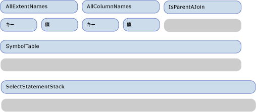
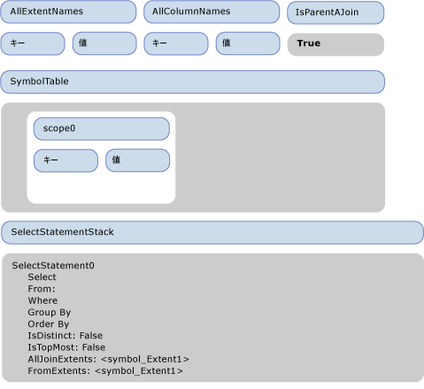
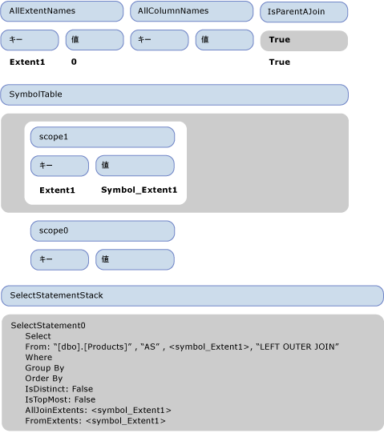
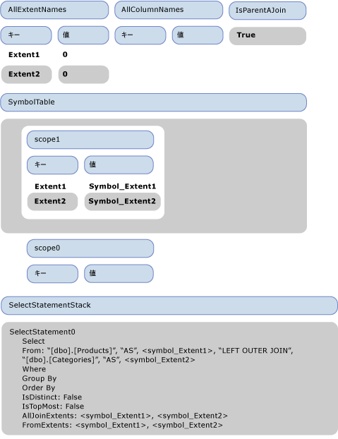
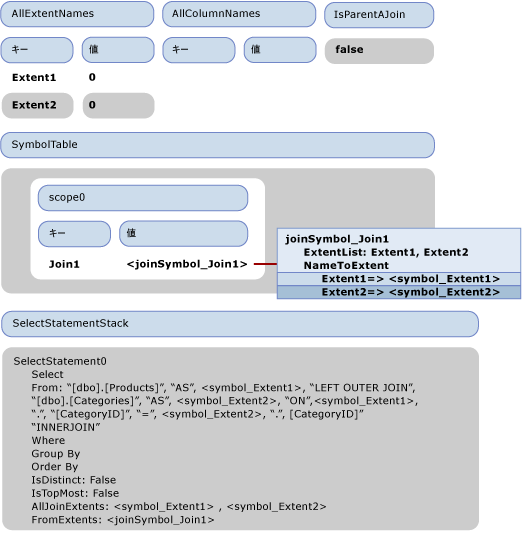
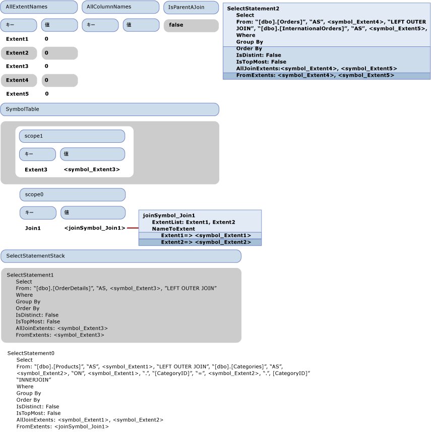
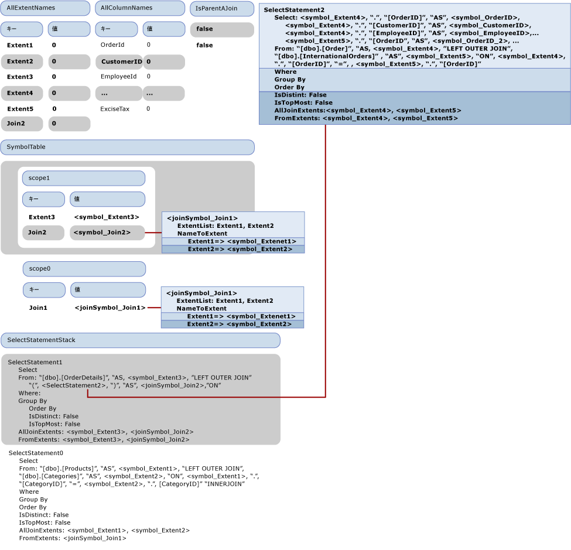

# チュートリアル: SQL 生成
このトピックでは、[サンプル プロバイダー](http://go.microsoft.com/fwlink/?LinkId=180616)で SQL の生成がどのように行われるかについて説明します。  次の Entity SQL クエリでは、サンプル プロバイダーに含まれているモデルを使用します。  
  
```  
SELECT  j1.ProductId, j1.ProductName, j1.CategoryName, j2.ShipCountry, j2.ProductId  
FROM (  SELECT P.ProductName, P.ProductId, P.Category.CategoryName  
        FROM NorthwindEntities.Products AS P) as j1  
INNER JOIN (SELECT OD.ProductId, OD.Order.ShipCountry as ShipCountry  
            FROM NorthwindEntities.OrderDetails AS OD) as j2  
            ON j1.ProductId == j2.ProductId   
```  
  
 このクエリでは、プロバイダーに渡される次の出力コマンド ツリーが生成されます。  
  
```  
DbQueryCommandTree  
|_Parameters  
|_Query : Collection{Record['C1'=Edm.Int32, 'ProductID'=Edm.Int32, 'ProductName'=Edm.String, 'CategoryName'=Edm.String, 'ShipCountry'=Edm.String, 'ProductID1'=Edm.Int32]}  
  |_Project  
    |_Input : 'Join4'  
    | |_InnerJoin  
    |   |_Left : 'Join1'  
    |   | |_LeftOuterJoin  
    |   |   |_Left : 'Extent1'  
    |   |   | |_Scan : dbo.Products  
    |   |   |_Right : 'Extent2'  
    |   |   | |_Scan : dbo.Categories  
    |   |   |_JoinCondition  
    |   |     |_  
    |   |       |_Var(Extent1).CategoryID  
    |   |       |_=  
    |   |       |_Var(Extent2).CategoryID  
    |   |_Right : 'Join3'  
    |   | |_LeftOuterJoin  
    |   |   |_Left : 'Extent3'  
    |   |   | |_Scan : dbo.OrderDetails  
    |   |   |_Right : 'Join2'  
    |   |   | |_LeftOuterJoin  
    |   |   |   |_Left : 'Extent4'  
    |   |   |   | |_Scan : dbo.Orders  
    |   |   |   |_Right : 'Extent5'  
    |   |   |   | |_Scan : dbo.InternationalOrders  
    |   |   |   |_JoinCondition  
    |   |   |     |_  
    |   |   |       |_Var(Extent4).OrderID  
    |   |   |       |_=  
    |   |   |       |_Var(Extent5).OrderID  
    |   |   |_JoinCondition  
    |   |     |_  
    |   |       |_Var(Extent3).OrderID  
    |   |       |_=  
    |   |       |_Var(Join2).Extent4.OrderID  
    |   |_JoinCondition  
    |     |_  
    |       |_Var(Join1).Extent1.ProductID  
    |       |_=  
    |       |_Var(Join3).Extent3.ProductID  
    |_Projection  
      |_NewInstance : Record['C1'=Edm.Int32, 'ProductID'=Edm.Int32, 'ProductName'=Edm.String, 'CategoryName'=Edm.String, 'ShipCountry'=Edm.String, 'ProductID1'=Edm.Int32]  
        |_Column : 'C1'  
        | |_1  
        |_Column : 'ProductID'  
        | |_Var(Join4).Join1.Extent1.ProductID  
        |_Column : 'ProductName'  
        | |_Var(Join4).Join1.Extent1.ProductName  
        |_Column : 'CategoryName'  
        | |_Var(Join4).Join1.Extent2.CategoryName  
        |_Column : 'ShipCountry'  
        | |_Var(Join4).Join3.Join2.Extent4.ShipCountry  
        |_Column : 'ProductID1'  
          |_Var(Join4).Join3.Extent3.ProductID  
```  
  
 このトピックでは、この出力コマンド ツリーを次の SQL ステートメントに変換する方法について説明します。  
  
```  
SELECT   
1 AS [C1],   
[Extent1].[ProductID] AS [ProductID],   
[Extent1].[ProductName] AS [ProductName],   
[Extent2].[CategoryName] AS [CategoryName],   
[Join3].[ShipCountry] AS [ShipCountry],   
[Join3].[ProductID] AS [ProductID1]  
FROM   [dbo].[Products] AS [Extent1]  
LEFT OUTER JOIN [dbo].[Categories] AS [Extent2] ON [Extent1].[CategoryID] = [Extent2].[CategoryID]  
INNER JOIN    
(SELECT [Extent3].[OrderID] AS [OrderID1], [Extent3].[ProductID] AS [ProductID], [Extent3].[UnitPrice] AS [UnitPrice], [Extent3].[Quantity] AS [Quantity], [Extent3].[Discount] AS [Discount], [Join2].[OrderID2], [Join2].[CustomerID], [Join2].[EmployeeID], [Join2].[OrderDate], [Join2].[RequiredDate], [Join2].[ShippedDate], [Join2].[Freight], [Join2].[ShipName], [Join2].[ShipAddress], [Join2].[ShipCity], [Join2].[ShipRegion], [Join2].[ShipPostalCode], [Join2].[ShipCountry], [Join2].[OrderID3], [Join2].[CustomsDescription], [Join2].[ExciseTax]  
FROM  [dbo].[OrderDetails] AS [Extent3]  
LEFT OUTER JOIN    
      (SELECT [Extent4].[OrderID] AS [OrderID2], [Extent4].[CustomerID] AS [CustomerID], [Extent4].[EmployeeID] AS [EmployeeID], [Extent4].[OrderDate] AS [OrderDate], [Extent4].[RequiredDate] AS [RequiredDate], [Extent4].[ShippedDate] AS [ShippedDate], [Extent4].[Freight] AS [Freight], [Extent4].[ShipName] AS [ShipName], [Extent4].[ShipAddress] AS [ShipAddress], [Extent4].[ShipCity] AS [ShipCity], [Extent4].[ShipRegion] AS [ShipRegion], [Extent4].[ShipPostalCode] AS [ShipPostalCode], [Extent4].[ShipCountry] AS [ShipCountry], [Extent5].[OrderID] AS [OrderID3], [Extent5].[CustomsDescription] AS [CustomsDescription], [Extent5].[ExciseTax] AS [ExciseTax]  
FROM  [dbo].[Orders] AS [Extent4]  
LEFT OUTER JOIN [dbo].[InternationalOrders] AS [Extent5] ON [Extent4].[OrderID] = [Extent5].[OrderID]   
      ) AS [Join2] ON [Extent3].[OrderID] = [Join2].[OrderID2]   
   ) AS [Join3] ON [Extent1].[ProductID] = [Join3].[ProductID]  
```  
  
## SQL 生成の最初のフェーズ: 式ツリーへのアクセス  
 次の図は、ビジターの最初の空の状態を示しています。  このトピック全体では、このチュートリアルの説明に関連するプロパティのみを示しています。  
  
   
  
 Project ノードにアクセスすると、VisitInputExpression がその入力 \(Join4\) に対して呼び出され、VisitJoinExpression メソッドによって Join4 のアクセスがトリガーされます。  これは最上位の結合であるため、IsParentAJoin は false を返し、新しい SqlSelectStatement \(SelectStatement0\) が作成され、SELECT ステートメント スタックにプッシュされます。  また、新しいスコープ \(scope0\) がシンボル テーブルに追加されます。  結合の最初の入力 \(左辺\) にアクセスする前に、'true' が IsParentAJoin スタックにプッシュされます。  Join4 の左辺の入力である Join1 にアクセスする直前に、ビジターの状態は次の図に示すようになります。  
  
   
  
 結合のビジット メソッドが Join4 に対して呼び出されると、IsParentAJoin は true になるため、現在の SELECT ステートメントである SelectStatement0 が再利用されます。  新しいスコープ \(scope1\) が追加されます。  左辺の子である Extent1 にアクセスする前に、もう 1 度 true が IsParentAJoin スタックにプッシュされます。  
  
 Extent1 にアクセスすると、IsParentAJoin が true を返すため、"\[dbo\].\[Products\]" を含む SqlBuilder が返されます。  制御が、Join4 にアクセスしているメソッドに戻されます。  エントリが IsParentAJoin からポップされ、ProcessJoinInputResult が呼び出されます。それによって、Extent1 へのアクセス結果が SelectStatement0 の FROM 句に追加されます。  入力バインディング名 "Extent1" の新しい from シンボルである symbol\_Extent1 が作成され、SelectStatement0 の FromExtents に追加され、さらに "As" と symbol\_Extent1 が FROM 句に追加されます。  新しいエントリが "Extent1" の AllExtentNames に追加され、値が 0 に設定されます。  新しいエントリがシンボル テーブルの現在のスコープに追加され、"Extent1" にそのシンボル symbol\_Extent1 が関連付けられます。  また、symbol\_Extent1 は SqlSelectStatement の AllJoinExtents にも追加されます。  
  
 Join1 の右辺の入力にアクセスする前に、"LEFT OUTER JOIN" が SelectStatement0 の FROM 句に追加されます。  右辺の入力はスキャン式であるため、再度 true が IsParentAJoin スタックにプッシュされます。  右辺の入力にアクセスする前の状態は次の図に示すとおりです。  
  
   
  
 右辺の入力は、左辺の入力と同じように処理されます。  右辺の入力にアクセスした後の状態を、次の図に示します。  
  
   
  
 次に、"false" が IsParentAJoin スタックにプッシュされ、結合条件である Var\(Extent1\).CategoryID \=\= Var\(Extent2\).CategoryID が処理されます。  Var\(Extenent1\) は、シンボル テーブルの検索後、\<symbol\_Extent1\> に解決されます。  このインスタンスは単純なシンボルに解決されるため、Var\(Extent1\).CategoryID の処理結果として、\<symbol1\>."CategoryID" を含む SqlBuilder が返されます。  同様に比較の右辺が処理され、結合条件へのアクセス結果が SelectStatement1 の FROM 句に追加され、値 "false" が IsParentAJoin スタックからポップされます。  
  
 これで Join1 の処理が完了し、スコープがシンボル テーブルからポップされます。  
  
 制御が、Join1 の親である Join4 の処理に戻されます。  子では SELECT ステートメントを再利用したため、Join1 のエクステントは単一の結合シンボル \<joinSymbol\_Join1\> に置き換えられます。  また、新しいエントリがシンボル テーブルに追加され、Join1 と \<joinSymbol\_Join1\> が関連付けられます。  
  
 次に処理するノードは、Join4 の 2 つ目の子である Join3 です。  これは右辺の子であるため、"false" が IsParentAJoin スタックにプッシュされます。  この時点のビジターの状態を次の図に示します。  
  
   
  
 Join3 の場合、IsParentAJoin は false を返します。また、新しい SqlSelectStatement \(SelectStatement1\) を開始し、それをスタックにプッシュする必要があります。  処理は前の結合と同じように実行されます。新しいスコープがスタックにプッシュされ、子が処理されます。  左辺の子がエクステント \(Extent3\) で、右辺の子が結合 \(Join2\) です。Join2 では、新しい SqlSelectStatement \(SelectStatement2\) を開始する必要があります。  Join2 の子もエクステントであり、SelectStatement2 に集約されます。  
  
 Join2 にアクセスした直後で、その後処理 \(ProcessJoinInputResult\) を実行する前のビジターの状態を次の図に示します。  
  
   
  
 SelectStatement2 は、前の図では型指定されていない状態で示されています。これは、スタックからポップされたが、まだ親によって後処理が実行されていないためです。  親の FROM の部分に追加する必要がありますが、SELECT 句がないため、完全な SQL ステートメントではありません。  そのため、この時点では、既定の列 \(入力によって生成されるすべての列\) が AddDefaultColumns メソッドによって選択リストに追加されます。  AddDefaultColumns では、FromExtents 内のシンボルを反復処理し、スコープ内に取り込まれたすべての列をシンボルごとに追加します。  単純なシンボルの場合は、シンボルの型を参照して、追加するすべてのプロパティを取得します。  また、AllColumnNames ディクショナリに列名を追加します。  完成した SelectStatement2 が SelectStatement1 の FROM 句に追加されます。  
  
 次に、Join2 を表す新しい結合シンボルが作成され、入れ子になっている結合としてマークされ、SelectStatement1 の AllJoinExtents とシンボル テーブルに追加されます。  その後で、Join3 の結合条件である Var\(Extent3\).OrderID \=  Var\(Join2\).Extent4.OrderID を処理する必要があります。  左辺の処理は Join1 の結合条件の場合と同様です。  ただし、右辺 "Var\(Join2\).Extent4.OrderID" の処理は、結合のフラット化が必要なため異なります。  
  
 次の図には、DbPropertyExpression である "Var\(Join2\).Extent4.OrderID" を処理する直前のビジターの状態を示しています。  
  
 "Var\(Join2\).Extent4.OrderID" にアクセスする方法について説明します。  最初に、インスタンス プロパティ "Var\(Join2\).Extent4" にアクセスします。これ自体が 1 つの DbPropertyExpression であり、まず、そのインスタンス "Var\(Join2\)" にアクセスします。  シンボル テーブルの最上位のスコープで、"Join2" は \<joinSymbol\_join2\> に解決されます。  "Var\(Join2\).Extent4" を処理する DbPropertyExpression のビジット メソッドでは、そのインスタンスへのアクセス時に結合シンボルが返されたこと、および結合のフラット化が必要なことが検出されます。  
  
 入れ子になっている結合であるため、結合シンボルの NameToExtent ディクショナリの "Extent4" プロパティを検索し、それを \<symbol\_Extent4\> に解決することで、新しい \<SymbolPair \(joinSymbol\_join2\>、\<symbol\_Extent4\>\) を返します。  シンボル ペアは "Var\(Join2\).Extent4.OrderID" のインスタンスの処理から返されるため、"OrderID" プロパティはそのシンボル ペア \(\<symbol\_Extent4\>\) の ColumnPart を基に解決されます。このシンボル ペアには、それが表すエクステントの列のリストが含まれています。  そのため、"Var\(Join2\).Extent4.OrderID" は { \<joinSymbol\_Join2\>, ".", \<symbol\_OrderID\>} に解決されます。  
  
 Join4 の結合条件は同じように処理されます。  制御は最上位の Project を処理した VisitInputExpression メソッドに戻されます。  返された SelectStatement0 の FromExtents を確認すると、入力は結合として識別されており、元のエクステントは削除され、結合シンボルのみを含む新しいエクステントに置き換えられています。  また、シンボル テーブルも更新されています。次に、Project の Projection 部分を処理します。  プロパティの解決および結合エクステントのフラット化は前に説明したとおりです。  
  
   
  
 最終的に、次の SqlSelectStatement が生成されます。  
  
```  
SELECT:   
  "1", " AS ", "[C1]",  
  <symbol_Extent1>, ".", "[ProductID]", " AS ", "[ProductID]",   
  <symbol_Extent1>, ".", "[ProductName]", " AS ", "[ProductName]",  
  <symbol_Extent2>, ".", "[CategoryName]", " AS ", "[CategoryName]",  
  <joinSymbol_Join3>, ".", <symbol_ShipCountry>, " AS ", "[ShipCountry]",   
  <joinSymbol_Join3>, ".", <symbol_ProductID>, " AS ", "[ProductID1]"  
FROM: "[dbo].[Products]", " AS ", <symbol_Extent1>,   
        "LEFT OUTER JOIN ""[dbo].[Categories]", " AS ", <symbol_Extent2>, " ON ", <symbol_Extent1>, ".", "[CategoryID]", " = ", <symbol_Extent2>, ".", "[CategoryID]",   
        "INNER JOIN ",   
        " (", SELECT:   
           <symbol_Extent3>, ".", "[OrderID]", " AS ", <symbol_OrderID>, ",   
              <symbol_Extent3>, ".", "[ProductID]", " AS ", <symbol_ProductID>, ...,  
         <joinSymbol_Join2>, ".", <symbol_OrderID_2>, ", ",   
           <joinSymbol_Join2>, ".", <symbol_CustomerID>, ....,    
        <joinSymbol_Join2>, ".", <symbol_OrderID_3>,   
<joinSymbol_Join2>, ".", <symbol_CustomsDescription>,   
<joinSymbol_Join2>, ".", <symbol_ExciseTax>  
FROM: "[dbo].[OrderDetails]", " AS ", <symbol_Extent3>,   
"LEFT OUTER JOIN ",   
" (", SELECT:   
<symbol_Extent4>, ".", "[OrderID]", " AS ", <symbol_OrderID_2>,   
<symbol_Extent4>, ".", "[CustomerID]", " AS ", <symbol_CustomerID>, ...  
<symbol_Extent5>, ".", "[OrderID]", " AS ", <symbol_OrderID_3>,  
<symbol_Extent5>, ".", "[CustomsDescription]", " AS ", <symbol_CustomsDescription>,  
<symbol_Extent5>, ".", "[ExciseTax]", " AS ", <symbol_ExciseTax>  
FROM: "[dbo].[Orders]", " AS ", <symbol_Extent4>,  
"LEFT OUTER JOIN ", , "[dbo].[InternationalOrders]", " AS ", <symbol_Extent5>,   
" ON ", <symbol_Extent4>, ".", "[OrderID]", " = ", , <symbol_Extent5>, ".", "[OrderID]"  
" )", " AS ", <joinSymbol_Join2>, " ON ", , , <symbol_Extent3>, ".", "[OrderID]", " = ", , <joinSymbol_Join2>, ".", <symbol_OrderID_2>  
" )", " AS ", <joinSymbol_Join3>, " ON ", , , <symbol_Extent1>, ".", "[ProductID]", " = ", , <joinSymbol_Join3>, ".", <symbol_ProductID>  
```  
  
### SQL 生成の 2 番目のフェーズ: 文字列コマンドの生成  
 2 番目のフェーズでは、シンボルの実際の名前を生成します。ここでは、競合を解決する必要がある "OrderID" という名前の列を表すシンボルについてのみ説明します。  これらは SqlSelectStatement で強調表示されます。  図に使用されているサフィックスは、これらが別々のインスタンスであることを強調しているだけで、新しい名前を表しているわけではありません。その理由は、この段階では、シンボルの最終的な名前 \(場合によっては元の名前とは異なる\) がまだ割り当てられていないためです。  
  
 名前を変更する必要があるシンボルとして最初に検出されるのが、\<symbol\_OrderID\> です。  その新しい名前として "OrderID1" が割り当てられます。1 は、"OrderID" に対して最後に使用されたサフィックスとしてマークされ、シンボルは名前を変更する必要がないものとしてマークされます。  次に、最初に使われている \<symbol\_OrderID\_2\> が検出されます。  これは、有効な次のサフィックスを使用するように名前が変更され \("OrderID2"\)、このシンボルも名前を変更する必要がないものとしてマークされます。そのため、次に使用するときに、名前の変更は行われません。  この処理は、\<symbol\_OrderID\_3\> に対しても行われます。  
  
 2 番目のフェーズの最後に、最終的な SQL ステートメントが生成されます。  
  
## 参照  
 [サンプル プロバイダーでの SQL 生成](../../../../../docs/framework/data/adonet/ef/sql-generation-in-the-sample-provider.md)