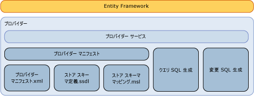

# Entity Framework データ プロバイダーの作成
ここでは、[!INCLUDE[adonet_ef](../../../../../includes/adonet-ef-md.md)] 以外のデータ ソースをサポートする [!INCLUDE[ssNoVersion](../../../../../includes/ssnoversion-md.md)] プロバイダーの作成方法について説明します。 [!INCLUDE[adonet_ef](../../../../../includes/adonet-ef-md.md)] には、[!INCLUDE[ssNoVersion](../../../../../includes/ssnoversion-md.md)] をサポートするプロバイダーが含まれています。  
  
## Entity Framework プロバイダー モデルの概要  
 [!INCLUDE[adonet_ef](../../../../../includes/adonet-ef-md.md)] はデータベースに依存しません。ADO.NET プロバイダー モデルを使用して、さまざまなデータ ソースに接続するプロバイダーを作成できます。  
  
 ADO.NET データ プロバイダー モデルを使用して構築された Entity Framework データ プロバイダーは、次の機能を実行します。  
  
-   Entity Data Model (EDM) プリミティブ型をプロバイダー型にマップします。  
  
-   プロバイダー固有の関数を公開します。  
  
-   指定された DbQueryCommandTree に対してプロバイダー固有のコマンドを生成して、[!INCLUDE[adonet_ef](../../../../../includes/adonet-ef-md.md)] クエリをサポートします。  
  
-   指定された DbModificationCommandTree に対してプロバイダー固有の更新コマンドを生成して、[!INCLUDE[adonet_ef](../../../../../includes/adonet-ef-md.md)] を介した更新をサポートします。  
  
-   ストア スキーマ定義のマッピング ファイルを公開して、データベースに基づくモデルの生成をサポートします。  
  
-   概念モデルを使用してメタデータ (テーブルとビューなど) を公開します。  
  
   
  
## サンプル  
 参照してください、 [Entity Framework サンプル プロバイダー](http://go.microsoft.com/fwlink/?LinkId=180616)のサンプルについては、[!INCLUDE[adonet_ef](../../../../../includes/adonet-ef-md.md)]以外のデータ ソースをサポートするプロバイダー[!INCLUDE[ssNoVersion](../../../../../includes/ssnoversion-md.md)]です。  
  
## このセクションの内容  
 [SQL 生成](../../../../../docs/framework/data/adonet/ef/sql-generation.md)  
  
 [変更 SQL 生成](../../../../../docs/framework/data/adonet/ef/modification-sql-generation.md)  
  
 [プロバイダー マニフェストの仕様](../../../../../docs/framework/data/adonet/ef/provider-manifest-specification.md)  
  
## 参照  
 [データ プロバイダーの操作](../../../../../docs/framework/data/adonet/ef/working-with-data-providers.md)
