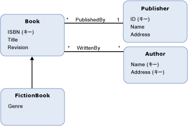

# Entity Data Model: 継承
Entity Data Model (EDM) の継承をサポートしている[エンティティ型](../../../../docs/framework/data/adonet/entity-type.md)です。 EDM の継承は、オブジェクト指向プログラミング言語におけるクラスの継承に似ています。 オブジェクト指向言語でクラスでは、概念モデルで定義できます、エンティティ型と同じように (、*派生型*) 別のエンティティ型から継承する (、*基本型*)。 ただし、オブジェクト指向プログラミングのクラスとは異なり、概念モデルで、派生型常にすべてを継承、[プロパティ](../../../../docs/framework/data/adonet/property.md)と[ナビゲーション プロパティ](../../../../docs/framework/data/adonet/navigation-property.md)の基本型です。 派生型の継承プロパティは、オーバーライドできません。  
  
 概念モデルでは、派生型が別の派生型を継承する継承階層を構築することができます。 階層 (派生型ではない階層内の 1 つの型) の上部にある型が呼び出される、*ルート型*です。 継承階層で、[エンティティ キー](../../../../docs/framework/data/adonet/entity-key.md)ルート型で定義する必要があります。  
  
 複数の型から派生型を継承する継承階層を構築することはできません。 たとえば、`Book` エンティティ型の概念モデルでは、それぞれ `FictionBook` から継承する派生型、`NonFictionBook` および `Book` を定義することができます。 しかし、`FictionBook` 型と `NonFictionBook` 型の両方から継承する型を定義することはできません。  
  
## 例  
 下のダイアグラムは、`Book`、`FictionBook`、`Publisher`、および `Author` という 4 つのエンティティ型の概念モデルを示しています。 `FictionBook` エンティティ型は、`Book` エンティティ型から継承する派生型です。 `FictionBook` 型は、`ISBN (Key)` プロパティ、`Title` プロパティ、および `Revision` プロパティを継承し、`Genre` と呼ばれる追加プロパティを定義します。  
  
   
  
 [ADO.NET Entity Framework](../../../../docs/framework/data/adonet/ef/index.md)概念スキーマ定義言語と呼ばれるドメイン固有言語 (DSL) を使用して ([CSDL](../../../../docs/framework/data/adonet/ef/language-reference/csdl-specification.md)) 概念モデルを定義します。 次の CSDL は、上のダイアグラムに示された `FictionBook` 型を継承する `Book` エンティティ型を定義しています。  
  
 [!code-xml[EDM_Example_Model#DerivedType](../../../../samples/snippets/xml/VS_Snippets_Data/edm_example_model/xml/books5.edmx#derivedtype)]  
  
## 関連項目  
 [Entity Data Model キーの概念](../../../../docs/framework/data/adonet/entity-data-model-key-concepts.md)  
 [Entity Data Model](../../../../docs/framework/data/adonet/entity-data-model.md)
