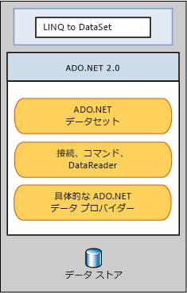

# LINQ to DataSet
[!INCLUDE[linq_dataset](../../../../includes/linq-dataset-md.md)] は、<xref:System.Data.DataSet> オブジェクトにキャッシュされたデータに対するクエリをより簡単に、より高速にします。  つまり、[!INCLUDE[linq_dataset](../../../../includes/linq-dataset-md.md)] では、クエリを記述するのにクエリ言語ではなくプログラミング言語そのものを使用できるので、クエリ操作が容易になります。  これは、[!INCLUDE[vsprvs](../../../../includes/vsprvs-md.md)] 開発者にとって特に便利で、[!INCLUDE[vsprvs](../../../../includes/vsprvs-md.md)] によって提供されるコンパイル時の構文チェック、静的な型指定、IntelliSense のサポートをクエリで利用できるようになります。  
  
 また、[!INCLUDE[linq_dataset](../../../../includes/linq-dataset-md.md)] を使用すると、1 つまたは複数のデータ ソースから取得して統合したデータを照会することもできます。  これにより、ローカルに集計されたデータのクエリや Web アプリケーションでの中間層のキャッシュなど、データの表現方法や扱いに柔軟性が要求されるさまざまなシナリオが実現します。  特に、汎用のレポート作成、分析、ビジネス インテリジェンスを行うアプリケーションでは、この手法を用いたデータ操作が欠かせません。  
  
 [!INCLUDE[linq_dataset](../../../../includes/linq-dataset-md.md)] 機能は、主に <xref:System.Data.DataRowExtensions> クラスおよび <xref:System.Data.DataTableExtensions> クラスの拡張メソッドを介して公開されます。[!INCLUDE[linq_dataset](../../../../includes/linq-dataset-md.md)] は、既存の [!INCLUDE[ado_whidbey_long](../../../../includes/ado-whidbey-long-md.md)] アーキテクチャに基づきこれを使用するものであり、アプリケーション コードの [!INCLUDE[ado_whidbey_long](../../../../includes/ado-whidbey-long-md.md)] に代わるものではありません。  既存の ADO.NET 2.0 コードは [!INCLUDE[linq_dataset](../../../../includes/linq-dataset-md.md)] アプリケーションにおいても機能します。 [!INCLUDE[linq_dataset](../../../../includes/linq-dataset-md.md)] と [!INCLUDE[ado_whidbey_long](../../../../includes/ado-whidbey-long-md.md)] のリレーションシップとデータ ストアを次の図に示します。  
  
   
  
## このセクションの内容  
 [Getting Started](../../../../docs/framework/data/adonet/getting-started-linq-to-dataset.md)  
  
 [Programming Guide](../../../../docs/framework/data/adonet/programming-guide-linq-to-dataset.md)  
  
## 関連項目  
 <xref:System.Data.DataTableExtensions>  
  
 <xref:System.Data.DataRowExtensions>  
  
 <xref:System.Data.DataRowComparer>  
  
## 参照  
 [LINQ \(Language\-Integrated Query\)](../Topic/LINQ%20\(Language-Integrated%20Query\).md)   
 [LINQ と ADO.NET](../../../../docs/framework/data/adonet/linq-and-ado-net.md)   
 [ADO.NET](../../../../docs/framework/data/adonet/index.md)