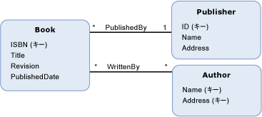

# モデル定義関数model-defined function
A*モデル定義関数*概念モデルで定義されている関数です。A *model-defined function* is a function that is defined in a conceptual model. モデル定義関数の本体はで表現[Entity SQL](../../../../docs/framework/data/adonet/ef/language-reference/entity-sql-language.md)ルール関数とは無関係に表すことのできる、またはデータ ソースでサポートされている言語。The body of a model-defined function is expressed in [Entity SQL](../../../../docs/framework/data/adonet/ef/language-reference/entity-sql-language.md), which allows for the function to be expressed independently of rules or languages supported in the data source.  
  
 モデル定義関数の定義には、次の情報が含まれます。A definition for a model-defined function contains the following information:  
  
-   関数名。A function name. (必須)(Required)  
  
-   戻り値の型。The type of the return value. (オプション)。(Optional)  
  
    > [!NOTE]
    >  戻り値の型が指定されていない場合、戻り値は void になります。If no return type is specified, the return value is void.  
  
-   パラメーター情報。Parameter information. (オプション)。(Optional)  
  
-   [Entity SQL](../../../../docs/framework/data/adonet/ef/language-reference/entity-sql-language.md)関数の本体を定義する式。An [Entity SQL](../../../../docs/framework/data/adonet/ef/language-reference/entity-sql-language.md) expression that defines the body of the function.  
  
 モデル定義関数では、出力パラメーターがサポートされません。Note that model-defined functions do not support output parameters. この制約は、モデル定義関数を構成できるようにするためにあります。This restriction is in place so that model-defined functions can be composed.  
  
## 例Example  
 下のダイアグラムは、`Book`、`Publisher`、および `Author` という 3 つのエンティティ型の概念モデルを示しています。The diagram below shows a conceptual model with three entity types: `Book`, `Publisher`, and `Author`.  
  
   
  
 [ADO.NET Entity Framework](../../../../docs/framework/data/adonet/ef/index.md)概念スキーマ定義言語と呼ばれるドメイン固有言語 (DSL) を使用して ([CSDL](../../../../docs/framework/data/adonet/ef/language-reference/csdl-specification.md)) 概念モデルを定義します。The [ADO.NET Entity Framework](../../../../docs/framework/data/adonet/ef/index.md) uses a domain-specific language (DSL) called conceptual schema definition language ([CSDL](../../../../docs/framework/data/adonet/ef/language-reference/csdl-specification.md)) to define conceptual models. 次の CSDL は、`Book` (上のダイアグラムの) の出版以降の年数を返す概念モデルの関数を定義しています。The following CSDL defines a function in the conceptual model that returns the numbers of years since an instance of a `Book` (in the diagram above) was published.  
  
 [!code-xml[EDM_Example_Model#ModelDefinedFunction](../../../../samples/snippets/xml/VS_Snippets_Data/edm_example_model/xml/books4.edmx#modeldefinedfunction)]  
  
## 関連項目See Also  
 [Entity Data Model キーの概念Entity Data Model Key Concepts](../../../../docs/framework/data/adonet/entity-data-model-key-concepts.md)  
 [Entity Data ModelEntity Data Model](../../../../docs/framework/data/adonet/entity-data-model.md)  
 [Entity Data Model: プリミティブ データ型Entity Data Model: Primitive Data Types](../../../../docs/framework/data/adonet/entity-data-model-primitive-data-types.md)
