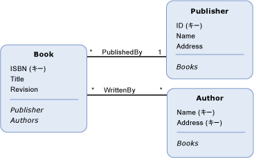

# ナビゲーション プロパティ
A*ナビゲーション プロパティ*では、省略可能なプロパティ、[エンティティ型](../../../../docs/framework/data/adonet/entity-type.md)から 1 つのナビゲーションを可能にする[終了](../../../../docs/framework/data/adonet/association-end.md)の[アソシエーション](../../../../docs/framework/data/adonet/association-type.md)にその他の終了時刻です。 その他のとは異なり[プロパティ](../../../../docs/framework/data/adonet/property.md)、ナビゲーション プロパティがデータを伝達しません。  
  
 ナビゲーション プロパティの定義には、以下が含まれます。  
  
-   名前。 (必須)  
  
-   移動対象のアソシエーション。 (必須)  
  
-   移動対象のアソシエーションの End。 (必須)  
  
 ナビゲーション プロパティは、アソシエーション End の両方のエンティティ型で省略可能です。 1 つのアソシエーション End のエンティティ型にナビゲーション プロパティを定義した場合に、そのアソシエーションの他方の End でもエンティティ型にナビゲーション プロパティを定義する必要はありません。  
  
 ナビゲーション プロパティのデータ型は、によって決定されます、[多重度](../../../../docs/framework/data/adonet/association-end-multiplicity.md)、リモートの[アソシエーション end](../../../../docs/framework/data/adonet/association-end.md)です。 たとえば、ナビゲーション プロパティ `OrdersNavProp` が `Customer` エンティティ型に存在し、`Customer` と `Order` の間の一対多のアソシエーションで移動するとします。 ナビゲーション プロパティのリモートのアソシエーション End の多重度が多数 (*) であるため、そのデータ型は (`Order` の) コレクションになります。 同様に、`CustomerNavProp` エンティティ型にナビゲーション プロパティ、`Order` が存在する場合、リモート End の多重度が (1) であるため、データ型は `Customer` になります。  
  
## 例  
 下のダイアグラムは、`Book`、`Publisher`、および `Author` という 3 つのエンティティ型の概念モデルを示しています。 Book エンティティ型には、ナビゲーション プロパティ、`Publisher` および `Authors` が定義されています。 Publisher エンティティ型と `Books` エンティティ型には、ナビゲーション プロパティ、`Author` が定義されています。  
  
   
  
 [ADO.NET Entity Framework](../../../../docs/framework/data/adonet/ef/index.md)概念スキーマ定義言語と呼ばれるドメイン固有言語 (DSL) を使用して ([CSDL](../../../../docs/framework/data/adonet/ef/language-reference/csdl-specification.md)) 概念モデルを定義します。 次の CSDL は、上のダイアグラムに示された `Book` エンティティ型を定義しています。  
  
 [!code-xml[EDM_Example_Model#EntityExample](../../../../samples/snippets/xml/VS_Snippets_Data/edm_example_model/xml/books.edmx#entityexample)]  
  
 ナビゲーション プロパティの定義に必要な情報を伝達するために、XML 属性が使用されています。属性 `Name` にはプロパティ名が含まれ、`Relationship` には移動対象のアソシエーション名が含まれ、`FromRole` および `ToRole` にはアソシエーション End が含まれています。  
  
## 参照  
 [Entity Data Model キーの概念](../../../../docs/framework/data/adonet/entity-data-model-key-concepts.md)  
 [Entity Data Model](../../../../docs/framework/data/adonet/entity-data-model.md)
