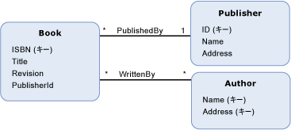

# 参照整合性制約
Entity Data Model \(EDM\) の*参照整合性制約*は、リレーショナル データベースの参照整合性制約と似ています。  データベース テーブルの列が別のテーブルの主キーを参照できるのと同じように、[エンティティ型](../../../../docs/framework/data/adonet/entity-type.md)の[プロパティ](../../../../docs/framework/data/adonet/property.md)は別のエンティティ型の[エンティティ キー](../../../../docs/framework/data/adonet/entity-key.md)を参照できます。  参照されるエンティティ型は、制約の*プリンシパル End* と呼ばれます。  プリンシパル End を参照するエンティティ型は、制約の*依存 End* と呼ばれます。  
  
 参照整合性制約は、2 つのエンティティ型の間の[アソシエーション](../../../../docs/framework/data/adonet/association-type.md)の一部として定義されます。  参照整合性制約の定義には、次の情報を指定します。  
  
-   制約のプリンシパル End。  \(エンティティ キーが依存 End により参照されるエンティティ型\)  
  
-   プリンシパル End のエンティティ キー。  
  
-   制約の依存 End。  \(プリンシパル End のエンティティ キーを参照するプロパティを持つエンティティ型\)  
  
-   依存 End の参照プロパティ。  
  
 EDM の参照整合性制約の目的は、常に有効なアソシエーションが存在することを確認するためです。  詳細については、「[外部キーのプロパティ](../../../../docs/framework/data/adonet/foreign-key-property.md)」を参照してください。  
  
## 例  
 下のダイアグラムは、`PublishedBy` および `WrittenBy` という 2 つのアソシエーションの概念モデルを示しています。  `Book` エンティティ型には、`PublisherId` というプロパティがあります。`PublishedBy` アソシエーションに参照整合性制約を定義するときに、このプロパティは `Publisher` エンティティ型のエンティティ キーを参照します。  
  
   
  
 [ADO.NET Entity Framework](../../../../docs/framework/data/adonet/ef/index.md) では、概念スキーマ定義言語 \([CSDL](../../../../docs/framework/data/adonet/ef/language-reference/csdl-specification.md)\) と呼ばれるドメイン固有言語 \(DSL\) を使用して概念モデルを定義します。  次の CSDL は、上の概念モデルに示された `PublishedBy` アソシエーションの参照整合性制約を定義しています。  
  
 [!code-xml[EDM_Example_Model#RefConstraint](../../../../samples/snippets/xml/VS_Snippets_Data/edm_example_model/xml/books4.edmx#refconstraint)]  
  
## 参照  
 [Entity Data Model キーの概念](../../../../docs/framework/data/adonet/entity-data-model-key-concepts.md)   
 [Entity Data Model](../../../../docs/framework/data/adonet/entity-data-model.md)