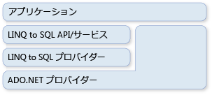

# ADO.NET および LINQ to SQL
[!INCLUDE[vbtecdlinq](../../../../../../includes/vbtecdlinq-md.md)] 一部である、[!INCLUDE[vstecado](../../../../../../includes/vstecado-md.md)]テクノロジ ファミリ。 [!INCLUDE[vstecado](../../../../../../includes/vstecado-md.md)] プロバイダー モデルから提供されるサービスに基づいて動作します。 そのために混合できます[!INCLUDE[vbtecdlinq](../../../../../../includes/vbtecdlinq-md.md)]コードを既存[!INCLUDE[vstecado](../../../../../../includes/vstecado-md.md)]アプリケーションさせ、現在[!INCLUDE[vstecado](../../../../../../includes/vstecado-md.md)]の解決策を[!INCLUDE[vbtecdlinq](../../../../../../includes/vbtecdlinq-md.md)]です。 次の図は、この関係を高いレベルから見たものです。  
  
   
  
## 接続  
 既存を指定することができます[!INCLUDE[vstecado](../../../../../../includes/vstecado-md.md)]接続を作成するとき、 [!INCLUDE[vbtecdlinq](../../../../../../includes/vbtecdlinq-md.md)] <xref:System.Data.Linq.DataContext>です。 すべての操作に対して、 <xref:System.Data.Linq.DataContext> (クエリを含む) には、この接続を使用します。 場合は、接続が開いて[!INCLUDE[vbtecdlinq](../../../../../../includes/vbtecdlinq-md.md)]は操作を終了するときにそのままです。  
  
 [!code-csharp[DLinqCommunicatingWithDatabase#4](../../../../../../samples/snippets/csharp/VS_Snippets_Data/DLinqCommunicatingWithDatabase/cs/Program.cs#4)]
 [!code-vb[DLinqCommunicatingWithDatabase#4](../../../../../../samples/snippets/visualbasic/VS_Snippets_Data/DLinqCommunicatingWithDatabase/vb/Module1.vb#4)]  
  
 次のコードに示すとおり、<xref:System.Data.Linq.DataContext.Connection%2A> プロパティを使用して、いつでも接続にアクセスしたり、任意に閉じたりすることができます。  
  
 [!code-csharp[DLinqAdoNet#1](../../../../../../samples/snippets/csharp/VS_Snippets_Data/DLinqAdoNet/cs/Program.cs#1)]
 [!code-vb[DLinqAdoNet#1](../../../../../../samples/snippets/visualbasic/VS_Snippets_Data/DLinqAdoNet/vb/Module1.vb#1)]  
  
## トランザクション  
 既に独自のデータベース トランザクションを初期化していて、<xref:System.Data.Linq.DataContext> をトランザクションに使用する必要がある場合は、<xref:System.Data.Linq.DataContext> をトランザクションに渡すことができます。  
  
 [!INCLUDE[dnprdnshort](../../../../../../includes/dnprdnshort-md.md)] でトランザクションを実行する場合は、<xref:System.Transactions.TransactionScope> オブジェクトの使用をお勧めします。 この方法を使うと、データベースと他のメモリ常駐リソース マネージャー間で動作する分散トランザクションを作成できます。 トランザクション スコープは、わずかなリソースで開始されます。 トランザクションのスコープ内に複数の接続がある場合のみ、このトランザクションは分散トランザクションに昇格します。  
  
 [!code-csharp[DLinqAdoNet#2](../../../../../../samples/snippets/csharp/VS_Snippets_Data/DLinqAdoNet/cs/Program.cs#2)]
 [!code-vb[DLinqAdoNet#2](../../../../../../samples/snippets/visualbasic/VS_Snippets_Data/DLinqAdoNet/vb/Module1.vb#2)]  
  
 この方法は、すべてのデータベースに使用できるわけではありません。 たとえば、SqlClient 接続を [!INCLUDE[ss2k](../../../../../../includes/ss2k-md.md)] サーバーに使用する場合、この接続はシステム トランザクションに昇格できません。 代わりに、トランザクション スコープが使用されているときは、完全な分散トランザクションに自動的に参加します。  
  
## 直接 SQL コマンド  
 ときには、クエリを実行したり変更内容を送信したりする <xref:System.Data.Linq.DataContext> 機能に不足があり、実行する必要がある特別なタスクを完了できないこともあります。 このような場合は、<xref:System.Data.Linq.DataContext.ExecuteQuery%2A> メソッドを使用して、SQL コマンドをデータベースに発行し、クエリ結果をオブジェクトに変換することができます。  
  
 たとえば、`Customer` クラスのデータが 2 つのテーブル (customer1 および customer2) に含まれているとします。 次のクエリは `Customer` オブジェクトのシーケンスを返します。  
  
 [!code-csharp[DLinqAdoNet#3](../../../../../../samples/snippets/csharp/VS_Snippets_Data/DLinqAdoNet/cs/Program.cs#3)]
 [!code-vb[DLinqAdoNet#3](../../../../../../samples/snippets/visualbasic/VS_Snippets_Data/DLinqAdoNet/vb/Module1.vb#3)]  
  
 表形式の結果内の列名には、エンティティ クラスの列のプロパティが一致する限り[!INCLUDE[vbtecdlinq](../../../../../../includes/vbtecdlinq-md.md)]SQL クエリからオブジェクトを作成します。  
  
### パラメーター  
 <xref:System.Data.Linq.DataContext.ExecuteQuery%2A> メソッドは、パラメーターを受け取ります。 次のコードでは、パラメーター化されたクエリが実行されます。  
  
 [!code-csharp[DlinqAdoNet#4](../../../../../../samples/snippets/csharp/VS_Snippets_Data/DLinqAdoNet/cs/Program.cs#4)]
 [!code-vb[DlinqAdoNet#4](../../../../../../samples/snippets/visualbasic/VS_Snippets_Data/DLinqAdoNet/vb/Module1.vb#4)]  
  
> [!NOTE]
>  パラメーターは、`Console.WriteLine()` および `String.Format()` で使用されるものと同じ中かっこ表記でクエリ テキストに表現されます。 `String.Format()` は、指定されたクエリ文字列を受け取り、中かっこで囲まれたパラメーターを、`@p0`、`@p1` …、`@p(n)` などの、生成されたパラメーター名に置き換えます。  
  
## 関連項目  
 [背景情報](../../../../../../docs/framework/data/adonet/sql/linq/background-information.md)  
 [方法 : ADO.NET コマンドおよび DataContext 間の接続を再利用する](../../../../../../docs/framework/data/adonet/sql/linq/how-to-reuse-a-connection-between-an-ado-net-command-and-a-datacontext.md)
