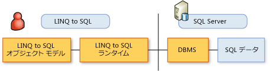

# 典型的な LINQ to SQL の使用手順
[!INCLUDE[vbtecdlinq](../../../../../../includes/vbtecdlinq-md.md)] アプリケーションを実装するには、このトピックで説明する手順に従います。 多くの手順は省略できます。 既定の状態でオブジェクト モデルを使用することもできます。  
  
 [!INCLUDE[vs_ordesigner_long](../../../../../../includes/vs-ordesigner-long-md.md)]を使用してオブジェクト モデルを作成し、クエリのコーディングを開始すると、非常に簡単です。  
  
## オブジェクト モデルの作成  
 最初に、既存のリレーショナル データベースのメタデータからオブジェクト モデルを作成します。 オブジェクト モデルは、開発者のプログラミング言語に従ってデータベースを表します。 詳細については、次を参照してください。 [LINQ to SQL オブジェクト モデル](../../../../../../docs/framework/data/adonet/sql/linq/the-linq-to-sql-object-model.md)です。  
  
### 1.モデルを作成するツールを選択します。  
 モデルを作成するツールとして、3 つのツールを使用できます。  
  
-   [!INCLUDE[vs_ordesigner_long](../../../../../../includes/vs-ordesigner-long-md.md)]   
  
     このデザイナーは、既存のデータベースからモデルを作成する多機能なユーザー インターフェイスを備えています。 このツール、Visual Studio IDE の一部であり、小規模または中規模のデータベースに最適です。  
  
-   SQLMetal コード生成ツール  
  
     このコマンド ライン ユーティリティは、[!INCLUDE[vs_ordesigner_short](../../../../../../includes/vs-ordesigner-short-md.md)]と多少異なるオプション セットを備えています。 このツールは、大規模なデータベースのモデル化に適しています。 詳しくは、「[SqlMetal.exe (コード生成ツール)](../../../../../../docs/framework/tools/sqlmetal-exe-code-generation-tool.md)」をご覧ください。  
  
-   コード エディター  
  
     Visual Studio code エディターまたは別のエディターを使用して独自のコードを記述することができます。 既存のデータベースがあり、[!INCLUDE[vs_ordesigner_short](../../../../../../includes/vs-ordesigner-short-md.md)]または SQLMetal ツールを使用できる場合は、この方法はエラーを発生する可能性が高いため、その使用はお勧めできません。 ただし、コード エディターは、他のツールを使用して既に生成されたコードを調整または変更する場合に役立ちます。 詳細については、次を参照してください。[する方法: コード エディターを使用してエンティティ クラスをカスタマイズ](../../../../../../docs/framework/data/adonet/sql/linq/how-to-customize-entity-classes-by-using-the-code-editor.md)です。  
  
### 2.生成するコードの種類を選択します。  
  
-   C# または Visual Basic ソース コード ファイルの属性に基づくマッピングします。  
  
     このコード ファイルは、Visual Studio プロジェクトに含めます。 詳細については、次を参照してください。[属性ベースの対応付け](../../../../../../docs/framework/data/adonet/sql/linq/attribute-based-mapping.md)です。  
  
-   外部マッピング用の XML ファイル。  
  
     この方法を使用すると、アプリケーション コードとは別にマッピング メタデータを保持できます。 詳細については、次を参照してください。[外部マッピング](../../../../../../docs/framework/data/adonet/sql/linq/external-mapping.md)です。  
  
    > [!NOTE]
    >  [!INCLUDE[vs_ordesigner_short](../../../../../../includes/vs-ordesigner-short-md.md)]は、外部マッピング ファイルの生成をサポートしていません。 SQLMetal ツールを使用してこの機能を実装する必要があります。  
  
-   最終コード ファイルを生成する前に変更できる DBML ファイル。  
  
     これは高度な機能です。  
  
### 3.コード ファイルを調整して、アプリケーションのニーズを反映します。  
 この目的で、[!INCLUDE[vs_ordesigner_short](../../../../../../includes/vs-ordesigner-short-md.md)]またはコード エディターを使用できます。  
  
## オブジェクト モデルの使用  
 2 層シナリオでの開発者とデータの関係を次の図に示します。 その他のシナリオでは、次を参照してください。 [N 層でおよびリモート アプリケーション LINQ to SQL](../../../../../../docs/framework/data/adonet/sql/linq/n-tier-and-remote-applications-with-linq-to-sql.md)です。  
  
   
  
 オブジェクト モデルが完成したので、そのモデル内で情報要求を記述し、データを操作します。 オブジェクト モデルのオブジェクトとプロパティを使用し、データベースの行と列は使用しません。 データベースを直接操作することはありません。  
  
 指示すると[!INCLUDE[vbtecdlinq](../../../../../../includes/vbtecdlinq-md.md)]記述したクエリまたは呼び出しを実行するか、`SubmitChanges()`を操作するデータに[!INCLUDE[vbtecdlinq](../../../../../../includes/vbtecdlinq-md.md)]データベースの言語でデータベースと通信します。  
  
 作成したオブジェクト モデルの典型的な使用手順を次に示します。  
  
### 1.クエリを作成し、データベースから情報を取得します。  
 詳細については、次を参照してください。[クエリの概念](../../../../../../docs/framework/data/adonet/sql/linq/query-concepts.md)と[クエリ例](../../../../../../docs/framework/data/adonet/sql/linq/query-examples.md)です。  
  
### 2.挿入、更新、および削除の既定の動作をオーバーライドします。  
 この手順は省略できます。 詳細については、次を参照してください。[のカスタマイズを挿入、更新、および削除を行う](../../../../../../docs/framework/data/adonet/sql/linq/customizing-insert-update-and-delete-operations.md)です。  
  
### 3.適切なオプションを設定し、同時実行の競合を検出およびレポートします。  
 同時実行の競合の処理について、モデルの既定値をそのまま使用することも、目的に合わせて変更することもできます。 詳細については、次を参照してください。[する方法: 同時実行の競合があるテストを指定するメンバー](../../../../../../docs/framework/data/adonet/sql/linq/how-to-specify-which-members-are-tested-for-concurrency-conflicts.md)と[する方法: を指定するときに同時実行例外がスローされた](../../../../../../docs/framework/data/adonet/sql/linq/how-to-specify-when-concurrency-exceptions-are-thrown.md)です。  
  
### 4.継承階層を確立します。  
 この手順は省略できます。 詳細については、次を参照してください。[継承のサポート](../../../../../../docs/framework/data/adonet/sql/linq/inheritance-support.md)です。  
  
### 5.適切なユーザー インターフェイスを提供します。  
 この手順は省略でき、アプリケーションの使用方法によって異なります。  
  
### 6.アプリケーションをデバッグおよびテストします。  
 詳細については、次を参照してください。[デバッグのサポート](../../../../../../docs/framework/data/adonet/sql/linq/debugging-support.md)です。  
  
## 関連項目  
 [はじめに](../../../../../../docs/framework/data/adonet/sql/linq/getting-started.md)  
 [オブジェクト モデルの作成](../../../../../../docs/framework/data/adonet/sql/linq/creating-the-object-model.md)  
 [ストアド プロシージャ](../../../../../../docs/framework/data/adonet/sql/linq/stored-procedures.md)
