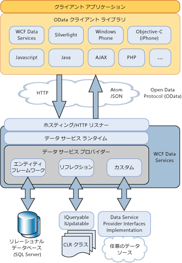

# WCF Data Services の概要
[!INCLUDE[ssAstoria](../../../../includes/ssastoria-md.md)] 使用して作成し、Web またはイントラネット用のデータ サービスの利用を有効に、[!INCLUDE[ssODataFull](../../../../includes/ssodatafull-md.md)]です。 [!INCLUDE[ssODataShort](../../../../includes/ssodatashort-md.md)] Uri によってアドレス指定できるリソースとしてデータを公開できます。 したがって、Representational State Transfer (REST) のセマンティクス (標準的な HTTP 動詞 GET、PUT、POST、DELETE) を使用してデータにアクセスし、そのデータを変更できます。 このトピックでは、[!INCLUDE[ssODataShort](../../../../includes/ssodatashort-md.md)] で定義されるパターンとプラクティスの両方の概要について説明します。また、.NET Framework ベースのアプリケーションで [!INCLUDE[ssAstoria](../../../../includes/ssastoria-md.md)] を利用するために [!INCLUDE[ssODataShort](../../../../includes/ssodatashort-md.md)] で提供される機能についても説明します。  
  
## リソースとしてのデータのアドレス指定  
 [!INCLUDE[ssODataShort](../../../../includes/ssodatashort-md.md)] は、URI でアドレス指定できるリソースとしてデータを公開します。 リソース パスは、Entity Data Model のエンティティとリレーションシップの規則に基づいて構築されます。 このモデルでは、エンティティは、顧客、注文、項目、および製品など、アプリケーション ドメイン内のデータの操作単位を表します。 詳細については、次を参照してください。 [Entity Data Model](../../../../docs/framework/data/adonet/entity-data-model.md)です。  
  
 [!INCLUDE[ssODataShort](../../../../includes/ssodatashort-md.md)] では、エンティティ型のインスタンスを含むエンティティ セットとしてエンティティ リソースのアドレスを指定します。 たとえば、URI`http://services.odata.org/Northwind/Northwind.svc/Customers('ALFKI')/Orders`からの注文のすべてを返します、`Northwind`を顧客に関連するデータ サービス、`CustomerID`の値 `ALFKI.`  
  
 クエリ式を使用して、リソースに対して従来のクエリ操作 (フィルターの適用、並べ替え、ページングなど) を実行できます。 たとえば、`http://services.odata.org/Northwind/Northwind.svc/Customers('ALFKI')/Orders?$filter=Freight gt 50` という URI は、リソースをフィルターして、$50 以上の運賃の注文だけを返します。 詳細については、次を参照してください。[データ サービス リソースのへのアクセス](../../../../docs/framework/data/wcf/accessing-data-service-resources-wcf-data-services.md)です。  
  
## 相互運用可能なデータ アクセス  
 [!INCLUDE[ssODataShort](../../../../includes/ssodatashort-md.md)] データ サービスを .NET Framework を使用しないアプリケーションと相互運用できるようにする標準のインターネット プロトコルに基づいています。 アドレス データに standard の Uri を使用するため、アプリケーションにアクセスできると、representational state transfer (REST) の具体的には標準の HTTP 動詞のセマンティクスを使用して変更データの GET、PUT、POST、および削除します。 そのため、標準的な HTTP プロトコルを介して転送されるデータの解析、およびこれらのデータへのアクセスを行うことができる任意のクライアントからこれらのサービスにアクセスできます。  
  
 [!INCLUDE[ssODataShort](../../../../includes/ssodatashort-md.md)] は Atom 公開プロトコル (AtomPub) に対する一連の拡張を定義しています。 さまざまなクライアント アプリケーションおよびプラットフォームに対応するために、複数のデータ形式による HTTP 要求と応答をサポートしています。 [!INCLUDE[ssODataShort](../../../../includes/ssodatashort-md.md)] フィードは、Atom、JavaScript Object Notation (JSON)、および通常の XML でデータを表現できます。 Atom が既定の形式ですが、フィードの形式は HTTP 要求のヘッダーで指定されます。 詳細については、次を参照してください。 [OData: Atom 形式](http://go.microsoft.com/fwlink/?LinkID=185794)と[OData: JSON 形式](http://go.microsoft.com/fwlink/?LinkID=185795)です。  
  
 としてデータを発行するときに、[!INCLUDE[ssODataShort](../../../../includes/ssodatashort-md.md)]フィード、[!INCLUDE[ssAstoria](../../../../includes/ssastoria-md.md)]キャッシュや認証などの操作の他の既存のインターネット機能に依存しています。 これを実現する[!INCLUDE[ssAstoria](../../../../includes/ssastoria-md.md)]既存のアプリケーションをホストし、ASP.NET、Windows Communication Foundation (WCF) およびインターネット インフォメーション サービス (IIS) などのサービスと統合します。  
  
## ストレージの独立性  
 リソースはエンティティ リレーションシップ モデルに基づいてアドレス指定されますが、[!INCLUDE[ssAstoria](../../../../includes/ssastoria-md.md)] は、基になるデータ ソースとは関係なく [!INCLUDE[ssODataShort](../../../../includes/ssodatashort-md.md)] フィードを公開します。 URI で指定されたリソースへの HTTP 要求を [!INCLUDE[ssAstoria](../../../../includes/ssastoria-md.md)] が受け取ると、その要求は逆シリアル化され、その要求の表現が [!INCLUDE[ssAstoria](../../../../includes/ssastoria-md.md)] プロバイダーに渡されます。 このプロバイダーは、要求をデータ ソース固有の形式に変換し、基になるデータ ソースで要求を実行します。 [!INCLUDE[ssAstoria](../../../../includes/ssastoria-md.md)] は、[!INCLUDE[ssODataShort](../../../../includes/ssodatashort-md.md)] で規定されるリソースをアドレス指定する概念モデルと、基になるデータ ソースのスキーマとを分離することによってストレージの独立性を実現します。  
  
 [!INCLUDE[ssAstoria](../../../../includes/ssastoria-md.md)] と ADO.NET Entity Framework の組み合わせにより、リレーショナル データを公開するデータ サービスを作成できます。 Entity Data Model ツールを使用して、エンティティとしてアドレス指定可能なリソースを含むデータ モデルを作成すると同時に、このモデルと基になるデータベースのテーブルの間のマッピングを定義できます。 詳細については、次を参照してください。 [Entity Framework プロバイダー](../../../../docs/framework/data/wcf/entity-framework-provider-wcf-data-services.md)です。  
  
 [!INCLUDE[ssAstoria](../../../../includes/ssastoria-md.md)] 実装を返すデータ構造を公開するデータ サービスを作成することもできます、<xref:System.Linq.IQueryable%601>インターフェイスです。 そのため、.NET Framework 型からデータを公開するデータ サービスを作成できます。 <xref:System.Data.Services.IUpdatable> インターフェイスも実装すると、作成、更新、および削除操作がサポートされます。 詳細については、次を参照してください。[リフレクション プロバイダー](../../../../docs/framework/data/wcf/reflection-provider-wcf-data-services.md)です。  
  
 方法の詳細については[!INCLUDE[ssAstoria](../../../../includes/ssastoria-md.md)]統合これらのデータ プロバイダーでは、このトピックの後半のアーキテクチャの図を参照してください。  
  
## カスタム ビジネス ロジック  
 [!INCLUDE[ssAstoria](../../../../includes/ssastoria-md.md)] サービス操作およびインターセプターを介してデータ サービスにカスタム ビジネス ロジックを追加できるようになります。 サービス操作とは、データ リソースと同じ形態の URI によるアドレス指定が可能な、サーバーで定義されるメソッドです。 サービス操作では、クエリ式構文を使用して、操作によって返されるデータのフィルター、並べ替え、およびページングを行うこともできます。 たとえば、`http://localhost:12345/Northwind.svc/GetOrdersByCity?city='London'&$orderby=OrderDate&$top=10&$skip=10` という URI は、ロンドン (London) の顧客の注文を Northwind データ サービスから返し、ページングされた結果を `GetOrdersByCity` で並べ替える `OrderDate` というサービス操作への呼び出しを表します。 詳細については、次を参照してください。[サービス操作](../../../../docs/framework/data/wcf/service-operations-wcf-data-services.md)です。  
  
 インターセプターを使用すると、カスタム アプリケーション ロジックをデータ サービスによる要求メッセージまたは応答メッセージの処理に統合できます。 インターセプターは、指定されたエンティティ セットに対してクエリ、挿入、更新、または削除の各操作が行われたときに呼び出されます。 インターセプターは、その後データの変更や承認ポリシーの強制を行うか、さらには操作を終了することもあります。 インターセプターのメソッドは、データ サービスによって公開される何らかのエンティティ セットに明示的に登録されている必要があります。 詳細については、次を参照してください。[インターセプター](../../../../docs/framework/data/wcf/interceptors-wcf-data-services.md)です。  
  
## クライアント ライブラリ  
 [!INCLUDE[ssODataShort](../../../../includes/ssodatashort-md.md)] データ サービスと対話する統一パターンのセットを定義します。 これは、データ サービスの使用を容易にできるようにするクライアント側ライブラリなど、これらのサービスに基づく再利用可能なコンポーネントを作成する機会を提供します。  
  
 [!INCLUDE[ssAstoria](../../../../includes/ssastoria-md.md)] には、.NET Framework ベースのクライアント アプリケーションと Silverlight ベースのクライアント アプリケーションの両方のクライアント ライブラリが含まれます。 これらのクライアント ライブラリでは、.NET Framework オブジェクトを使用してデータ サービスと対話できます。 また、オブジェクト ベースのクエリと LINQ クエリ、関連オブジェクトの読み込み、変更の追跡、および ID 解決もサポートしています。 詳細については、次を参照してください。 [WCF Data Services クライアント ライブラリ](../../../../docs/framework/data/wcf/wcf-data-services-client-library.md)です。  
  
 加え、 [!INCLUDE[ssODataShort](../../../../includes/ssodatashort-md.md)] 、.NET Framework および Silverlight に含まれるクライアント ライブラリを使用できるようにするその他のクライアント ライブラリがある、 [!INCLUDE[ssODataShort](../../../../includes/ssodatashort-md.md)] PHP、AJAX、Java アプリケーションなど、クライアント アプリケーションでのフィードです。 詳細については、次を参照してください。、 [OData SDK](http://go.microsoft.com/fwlink/?LinkID=185796)です。  
  
## アーキテクチャの概要  
 次の図は、[!INCLUDE[ssAstoria](../../../../includes/ssastoria-md.md)]を公開するためのアーキテクチャ[!INCLUDE[ssODataShort](../../../../includes/ssodatashort-md.md)]フィードおよびでこれらのフィードを使用して[!INCLUDE[ssODataShort](../../../../includes/ssodatashort-md.md)]-クライアント ライブラリを有効にします。  
  
   
  
## 関連項目  
 [WCF Data Services 4.5](../../../../docs/framework/data/wcf/index.md)  
 [はじめに](../../../../docs/framework/data/wcf/getting-started-with-wcf-data-services.md)  
 [WCF Data Services の定義](../../../../docs/framework/data/wcf/defining-wcf-data-services.md)  
 [データ サービス (WCF Data Services) にアクセスします。](http://msdn.microsoft.com/library/1e54a2b9-2ec6-4002-b8f8-c1d8df37c350)  
 [WCF Data Services クライアント ライブラリ](../../../../docs/framework/data/wcf/wcf-data-services-client-library.md)  
 [Representational State Transfer (REST)](http://go.microsoft.com/fwlink/?LinkId=113919)
