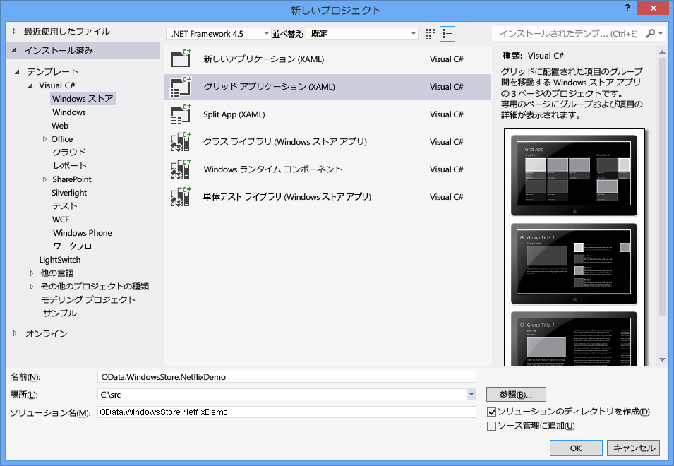
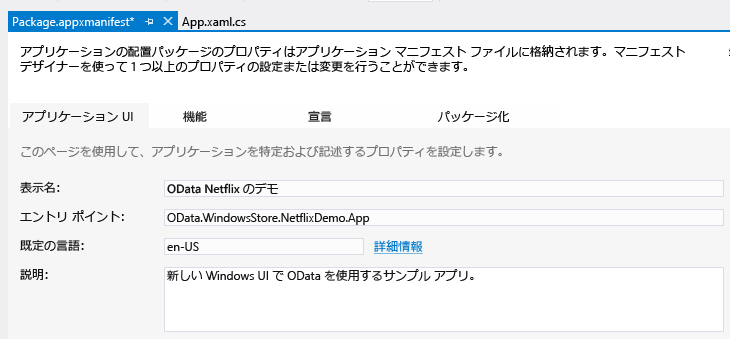
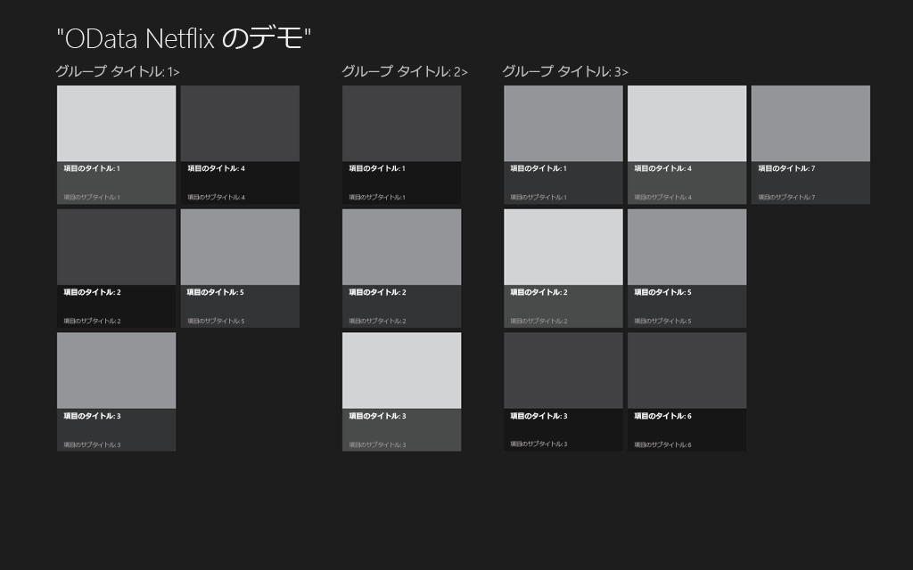
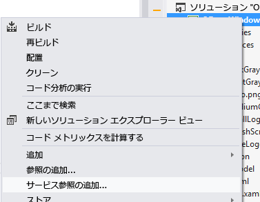
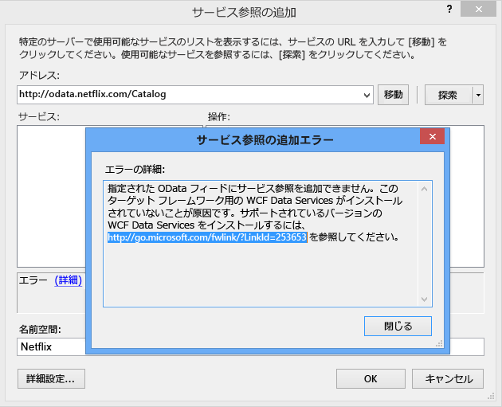
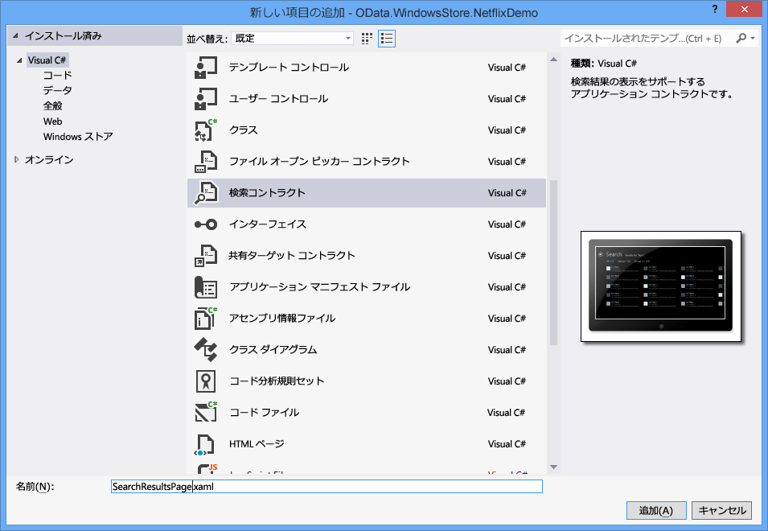

# <a name="writing-a-windows-store-app-that-consumes-an-odata-service"></a><span data-ttu-id="24590-102">OData サービスを利用する Windows ストア アプリの開発</span><span class="sxs-lookup"><span data-stu-id="24590-102">Writing a Windows Store App that consumes an OData Service</span></span>
<span data-ttu-id="24590-103">Windows 8 アプリケーションの新しい型が導入されています。 Windows ストア アプリ。</span><span class="sxs-lookup"><span data-stu-id="24590-103">Windows 8 introduces a new type of application: the Windows Store app.</span></span> <span data-ttu-id="24590-104">まったく新しい外観を備え、さまざまなデバイス上で実行される Windows ストア アプリは、Windows ストアで入手できます。</span><span class="sxs-lookup"><span data-stu-id="24590-104">Windows Store apps have a brand new look and feel, run on a variety of devices, and are made available on the Windows Store.</span></span> <span data-ttu-id="24590-105">このトピックでは、特に NetFlix のカタログで公開されている OData サービスを中心に、OData サービスを利用する Windows ストア アプリの開発方法を説明します。</span><span class="sxs-lookup"><span data-stu-id="24590-105">This topic describes how to write a Windows Store app that consumes an OData service, specifically the NetFlix Catalog OData service.</span></span> <span data-ttu-id="24590-106">Windows ストア アプリの詳細については、「 [Windows ストア アプリの概要](http://msdn.microsoft.com/library/windows/apps/br211386.aspx)です。</span><span class="sxs-lookup"><span data-stu-id="24590-106">For more information about Windows Store Apps, please read [Getting Started with Windows Store apps](http://msdn.microsoft.com/library/windows/apps/br211386.aspx).</span></span>  
  
## <a name="prerequisites"></a><span data-ttu-id="24590-107">必須コンポーネント</span><span class="sxs-lookup"><span data-stu-id="24590-107">Prerequisites</span></span>  
  
1.  [<span data-ttu-id="24590-108">Microsoft Windows 8</span><span class="sxs-lookup"><span data-stu-id="24590-108">Microsoft Windows 8</span></span>](http://go.microsoft.com/fwlink/p/?LinkId=266654)  
  
2.  [<span data-ttu-id="24590-109">Microsoft Visual Studio 2012</span><span class="sxs-lookup"><span data-stu-id="24590-109">Microsoft Visual Studio 2012</span></span>](http://go.microsoft.com/fwlink/p/?LinkId=266655)  
  
3.  [<span data-ttu-id="24590-110">WCF Data Services</span><span class="sxs-lookup"><span data-stu-id="24590-110">WCF Data Services</span></span>](http://msdn.microsoft.com/data/bb931106)  
  
#### <a name="creating-the-default-windows-store-grid-application"></a><span data-ttu-id="24590-111">既定の Windows ストア グリッド アプリケーションの作成</span><span class="sxs-lookup"><span data-stu-id="24590-111">Creating the default Windows Store Grid Application</span></span>  
  
1.  <span data-ttu-id="24590-112">C# と XAML を使用して、新しい Windows ストア グリッド アプリケーションを作成します。</span><span class="sxs-lookup"><span data-stu-id="24590-112">Create a new Windows Store Grid Application using C# and XAML.</span></span> <span data-ttu-id="24590-113">アプリケーションに OData.WindowsStore.NetflixDemo という名前を付けます。</span><span class="sxs-lookup"><span data-stu-id="24590-113">Name the application OData.WindowsStore.NetflixDemo:</span></span>  
  
     <span data-ttu-id="24590-114"></span><span class="sxs-lookup"><span data-stu-id="24590-114"></span></span>  
  
2.  <span data-ttu-id="24590-115">Package.appxmanifest を開き、[表示名] テキスト ボックスに表示名を入力します。</span><span class="sxs-lookup"><span data-stu-id="24590-115">Open the Package.appxmanifest and enter a friendly name in the Display name text box.</span></span> <span data-ttu-id="24590-116">これによって、Windows 8 の検索機能で使用されるアプリケーション名が指定されます。</span><span class="sxs-lookup"><span data-stu-id="24590-116">This specifies the application name used with the Windows 8 search functionality.</span></span>  
  
     <span data-ttu-id="24590-117"></span><span class="sxs-lookup"><span data-stu-id="24590-117"></span></span>  
  
3.  <span data-ttu-id="24590-118">フレンドリ名を入力、 \<AppName > App.xaml ファイル内の要素。</span><span class="sxs-lookup"><span data-stu-id="24590-118">Enter a friendly name in the \<AppName> element in the App.xaml file.</span></span> <span data-ttu-id="24590-119">これによってアプリケーションの起動時に表示されるアプリケーション名が設定されます。</span><span class="sxs-lookup"><span data-stu-id="24590-119">This sets the application name that is displayed when the application is launched:</span></span>  
  
     <span data-ttu-id="24590-120"></span><span class="sxs-lookup"><span data-stu-id="24590-120"></span></span>  
  
4.  <span data-ttu-id="24590-121">アプリケーションをビルドして起動します。</span><span class="sxs-lookup"><span data-stu-id="24590-121">Build and launch the application.</span></span> <span data-ttu-id="24590-122">アプリケーションのスプラッシュ スクリーンが最初に表示されます。</span><span class="sxs-lookup"><span data-stu-id="24590-122">You first see the application’s splash screen.</span></span> <span data-ttu-id="24590-123">以下のスクリーンショットは既定のスプラッシュ スクリーンを示しています。</span><span class="sxs-lookup"><span data-stu-id="24590-123">The screenshot below displays the default splash screen.</span></span> <span data-ttu-id="24590-124">使用される画像はプロジェクトの Assets フォルダーに格納されています。</span><span class="sxs-lookup"><span data-stu-id="24590-124">The image used is stored in the project’s Assets folder.</span></span>  
  
     <span data-ttu-id="24590-125"></span><span class="sxs-lookup"><span data-stu-id="24590-125"></span></span>  
  
     <span data-ttu-id="24590-126">次にアプリケーション ウィザードが表示されます。</span><span class="sxs-lookup"><span data-stu-id="24590-126">Then the application will be displayed.</span></span>  
  
     <span data-ttu-id="24590-127"></span><span class="sxs-lookup"><span data-stu-id="24590-127"></span></span>  
  
     <span data-ttu-id="24590-128">既定のアプリケーションは、SampleDataSource.cs: SampleDataGroup と SampleDataItem 内のクラスのセットを定義します。これらはいずれも SampleDataCommon から派生しており、SampleDataCommon 自体は BindableBase から派生しています。</span><span class="sxs-lookup"><span data-stu-id="24590-128">The default application defines a set of classes in SampleDataSource.cs: SampleDataGroup and SampleDataItem, both of which are derived from SampleDataCommon, which itself is derived from BindableBase.</span></span> <span data-ttu-id="24590-129">SampleDataGroup と SampleDataItem は既定の GridView にバインドされています。</span><span class="sxs-lookup"><span data-stu-id="24590-129">SampleDataGroup and SampleDataItem are bound to the default GridView.</span></span> <span data-ttu-id="24590-130">SampleDataSource.cs は NetflixDemo プロジェクトの DataModel フォルダーにあります。</span><span class="sxs-lookup"><span data-stu-id="24590-130">SampleDataSource.cs is located in the DataModel folder within the NetflixDemo project.</span></span> <span data-ttu-id="24590-131">このアプリケーションにはグループ化されたコレクションが表示されます。</span><span class="sxs-lookup"><span data-stu-id="24590-131">The application displays a grouped collection.</span></span> <span data-ttu-id="24590-132">各グループには任意の数の項目が含まれており、これらの項目は SampleDataGroup と SampleDataItem によってぞれぞれ表されます。</span><span class="sxs-lookup"><span data-stu-id="24590-132">Each group contains any number of items, represented by SampleDataGroup and SampleDataItem, respectively.</span></span> <span data-ttu-id="24590-133">前のスクリーンショットには、Group Title 1 というグループと、このグループ内のすべての項目が同時に表示されています。</span><span class="sxs-lookup"><span data-stu-id="24590-133">In the previous screen shot you can see a group called Group Title 1 and all of the items in the group displayed together.</span></span>  
  
     <span data-ttu-id="24590-134">アプリケーションのメイン ページは GroupedItemsPage.xaml です。</span><span class="sxs-lookup"><span data-stu-id="24590-134">The main page of the application is GroupedItemsPage.xaml.</span></span> <span data-ttu-id="24590-135">このファイルに含まれる GridView に、SampleDataSource.cs クラスが作成するサンプル データが表示されます。</span><span class="sxs-lookup"><span data-stu-id="24590-135">It contains a GridView that displays the sample data created by the SampleDataSource.cs class.</span></span> <span data-ttu-id="24590-136">GroupedItemsPage は、rootFrame.Navigate への呼び出しを通して App.xaml.cs によって読み込まれます。</span><span class="sxs-lookup"><span data-stu-id="24590-136">The GroupedItemsPage is loaded by the App.xaml.cs in a call to rootFrame.Navigate:</span></span>  
  
    ```csharp  
    if (!rootFrame.Navigate(typeof(GroupedItemsPage), "AllGroups"))  
    {  
        throw new Exception("Failed to create initial page");  
    }  
    ```  
  
     <span data-ttu-id="24590-137">これによって GroupedItemsPage がインストールされ、LoadState メソッドが呼び出されます。</span><span class="sxs-lookup"><span data-stu-id="24590-137">This causes the GroupedItemsPage to be instantiated and it’s LoadState method is called.</span></span> <span data-ttu-id="24590-138">LoadState によって静的な SampleDataSource インスタンスが作成され、これによって SampleDataGroup オブジェクトのコレクションが作成されます。</span><span class="sxs-lookup"><span data-stu-id="24590-138">LoadState causes the static SampleDataSource instance to be created, which creates a collection of SampleDataGroup objects.</span></span> <span data-ttu-id="24590-139">SampleDataGroup オブジェクトには SampleDataItem オブジェクトのコレクションが含まれます。</span><span class="sxs-lookup"><span data-stu-id="24590-139">Each SampleDataGroup object contains a collection of SampleDataItem objects.</span></span> <span data-ttu-id="24590-140">LoadState は、SampleDataGroup オブジェクトのコレクションを DefaultViewModel に格納します。</span><span class="sxs-lookup"><span data-stu-id="24590-140">LoadState stores the collection of SampleDataGroup objects in the DefaultViewModel:</span></span>  
  
    ```csharp  
    protected override void LoadState(Object navigationParameter, Dictionary<String, Object> pageState)  
    {  
        var sampleDataGroups = SampleDataSource.GetGroups((String)navigationParameter);  
        this.DefaultViewModel["Groups"] = sampleDataGroups;  
    }  
    ```  
  
     <span data-ttu-id="24590-141">次に DefaultViewModel が GridView にバインドされます。</span><span class="sxs-lookup"><span data-stu-id="24590-141">The DefaultViewModel is then bound to the GridView.</span></span> <span data-ttu-id="24590-142">これは、データ バインドの構成時に GroupedItemsPage.xaml ファイル内で参照されます。</span><span class="sxs-lookup"><span data-stu-id="24590-142">This is referenced in the GroupedItemsPage.xaml file when configuring the data binding.</span></span>  
  
    ```xaml
    <CollectionViewSource  
                x:Name="groupedItemsViewSource"  
                Source="{Binding Groups}"  
                IsSourceGrouped="true"  
                ItemsPath="TopItems"  
                d:Source="{Binding AllGroups, Source={d:DesignInstance Type=data:SampleDataSource, IsDesignTimeCreatable=True}}"/>  
    ```  
  
     <span data-ttu-id="24590-143">CollectionViewSource は、グループ化されたコレクションの処理時にプロキシとして使用されます。</span><span class="sxs-lookup"><span data-stu-id="24590-143">The CollectionViewSource is used as a proxy for handling grouped collections.</span></span> <span data-ttu-id="24590-144">バインドが発生すると、SampleDataGroup オブジェクトのコレクションを反復処理することによって GridView を設定します。</span><span class="sxs-lookup"><span data-stu-id="24590-144">When binding occurs, it iterates through the collection of SampleDataGroup objects to populate the GridView.</span></span>  <span data-ttu-id="24590-145">ItemsPath 属性は、格納されている SampleDataItems の検索に使用する SampleDataGroup のプロパティを CollectionViewSource に指定します。</span><span class="sxs-lookup"><span data-stu-id="24590-145">The ItemsPath attribute tells the CollectionViewSource what property on each SampleDataGroup object to use to find the SampleDataItems it contains.</span></span> <span data-ttu-id="24590-146">この場合、各 SampleDataGroup オブジェクトには SampleDataItem オブジェクトの TopItems コレクションが含まれます。</span><span class="sxs-lookup"><span data-stu-id="24590-146">In this case each SampleDataGroup object contains a TopItems collection of SampleDataItem objects.</span></span>  
  
     <span data-ttu-id="24590-147">Netflix の場合、ムービーはジャンルでグループ化されます。</span><span class="sxs-lookup"><span data-stu-id="24590-147">For the Netflix application, movies are grouped by genre.</span></span> <span data-ttu-id="24590-148">このため、アプリケーションはジャンルの数とジャンル内のムービーの一覧を表示します。</span><span class="sxs-lookup"><span data-stu-id="24590-148">So the application displays a number of genres and a list of movies within that genre.</span></span>  
  
#### <a name="add-a-service-reference-to-the-netflix-odata-service"></a><span data-ttu-id="24590-149">Netflix OData サービスへのサービス参照の追加</span><span class="sxs-lookup"><span data-stu-id="24590-149">Add a Service Reference to the Netflix OData Service</span></span>  
  
1.  <span data-ttu-id="24590-150">Netflix OData サービスへの呼び出しを実行する前に、サービス参照を追加する必要があります。</span><span class="sxs-lookup"><span data-stu-id="24590-150">Before we can make any calls to the Netflix OData service we need to add a service reference.</span></span> <span data-ttu-id="24590-151">ソリューション エクスプローラーでプロジェクトを右クリックし、[サービス参照の追加] をクリックします。</span><span class="sxs-lookup"><span data-stu-id="24590-151">Right-click the project in the Solution Explorer and select Add Service Reference…</span></span>  
  
     <span data-ttu-id="24590-152"></span><span class="sxs-lookup"><span data-stu-id="24590-152"></span></span>  
  
2.  <span data-ttu-id="24590-153">Netflix OData サービスの URL をアドレス バーに入力し、[移動] をクリックします。</span><span class="sxs-lookup"><span data-stu-id="24590-153">Enter the URL for the Netflix OData service in the Address bar and click Go.</span></span> <span data-ttu-id="24590-154">Netflix へのサービス参照の名前空間を設定し、[OK] をクリックします。</span><span class="sxs-lookup"><span data-stu-id="24590-154">Set the Namespace of the service reference to Netflix and click OK.</span></span>  
  
     <span data-ttu-id="24590-155"></span><span class="sxs-lookup"><span data-stu-id="24590-155"></span></span>  
  
    > [!NOTE]
    >  <span data-ttu-id="24590-156">まだインストールしていない場合[WCF データ サービス ツール for Windows Store Apps](http://go.microsoft.com/fwlink/p/?LinkId=266652)、上記のようなメッセージで求められます。</span><span class="sxs-lookup"><span data-stu-id="24590-156">If you have not yet installed [WCF Data Services Tools for Windows Store Apps](http://go.microsoft.com/fwlink/p/?LinkId=266652), you will be prompted with a message such as the one above.</span></span> <span data-ttu-id="24590-157">続行するには、リンクで参照されているツールをダウンロードしてインストールする必要があります。</span><span class="sxs-lookup"><span data-stu-id="24590-157">You will need to download and install the tools referenced in the link to continue.</span></span>  
  
 <span data-ttu-id="24590-158">サービス参照を追加すると、厳密に型指定されたクラスが生成されます。WCF Data Services はこのクラスを使用して Netflix OData サービスが返す OData を解析します。</span><span class="sxs-lookup"><span data-stu-id="24590-158">Adding a service reference generates strongly typed classes that WCF Data Services will use to parse the OData returned by the Netflix OData service.</span></span> <span data-ttu-id="24590-159">SampleDataSource.cs で定義されるクラスは GridView にバインドできます。このため、生成される OData クライアント クラスのデータを、SampleDataSource.cs で定義されるバインド可能なクラスに転送する必要があります。</span><span class="sxs-lookup"><span data-stu-id="24590-159">The classes defined in SampleDataSource.cs can be bound to the GridView so we need to transfer the data from the generated OData client classes into the bindable classes defined in SampleDataSource.cs.</span></span>  <span data-ttu-id="24590-160">これを実行するには、SampleDataSource.cs で定義されるデータ モデルにいくつかの変更を加える必要があります。</span><span class="sxs-lookup"><span data-stu-id="24590-160">In order to do this, we need to make some changes to the data model defined in SampleDataSource.cs.</span></span>  
  
#### <a name="update-the-data-model-for-the-application"></a><span data-ttu-id="24590-161">アプリケーションで使用するデータ モデルの更新</span><span class="sxs-lookup"><span data-stu-id="24590-161">Update the data model for the application</span></span>  
  
1.  <span data-ttu-id="24590-162">コードを sampledatasource.cs ファイル内の既存のコードを置き換える[この gist](https://gist.github.com/3419288)です。</span><span class="sxs-lookup"><span data-stu-id="24590-162">Replace the existing code in SampleDataSource.cs with the code from [this gist](https://gist.github.com/3419288).</span></span> <span data-ttu-id="24590-163">更新されたコードにより LoadMovies メソッドが (SampleDataSource クラスに) 追加されます。このメソッドによって Netflix OData にクエリが実行されることで、ジャンルの一覧が設定され、各ジャンルにムービーの一覧が設定されます。</span><span class="sxs-lookup"><span data-stu-id="24590-163">The updated code adds a LoadMovies method (to the SampleDataSource class)  that performs a query against the Netflix OData service and populates a list of genres (allGroups) and within each genre a list of movies.</span></span> <span data-ttu-id="24590-164">SampleDataGroup クラスはジャンルを表すために使用され、SampleDataItem クラスはムービーを表すために使用されます。</span><span class="sxs-lookup"><span data-stu-id="24590-164">The SampleDataGroup class is used to represent a genre and the SampleDataItem class is used to represent a movie.</span></span>  
  
    ```csharp  
    public static async void LoadMovies()  
    {  
        IEnumerable<Title> titles = await ((DataServiceQuery<Title>)Context.Titles  
            .Expand("Genres,AudioFormats,AudioFormats/Language,Awards,Cast")  
            .Where(t => t.Rating == "PG")  
            .OrderByDescending(t => t.ReleaseYear)  
            .Take(300)).ExecuteAsync();  
  
        foreach (Title title in titles)  
        {  
            foreach (Genre netflixGenre in title.Genres)  
            {  
                SampleDataGroup genre = GetGroup(netflixGenre.Name);  
                if (genre == null)  
                {  
                    genre = new SampleDataGroup(netflixGenre.Name, netflixGenre.Name, String.Empty, title.BoxArt.LargeUrl, String.Empty);  
                    Instance.AllGroups.Add(genre);  
                }  
                var content = new StringBuilder();  
                // Write additional things to content here if you want them to display in the item detail.  
                genre.Items.Add(new SampleDataItem(title.Id, title.Name, String.Format("{0}rnrn{1} ({2})", title.Synopsis, title.Rating, title.ReleaseYear), title.BoxArt.HighDefinitionUrl ?? title.BoxArt.LargeUrl, "Description", content.ToString()));  
            }  
        }  
    }  
    ```  
  
     <span data-ttu-id="24590-165">[タスク ベースの非同期パターン](http://go.microsoft.com/fwlink/p/?LinkId=266651)(TAP) を使用して、300 (Take) 最近 (OrderByDescending) を非同期で取得 pg 指定 (Where) の映画が Netflix からバックアップします。</span><span class="sxs-lookup"><span data-stu-id="24590-165">The [Task-based Asynchronous Pattern](http://go.microsoft.com/fwlink/p/?LinkId=266651) (TAP) is used to asynchronously get 300 (Take) recent (OrderByDescending) PG-rated (Where) movies back from Netflix.</span></span> <span data-ttu-id="24590-166">コードの残りの部分は、OData フィードで返されるエンティティの SimpleDataItems と SimpleDataGroups で構成されます。</span><span class="sxs-lookup"><span data-stu-id="24590-166">The rest of the code constructs SimpleDataItems and SimpleDataGroups from the entities that were returned in the OData feed.</span></span>  
  
     <span data-ttu-id="24590-167">SampleDataSource クラスは、シンプルな検索手法も実装します。</span><span class="sxs-lookup"><span data-stu-id="24590-167">The SampleDataSource class also implements a simple search method.</span></span> <span data-ttu-id="24590-168">この場合は、読み込まれたムービーのシンプルなインメモリ検索を実行します。</span><span class="sxs-lookup"><span data-stu-id="24590-168">In this case, it does a simple in-memory search of the loaded movies.</span></span>  
  
    ```csharp  
    public static IEnumerable<SampleDataItem> Search(string searchString)  
    {  
            var regex = new Regex(searchString, RegexOptions.CultureInvariant | RegexOptions.IgnoreCase | RegexOptions.IgnorePatternWhitespace);  
            return Instance.AllGroups  
                .SelectMany(g => g.Items)  
                .Where(m => regex.IsMatch(m.Title) || regex.IsMatch(m.Subtitle))  
                    .Distinct(new SampleDataItemComparer());  
    }  
    ```  
  
     <span data-ttu-id="24590-169">SampleDataSource.cs には ExtensionMethods というクラスも定義されています。</span><span class="sxs-lookup"><span data-stu-id="24590-169">Also in SampleDataSource.cs a class called ExtensionMethods is defined.</span></span> <span data-ttu-id="24590-170">これらの拡張メソッドでは、TAP パターンを使用することで、UI のブロックが発生しない SampleDataSource による OData のクエリを可能にしています。</span><span class="sxs-lookup"><span data-stu-id="24590-170">Each of these extension methods uses the TAP pattern to allow the SampleDataSource to execute an OData query without blocking the UI.</span></span> <span data-ttu-id="24590-171">たとえば以下のコードでは、Task.Factory.FromAsync メソッドを使用して TAP を実装しています。</span><span class="sxs-lookup"><span data-stu-id="24590-171">For example, the following code uses the Task.Factory.FromAsync method to implement TAP.</span></span>  
  
    ```csharp  
    public static async Task<IEnumerable<T>> ExecuteAsync<T>(this DataServiceQuery<T> query)  
    {  
        return await Task.Factory.FromAsync<IEnumerable<T>>(query.BeginExecute(null, null), query.EndExecute);  
    }  
    ```  
  
     <span data-ttu-id="24590-172">既定のアプリケーションと同様、アプリケーションのメイン ページは GroupedItemsPage となります。</span><span class="sxs-lookup"><span data-stu-id="24590-172">As in the default application, the main page of the application is GroupedItemsPage.</span></span> <span data-ttu-id="24590-173">ただし今回は、Netflix から取得され、ジャンル別にグループ化されたムービーが表示されます。</span><span class="sxs-lookup"><span data-stu-id="24590-173">This time, however, it displays the movies retrieved from Netflix grouped by genre.</span></span>  <span data-ttu-id="24590-174">GroupedItemsPage がインストールされると、LoadState メソッドが呼び出されます。</span><span class="sxs-lookup"><span data-stu-id="24590-174">When the GroupedItemsPage is instantiated, its LoadState method is called.</span></span> <span data-ttu-id="24590-175">前述のとおり、LoadState によって静的な SampleDataSource インスタンスが作成され、Netflix OData サービスへの呼び出しが実行されます。</span><span class="sxs-lookup"><span data-stu-id="24590-175">LoadState causes the static SampleDataSource instance to be created, making a call to the Netflix OData service as discussed previously.</span></span> <span data-ttu-id="24590-176">LoadState は、ジャンル (SampleDataGroup オブジェクト) のコレクションを DefaultViewModel に格納します。</span><span class="sxs-lookup"><span data-stu-id="24590-176">LoadState stores the collection of genres (SampleDataGroup objects) in the DefaultViewModel:</span></span>  
  
    ```csharp  
    protected override void LoadState(Object navigationParameter, Dictionary<String, Object> pageState)  
    {  
  
        var sampleDataGroups = SampleDataSource.GetGroups((String)navigationParameter);  
        this.DefaultViewModel["Groups"] = sampleDataGroups;  
    }  
    ```  
  
     <span data-ttu-id="24590-177">前述のとおり、次に DefaultViewModel を使用して GridView にデータがバインドされます。</span><span class="sxs-lookup"><span data-stu-id="24590-177">As described previously, the DefaultViewModel is then used to bind the data to the GridView.</span></span>  
  
#### <a name="add-a-search-contract-to-allow-the-application-to-participate-in-windows-search"></a><span data-ttu-id="24590-178">検索コントラクトの追加による、アプリケーションの Windows 検索への参加</span><span class="sxs-lookup"><span data-stu-id="24590-178">Add a search contract to allow the application to participate in Windows search</span></span>  
  
1.  <span data-ttu-id="24590-179">アプリケーションに検索コントラクトを追加します。</span><span class="sxs-lookup"><span data-stu-id="24590-179">Add a search contract to the application.</span></span> <span data-ttu-id="24590-180">これによってアプリケーションと Windows 8 の検索エクスペリエンスを統合できるようになります。</span><span class="sxs-lookup"><span data-stu-id="24590-180">This allows the application to integrate with the Windows 8 search experience.</span></span> <span data-ttu-id="24590-181">検索コントラクトに SearchResultsPage.xaml という名前を付けます。</span><span class="sxs-lookup"><span data-stu-id="24590-181">Name the search contract SearchResultsPage.xaml</span></span>  
  
     <span data-ttu-id="24590-182"></span><span class="sxs-lookup"><span data-stu-id="24590-182"></span></span>  
  
2.  <span data-ttu-id="24590-183">queryText の周囲に埋め込まれた引用符を削除して、SearchResultsPage.xaml.cs の 58 行目を変更します。</span><span class="sxs-lookup"><span data-stu-id="24590-183">Modify line 58 of SearchResultsPage.xaml.cs by removing the embedded quotes around queryText.</span></span>  
  
    ```csharp  
    // Communicate results through the view model  
    this.DefaultViewModel["QueryText"] = queryText;  
    this.DefaultViewModel["Filters"] = filterList;  
    this.DefaultViewModel["ShowFilters"] = filterList.Count > 1;  
    ```  
  
3.  <span data-ttu-id="24590-184">検索結果を取得するには、以下の 2 行のコードを SearchResultsPage.xaml.cs の 81 行目に挿入します。</span><span class="sxs-lookup"><span data-stu-id="24590-184">Insert the following two lines of code at line 81 in SearchResultsPage.xaml.cs to retrieve the search results.</span></span>  
  
    ```csharp  
    // TODO: Respond to the change in active filter by setting this.DefaultViewModel["Results"]  
                    //       to a collection of items with bindable Image, Title, Subtitle, and Description properties  
                    var searchValue = (string)this.DefaultViewModel["QueryText"];  
                    this.DefaultViewModel["Results"] = new List<SampleDataItem>(SampleDataSource.Search(searchValue));  
    ```  
  
 <span data-ttu-id="24590-185">ユーザーが Windows 検索を起動し、検索用語を入力して、検索バーで Netflix デモ アプリのアイコンをタッチすると、SearchResultsPage の LoadState メソッドが実行されます。</span><span class="sxs-lookup"><span data-stu-id="24590-185">When a user invokes Windows search, types in a search term and then touches the Netflix Demo app icon in the search bar, the LoadState method of the SearchResultsPage is executed.</span></span> <span data-ttu-id="24590-186">クエリのテキストは LoadState に送信されるナビゲーション パラメーターに含まれています。</span><span class="sxs-lookup"><span data-stu-id="24590-186">The navigation parameter sent to LoadState contains the query text.</span></span> <span data-ttu-id="24590-187">次に、Filter_SelectionChanged メソッドが呼び出され、このメソッドによって SampleDataSource クラスで Search メソッドが呼び出されます。</span><span class="sxs-lookup"><span data-stu-id="24590-187">Next the Filter_SelectionChanged method is called which then calls the Search method on the SampleDataSource class.</span></span> <span data-ttu-id="24590-188">結果が返され、SearchResultsPage.xaml ページに表示されます。</span><span class="sxs-lookup"><span data-stu-id="24590-188">The results are returned and displayed in the SearchResultsPage.xaml page.</span></span>  
  
```csharp  
/// <summary>  
        /// Invoked when a filter is selected using the ComboBox in snapped view state.  
        /// </summary>  
        /// <param name="sender">The ComboBox instance.</param>  
        /// <param name="e">Event data describing how the selected filter was changed.</param>  
        void Filter_SelectionChanged(object sender, SelectionChangedEventArgs e)  
        {  
            // Determine what filter was selected  
            var selectedFilter = e.AddedItems.FirstOrDefault() as Filter;  
            if (selectedFilter != null)  
            {  
                // Mirror the results into the corresponding Filter object to allow the  
                // RadioButton representation used when not snapped to reflect the change  
                selectedFilter.Active = true;  
  
                // TODO: Respond to the change in active filter by setting this.DefaultViewModel["Results"]  
                //       to a collection of items with bindable Image, Title, Subtitle, and Description properties  
                var searchValue = (string)this.DefaultViewModel["QueryText"];  
                this.DefaultViewModel["Results"] = new List<SampleDataItem>(SampleDataSource.Search(searchValue));  
  
                // Ensure results are found  
                object results;  
                ICollection resultsCollection;  
                if (this.DefaultViewModel.TryGetValue("Results", out results) &&  
                    (resultsCollection = results as ICollection) != null &&  
                    resultsCollection.Count != 0)  
                {  
                    VisualStateManager.GoToState(this, "ResultsFound", true);  
                    return;  
                }  
            }  
  
            // Display informational text when there are no search results.  
            VisualStateManager.GoToState(this, "NoResultsFound", true);  
        }  
```  
  
 <span data-ttu-id="24590-189">アプリケーション参照の場合への検索の統合の詳細については[検索: Windows 8 の検索エクスペリエンスに統合する](http://go.microsoft.com/fwlink/p/?LinkId=266650)です。</span><span class="sxs-lookup"><span data-stu-id="24590-189">For more information on integrating search into an application see, [Search: integrating into the Windows 8 search experience](http://go.microsoft.com/fwlink/p/?LinkId=266650).</span></span>  
  
## <a name="run-the-application"></a><span data-ttu-id="24590-190">アプリケーションの実行</span><span class="sxs-lookup"><span data-stu-id="24590-190">Run the application</span></span>  
 <span data-ttu-id="24590-191">F5 キーを押してアプリケーションを起動します。</span><span class="sxs-lookup"><span data-stu-id="24590-191">Launch the application by pressing F5.</span></span> <span data-ttu-id="24590-192">アプリケーションの起動時には、画像の読み込みに数秒かかります。</span><span class="sxs-lookup"><span data-stu-id="24590-192">Note that it will take a few seconds to load the images upon application launch.</span></span> <span data-ttu-id="24590-193">また、最初の検索では結果がまったく返されない場合があります。</span><span class="sxs-lookup"><span data-stu-id="24590-193">Also, your first search attempt may not return any results.</span></span> <span data-ttu-id="24590-194">実際のアプリケーションでは、これらの問題の両方に対処する必要があります。</span><span class="sxs-lookup"><span data-stu-id="24590-194">In a real-world application, you would want to deal with both of these issues.</span></span>  
  
 <span data-ttu-id="24590-195">アプリケーションは、Netflix OData サービスを呼び出し、生成される OData クライアント クラスでデータを受け取り、バインド可能なデータ クラス (SampleDataSource、SampleDataGroup、および SampleDataItem) にこのデータを転送します。</span><span class="sxs-lookup"><span data-stu-id="24590-195">The application calls the Netflix OData service, receives the data in the generated OData client classes and then transfers that data to bindable data classes (SampleDataSource, SampleDataGroup, and SampleDataItem).</span></span> <span data-ttu-id="24590-196">これらのバインド可能なクラスが使用され、データが GridView にバインドされます。</span><span class="sxs-lookup"><span data-stu-id="24590-196">It uses these bindable classes to bind the data to the GridView.</span></span> <span data-ttu-id="24590-197">XAML のデータ バインドを参照してくださいの動作方法に慣れていない場合[リストまたはグリッド (C #/VB/C + + と XAML を使った Windows ストア アプリ) でアイテムをグループ化方法](http://msdn.microsoft.com/library/windows/apps/xaml/hh780627)です。</span><span class="sxs-lookup"><span data-stu-id="24590-197">If you are unfamiliar with how XAML databinding works see [How to group items in a list or grid (Windows Store apps using C#/VB/C++ and XAML)](http://msdn.microsoft.com/library/windows/apps/xaml/hh780627).</span></span>
