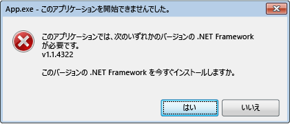
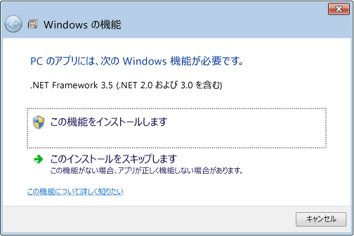

# .NET Framework 初期化エラー: ユーザー エクスペリエンスの管理
共通言語ランタイムの (CLR) のアクティベーション システムでは、マネージ アプリケーション コードの実行に使用する CLR のバージョンを特定します。 アクティベーション システムで、読み込む CLR のバージョンを検出できない場合もあります。 通常、この状況は、特定のコンピューターで無効になっているかインストールされていない CLR バージョンがアプリケーションで必要な場合に発生します。 要求されたバージョンが見つからない場合、CLR アクティベーション システムは、呼び出された関数またはインターフェイスから HRESULT エラー コードを返します。また、アプリケーションを実行しているユーザーにはエラー メッセージが表示されることがあります。 ここでは、HRESULT コードの一覧を示し、エラー メッセージが表示されないようにする方法について説明します。  
  
 CLR には、「[方法: CLR のアクティブ化に関する問題をデバッグする](../../../docs/framework/deployment/how-to-debug-clr-activation-issues.md)」で説明されているように、CLR のアクティベーションに関する問題のデバッグに役立つログ インフラストラクチャが用意されています。 このインフラストラクチャと[アセンブリ バインド ログ](../../../docs/framework/tools/fuslogvw-exe-assembly-binding-log-viewer.md)は完全に異なりますので混同しないでください。  
  
## CLR アクティベーションの HRESULT コード  
 CLR アクティベーションの API は、ホストにアクティベーション操作の結果を報告する HRESULT コードを返します。 CLR ホストでは、追加操作を続行する前に、これらの戻り値を必ず調べる必要があります。  
  
-   CLR_E_SHIM_RUNTIMELOAD  
  
-   CLR_E_SHIM_RUNTIMEEXPORT  
  
-   CLR_E_SHIM_INSTALLROOT  
  
-   CLR_E_SHIM_INSTALLCOMP  
  
-   CLR_E_SHIM_LEGACYRUNTIMEALREADYBOUND  
  
-   CLR_E_SHIM_SHUTDOWNINPROGRESS  
  
## 初期化エラーの UI  
 CLR アクティベーション システムがアプリケーションで必要なランタイムの正しいバージョンを読み込むことができない場合、ユーザーには、コンピューターがアプリケーションを実行するように正しく構成されていないことを示すエラー メッセージが表示され、この状況を解決できるようになります。 この状況では、通常、次のエラー メッセージが表示されます。 ユーザーは **[はい]** を選択すると、アプリケーションに適切な .NET Framework のバージョンをダウンロードできる Microsoft Web サイトに移動します。  
  
   
初期化エラーの一般的なエラー メッセージ  
  
## 初期化エラーの解決  
 開発者には、.NET Framework の初期化エラー メッセージを制御するさまざまなオプションが用意されています。 たとえば、次のセクションで説明されているように、API フラグを使用してメッセージが表示されないようにすることができます。 ただし、要求されたランタイムがアプリケーションで読み込まれなかった問題を解決する必要があります。 そうしないと、アプリケーションがまったく実行されないか、一部の機能を利用できない可能性があります。  
  
 基になる問題を解決し、最適なユーザー エクスペリエンスを提供する (エラー メッセージの数を減らす) には、次のことをお勧めします。  
  
-   .NET Framework 3.5 (以前の) アプリケーションの場合: .NET Framework 4 または 4.5 をサポートするようにアプリケーションを構成します ([手順](../../../docs/framework/migration-guide/how-to-configure-an-app-to-support-net-framework-4-or-4-5.md)を参照)。  
  
-   .NET Framework 4 アプリケーションの場合: アプリケーションのセットアップの一環として .NET Framework 4 再頒布可能パッケージをインストールします。 「[配置ガイド (開発者向け)](../../../docs/framework/deployment/deployment-guide-for-developers.md)」をご覧ください。  
  
## エラー メッセージの制御  
 要求された .NET Framework のバージョンが見つからなかったことを伝えるエラー メッセージを表示することは、ユーザーにとって役立つサービスであると見なされることもあれば、少し不快であると見なされることもあります。 いずれの場合も、アクティベーションの API にフラグを渡すことによってこの UI を制御できます。  
  
 [ICLRMetaHostPolicy::GetRequestedRuntime](../../../docs/framework/unmanaged-api/hosting/iclrmetahostpolicy-getrequestedruntime-method.md) メソッドは、入力として [METAHOST_POLICY_FLAGS](../../../docs/framework/unmanaged-api/hosting/metahost-policy-flags-enumeration.md) 列挙型のメンバーを受け取ります。 METAHOST_POLICY_SHOW_ERROR_DIALOG フラグを含めると、CLR の要求されたバージョンが見つからない場合にエラー メッセージを要求することができます。 既定では、エラー メッセージは表示されません  ([ICLRMetaHost::GetRuntime](../../../docs/framework/unmanaged-api/hosting/iclrmetahost-getruntime-method.md) メソッドは、このフラグを受け取らず、エラー メッセージを表示する他の方法を提供しません)。  
  
 Windows には、プロセス内で実行するコードの結果としてエラー メッセージを表示するかどうかを宣言する際に使用できる [SetErrorMode](http://go.microsoft.com/fwlink/p/?LinkID=255242) 関数が用意されています。 SEM_FAILCRITICALERRORS フラグを指定すると、エラー メッセージが表示されないようにすることができます。  
  
 ただし、一部のシナリオでは、アプリケーション プロセスで設定された SEM_FAILCRITICALERRORS の設定をオーバーライドすることが重要です。 たとえば、CLR をホストし、SEM_FAILCRITICALERRORS が設定されているプロセスでホストされるネイティブの COM コンポーネントがある場合、その特定のアプリケーション プロセス内でエラー メッセージを表示する影響に応じて、フラグをオーバーライドできます。 この場合、次のいずれかのフラグを使用して、SEM_FAILCRITICALERRORS をオーバーライドできます。  
  
-   METAHOST_POLICY_IGNORE_ERROR_MODE は [ICLRMetaHostPolicy::GetRequestedRuntime](../../../docs/framework/unmanaged-api/hosting/iclrmetahostpolicy-getrequestedruntime-method.md) メソッドと共に使用します。  
  
-   RUNTIME_INFO_IGNORE_ERROR_MODE は [GetRequestedRuntimeInfo](../../../docs/framework/unmanaged-api/hosting/getrequestedruntimeinfo-function.md) 関数と共に使用します。  
  
## CLR によって提供されているホストの UI ポリシー  
 CLR にはさまざまなシナリオ向けの一連のホストが含まれています。それらすべてのホストでは、必要なバージョンのランタイムを読み込むときに問題が発生した場合にエラー メッセージを表示します。 次の表に、ホストとそのエラー メッセージ ポリシーの一覧を示します。  
  
|CLR ホスト|説明|エラー メッセージ ポリシー|エラー メッセージを無効にできるか|  
|--------------|-----------------|--------------------------|------------------------------------|  
|マネージ EXE ホスト|マネージ EXE を起動します。|.NET Framework のバージョンが見つからない場合に表示される|いいえ|  
|マネージ COM ホスト|マネージ COM コンポーネントをプロセスに読み込みます。|.NET Framework のバージョンが見つからない場合に表示される|はい (SEM_FAILCRITICALERRORS フラグを設定すると可能)|  
|ClickOnce ホスト|ClickOnce アプリケーションを起動します。|[!INCLUDE[net_v45](../../../includes/net-v45-md.md)] 以降で、.NET Framework のバージョンが見つからない場合に表示される|いいえ|  
|XBAP ホスト|WPF XBAP アプリケーションを起動します。|[!INCLUDE[net_v45](../../../includes/net-v45-md.md)] 以降で、.NET Framework のバージョンが見つからない場合に表示される|いいえ|  
  
## [!INCLUDE[win8](../../../includes/win8-md.md)] の動作と UI  
 CLR アクティベーション システムでは、他のバージョンの Windows オペレーティング システムで提供しているのと同じ動作と UI を [!INCLUDE[win8](../../../includes/win8-md.md)] でも提供しています。ただし、CLR 2.0 を読み込む際に問題が発生する場合は除きます。 [!INCLUDE[win8](../../../includes/win8-md.md)] には、CLR 4.5 を使用する [!INCLUDE[net_v45](../../../includes/net-v45-md.md)] が含まれています。 ただし、[!INCLUDE[win8](../../../includes/win8-md.md)] には CLR 2.0 を使用する .NET Framework 2.0、3.0、3.5 のいずれも含まれていません。 その結果、既定では、CLR 2.0 に依存するアプリケーションが [!INCLUDE[win8](../../../includes/win8-md.md)] で実行されません。 代わりに、ユーザーが .NET Framework 3.5 をインストールできるように、次のダイアログ ボックスが表示されます。 ユーザーは、コントロール パネルで .NET Framework 3.5 を有効にすることもできます。 両方のオプションの説明については、「[Windows 10、Windows 8.1、および Windows 8 への .NET Framework 3.5 のインストール](../../../docs/framework/install/dotnet-35-windows-10.md)」を参照してください。  
  
   
必要に応じた .NET Framework 3.5 のインストール時のプロンプト  
  
> [!NOTE]
>  [!INCLUDE[net_v45](../../../includes/net-v45-md.md)] は、ユーザーのコンピューターの .NET Framework 4 (CLR 4) を置き換えます。 したがって、[!INCLUDE[win8](../../../includes/win8-md.md)] では、.NET Framework 4 アプリケーションはこのダイアログ ボックスを表示せずにシームレスに実行されます。  
  
 .NET Framework 3.5 がインストールされている場合、ユーザーは [!INCLUDE[win8](../../../includes/win8-md.md)] コンピューターで .NET Framework 2.0、3.0、または 3.5 に依存するアプリケーションを実行できます。 また、アプリケーションが .NET Framework 1.0 または 1.1 でのみ実行するように明示的に構成されていなければ、.NET Framework 1.0 および 1.1 のアプリケーションを実行することもできます。 「[.NET Framework 1.1 からの移行](../../../docs/framework/migration-guide/migrating-from-the-net-framework-1-1.md)」をご覧ください。  
  
 [!INCLUDE[net_v45](../../../includes/net-v45-md.md)] 以降では、CLR アクティベーション ログは、初期化エラー メッセージが表示された日時とその理由を記録するログ エントリを含むように強化されています。 詳しくは、「[方法: CLR のアクティブ化に関する問題をデバッグする](../../../docs/framework/deployment/how-to-debug-clr-activation-issues.md)」をご覧ください。  
  
## 関連項目  
 [配置ガイド (開発者向け)](../../../docs/framework/deployment/deployment-guide-for-developers.md)   
 [方法: .NET Framework 4 または 4.5 をサポートするアプリを構成する](../../../docs/framework/migration-guide/how-to-configure-an-app-to-support-net-framework-4-or-4-5.md)   
 [方法: CLR のアクティブ化に関する問題をデバッグする](../../../docs/framework/deployment/how-to-debug-clr-activation-issues.md)   
 [Windows 10、Windows 8.1、および Windows 8 への .NET Framework 3.5 のインストール](../../../docs/framework/install/dotnet-35-windows-10.md)

