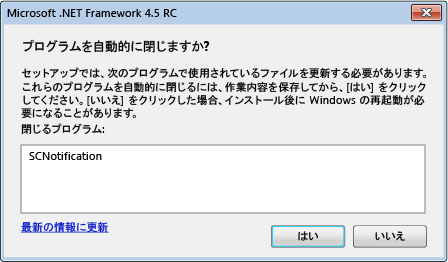

# .NET Framework 4.5 のインストール中のシステム再起動の削減Reducing System Restarts During .NET Framework 4.5 Installations
[!INCLUDE[net_v45](../../../includes/net-v45-md.md)] インストーラーは[再起動マネージャー](http://go.microsoft.com/fwlink/?LinkId=231425)を使用して、インストール中のシステムの再起動をできる限り回避します。The [!INCLUDE[net_v45](../../../includes/net-v45-md.md)] installer uses the [Restart Manager](http://go.microsoft.com/fwlink/?LinkId=231425) to prevent system restarts whenever possible during installation. アプリケーションのセットアップ プログラムで .NET Framework をインストールする場合は、再起動マネージャーとやり取りしてこの機能を利用できます。If your app setup program installs the .NET Framework, it can interface with the Restart Manager to take advantage of this feature. 詳しくは、「[方法: .NET Framework 4.5 インストーラーの進行状況を表示する](../../../docs/framework/deployment/how-to-get-progress-from-the-dotnet-installer.md)」をご覧ください。For more information, see [How to: Get Progress from the .NET Framework 4.5 Installer](../../../docs/framework/deployment/how-to-get-progress-from-the-dotnet-installer.md).  
  
## 再起動の理由Reasons for a Restart  
 [!INCLUDE[net_v45](../../../includes/net-v45-md.md)] のインストールにおいて、.NET Framework 4 アプリケーションがインストール中に使用されている場合は、システムの再起動が必要になります。The [!INCLUDE[net_v45](../../../includes/net-v45-md.md)] installation requires a system restart if a .NET Framework 4 app is in use during the installation. これは、[!INCLUDE[net_v45](../../../includes/net-v45-md.md)] が .NET Framework 4 のファイルを置き換え、インストール中にこれらのファイルが使用可能になっている必要があるためです。This is because the [!INCLUDE[net_v45](../../../includes/net-v45-md.md)] replaces .NET Framework 4 files and requires those files to be available during installation. 多くの場合、再起動は使用中の .NET Framework 4 アプリケーションをプリエンティブに検出し、終了することで回避できます。In many cases, the restart can be prevented by preemptively detecting and closing.NET Framework 4 apps that are in use. ただし、一部のシステム アプリケーションは終了しないでください。However, some system apps should not be closed. このような場合、再起動は回避できません。In these cases, a restart cannot be avoided.  
  
## エンド ユーザー エクスペリエンスEnd-User Experience  
 [!INCLUDE[net_v45](../../../includes/net-v45-md.md)] の完全インストールを行っているエンド ユーザーには、使用中の .NET Framework 4 アプリケーションをインストーラーが検出した場合にシステムの再起動を回避する機会が与えられます。An end-user who is doing a full installation of the [!INCLUDE[net_v45](../../../includes/net-v45-md.md)] is given the opportunity to avoid a system restart if the installer detects .NET Framework 4 apps in use. メッセージには、実行中の .NET Framework 4 アプリケーションがすべて一覧表示され、インストール前にこれらのアプリケーションを終了するオプションが表示されます。A message lists all running .NET Framework 4 apps and provides the option to close these apps before the installation. ユーザーが終了を確認すると、これらのアプリケーションはインストーラーによってシャットダウンされ、システムの再起動が回避されます。If the user confirms, these apps are shut down by the installer, and a system restart is avoided. 一定時間内にユーザーがメッセージに応答しなかった場合、インストールはアプリケーションを終了せずに続行します。If the user does not respond to the message within a certain amount of time, the installation continues without closing any apps.  
  
 実行中のアプリケーションが終了してもシステムの再起動が必要な状況を再起動マネージャーが検出した場合、メッセージは表示されません。If the Restart Manager detects a situation that will require a system restart even if running apps are closed, the message is not displayed.  
  
 ![[アプリケーションの終了] ダイアログ](../../../docs/framework/deployment/media/closeapplicationdialog.png "CloseApplicationDialog")  
使用中の .NET Framework アプリケーションを終了するためのプロンプトPrompt for closing .NET Framework apps that are in use  
  
## チェーンされたインストーラーの使用Using a Chained Installer  
 アプリケーションと共に .NET Framework を再配布し、ただし独自のセットアップ プログラムと UI を使用する場合は、.NET Framework のセットアップ プロセスをセットアップ プロセスにインクルード (チェーン) できます。If you want to redistribute the .NET Framework with your app, but you want to use your own setup program and UI, you can include (chain) the .NET Framework setup process to your setup process. チェーンされたインストールについて詳しくは、「[配置ガイド (開発者向け)](../../../docs/framework/deployment/deployment-guide-for-developers.md)」をご覧ください。For more information about chained installations, see [Deployment Guide for Developers](../../../docs/framework/deployment/deployment-guide-for-developers.md). チェーンされたインストールでのシステムの再起動を減らすために、.NET Framework インストーラーは、終了するアプリケーションの一覧をセットアップ プログラムに提示します。To reduce system restarts in chained installations, the .NET Framework installer supplies your setup program with the list of apps to close. セットアップ プログラムは、メッセージ ボックスなどのユーザー インターフェイスを経由してこの情報をユーザーに提供し、ユーザーの応答を取得して、応答を .NET Framework インストーラーに渡す必要があります。Your setup program must provide this information to the user through a user interface such as a message box, get the user’s response, and then pass the response back to the .NET Framework installer. チェーンされたインストーラーの例については、「[方法: .NET Framework 4.5 インストーラーの進行状況を表示する](../../../docs/framework/deployment/how-to-get-progress-from-the-dotnet-installer.md)」をご覧ください。For an example of a chained installer, see the article [How to: Get Progress from the .NET Framework 4.5 Installer](../../../docs/framework/deployment/how-to-get-progress-from-the-dotnet-installer.md).  
  
 チェーンされたインストーラーを使用しているときに、終了するアプリケーションに対して独自のメッセージ ボックスを非表示にする場合は、.NET Framework セットアップ プロセスをチェーンするときに、コマンド ラインで `/showrmui` と `/passive` のオプションを使用できます。If you're using a chained installer, but you do not want to provide your own message box for closing apps, you can use the `/showrmui` and `/passive` options on the command line when you chain the .NET Framework setup process. これらのオプションを一緒に使用すると、システムの再起動を避けるために終了できるアプリケーションを閉じるためのメッセージ ボックスがインストーラーによって表示されます。When you use these options together, the installer shows the message box for closing apps if they can be closed to avoid a system restart. このメッセージ ボックスは、完全なユーザー インターフェイスの下でも、パッシブ モードでも同じように動作します。This message box behaves the same in passive mode as it does under the full user interface. .NET Framework 再頒布可能パッケージのコマンドライン オプションの完全なセットについては、「[配置ガイド (開発者向け)](../../../docs/framework/deployment/deployment-guide-for-developers.md)」をご覧ください。See [Deployment Guide for Developers](../../../docs/framework/deployment/deployment-guide-for-developers.md) for the complete set of command-line options for the .NET Framework redistributable.  
  
## 参照See Also  
 [配置Deployment](../../../docs/framework/deployment/index.md)  
 [配置ガイド (開発者向け)Deployment Guide for Developers](../../../docs/framework/deployment/deployment-guide-for-developers.md)  
 [方法: .NET Framework 4.5 インストーラーの進行状況を表示するHow to: Get Progress from the .NET Framework 4.5 Installer](../../../docs/framework/deployment/how-to-get-progress-from-the-dotnet-installer.md)
