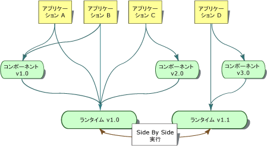
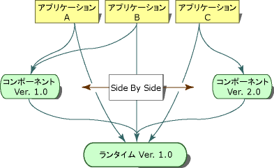

# <a name="side-by-side-execution-in-the-net-framework"></a>.NET Framework での side-by-side 実行
side-by-side 実行は、アプリケーションまたはコンポーネントの複数のバージョンを同じコンピューターで実行する機能です。 共通言語ランタイムの複数のバージョン、および 1 つの共通言語ランタイムを使用するアプリケーションとコンポーネントの複数のバージョンを同じコンピューターで同時に実行できます。  
  
 共通言語ランタイムの 2 つの異なるバージョンを同じコンピューターで使用する複数のアプリケーションを次の図に示します。 アプリケーション A、B、および C はランタイム バージョン 1.0 を使用し、アプリケーション D はランタイム バージョン 1.1 を使用します。  
  
   
ランタイムの 2 つのバージョンの side-by-side 実行  
  
 .NET Framework は、共通言語ランタイムと API 型を含むアセンブリのコレクションで構成されています。 ランタイムと .NET Framework アセンブリは、個別にバージョン管理されます。 たとえば、ランタイムのバージョン 4.0 は実際にはバージョン 4.0.319 で、.NET Framework アセンブリのバージョン 1.0 はバージョン 1.0.3300.0 です。  
  
 コンポーネントの 2 つの異なるバージョンを同じコンピューターで使用する複数のアプリケーションを次の図に示します。 アプリケーション A とアプリケーション B はコンポーネントのバージョン 1.0 を使用し、アプリケーション C は同じコンポーネントのバージョン 2.0 を使用します。  
  
   
コンポーネントの 2 つのバージョンの side-by-side 実行  
  
 side-by-side 実行により、アプリケーションがバインドするコンポーネントのバージョンやアプリケーションが使用するランタイムのバージョンをより詳細に制御できます。  
  
## <a name="benefits-of-side-by-side-execution"></a>side-by-side 実行の利点  
 Windows XP および .NET Framework 以前では、アプリケーションは同じコードの非互換バージョンを識別できないため、DLL の競合が発生することがありました。 DLL に含まれる型情報は、ファイル名だけに関連付けられていました。 アプリケーションは、DLL に含まれている型とアプリケーションの作成に使用された型が同じであるかどうかを判断できませんでした。 この結果、新しいバージョンのコンポーネントが古いバージョンを書き変え、アプリケーションが壊れてしまうことがありました。  
  
 side-by-side 実行と .NET Framework によって、DLL の競合を防ぐ次の機能が得られます。  
  
-   厳密な名前付きアセンブリ  
  
     side-by-side 実行機能は、厳密な名前付きアセンブリを使用して、型情報をアセンブリの特定のバージョンにバインドします。 これによって、アプリケーションまたはコンポーネントが、アセンブリの無効なバージョンをバインドするのを防げます。 また、厳密な名前付きアセンブリによって、1 つのファイルの複数のバージョンが同じコンピューター上に存在することが可能で、アプリケーションはこれらを使用できます。 詳細については、「[厳密な名前付きアセンブリ](../../../docs/framework/app-domains/strong-named-assemblies.md)」を参照してください。  
  
-   バージョンを認識するコード ストレージ  
  
     .NET Framework のグローバル アセンブリ キャッシュには、バージョンを認識するコード ストレージが用意されています。 グローバル アセンブリ キャッシュは、コンピューター全体にわたるコード キャッシュで、.NET Framework がインストールされているすべてのコンピューターに存在します。 グローバル アセンブリ キャッシュは、バージョン、カルチャ、発行者の情報に基づいてアセンブリを格納し、コンポーネントおよびアプリケーションの複数バージョンをサポートします。 詳細については、「[グローバル アセンブリ キャッシュ](../../../docs/framework/app-domains/gac.md)」を参照してください。  
  
-   分離。  
  
     .NET Framework を使用すると、分離して実行できるアプリケーションとコンポーネントを作成できます。 分離は、side-by-side 実行に欠くことのできない構成要素です。 分離には、使用しているリソースを認識し、アプリケーションまたはコンポーネントの複数のバージョンでこれを確実に共有する処理も含まれます。 また、分離には、バージョンに固有の方法でファイルを格納する方法も含まれます。 分離の詳細については、「[Guidelines for Creating Components for Side-by-Side Execution](../../../docs/framework/deployment/guidelines-for-creating-components-for-side-by-side-execution.md)」(side-by-side 実行用のコンポーネントを作成するためのガイドライン) を参照してください。  
  
## <a name="version-compatibility"></a>バージョンの互換性  
 .NET Framework Version 1.0 と 1.1 は互換性を持つようにデザインされています。 .NET Framework Version 1.0 で作成されたアプリケーションはバージョン 1.1 で動作し、.NET Framework Version 1.1 で作成されたアプリケーションはバージョン 1.0 で動作する必要があります。 ただし、.NET Framework Version 1.1 で追加された API 機能は、.NET Framework Version 1.0 では動作しません。 .NET Framework Version 2.0 で作成されたアプリケーションは .NET Framework Version 2.0 でのみ動作します。 .NET Framework Version 2.0 で作成されたアプリケーションは、Version 1.1 以前では動作しません。  
  
 .NET Framework のバージョンは、ランタイムとそれに対応する .NET Framework アセンブリで構成される単一のユニットとして扱われます。この概念をアセンブリの統一と呼んでいます。 他のバージョンの .NET Framework アセンブリを含むようにアセンブリ バインディングをリダイレクトすることもできますが、既定のアセンブリ バインディングのオーバーライドは危険性が伴うため、配置する前に厳密なテストが必要です。  
  
## <a name="locating-runtime-version-information"></a>ランタイム バージョン情報の検索  
 アプリケーションまたはコンポーネントのコンパイルに使用したランタイム バージョンおよびアプリケーションの実行時に必要なランタイム バージョンは、2 つの場所に格納されています。 アプリケーションまたはコンポーネントをコンパイルするとき、コンパイルに使用したランタイム バージョンの情報がマネージ実行可能ファイルに格納されます。 アプリケーションまたはコンポーネントが要求するランタイム バージョンの情報は、アプリケーション構成ファイルに格納されています。  
  
### <a name="runtime-version-information-in-the-managed-executable"></a>マネージ実行可能ファイルのランタイム バージョン情報  
 各マネージ アプリケーションおよびマネージ コンポーネントのポータブル実行可能 (PE) ファイル ヘッダーには、その作成に使用されたランタイム バージョンに関する情報が含まれています。 共通言語ランタイムは、この情報に基づいて、アプリケーションの実行に必要なランタイムの最も適したバージョンを決定します。  
  
### <a name="runtime-version-information-in-the-application-configuration-file"></a>アプリケーション構成ファイルのランタイム バージョン情報  
 PE ファイル ヘッダーの情報に加え、アプリケーションは、ランタイム バージョン情報が含まれるアプリケーション構成ファイルと共に配置できます。 アプリケーション構成ファイルは XML ベースのファイルで、アプリケーションの開発者によって作成され、アプリケーションと共に出荷されます。 このファイルに [\<startup> セクション](../../../docs/framework/configure-apps/file-schema/startup/startup-element.md)の [\<requiredRuntime> 要素](../../../docs/framework/configure-apps/file-schema/startup/requiredruntime-element.md)が存在する場合、この要素にアプリケーションでサポートするランタイムのバージョンとコンポーネントのバージョンを指定します。 また、このファイルを使用して、ランタイムの別のバージョンとアプリケーションの互換性をテストすることができます。  
  
 COM アプリケーションおよび COM+ アプリケーションを含むアンマネージ コードは、ランタイムがマネージ コードとやり取りするときに使用するアプリケーション構成ファイルを持つことができます。 アプリケーション構成ファイルは、COM 経由で起動するどのマネージ コードにも適用されます。 このファイルは、サポートするランタイム バージョンやアセンブリのリダイレクトを指定できます。 既定では、マネージ コードを呼び出す COM 相互運用アプリケーションは、コンピューターにインストールされている最新のバージョンを使用します。  
  
 アプリケーション構成ファイルの詳細については、「[Configuring Apps](../../../docs/framework/configure-apps/index.md)」(アプリケーションの構成) を参照してください。  
  
## <a name="determining-which-version-of-the-runtime-to-load"></a>読み込むランタイム バージョンの決定  
 共通言語ランタイムは、次の情報を使用して、アプリケーションのために読み込むランタイム バージョンを決定します。  
  
-   利用できるランタイム バージョン  
  
-   アプリケーションがサポートするランタイム バージョン  
  
### <a name="supported-runtime-versions"></a>サポートされているランタイム バージョン  
 ランタイムは、アプリケーション構成ファイルとポータブル実行可能 (PE) ファイル ヘッダーを使用して、アプリケーションがサポートするランタイムのバージョンを決定します。 アプリケーション構成ファイルが存在しない場合、ランタイムはアプリケーションの PE ファイル ヘッダーで指定されているランタイム バージョンを読み込みます。ただし、このバージョンが利用できる場合です。  
  
 アプリケーション構成ファイルが存在する場合は、次のプロセスの結果に基づいて、ランタイムは読み込むランタイムの適切なバージョンを決定します。  
  
1.  ランタイムは、アプリケーション構成ファイルの [\<supportedRuntime> 要素](../../../docs/framework/configure-apps/file-schema/startup/supportedruntime-element.md)を調べます。 **\<supportedRuntime>** 要素で指定されたサポートされるランタイム バージョンが 1 つ以上が見つかった場合、ランタイムは最初の **\<supportedRuntime>** 要素で指定されているランタイム バージョンを読み込みます。 このバージョンが利用できない場合、ランタイムは **\<supportedRuntime>** の次の要素を調べ、指定されているランタイム バージョンを読み込むようにしようとします。 このランタイム バージョンが利用できない場合は、**\<supportedRuntime>** の後続の要素を調べます。 サポートされるランタイム バージョンがどれも利用できない場合、ランタイムはランタイム バージョンの読み込みに失敗し、ユーザーに対してメッセージが表示されます (手順 3. 参照)。  
  
2.  ランタイムはアプリケーションの実行可能ファイルの PE ファイル ヘッダーを読み込みます。 PE ファイル ヘッダーで指定されたランタイム バージョンが利用できる場合、ランタイムはこのバージョンを読み込みます。 指定されたランタイム バージョンが利用できない場合は、PE ヘッダーのランタイム バージョンと互換性があると Microsoft によって決められたランタイム バージョンがランタイムによって検索されます。 このバージョンが見つからない場合、プロセスは手順 3. に進みます。  
  
3.  ランタイムは、アプリケーションがサポートしているランタイム バージョンが利用できないことを示すメッセージを表示します。 ランタイムは読み込まれません。  
  
    > [!NOTE]
    >  このメッセージが表示されないようにするには、レジストリ キー HKLM\Software\Microsoft\\.NETFramework の値 NoGuiFromShim を使用するか、環境変数 COMPLUS_NoGuiFromShim を使用します。 たとえば、無人インストールや Windows サービスなど、一般にはユーザーとの対話が不要なアプリケーションの場合、このメッセージを抑制できます。 このメッセージを抑制すると、ランタイムによって、イベント ログにメッセージが書き込まれます。  レジストリ値 NoGuiFromShim を 1 に設定すると、コンピューター上のすべてのアプリケーションで、このメッセージが抑制されます。 別の方法として、COMPLUS_NoGuiFromShim 環境変数を 1 に設定すると、特定のユーザー コンテキストで実行されるアプリケーションについてメッセージを抑制できます。  
  
> [!NOTE]
>  ランタイム バージョンが読み込まれた後、アセンブリ バインディングのリダイレクトによって、.NET Framework アセンブリの異なるバージョンを読み込むように指定されることがあります。 これらのバインディングのリダイレクトは、リダイレクトされた特定のアセンブリだけに影響します。  
  
## <a name="partially-qualified-assembly-names-and-side-by-side-execution"></a>部分修飾アセンブリ名と side-by-side 実行  
 部分限定アセンブリ参照は、side-by-side 実行の潜在的な問題の原因となり得るので、アプリケーション ディレクトリ内のアセンブリへのバインドだけで使用します。 開発するコード内では、部分限定アセンブリ参照は使用しないでください。  
  
 コードの部分修飾アセンブリ参照を軽減するには、アプリケーション構成ファイルで完全にコード内で発生する部分修飾アセンブリ参照を修飾するために [\<qualifyAssembly>](../../../docs/framework/configure-apps/file-schema/runtime/qualifyassembly-element.md) 要素を使用できます。 部分参照に設定されていないフィールドだけを指定するために **\<qualifyAssembly>** 要素を使用します。 **fullName** 属性で指定されているアセンブリ ID には、アセンブリ名を完全に修飾するのに必要なすべての情報 (つまり、アセンブリ名、公開キー、カルチャ、およびバージョン) が含まれている必要があります。  
  
 `myAssembly` というアセンブリを完全に修飾する、アプリケーション構成ファイルのエントリの例を次に示します。  
  
```xml  
<assemblyBinding xmlns="urn:schemas-microsoft-com:asm.v1">   
<qualifyAssembly partialName="myAssembly"   
fullName="myAssembly,  
      version=1.0.0.0,   
publicKeyToken=...,   
      culture=neutral"/>   
</assemblyBinding>   
```  
  
 アセンブリの読み込みステートメントが `myAssembly` を参照するたびに、構成ファイルのこれらの設定により、ランタイムは部分修飾された `myAssembly` 参照を完全限定参照に自動的に変換します。 たとえば、Assembly.Load("myAssembly") は Assembly.Load("myAssembly, version=1.0.0.0, publicKeyToken=..., culture=neutral") に変換されます。  
  
> [!NOTE]
>  **LoadWithPartialName** メソッドを使用すると、グローバル アセンブリ キャッシュから部分参照アセンブリを読み込むのを禁止する共通言語ランタイムの制限をバイパスできます。 このメソッドは、side-by-side 実行で問題になりやすいので、リモート処理のシナリオだけで使用してください。  
  
## <a name="related-topics"></a>関連トピック  
  
|Title|説明|  
|-----------|-----------------|  
|[方法: 自動バインディング リダイレクトを有効/無効にする](../../../docs/framework/configure-apps/how-to-enable-and-disable-automatic-binding-redirection.md)|アプリケーションをアセンブリの特定のバージョンにバインドする方法について説明します。|  
|[アセンブリ バインディングのリダイレクトの構成](../../../docs/framework/deployment/configuring-assembly-binding-redirection.md)|.NET Framework アセンブリの特定のバージョンへのアセンブリ バインドの参照をリダイレクトする方法について説明します。|  
|[インプロセスの side-by-side 実行](../../../docs/framework/deployment/in-process-side-by-side-execution.md)|インプロセスのランタイム ホストの並行アクティブ化を使用して、1 つのプロセスで複数のバージョンの CLR を実行する方法について説明します。|  
|[共通言語ランタイムのアセンブリ](../../../docs/framework/app-domains/assemblies-in-the-common-language-runtime.md)|アセンブリの概念的な概要を説明します。|  
|[アプリケーション ドメイン](../../../docs/framework/app-domains/application-domains.md)|アプリケーション ドメインの概念的な概要を説明します。|  
  
## <a name="reference"></a>参照  
 [\<<supportedRuntime> 要素](../../../docs/framework/configure-apps/file-schema/startup/supportedruntime-element.md)
