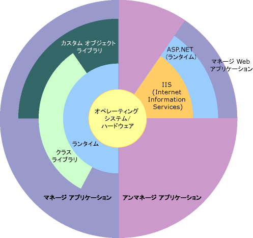

# .NET Framework の概要Overview of the .NET Framework

.NET Framework は、次世代アプリケーションや XML Web サービスのビルドと実行をサポートするテクノロジです。The .NET Framework is a technology that supports building and running the next generation of apps and XML Web services. .NET Framework は、次の目的を実現するためにデザインされています。The .NET Framework is designed to fulfill the following objectives:

- オブジェクト コードがローカルに保存され実行されるか、インターネットに分散されローカルに実行されるか、リモートで実行されるかにかかわらず、一貫したオブジェクト指向プログラミング環境を提供すること。To provide a consistent object-oriented programming environment whether object code is stored and executed locally, executed locally but Internet-distributed, or executed remotely.

- ソフトウェア配置やバージョン管理の競合を最小化するコード実行環境を提供すること。To provide a code-execution environment that minimizes software deployment and versioning conflicts.

- 作成者が不明なコードや、完全には信頼できないサード パーティ製のコードも含めて、コードを安全に実行できるようにするためのコード実行環境を提供すること。To provide a code-execution environment that promotes safe execution of code, including code created by an unknown or semi-trusted third party.

- スクリプトやインタープリターが実行される環境でのパフォーマンスの問題を回避するコード実行環境を提供すること。To provide a code-execution environment that eliminates the performance problems of scripted or interpreted environments.

- Windows ベースのアプリケーションや Windows ベースや Web ベースのアプリケーションなど、多種のアプリケーションの開発において、ユーザーが一貫した方法で作業できること。To make the developer experience consistent across widely varying types of apps, such as Windows-based apps and Web-based apps.

- .NET Framework に基づいたコードを他の任意のコードと統合できるように、すべての通信を業界標準に準拠して構築すること。To build all communication on industry standards to ensure that code based on the .NET Framework integrates with any other code.

> [!NOTE]
> ユーザーと開発者のための .NET Framework の概要については、「[.NET Framework の概要](../../../docs/framework/get-started/index.md)」を参照してください。For a general introduction to the .NET Framework for both users and developers, see [Getting Started](../../../docs/framework/get-started/index.md).

.NET Framework は、共通言語ランタイム (CLR) と .NET Framework クラス ライブラリから構成されます。The .NET Framework consists of the common language runtime (CLR) and the .NET Framework class library. 共通言語ランタイムは、.NET Framework の基礎となるコンポーネントです。The common language runtime is the foundation of the .NET Framework. このランタイムは、実行時のコード管理を行うエージェントのようなものであり、メモリ管理、スレッド管理、リモート処理などの重要なサービスを提供したり、セキュリティや保全性を促進するために厳密なタイプ セーフやその他のコード整合性を強制的に適用したりします。Think of the runtime as an agent that manages code at execution time, providing core services such as memory management, thread management, and remoting, while also enforcing strict type safety and other forms of code accuracy that promote security and robustness. 実際、コード管理の概念はこのランタイムの基本原理です。In fact, the concept of code management is a fundamental principle of the runtime. このランタイムを使用して実行するように作成されたコードはマネージ コードと呼ばれ、そうでないコードはアンマネージ コードと呼ばれます。Code that targets the runtime is known as managed code, while code that doesn't target the runtime is known as unmanaged code. クラス ライブラリは、従来のコマンド ラインやグラフィカル ユーザー インターフェイス (GUI) を使用したアプリケーションから、ASP.NET がもたらした最新の機構に基づく Web フォームや XML Web サービスなどのアプリケーションに至るまでのアプリケーション開発に使用できる、再利用可能な型の包括的なオブジェクト指向コレクションです。The class library is a comprehensive, object-oriented collection of reusable types that you use to develop apps ranging from traditional command-line or graphical user interface (GUI) apps to apps based on the latest innovations provided by ASP.NET, such as Web Forms and XML Web services.

.NET Framework は、アンマネージ コンポーネントでホストすることもできます。アンマネージ コンポーネントは、共通言語ランタイムをプロセスに読み込み、マネージ コードの実行を開始することで、マネージ機能とアンマネージ機能の両方を利用できるソフトウェア環境を構築できます。The .NET Framework can be hosted by unmanaged components that load the common language runtime into their processes and initiate the execution of managed code, thereby creating a software environment that exploits both managed and unmanaged features. .NET Framework には、いくつかのランタイム ホストが用意されているだけでなく、サードパーティ製ランタイム ホストの開発もサポートします。The .NET Framework not only provides several runtime hosts but also supports the development of third-party runtime hosts.

たとえば、ASP.NET は、このランタイムをホストして、マネージ コードのためのスケーラブルなサーバー側環境を提供します。For example, ASP.NET hosts the runtime to provide a scalable, server-side environment for managed code. ASP.NET はこのランタイムを直接利用して、ASP.NET アプリケーションや XML Web サービスを有効にします。Web フォーム アプリケーションと XML Web サービスについては、このトピックで後に説明します。ASP.NET works directly with the runtime to enable ASP.NET apps and XML Web services, both of which are discussed later in this topic.

共通言語ランタイムを MIME 型拡張機能としてホストするアンマネージ アプリケーションの例として、Internet Explorer があります。Internet Explorer is an example of an unmanaged app that hosts the runtime (in the form of a MIME type extension). Internet Explorer を使用してこのランタイムをホストすることにより、マネージ コンポーネントや Windows フォーム コントロールを HTML ドキュメントに埋め込むことができます。Using Internet Explorer to host the runtime enables you to embed managed components or Windows Forms controls in HTML documents. このランタイムをこの方法でホストすると、マネージ モバイル コードを実現できるだけでなく、それと同時に、中程度に信頼されたコードの実行や、分離ファイル ストレージなどのマネージ コードだけが提供できる重要な拡張機能も利用できます。Hosting the runtime in this way makes managed mobile code possible, but with significant improvements that only managed code offers, such as semi-trusted execution and isolated file storage.

共通言語ランタイムおよびクラス ライブラリの、アプリケーションおよびシステム全体に対する関係を次の図に示します。The following illustration shows the relationship of the common language runtime and the class library to your apps and to the overall system. この図には、比較的大規模なアーキテクチャの内部でマネージ コードが動作する方法も示されています。The illustration also shows how managed code operates within a larger architecture.

 コンテキスト内の .NET Framework .NET Framework in context

.NET Framework の主要な機能を以降のセクションでより詳細に説明します。The following sections describe the main features of the .NET Framework in greater detail.

## 共通言語ランタイムの機能Features of the common language runtime

共通言語ランタイムでは、メモリ、スレッドの実行、コードの実行、コードの整合性検査、コンパイル、およびその他のシステム サービスを管理します。The common language runtime manages memory, thread execution, code execution, code safety verification, compilation, and other system services. これらの機能は、共通言語ランタイムで実行されるマネージ コードにあらかじめ用意されています。These features are intrinsic to the managed code that runs on the common language runtime.

セキュリティ関連では、マネージ コンポーネントには、その出所 (インターネット、企業内ネットワーク、ローカル コンピューターなど) を含めた一連の要因に基づいて、さまざまな程度の信頼が与えられます。Regarding security, managed components are awarded varying degrees of trust, depending on a number of factors that include their origin (such as the Internet, enterprise network, or local computer). そのためマネージ コンポーネントは、同じアクティブなアプリケーションで使用されていても、ファイル アクセス操作、レジストリ アクセス操作、またはその他の一般に公開されない機能を、実行できる場合と実行できない場合があります。This means that a managed component might or might not be able to perform file-access operations, registry-access operations, or other sensitive functions, even if it's used in the same active app.

共通言語ランタイムでは、共通型システム (CTS: Common Type System) と呼ばれる厳密な型検査およびコード検査のインフラストラクチャを実装することで、コード保全性を強制的に適用します。The runtime also enforces code robustness by implementing a strict type-and-code-verification infrastructure called the common type system (CTS). CTS は、すべてのマネージ コードが自己言及的であることを保証します。The CTS ensures that all managed code is self-describing. 各種の Microsoft 製およびサードパーティ製言語コンパイラは、CTS に準拠したマネージ コードを生成します。The various Microsoft and third-party language compilers generate managed code that conforms to the CTS. そのためマネージ コードは、厳密な型の忠実性やタイプ セーフを適用しながら、他のマネージ型やマネージ インスタンスを利用できます。This means that managed code can consume other managed types and instances, while strictly enforcing type fidelity and type safety.

さらに、共通言語ランタイムのマネージ環境では、ソフトウェアに共通する多くの問題を除去できます。In addition, the managed environment of the runtime eliminates many common software issues. たとえば、このランタイムは、オブジェクトのレイアウトを自動的に処理し、それらのオブジェクトへの参照を管理し、不要になったオブジェクトを解放します。For example, the runtime automatically handles object layout and manages references to objects, releasing them when they are no longer being used. この自動メモリ管理により、メモリ リークおよび無効なメモリ参照という、最も頻繁に生じる 2 つのアプリケーション エラーが解決されます。This automatic memory management resolves the two most common app errors, memory leaks and invalid memory references.

共通言語ランタイムを使用することにより、開発者の生産性も向上します。The runtime also accelerates developer productivity. たとえば、プログラマは任意に選択した開発言語でアプリケーションを記述しながら、このランタイムの機能を十分に利用し、他の開発者が別の言語で記述したクラス ライブラリやコンポーネントを使用できます。For example, programmers write apps in their development language of choice yet take full advantage of the runtime, the class library, and components written in other languages by other developers. このランタイムをターゲットとして選択したコンパイラの販売元も、これらの利点を享受できます。Any compiler vendor who chooses to target the runtime can do so. .NET Framework をターゲットとする言語コンパイラを使用すると、その言語で記述された既存のコードでも .NET Framework の機能が利用できるようになるため、既存のアプリケーションの移行作業が簡単になります。Language compilers that target the .NET Framework make the features of the .NET Framework available to existing code written in that language, greatly easing the migration process for existing apps.

このランタイムは、これから開発されるソフトウェアのためにデザインされていますが、現在や過去のソフトウェアもサポートします。While the runtime is designed for the software of the future, it also supports software of today and yesterday. マネージ コードとアンマネージ コードには相互運用性があるため、開発者は必要な COM コンポーネントや DLL を使用し続けることができます。Interoperability between managed and unmanaged code enables developers to continue to use necessary COM components and DLLs.

共通言語ランタイムは、パフォーマンスを向上させるようにデザインされています。The runtime is designed to enhance performance. このランタイムには多くの標準ランタイム サービスが用意されていますが、マネージ コードのインタープリター処理が行われることはありません。Although the common language runtime provides many standard runtime services, managed code is never interpreted. ジャスト イン タイム (JIT: Just-In-Time) コンパイルと呼ばれる機能により、すべてのマネージ コードは、それが実行されるシステムのネイティブ機械語で実行できます。A feature called just-in-time (JIT) compiling enables all managed code to run in the native machine language of the system on which it's executing. また、メモリ マネージャーは、メモリの断片化を防止し、メモリ参照ができる限りローカルで行われるようにすることで、パフォーマンスを向上させます。Meanwhile, the memory manager removes the possibilities of fragmented memory and increases memory locality-of-reference to further increase performance.

最後に、共通言語ランタイムは、Microsoft SQL Server や Internet Information Services (IIS) などの高性能なサーバー側アプリケーションでホストできます。Finally, the runtime can be hosted by high-performance, server-side apps, such as Microsoft SQL Server and Internet Information Services (IIS). このインフラストラクチャにより、マネージ コードを使用してビジネス ロジックを記述し、ランタイム ホストをサポートする企業向けサーバーの優れたパフォーマンスを享受できます。This infrastructure enables you to use managed code to write your business logic, while still enjoying the superior performance of the industry's best enterprise servers that support runtime hosting.

## .NET Framework クラス ライブラリ.NET Framework class library

.NET Framework クラス ライブラリは、共通言語ランタイムと緊密に統合された再利用可能な型のコレクションです。The .NET Framework class library is a collection of reusable types that tightly integrate with the common language runtime. このクラス ライブラリはオブジェクト指向で、このライブラリが提供する型を使用することにより、独自に作成したマネージ コード内で機能を継承します。The class library is object oriented, providing types from which your own managed code derives functionality. これは .NET Framework の型を使いやすくするだけでなく、.NET Framework の新機能の学習に必要な時間を減らします。This not only makes the .NET Framework types easy to use but also reduces the time associated with learning new features of the .NET Framework. さらに、.NET Framework のクラスには、サードパーティ製のコンポーネントをシームレスに統合します。In addition, third-party components integrate seamlessly with classes in the .NET Framework.

たとえば、.NET Framework のコレクション クラスは、独自のコレクション クラスの開発に使用する一連のインターフェイスを実装しています。For example, the .NET Framework collection classes implement a set of interfaces for developing your own collection classes. 作成したコレクション クラスは、.NET Framework のクラスとシームレスに統合して使用できます。Your collection classes blend seamlessly with the classes in the .NET Framework.

他のオブジェクト指向クラス ライブラリの場合と同様に、.NET Framework の型を使用することで、文字列の管理、データ コレクション、データベース接続、ファイル アクセスなどを含む、共通性のあるさまざまなプログラミング作業を行うことができます。As you would expect from an object-oriented class library, the .NET Framework types enable you to accomplish a range of common programming tasks, including tasks such as string management, data collection, database connectivity, and file access. これらの共通の作業の他に、クラス ライブラリにはさまざまな特別の開発シナリオをサポートする型も含まれています。In addition to these common tasks, the class library includes types that support a variety of specialized development scenarios. 次のような種類のアプリケーションやサービスを開発する場合に .NET Framework を使用してください。Use the .NET Framework to develop the following types of apps and services:

- コンソール アプリ。Console apps. 「[コンソール アプリケーションの構築](../../../docs/standard/building-console-apps.md)」を参照してください。See [Building Console Applications](../../../docs/standard/building-console-apps.md).

- Windows GUI アプリケーション (Windows フォーム)。Windows GUI apps (Windows Forms). 「[Windows フォーム](../../../docs/framework/winforms/index.md)」を参照してください。See [Windows Forms](../../../docs/framework/winforms/index.md).

- Windows Presentation Foundation (WPF) アプリケーション。Windows Presentation Foundation (WPF) apps. 「[Windows Presentation Foundation](../../../docs/framework/wpf/index.md)」を参照してください。See [Windows Presentation Foundation](../../../docs/framework/wpf/index.md).

- ASP.NET アプリケーション。ASP.NET apps. 「[ASP.NET を使用した Web アプリケーション](../../../docs/framework/develop-web-apps-with-aspnet.md)」を参照してください。See [Web Applications with ASP.NET](../../../docs/framework/develop-web-apps-with-aspnet.md).

- Windows サービスWindows services. 「[Windows サービス アプリケーションの概要](../../../docs/framework/windows-services/introduction-to-windows-service-applications.md)」を参照してください。See [Introduction to Windows Service Applications](../../../docs/framework/windows-services/introduction-to-windows-service-applications.md).

- Windows Communication Foundation (WCF) を使用するサービス指向アプリケーション。Service-oriented apps using Windows Communication Foundation (WCF). 「[WCF を使用したサービス指向アプリケーション](../../../docs/framework/wcf/index.md)」を参照してください。See [Service-Oriented Applications with WCF](../../../docs/framework/wcf/index.md).

- Windows Workflow Foundation (WF) を使用するワークフロー対応アプリケーション。Workflow-enabled apps using Windows Workflow Foundation (WF). 「[.NET Framework におけるワークフローの作成](http://msdn.microsoft.com/library/cbf3880f-dc7b-466d-b808-1109b1223f4a)」を参照してください。See [Building Workflows in the .NET Framework](http://msdn.microsoft.com/library/cbf3880f-dc7b-466d-b808-1109b1223f4a).

Windows フォーム クラスは、Windows GUI の開発を非常に簡単にする、再利用可能な型の包括的なセットです。The Windows Forms classes are a comprehensive set of reusable types that vastly simplify Windows GUI development. ASP.NET Web フォーム アプリケーションを作成する場合は、Web フォーム クラスを使用します。If you write an ASP.NET Web Form app, you can use the Web Forms classes.

## 関連項目See also

[システム要件](../../../docs/framework/get-started/system-requirements.md) [System Requirements](../../../docs/framework/get-started/system-requirements.md)   
[インストール ガイド](../../../docs/framework/install/index.md) [Installation guide](../../../docs/framework/install/index.md)   
[開発ガイド](../../../docs/framework/development-guide.md) [Development Guide](../../../docs/framework/development-guide.md)   
[ツール](../../../docs/framework/tools/index.md) [Tools](../../../docs/framework/tools/index.md)   
[.NET Framework のサンプル](http://msdn.microsoft.com/library/177055f8-4a1f-43e7-aee6-995c196079b1) [.NET Framework Samples](http://msdn.microsoft.com/library/177055f8-4a1f-43e7-aee6-995c196079b1)   
[.NET Framework クラス ライブラリ.NET Framework Class Library](http://go.microsoft.com/fwlink/?LinkID=227195)
