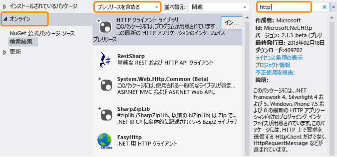

# .NET Framework および特別なリリースThe .NET Framework and Out-of-Band Releases
.NET Framework は、従来のデスクトップ アプリや Web アプリに加えて、Windows Phone や Windows ストア アプリなど、さまざまなプラットフォームに対応し、コードを最大限に再利用できるように発展しています。The .NET Framework is evolving to accommodate different platforms such as Windows Phone and Windows Store apps as well as traditional desktop and web apps, and to maximize code reuse. 通常の .NET Framework のリリースに加えて、クロスプラットフォームでの開発の強化や新機能の導入を目的として、新しい機能をアウトオブバンド (OOB) リリースによって提供しています。In addition to our regular .NET Framework releases, we release new features out of band (OOB) to improve cross-platform development or to introduce new functionality. ここでは、.NET Framework および OOB リリースの将来の方向性について説明します。This topic discusses the future direction of the .NET Framework and its OOB releases.  
  
## OOB リリースの長所Advantages of OOB releases  
 新しいコンポーネントやコンポーネントに対する更新プログラムをアウトオブバンドで提供することにより、Microsoft では .NET Framework の更新プログラムをより頻繁に提供できます。Shipping new components or updates to components out of band enables Microsoft to provide more frequent updates to the .NET Framework. また、カスタマーからのフィードバックにすばやく収集して対応できます。In addition, we can gather and respond to customer feedback more quickly.  
  
 独自のアプリで OOB 機能を使用する場合、OOB アセンブリはアプリのパッケージで配置されるため、ユーザーはアプリを実行するために最新バージョンの .NET Framework をインストールする必要はありません。When you use an OOB feature in your app, your users do not have to install the latest version of the .NET Framework to run your app, because the OOB assemblies deploy with your app package.  
  
## OOB パッケージの配布方法How OOB packages are distributed  
共通言語ランタイム (CLR) のコア コンポーネントの OOB リリースは、.NET 用パッケージ マネージャーである [NuGet](https://www.nuget.org/) を通じて配布されます。OOB releases for core common language runtime (CLR) components are delivered through the [NuGet](https://www.nuget.org/), which is a package manager for .NET. NuGet によって、Visual Studio のソリューション エクスプローラーから簡単に、.NET Framework プロジェクトを参照したり、ライブラリを追加したりすることができます。NuGet enables you to browse and add libraries to your .NET Framework projects easily from the Solution Explorer in Visual Studio. NuGet は、Visual Studio 2012 以降のすべてのエディションに付属しています。NuGet is included with all editions of Visual Studio starting with Visual Studio 2012. NuGet がインストールされているかどうかを確認するには、Visual Studio の **[ツール]** メニューの **[ライブラリ パッケージ マネージャー]** を検索します。To see if NuGet is installed, look for **Library Package Manager** on the Visual Studio **Tools** menu. インストールされていない場合:If it’s not installed:  
  
1.  Visual Studio のメニュー バーで、**[ツール]**、**[拡張機能と更新プログラム]** を選択します (Visual Studio 2010 では、**[拡張機能マネージャー]** を選択します)。On the Visual Studio menu bar, choose **Tools**, **Extensions and Updates** (in Visual Studio 2010, choose **Extension Manager**).  
  
     **[拡張機能と更新プログラム]** ダイアログ ボックスが表示されます。The **Extensions and Updates** dialog box opens.  
  
2.  **[オンライン]**、**[NuGet パッケージ マネージャー]** を選択し、**[ダウンロード]** を選択します。Choose **Online**, **NuGet Package Manager**, and then choose **Download**.  
  
3.  ダウンロードが完了したら、Visual Studio を再起動します。After the download completes, restart Visual Studio.  
  
 詳細なインストール方法については、NuGet Docs Web サイトの「[Installing NuGet](http://docs.nuget.org/docs/start-here/installing-nuget)」(Nuget のインストール) を参照してください。For detailed installation instructions, see [Installing NuGet](http://docs.nuget.org/docs/start-here/installing-nuget) on the NuGet Docs website. NuGet の詳細については、[NuGet のドキュメント](http://docs.nuget.org/)を参照してください。For more information about NuGet, see the [NuGet documentation](http://docs.nuget.org/).  
  
## NuGet OOB パッケージの使用Using a NuGet OOB package  
 NuGet をインストールした後、Visual Studio のソリューション エクスプローラーを使用して NuGet パッケージの表示や、NuGet パッケージへの参照の追加を行うことができます:After you install NuGet, you can browse and add references to NuGet packages by using Solution Explorer in Visual Studio:  
  
1.  Visual Studio でプロジェクトのショートカット メニューを開き、**[NuGet パッケージの管理]** を選択します。Open the shortcut menu for your project in Visual Studio, and then choose **Manage NuGet Packages**. (このオプションは、**[プロジェクト]** メニューからも使用できます。)(This option is also available from the **Project** menu.)  
  
2.  左ペインで、**[オンライン]** を選択します。In the left pane, choose **Online**.  
  
3.  プレリリースのパッケージを使用する場合は、中央のペインのドロップダウン リスト ボックスで **[安定版パッケージのみ]** の代わりに **[リリース前のパッケージを含める]** を選択します。If you want to use prerelease packages, in the drop-down list box in the middle pane, choose **Include Prerelease** instead of **Stable Only**.  
  
4.  右ペインで、**[検索]** ボックスを使用して使用するパッケージを検索します。In the right pane, use the **Search** box to locate the package you would like to use. Microsoft の一部のパッケージは、Microsoft .NET Framework のロゴで識別され、すべて発行者は Microsoft となっています。Some Microsoft packages are identified by the Microsoft .NET Framework logo, and all identify Microsoft as the publisher.  
  
   
  
 OOB パッケージを使用するアプリケーションを配置する場合は、前述のとおり、OOB のアセンブリは、アプリのパッケージに付属しています。As mentioned previously, when you deploy an app that uses an OOB package, the OOB assemblies will ship with your app package.  
  
## OOB のリリースの種類Types of OOB releases  
 通常、OOB パッケージには、1 つ以上のプレリリース バージョンと 1 つの安定したバージョンがあります。Typically, an OOB package has one or more prerelease versions and a stable version. プレリリースに含まれるライセンスでは通常、再配布は許可されませんが、パッケージを試用して、フィードバックを提供することができます。The license that accompanies a prerelease doesn't typically allow redistribution, but enables you to try out a package and provide feedback. フィードバックはパッケージに対する更新プログラムに組み込まれます。Feedback is incorporated in any updates made to the package. 最終リリースは NuGet を使って安定したパッケージとして配布され、アプリと共に NuGet パッケージを再配布できるライセンスが含まれます。A final release is distributed as a stable package with NuGet and includes a license that lets you redistribute the NuGet package with your app. 安定したパッケージは Microsoft によってサポートされています。Stable packages are supported by Microsoft. Microsoft では、IntelliSense のサポートや、ブログの投稿、フォーラムでの回答などの別の種類のドキュメントを、すべてのパッケージについて提供します。Microsoft provides IntelliSense support as well as other types of documentation such as blog posts and forum answers for all packages. また、すべてのパッケージではありませんが、一部のパッケージについてはソース コードも利用できる場合があります。In addition, source code may be available with some, but not all, packages. 新しいパッケージや更新パッケージに関するお知らせについては、「[.NET Framework ブログ](http://blogs.msdn.com/b/dotnet/)」を受信登録できます。For announcements regarding new and updated packages, you can subscribe to [the .NET Framework Blog](http://blogs.msdn.com/b/dotnet/).  
  
 リリース前のパッケージと安定版パッケージの両方を検索するには、NuGet パッケージ マネージャーで **[リリース前のパッケージを含める]** を選択してください。To find both prerelease and stable packages, choose **Include Prerelease** in the NuGet Package Manager.  
  
 安定版パッケージのリリースについて通知を受ける場合は、[the .NET Framework のフィード](https://nuget.org/api/v2/curated-feeds/dotnetframework/Packages/)を受信登録してください。If you want to be notified of stable package releases, subscribe to the [the .NET Framework feed](https://nuget.org/api/v2/curated-feeds/dotnetframework/Packages/).  
  
## 参照See Also  
 [はじめにGetting Started](../../../docs/framework/get-started/index.md)
