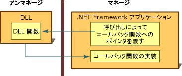

# コールバック関数
コールバック関数は、アンマネージ DLL 関数がタスクを完了できるように支援するマネージ アプリケーション内のコードです。 コールバック関数の呼び出しは、マネージ アプリケーションから、DLL 関数を介して、マネージ実装へと間接的に渡されます。 多数ある DLL 関数の一部はプラットフォーム呼び出しと呼ばれ、正常に実行されるには、マネージ コード内にコールバック関数が必要です。  
  
 ほとんどの DLL 関数は、マネージ コードから呼び出す場合、関数のマネージ定義を作成してから、それを呼び出します。 このプロセスは簡単です。  
  
 コールバック関数を必要とする DLL 関数を使用する場合は、追加の手順がいくつかあります。 まず、関数のドキュメントを参照して、その関数にコールバックが必要かどうかを判断する必要があります。 次に、マネージ アプリケーションにコールバック関数を作成する必要があります。 最後に、DLL 関数を呼び出し、引数としてコールバック関数のポインターを渡します。 次の図は、この手順をまとめたものです。  
  
   
コールバック関数と実装  
  
 コールバック関数は、タスクが繰り返し実行される状況での使用に最適です。 また、一般的な用途として、Win32 API の **EnumFontFamilies**、**EnumPrinters**、**EnumWindows** などの列挙関数があります。 **EnumWindows** 関数は、各ウィンドウでタスクを実行するコールバック関数を呼び出して、コンピューター上のすべての既存のウィンドウを列挙します。 手順と例については、「[How to: Implement Callback Functions](../../../docs/framework/interop/how-to-implement-callback-functions.md)」(方法: コールバック関数を実装する) を参照してください。  
  
## 参照  
 [方法: コールバック関数を実装する](../../../docs/framework/interop/how-to-implement-callback-functions.md)  
 [DLL 関数の呼び出し](../../../docs/framework/interop/calling-a-dll-function.md)
