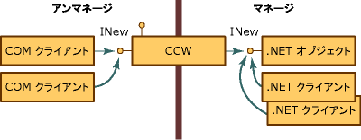
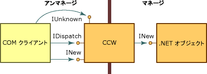

# <a name="com-callable-wrapper"></a><span data-ttu-id="1b6e4-102">COM 呼び出し可能ラッパー</span><span class="sxs-lookup"><span data-stu-id="1b6e4-102">COM Callable Wrapper</span></span>
<span data-ttu-id="1b6e4-103">COM クライアントが .NET オブジェクトを呼び出すと、共通言語ランタイムがマネージ オブジェクトとそのオブジェクトのための COM 呼び出し可能ラッパー (CCW: COM Callable Wrapper) を作成します。</span><span class="sxs-lookup"><span data-stu-id="1b6e4-103">When a COM client calls a .NET object, the common language runtime creates the managed object and a COM callable wrapper (CCW) for the object.</span></span> <span data-ttu-id="1b6e4-104">COM クライアントは .NET オブジェクトを直接参照できないため、CCW をマネージ オブジェクトのプロキシとして使用します。</span><span class="sxs-lookup"><span data-stu-id="1b6e4-104">Unable to reference a .NET object directly, COM clients use the CCW as a proxy for the managed object.</span></span>  
  
 <span data-ttu-id="1b6e4-105">ランタイムは、サービスを要求している COM クライアントの数に関係なく、1 つのマネージ オブジェクトに対して 1 つの CCW を作成します。</span><span class="sxs-lookup"><span data-stu-id="1b6e4-105">The runtime creates exactly one CCW for a managed object, regardless of the number of COM clients requesting its services.</span></span> <span data-ttu-id="1b6e4-106">次の図に示すように、複数の COM クライアントが、INew インターフェイスを公開する CCW への参照を保持できます。</span><span class="sxs-lookup"><span data-stu-id="1b6e4-106">As the following illustration shows, multiple COM clients can hold a reference to the CCW that exposes the INew interface.</span></span> <span data-ttu-id="1b6e4-107">CCW は、INew インターフェイスを実装するマネージ オブジェクトへの 1 つの参照を保持し、ガベージ コレクションされます。</span><span class="sxs-lookup"><span data-stu-id="1b6e4-107">The CCW, in turn, holds a single reference to the managed object that implements the interface and is garbage collected.</span></span> <span data-ttu-id="1b6e4-108">COM クライアントと .NET クライアントは、同一のマネージ オブジェジェクトに対して同時に要求できます。</span><span class="sxs-lookup"><span data-stu-id="1b6e4-108">Both COM and .NET clients can make requests on the same managed object simultaneously.</span></span>  
  
 <span data-ttu-id="1b6e4-109"></span><span class="sxs-lookup"><span data-stu-id="1b6e4-109"></span></span>  
<span data-ttu-id="1b6e4-110">COM 呼び出し可能ラッパー経由の .NET オブジェクト アクセス</span><span class="sxs-lookup"><span data-stu-id="1b6e4-110">Accessing .NET objects through COM callable wrapper</span></span>  
  
 <span data-ttu-id="1b6e4-111">CCW は、.NET Framework. 内で実行されている他のクラスからは見えません。</span><span class="sxs-lookup"><span data-stu-id="1b6e4-111">COM callable wrappers are invisible to other classes running within the .NET Framework.</span></span> <span data-ttu-id="1b6e4-112">CCW の主な目的は、マネージ コードとアンマネージ コードの間の呼び出しをマーシャリングすることですが、CCW は、CCW にラップされているマネージ オブジェクトのオブジェクト ID やオブジェクトの有効期間の管理も行います。</span><span class="sxs-lookup"><span data-stu-id="1b6e4-112">Their primary purpose is to marshal calls between managed and unmanaged code; however, CCWs also manage the object identity and object lifetime of the managed objects they wrap.</span></span>  
  
## <a name="object-identity"></a><span data-ttu-id="1b6e4-113">オブジェクト ID</span><span class="sxs-lookup"><span data-stu-id="1b6e4-113">Object Identity</span></span>  
 <span data-ttu-id="1b6e4-114">ランタイムは、ランタイムのガベージ コレクション ヒープから .NET オブジェクトにメモリを割り当てます。これにより、ランタイムは、メモリ内で必要に応じてオブジェクトを移動させることができます。</span><span class="sxs-lookup"><span data-stu-id="1b6e4-114">The runtime allocates memory for the .NET object from its garbage-collected heap, which enables the runtime to move the object around in memory as necessary.</span></span> <span data-ttu-id="1b6e4-115">一方、CCW に対して、ランタイムは、コレクション ヒープ以外からメモリを割り当てます。これにより、COM クライアントはラッパーを直接参照できます。</span><span class="sxs-lookup"><span data-stu-id="1b6e4-115">In contrast, the runtime allocates memory for the CCW from a noncollected heap, making it possible for COM clients to reference the wrapper directly.</span></span>  
  
## <a name="object-lifetime"></a><span data-ttu-id="1b6e4-116">オブジェクトの有効期間</span><span class="sxs-lookup"><span data-stu-id="1b6e4-116">Object Lifetime</span></span>  
 <span data-ttu-id="1b6e4-117">CCW にラップされている .NET クライアントとは異なり、CCW は、従来の COM 方式で参照カウントを使用します。</span><span class="sxs-lookup"><span data-stu-id="1b6e4-117">Unlike the .NET client it wraps, the CCW is reference-counted in traditional COM fashion.</span></span> <span data-ttu-id="1b6e4-118">CCW の参照カウントが 0 (ゼロ) に達すると、ラッパーはマネージ オブジェクトの参照を解放します。</span><span class="sxs-lookup"><span data-stu-id="1b6e4-118">When the reference count on the CCW reaches zero, the wrapper releases its reference on the managed object.</span></span> <span data-ttu-id="1b6e4-119">参照が残っていないマネージ オブジェクトは、次のガベージ コレクション サイクルで収集されます。</span><span class="sxs-lookup"><span data-stu-id="1b6e4-119">A managed object with no remaining references is collected during the next garbage-collection cycle.</span></span>  
  
## <a name="simulating-com-interfaces"></a><span data-ttu-id="1b6e4-120">COM インターフェイスのシミュレート</span><span class="sxs-lookup"><span data-stu-id="1b6e4-120">Simulating COM interfaces</span></span>  
 <span data-ttu-id="1b6e4-121">[COM 呼び出し可能ラッパー](../../../docs/framework/interop/com-callable-wrapper.md) (CCW) は、パブリックで COM から参照できるすべてのインターフェイス、データ型、および戻り値を、COM によるインターフェイス ベースの対話の適用と整合性のある方法で COM クライアントに公開します。</span><span class="sxs-lookup"><span data-stu-id="1b6e4-121">The [COM callable wrapper](../../../docs/framework/interop/com-callable-wrapper.md) (CCW) exposes all public, COM-visible interfaces, data types, and return values to COM clients in a manner that is consistent with COM's enforcement of interface-based interaction.</span></span> <span data-ttu-id="1b6e4-122">COM クライアントの場合、.NET Framework オブジェクトのメソッドを呼び出すことは COM オブジェクトのメソッドを呼び出すことと同じです。</span><span class="sxs-lookup"><span data-stu-id="1b6e4-122">For a COM client, invoking methods on a .NET Framework object is identical to invoking methods on a COM object.</span></span>  
  
 <span data-ttu-id="1b6e4-123">このシームレスなアプローチを実現するために、CCW は **IUnknown** や **IDispatch** などの従来の COM インターフェイスを製造します。</span><span class="sxs-lookup"><span data-stu-id="1b6e4-123">To create this seamless approach, the CCW manufactures traditional COM interfaces, such as **IUnknown** and **IDispatch**.</span></span> <span data-ttu-id="1b6e4-124">次の図が示すように、CCW は、ラップしている .NET オブジェクトの 1 つの参照を保持します。</span><span class="sxs-lookup"><span data-stu-id="1b6e4-124">As the following illustration shows, the CCW maintains a single reference on the .NET object that it wraps.</span></span> <span data-ttu-id="1b6e4-125">COM クライアントと .NET オブジェクトの両方は、CCW のプロキシとスタブ構築を介して相互に対話します。</span><span class="sxs-lookup"><span data-stu-id="1b6e4-125">Both the COM client and .NET object interact with each other through the proxy and stub construction of the CCW.</span></span>  
  
 <span data-ttu-id="1b6e4-126"></span><span class="sxs-lookup"><span data-stu-id="1b6e4-126"></span></span>  
<span data-ttu-id="1b6e4-127">COM インターフェイスおよび COM 呼び出し可能ラッパー</span><span class="sxs-lookup"><span data-stu-id="1b6e4-127">Com interfaces and the COM callable wrapper</span></span>  
  
 <span data-ttu-id="1b6e4-128">マネージ環境でクラスによって明示的実装されるインターフェイスを公開するだけでなく、.NET Framework は、オブジェクトの代わりに、次の表にリストされている COM インターフェイスの実装を提供します。</span><span class="sxs-lookup"><span data-stu-id="1b6e4-128">In addition to exposing the interfaces that are explicitly implemented by a class in the managed environment, the .NET Framework supplies implementations of the COM interfaces listed in the following table on behalf of the object.</span></span> <span data-ttu-id="1b6e4-129">.NET クラスは、これらのインターフェイスの独自の実装を提供することで、既定の動作をオーバーライドできます。</span><span class="sxs-lookup"><span data-stu-id="1b6e4-129">A .NET class can override the default behavior by providing its own implementation of these interfaces.</span></span> <span data-ttu-id="1b6e4-130">ただし、ランタイムは **IUnknown** と **IDispatch** インターフェイス実装を常に提供します。</span><span class="sxs-lookup"><span data-stu-id="1b6e4-130">However, the runtime always provides the implementation for the **IUnknown** and **IDispatch** interfaces.</span></span>  
  
|<span data-ttu-id="1b6e4-131">Interface</span><span class="sxs-lookup"><span data-stu-id="1b6e4-131">Interface</span></span>|<span data-ttu-id="1b6e4-132">説明</span><span class="sxs-lookup"><span data-stu-id="1b6e4-132">Description</span></span>|  
|---------------|-----------------|  
|<span data-ttu-id="1b6e4-133">**Idispatch**</span><span class="sxs-lookup"><span data-stu-id="1b6e4-133">**Idispatch**</span></span>|<span data-ttu-id="1b6e4-134">型への遅延バインディングのメカニズムを提供します。</span><span class="sxs-lookup"><span data-stu-id="1b6e4-134">Provides a mechanism for late binding to type.</span></span>|  
|<span data-ttu-id="1b6e4-135">**IerrorInfo**</span><span class="sxs-lookup"><span data-stu-id="1b6e4-135">**IerrorInfo**</span></span>|<span data-ttu-id="1b6e4-136">エラー、そのソース、ヘルプ ファイル、ヘルプ コンテキスト、およびエラーを定義したインターフェイスの GUID (.NET クラスでは常に **GUID_NULL**) に関する説明文を示します。</span><span class="sxs-lookup"><span data-stu-id="1b6e4-136">Provides a textual description of the error, its source, a Help file, Help context, and the GUID of the interface that defined the error (always **GUID_NULL** for .NET classes).</span></span>|  
|<span data-ttu-id="1b6e4-137">**IprovideClassInfo**</span><span class="sxs-lookup"><span data-stu-id="1b6e4-137">**IprovideClassInfo**</span></span>|<span data-ttu-id="1b6e4-138">マネージ クラスによって実装される **ITypeInfo** インターフェイスに COM クライアントがアクセスできるようにします。</span><span class="sxs-lookup"><span data-stu-id="1b6e4-138">Enables COM clients to gain access to the **ITypeInfo** interface implemented by a managed class.</span></span>|  
|<span data-ttu-id="1b6e4-139">**IsupportErrorInfo**</span><span class="sxs-lookup"><span data-stu-id="1b6e4-139">**IsupportErrorInfo**</span></span>|<span data-ttu-id="1b6e4-140">マネージ オブジェクトが **IErrorInfo** インターフェイスをサポートするかどうかを COM クライアントが判別できるようにします。</span><span class="sxs-lookup"><span data-stu-id="1b6e4-140">Enables a COM client to determine whether the managed object supports the **IErrorInfo** interface.</span></span> <span data-ttu-id="1b6e4-141">その場合は、クライアントが最新の例外オブジェクトへのポインターを取得できるようにします。</span><span class="sxs-lookup"><span data-stu-id="1b6e4-141">If so, enables the client to obtain a pointer to the latest exception object.</span></span> <span data-ttu-id="1b6e4-142">すべてのマネージ型は、**IErrorInfo** インターフェイスをサポートします。</span><span class="sxs-lookup"><span data-stu-id="1b6e4-142">All managed types support the **IErrorInfo** interface.</span></span>|  
|<span data-ttu-id="1b6e4-143">**ItypeInfo**</span><span class="sxs-lookup"><span data-stu-id="1b6e4-143">**ItypeInfo**</span></span>|<span data-ttu-id="1b6e4-144">Tlbexp.exe によって生成された型情報と完全に等しい、クラスの型情報を提供します。</span><span class="sxs-lookup"><span data-stu-id="1b6e4-144">Provides type information for a class that is exactly the same as the type information produced by Tlbexp.exe.</span></span>|  
|<span data-ttu-id="1b6e4-145">**Iunknown**</span><span class="sxs-lookup"><span data-stu-id="1b6e4-145">**Iunknown**</span></span>|<span data-ttu-id="1b6e4-146">COM クライアントが CCW の有効期間を管理し、強制型変換を提供するための、**IUnknown** インターフェイスの標準的な実装を提供します。</span><span class="sxs-lookup"><span data-stu-id="1b6e4-146">Provides the standard implementation of the **IUnknown** interface with which the COM client manages the lifetime of the CCW and provides type coercion.</span></span>|  
  
 <span data-ttu-id="1b6e4-147">マネージ クラスは、次の表で説明されている COM インターフェイスを提供することもできます。</span><span class="sxs-lookup"><span data-stu-id="1b6e4-147">A managed class can also provide the COM interfaces described in the following table.</span></span>  
  
|<span data-ttu-id="1b6e4-148">インターフェイス</span><span class="sxs-lookup"><span data-stu-id="1b6e4-148">Interface</span></span>|<span data-ttu-id="1b6e4-149">説明</span><span class="sxs-lookup"><span data-stu-id="1b6e4-149">Description</span></span>|  
|---------------|-----------------|  
|<span data-ttu-id="1b6e4-150">(_*classname*) クラス インターフェイス</span><span class="sxs-lookup"><span data-stu-id="1b6e4-150">The (_*classname*) class interface</span></span>|<span data-ttu-id="1b6e4-151">マネージ オブジェクトで明示的に公開されている、すべてのパブリック インターフェイス、メソッド、プロパティ、およびフィールドを公開する、ランタイムによって公開され、明示的に定義されていない、インターフェイス、</span><span class="sxs-lookup"><span data-stu-id="1b6e4-151">Interface, exposed by the runtime and not explicitly defined, that exposes all public interfaces, methods, properties, and fields that are explicitly exposed on a managed object.</span></span>|  
|<span data-ttu-id="1b6e4-152">**IConnectionPoint** と **IconnectionPointContainer**</span><span class="sxs-lookup"><span data-stu-id="1b6e4-152">**IConnectionPoint** and **IconnectionPointContainer**</span></span>|<span data-ttu-id="1b6e4-153">デリゲート ベースのソース イベント (イベント サブスクライバーを登録するためのインターフェイス) を供給するオブジェクトのインターフェイス。</span><span class="sxs-lookup"><span data-stu-id="1b6e4-153">Interface for objects that source delegate-based events (an interface for registering event subscribers).</span></span>|  
|<span data-ttu-id="1b6e4-154">**IdispatchEx**</span><span class="sxs-lookup"><span data-stu-id="1b6e4-154">**IdispatchEx**</span></span>|<span data-ttu-id="1b6e4-155">クラスが **IExpando** を実装する場合、ランタイムによって提供されているインターフェイス。</span><span class="sxs-lookup"><span data-stu-id="1b6e4-155">Interface supplied by the runtime if the class implements **IExpando**.</span></span> <span data-ttu-id="1b6e4-156">**IDispatchEx** インターフェイスは、**IDispatch** インターフェイスの拡張版で、**IDispatch** とは異なり、列挙、追加、削除、および大文字小文字を区別したメンバーの呼び出しが可能になります。</span><span class="sxs-lookup"><span data-stu-id="1b6e4-156">The **IDispatchEx** interface is an extension of the **IDispatch** interface that, unlike **IDispatch**, enables enumeration, addition, deletion, and case-sensitive calling of members.</span></span>|  
|<span data-ttu-id="1b6e4-157">**IEnumVARIANT**</span><span class="sxs-lookup"><span data-stu-id="1b6e4-157">**IEnumVARIANT**</span></span>|<span data-ttu-id="1b6e4-158">クラスが **IEnumerable** を実装する場合、コレクション内のオブジェクトを列挙するコレクション型クラスのインターフェイス。</span><span class="sxs-lookup"><span data-stu-id="1b6e4-158">Interface for collection-type classes, which enumerates the objects in the collection if the class implements **IEnumerable**.</span></span>|  
  
## <a name="introducing-the-class-interface"></a><span data-ttu-id="1b6e4-159">クラス インターフェイスの概要</span><span class="sxs-lookup"><span data-stu-id="1b6e4-159">Introducing the class interface</span></span>  
 <span data-ttu-id="1b6e4-160">マネージ コードで明示的に定義されていないクラス インターフェイスは、.NET オブジェクトで明示的に公開されるすべてのパブリック メソッド、プロパティ、フィールド、およびイベントを公開するインターフェイスです。</span><span class="sxs-lookup"><span data-stu-id="1b6e4-160">The class interface, which is not explicitly defined in managed code, is an interface that exposes all public methods, properties, fields, and events that are explicitly exposed on the .NET object.</span></span> <span data-ttu-id="1b6e4-161">このインターフェイスは、デュアルまたはディスパッチ専用インターフェイスです。</span><span class="sxs-lookup"><span data-stu-id="1b6e4-161">This interface can be a dual or dispatch-only interface.</span></span> <span data-ttu-id="1b6e4-162">クラス インターフェイスは、前にアンダー スコアの付いた、.NET クラス自体の名前を受け取ります。</span><span class="sxs-lookup"><span data-stu-id="1b6e4-162">The class interface receives the name of the .NET class itself, preceded by an underscore.</span></span> <span data-ttu-id="1b6e4-163">たとえば、クラス Mammal の場合、クラス インターフェイスは _Mammal です。</span><span class="sxs-lookup"><span data-stu-id="1b6e4-163">For example, for class Mammal, the class interface is _Mammal.</span></span>  
  
 <span data-ttu-id="1b6e4-164">派生クラスの場合、クラス インターフェイスは、基本クラスのすべてのパブリック メソッド、プロパティ、およびフィールドも公開します。</span><span class="sxs-lookup"><span data-stu-id="1b6e4-164">For derived classes, the class interface also exposes all public methods, properties, and fields of the base class.</span></span> <span data-ttu-id="1b6e4-165">派生クラスは、各基本クラスのクラス インターフェイスも公開します。</span><span class="sxs-lookup"><span data-stu-id="1b6e4-165">The derived class also exposes a class interface for each base class.</span></span> <span data-ttu-id="1b6e4-166">たとえば、クラス Mammal がクラス MammalSuperclass を拡張し、そのクラスがさらに System.Object を拡張する場合、.NET オブジェクトは COM クライアントに _Mammal、_MammalSuperclass、および _Object という名前の 3 つのクラス インターフェイスを公開します。</span><span class="sxs-lookup"><span data-stu-id="1b6e4-166">For example, if class Mammal extends class MammalSuperclass, which itself extends System.Object, the .NET object exposes to COM clients three class interfaces named _Mammal, _MammalSuperclass, and _Object.</span></span>  
  
 <span data-ttu-id="1b6e4-167">たとえば、次の .NET クラスを考えます。</span><span class="sxs-lookup"><span data-stu-id="1b6e4-167">For example, consider the following .NET class:</span></span>  
  
```vb  
' Applies the ClassInterfaceAttribute to set the interface to dual.  
<ClassInterface(ClassInterfaceType.AutoDual)> _  
' Implicitly extends System.Object.  
Public Class Mammal  
    Sub Eat()  
    Sub Breathe()  
    Sub Sleep()  
End Class  
```  
  
```csharp  
// Applies the ClassInterfaceAttribute to set the interface to dual.  
[ClassInterface(ClassInterfaceType.AutoDual)]  
// Implicitly extends System.Object.  
public class Mammal  
{  
    void  Eat();  
    void  Breathe():  
    void  Sleep();  
}  
```  
  
 <span data-ttu-id="1b6e4-168">COM クライアントは、`_Mammal` という名前のクラス インターフェイスへのポインターを取得できます。これについては、[タイプ ライブラリ エクスポーター (Tlbexp.exe)](../../../docs/framework/tools/tlbexp-exe-type-library-exporter.md) ツールで生成されるタイプ ライブラリで説明されています。</span><span class="sxs-lookup"><span data-stu-id="1b6e4-168">The COM client can obtain a pointer to a class interface named `_Mammal`, which is described in the type library that the [Type Library Exporter (Tlbexp.exe)](../../../docs/framework/tools/tlbexp-exe-type-library-exporter.md) tool generates.</span></span> <span data-ttu-id="1b6e4-169">`Mammal` クラスが 1 つ以上のインターフェイスを実装した場合、それらのインターフェイスはコクラスの下に表示されます。</span><span class="sxs-lookup"><span data-stu-id="1b6e4-169">If the `Mammal` class implemented one or more interfaces, the interfaces would appear under the coclass.</span></span>  
  
```  
[odl, uuid(…), hidden, dual, nonextensible, oleautomation]  
interface _Mammal : IDispatch  
{  
    [id(0x00000000), propget] HRESULT ToString([out, retval] BSTR*  
        pRetVal);  
    [id(0x60020001)] HRESULT Equals([in] VARIANT obj, [out, retval]  
        VARIANT_BOOL* pRetVal);  
    [id(0x60020002)] HRESULT GetHashCode([out, retval] short* pRetVal);  
    [id(0x60020003)] HRESULT GetType([out, retval] _Type** pRetVal);  
    [id(0x6002000d)] HRESULT Eat();  
    [id(0x6002000e)] HRESULT Breathe();  
    [id(0x6002000f)] HRESULT Sleep();  
}  
[uuid(…)]  
coclass Mammal   
{  
    [default] interface _Mammal;  
}  
```  
  
 <span data-ttu-id="1b6e4-170">クラス インターフェイスの生成はオプションです。</span><span class="sxs-lookup"><span data-stu-id="1b6e4-170">Generating the class interface is optional.</span></span> <span data-ttu-id="1b6e4-171">既定では、COM 相互運用が、タイプ ライブラリにエクスポートするクラスごとにディスパッチ専用インターフェイスを生成します。</span><span class="sxs-lookup"><span data-stu-id="1b6e4-171">By default, COM interop generates a dispatch-only interface for each class you export to a type library.</span></span> <span data-ttu-id="1b6e4-172"><xref:System.Runtime.InteropServices.ClassInterfaceAttribute> をクラスに適用することによって、このインターフェイスの自動作成を防止または変更することができます。</span><span class="sxs-lookup"><span data-stu-id="1b6e4-172">You can prevent or modify the automatic creation of this interface by applying the <xref:System.Runtime.InteropServices.ClassInterfaceAttribute> to your class.</span></span> <span data-ttu-id="1b6e4-173">クラス インターフェイスにより、マネージ クラスを COM に公開する作業負担を軽減できますが、その使用は制限されています。</span><span class="sxs-lookup"><span data-stu-id="1b6e4-173">Although the class interface can ease the task of exposing managed classes to COM, its uses are limited.</span></span>  
  
> [!CAUTION]
>  <span data-ttu-id="1b6e4-174">独自のものを明示的に定義する代わりにクラス インターフェイスを使用すると、マネージ クラスの将来のバージョン管理が複雑になることがあります。</span><span class="sxs-lookup"><span data-stu-id="1b6e4-174">Using the class interface, instead of explicitly defining your own, can complicate the future versioning of your managed class.</span></span> <span data-ttu-id="1b6e4-175">クラス インターフェイスを使用する前に、次のガイドラインを参照してください。</span><span class="sxs-lookup"><span data-stu-id="1b6e4-175">Please read the following guidelines before using the class interface.</span></span>  
  
### <a name="define-an-explicit-interface-for-com-clients-to-use-rather-than-generating-the-class-interface"></a><span data-ttu-id="1b6e4-176">クラス インターフェイスを生成するのではなく、COM クライアントが使用する明示的なインターフェイスを定義します。</span><span class="sxs-lookup"><span data-stu-id="1b6e4-176">Define an explicit interface for COM clients to use rather than generating the class interface.</span></span>  
 <span data-ttu-id="1b6e4-177">COM 相互運用はクラス インターフェイスを自動的に生成するため、クラスにバージョン後の変更が生じると、共通言語ランタイムによって公開されているクラス インターフェイスのレイアウトが変更されることがあります。</span><span class="sxs-lookup"><span data-stu-id="1b6e4-177">Because COM interop generates a class interface automatically, post-version changes to your class can alter the layout of the class interface exposed by the common language runtime.</span></span> <span data-ttu-id="1b6e4-178">COM クライアントは通常、インターフェイスのレイアウトの変更を処理するように準備されていないため、クラスのメンバー レイアウトを変更した場合に、クライアントが破損します。</span><span class="sxs-lookup"><span data-stu-id="1b6e4-178">Since COM clients are typically unprepared to handle changes in the layout of an interface, they break if you change the member layout of the class.</span></span>  
  
 <span data-ttu-id="1b6e4-179">このガイドラインは、COM クライアントに公開されるインターフェイスは変更不可にしておく必要があるという概念を促進しています。</span><span class="sxs-lookup"><span data-stu-id="1b6e4-179">This guideline reinforces the notion that interfaces exposed to COM clients must remain unchangeable.</span></span> <span data-ttu-id="1b6e4-180">間違えてインターフェイスのレイアウトを並べ替えることで COM クライアントが破損するリスクを抑えるため、インターフェイスを明示的に定義して、クラスに対するすべての変更をインターフェイス レイアウトから分離します。</span><span class="sxs-lookup"><span data-stu-id="1b6e4-180">To reduce the risk of breaking COM clients by inadvertently reordering the interface layout, isolate all changes to the class from the interface layout by explicitly defining interfaces.</span></span>  
  
 <span data-ttu-id="1b6e4-181">**ClassInterfaceAttribute** を使用してクラス インターフェイスの自動生成を中止し、次のコード フラグメントに示すように、クラスの明示的なインターフェイスを実装します。</span><span class="sxs-lookup"><span data-stu-id="1b6e4-181">Use the **ClassInterfaceAttribute** to disengage the automatic generation of the class interface and implement an explicit interface for the class, as the following code fragment shows:</span></span>  
  
```vb  
<ClassInterface(ClassInterfaceType.None)>Public Class LoanApp  
    Implements IExplicit  
    Sub M() Implements IExplicit.M  
…  
End Class  
```  
  
```csharp  
[ClassInterface(ClassInterfaceType.None)]  
public class LoanApp : IExplicit {  
    void M();  
}  
```  
  
 <span data-ttu-id="1b6e4-182">**ClassInterfaceType.None** 値により、クラス メタデータをタイプ ライブラリにエクスポートするときに、クラス インターフェイスが生成されなくなります。</span><span class="sxs-lookup"><span data-stu-id="1b6e4-182">The **ClassInterfaceType.None** value prevents the class interface from being generated when the class metadata is exported to a type library.</span></span> <span data-ttu-id="1b6e4-183">前の例では、COM クライアントは `IExplicit` インターフェイスを通してのみ `LoanApp` クラスにアクセスできます。</span><span class="sxs-lookup"><span data-stu-id="1b6e4-183">In the preceding example, COM clients can access the `LoanApp` class only through the `IExplicit` interface.</span></span>  
  
### <a name="avoid-caching-dispatch-identifiers-dispids"></a><span data-ttu-id="1b6e4-184">ディスパッチ識別子 (DISPID) をキャッシュしないようにします。</span><span class="sxs-lookup"><span data-stu-id="1b6e4-184">Avoid caching dispatch identifiers (DispIds).</span></span>  
 <span data-ttu-id="1b6e4-185">クラス インターフェイスの使用は、インターフェイス メンバーの DISPID をキャッシュしていないスクリプト化されたクライアント、Microsoft Visual Basic 6.0 クライアント、または遅延バインディング クライアントのために許容されるオプションです。</span><span class="sxs-lookup"><span data-stu-id="1b6e4-185">Using the class interface is an acceptable option for scripted clients, Microsoft Visual Basic 6.0 clients, or any late-bound client that does not cache the DispIds of interface members.</span></span> <span data-ttu-id="1b6e4-186">DISPID は遅延バインディングを有効にするインターフェイス メンバーを特定します。</span><span class="sxs-lookup"><span data-stu-id="1b6e4-186">DispIds identify interface members to enable late binding.</span></span>  
  
 <span data-ttu-id="1b6e4-187">クラス インターフェイスでは、インターフェイス内のメンバーの位置に基づいて DISPID が生成されます。</span><span class="sxs-lookup"><span data-stu-id="1b6e4-187">For the class interface, generation of DispIds is based on the position of the member in the interface.</span></span> <span data-ttu-id="1b6e4-188">メンバーの順序を変更してクラスをタイプ ライブラリにエクスポートすると、クラス インターフェイスで生成される DISPID が変更されます。</span><span class="sxs-lookup"><span data-stu-id="1b6e4-188">If you change the order of the member and export the class to a type library, you will alter the DispIds generated in the class interface.</span></span>  
  
 <span data-ttu-id="1b6e4-189">クラス インターフェイスを使用するとき、遅延バインドされた COM クライアントの中断を回避するには、**ClassInterfaceAttribute** に **ClassInterfaceType.AutoDispatch** 値を指定して適用します。</span><span class="sxs-lookup"><span data-stu-id="1b6e4-189">To avoid breaking late-bound COM clients when using the class interface, apply the **ClassInterfaceAttribute** with the **ClassInterfaceType.AutoDispatch** value.</span></span> <span data-ttu-id="1b6e4-190">この値は、ディスパッチ専用のクラスのインターフェイスを実装しますが、タイプ ライブラリからインターフェイスの説明を省略します。</span><span class="sxs-lookup"><span data-stu-id="1b6e4-190">This value implements a dispatch-only class interface, but omits the interface description from the type library.</span></span> <span data-ttu-id="1b6e4-191">インターフェイスの説明がないと、クライアントはコンパイル時に DISPID をキャッシュできません。</span><span class="sxs-lookup"><span data-stu-id="1b6e4-191">Without an interface description, clients are unable to cache DispIds at compile time.</span></span> <span data-ttu-id="1b6e4-192">これはクラス インターフェイスの既定のインターフェイス型ですが、属性値を明示的に適用することもできます。</span><span class="sxs-lookup"><span data-stu-id="1b6e4-192">Although this is the default interface type for the class interface, you can apply the attribute value explicitly.</span></span>  
  
```vb  
<ClassInterface(ClassInterfaceType.AutoDispatch)> Public Class LoanApp  
    Implements IAnother  
    Sub M() Implements IAnother.M  
…  
End Class  
```  
  
```csharp  
[ClassInterface(ClassInterfaceType.AutoDispatch]  
public class LoanApp : IAnother {  
    void M();  
}  
```  
  
 <span data-ttu-id="1b6e4-193">実行時にインターフェイス メンバーの DISPID を取得するために、COM クライアントは **IDispatch.GetIdsOfNames** を呼び出すことができます。</span><span class="sxs-lookup"><span data-stu-id="1b6e4-193">To get the DispId of an interface member at run time, COM clients can call **IDispatch.GetIdsOfNames**.</span></span> <span data-ttu-id="1b6e4-194">インターフェイスでメソッドを呼び出すには、返された DISPID を **IDispatch.Invoke** への引数として渡します。</span><span class="sxs-lookup"><span data-stu-id="1b6e4-194">To invoke a method on the interface, pass the returned DispId as an argument to **IDispatch.Invoke**.</span></span>  
  
### <a name="restrict-using-the-dual-interface-option-for-the-class-interface"></a><span data-ttu-id="1b6e4-195">クラス インターフェイス用のデュアル インターフェイスのオプションの使用を制限します。</span><span class="sxs-lookup"><span data-stu-id="1b6e4-195">Restrict using the dual interface option for the class interface.</span></span>  
 <span data-ttu-id="1b6e4-196">デュアル インターフェイスは、COM クライアントによるインターフェイス メンバーへの事前バインディングと遅延バインディングを有効にします。</span><span class="sxs-lookup"><span data-stu-id="1b6e4-196">Dual interfaces enable early and late binding to interface members by COM clients.</span></span> <span data-ttu-id="1b6e4-197">デザイン時およびテスト中は、クラス インターフェイスをデュアルに設定すると役に立つ場合があります。</span><span class="sxs-lookup"><span data-stu-id="1b6e4-197">At design time and during testing, you might find it useful to set the class interface to dual.</span></span> <span data-ttu-id="1b6e4-198">変更されることのないマネージ クラス (およびその基本クラス) の場合、このオプションも使用できます。</span><span class="sxs-lookup"><span data-stu-id="1b6e4-198">For a managed class (and its base classes) that will never be modified, this option is also acceptable.</span></span> <span data-ttu-id="1b6e4-199">それ以外の場合はすべて、クラス インターフェイスをデュアルに設定しないでください。</span><span class="sxs-lookup"><span data-stu-id="1b6e4-199">In all other cases, avoid setting the class interface to dual.</span></span>  
  
 <span data-ttu-id="1b6e4-200">自動的に生成されたデュアル インターフェイスが適切な場合もまれにありますが、より多くの場合、それはバージョンに関連する複雑さを生じさせます。</span><span class="sxs-lookup"><span data-stu-id="1b6e4-200">An automatically generated dual interface might be appropriate in rare cases; however, more often it creates version-related complexity.</span></span> <span data-ttu-id="1b6e4-201">たとえば、派生クラスのクラス インターフェイスを使用する COM クライアントは、基本クラスが変更されると簡単に中断します。</span><span class="sxs-lookup"><span data-stu-id="1b6e4-201">For example, COM clients using the class interface of a derived class can easily break with changes to the base class.</span></span> <span data-ttu-id="1b6e4-202">サード パーティが基本クラスを提供するとき、クラス インターフェイスのレイアウトを自分で制御することはできません。</span><span class="sxs-lookup"><span data-stu-id="1b6e4-202">When a third party provides the base class, the layout of the class interface is out of your control.</span></span> <span data-ttu-id="1b6e4-203">さらに、ディスパッチ専用インターフェイスとは異なり、デュアル インターフェイス (**ClassInterface.AutoDual**) は、エクスポートされたタイプ ライブラリ内にクラス インターフェイスの説明を提供します。</span><span class="sxs-lookup"><span data-stu-id="1b6e4-203">Further, unlike a dispatch-only interface, a dual interface (**ClassInterface.AutoDual**) provides a description of the class interface in the exported type library.</span></span> <span data-ttu-id="1b6e4-204">そのような説明は、遅延バインディングのクライアントが実行時に DISPID をキャッシュすることを促進します。</span><span class="sxs-lookup"><span data-stu-id="1b6e4-204">Such a description encourages late-bound clients to cache DispIds at run time.</span></span>  
  
## <a name="see-also"></a><span data-ttu-id="1b6e4-205">参照</span><span class="sxs-lookup"><span data-stu-id="1b6e4-205">See Also</span></span>  
 <xref:System.Runtime.InteropServices.ClassInterfaceAttribute>  
 [<span data-ttu-id="1b6e4-206">COM 呼び出し可能ラッパー</span><span class="sxs-lookup"><span data-stu-id="1b6e4-206">COM Callable Wrapper</span></span>](../../../docs/framework/interop/com-callable-wrapper.md)  
 [<span data-ttu-id="1b6e4-207">COM ラッパー</span><span class="sxs-lookup"><span data-stu-id="1b6e4-207">COM Wrappers</span></span>](../../../docs/framework/interop/com-wrappers.md)  
 [<span data-ttu-id="1b6e4-208">COM への .NET Framework コンポーネントの公開</span><span class="sxs-lookup"><span data-stu-id="1b6e4-208">Exposing .NET Framework Components to COM</span></span>](../../../docs/framework/interop/exposing-dotnet-components-to-com.md)  
 [<span data-ttu-id="1b6e4-209">COM インターフェイスのシミュレート</span><span class="sxs-lookup"><span data-stu-id="1b6e4-209">Simulating COM Interfaces</span></span>](http://msdn.microsoft.com/library/ad2ab959-e2be-411b-aaff-275c3fba606c)  
 [<span data-ttu-id="1b6e4-210">要件 (相互運用のための .NET 型の)</span><span class="sxs-lookup"><span data-stu-id="1b6e4-210">Qualifying .NET Types for Interoperation</span></span>](../../../docs/framework/interop/qualifying-net-types-for-interoperation.md)  
 [<span data-ttu-id="1b6e4-211">ランタイム呼び出し可能ラッパー</span><span class="sxs-lookup"><span data-stu-id="1b6e4-211">Runtime Callable Wrapper</span></span>](../../../docs/framework/interop/runtime-callable-wrapper.md)
