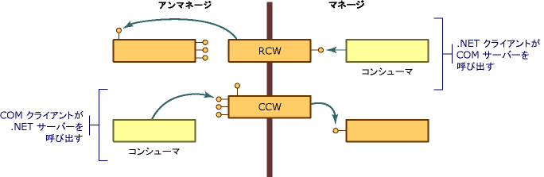

# COM ラッパー
COM は、次のいくつかの重要な点で、.NET Framework オブジェクト モデルとは異なります。  
  
-   COM オブジェクトのクライアントは、COM オブジェクトの有効期間を管理する必要があります。共通言語ランタイムはその環境でのオブジェクトの有効期間を管理します。  
  
-   COM オブジェクトのクライアントは、サービスを提供するインターフェイスを要求し、インターフェイス ポインターを取得して、そのサービスが利用可能かどうかを確認します。 .NET オブジェクトのクライアントは、リフレクションを使用してオブジェクトの機能の説明を取得できます。  
  
-   NET オブジェクトは、.NET Framework の実行環境によって管理されるメモリ内に存在します。 実行環境では、パフォーマンス上の理由からオブジェクトをメモリ内で移動させることができ、移動先のオブジェクトへのすべての参照を更新できます。 オブジェクトへのポインターを取得するアンマネージ クライアントは、そのオブジェクトに依存するので同じ場所にとどまります。 これらのクライアントには、場所が固定されていないオブジェクトを処理するための機構がありません。  
  
 このような相違を克服するために、ランタイムはラッパー クラスを提供して、マネージ クライアントとアンマネージ クライアントの両方がそれぞれの環境内でオブジェクトを呼び出していると認識するようにします。 マネージ クライアントが COM オブジェクトでメソッドを呼び出すたびに、ランタイムは[ランタイム呼び出し可能ラッパー](../../../docs/framework/interop/runtime-callable-wrapper.md) (RCW) を作成します。 RCW は、特にマネージ参照機構とアンマネージ参照機構の相違を抽象化します。 また、ランタイムは [COM 呼び出し可能ラッパー](../../../docs/framework/interop/com-callable-wrapper.md) (CCW) を作成して、プロセスを反転させ、COM クライアントがシームレスに .NET オブジェクトでメソッドを呼び出せるようにします。 呼び出し元のコードと、ランタイムが作成するラッパー クラスの関係を示す図を以下に示します。  
  
   
COM ラッパーの概要  
  
 ほとんどの場合、ランタイムによって生成される標準の RCW または CCW は、COM と .NET Framework の境界をまたがる呼び出しに対して適切なマーシャリングを提供します。 カスタム属性を使用することにより、必要に応じて、ランタイムがマネージ コードおよびアンマネージ コードを表わす方法を調整できます。  
  
## 関連項目  
 [高度な COM 相互運用性](http://msdn.microsoft.com/en-us/3ada36e5-2390-4d70-b490-6ad8de92f2fb)  
 [ランタイム呼び出し可能ラッパー](../../../docs/framework/interop/runtime-callable-wrapper.md)  
 [COM 呼び出し可能ラッパー](../../../docs/framework/interop/com-callable-wrapper.md)  
 [標準ラッパーのカスタマイズ](http://msdn.microsoft.com/en-us/c40d089b-6a3c-41b5-a20d-d760c215e49d)  
 [方法 : ランタイム呼び出し可能ラッパーをカスタマイズする](http://msdn.microsoft.com/en-us/4a4bb3da-4d60-4517-99f2-78d46a681732)
