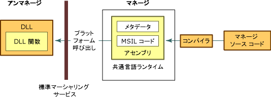

# アンマネージ DLL 関数の処理
プラットフォーム呼び出しは、マネージ コードがダイナミック リンク ライブラリ (DLL) に実装されたアンマネージ関数 (Win32 API に含まれているものなど) を呼び出すことを可能にするサービスです。 これはエクスポートされた関数を見つけて呼び出し、必要に応じて相互運用の境界を越えて、その引数 (整数、文字列、配列、構造体、その他) をマーシャリングします。  
  
 このセクションでは、アンマネージド DLL 関数の使用に関連するタスクを紹介し、プラットフォーム呼び出しについての詳しい情報を提供します。 以下のタスクに加えて、一般的な考慮事項、および追加情報や例を提供するリンクがあります。  
  
#### エクスポートされた DLL 関数を使用するには  
  
1.  [DLL 内の関数を識別します](../../../docs/framework/interop/identifying-functions-in-dlls.md)。  
  
     少なくとも、関数の名前とそれを含んでいる DLL の名前を指定する必要があります。  
  
2.  [DLL 関数を保持するクラスを作成します](../../../docs/framework/interop/creating-a-class-to-hold-dll-functions.md)。  
  
     既存のクラスを使用して、アンマネージ関数ごとに個別のクラスを作成するか、または関連するアンマネージ関数のセットを格納する 1 つのクラスを作成できます。  
  
3.  [マネージ コードでプロトタイプを作成します](../../../docs/framework/interop/creating-prototypes-in-managed-code.md)。  
  
     [Visual Basic] **Declare** ステートメントを **Function** および **Lib** キーワードと共に使用します。 いくつかのまれなケースでは、**DllImportAttribute** を **Shared Function** キーワードと共に使用できます。 それらのケースについては、このセクションで後述します。  
  
     [C#] **DllImportAttribute** を使用して DLL と関数を指定します。 メソッドを **static** および **extern** 修飾子でマークします。  
  
     [C++] **DllImportAttribute** を使用して DLL と関数を指定します。 ラッパー メソッドまたは関数を **extern "C"** でマークします。  
  
4.  [DLL 関数を呼び出します](../../../docs/framework/interop/calling-a-dll-function.md)。  
  
     他のマネージ メソッドと同様の方法で、マネージ クラスのメソッドを呼び出します。 [構造体の受け渡し](../../../docs/framework/interop/passing-structures.md)および[コールバック関数の実装](../../../docs/framework/interop/callback-functions.md)は、特殊なケースです。  
  
 プラットフォーム呼び出しで使用する .NET ベースの宣言を作成する方法を示す例については、「[プラットフォーム呼び出しによるデータのマーシャリング](../../../docs/framework/interop/marshaling-data-with-platform-invoke.md)」を参照してください。  
  
## プラットフォーム呼び出しの詳細  
 プラットフォーム呼び出しは、エクスポート関数を検索して、その引数を実行時にマーシャリングするために、メタデータに依存します。 次に、このプロセスの図を示します。  
  
   
アンマネージ DLL 関数を呼び出すプラットフォーム呼び出し  
  
 プラットフォーム呼び出しがアンマネージ関数を呼び出すと、以下の一連のアクションが実行されます。  
  
1.  関数を含む DLL を検索します。  
  
2.  DLL をメモリに読み込みます。  
  
3.  メモリ内の関数のアドレスを検索し、その引数をスタックにプッシュし、必要に応じてデータをマーシャリングします。  
  
    > [!NOTE]
    >  DLL の検索と読み込み、およびメモリ内の関数のアドレスの検索は、その関数を初めて呼び出したときにのみ生じます。  
  
4.  アンマネージ関数に制御を移します。  
  
 プラットフォーム呼び出しは、アンマネージ関数によって生成された例外を、マネージ呼び出し元にスローします。  
  
## 参照  
 [アンマネージ コードとの相互運用](../../../docs/framework/interop/index.md)  
 [プラットフォーム呼び出しの例](../../../docs/framework/interop/platform-invoke-examples.md)  
 [相互運用マーシャリング](../../../docs/framework/interop/interop-marshaling.md)  
