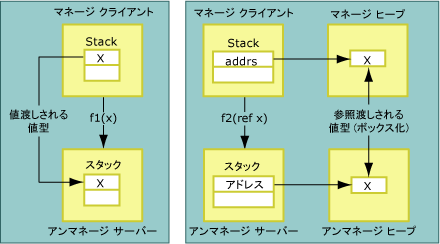
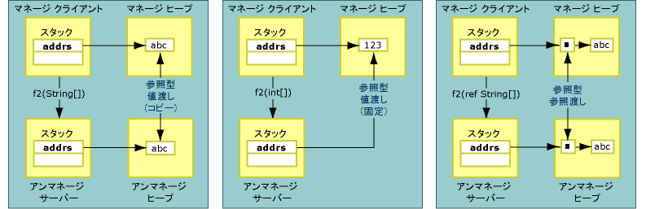

# コピーと固定
データをマーシャリングするときに、相互運用マーシャラーはマーシャリングされるデータをコピーまたは固定できます。 データをコピーすると、あるメモリ位置のデータのコピーが別のメモリ位置に配置されます。 マネージ メモリからアンマネージ メモリへの値型のコピーと、参照渡しされる型のコピーの違いを次の図に示します。  
  
   
値と参照別に渡される値型  
  
 値渡しされるメソッド引数は、スタック上の値としてアンマネージ コードにマーシャリングされます。 コピーのプロセスは直接的です。 参照渡しされる引数は、ポインターとしてスタック上に渡されます。 参照型も値渡しと参照渡しが行われます。 次の図に示されているように、値渡しされる参照型はコピーまたは固定されます。  
  
   
値渡しされる参照型と参照渡しされる参照型  
  
 固定では一時的に現在のメモリ位置でデータをロックします。したがって、共通言語ランタイムのガベージ コレクターによって、そのデータが再配置されることを回避できます。 マーシャラーはデータを固定することでコピーのオーバーヘッドを減らし、パフォーマンスを向上させます。 マーシャリング プロセス中にデータがコピーされるか固定されるかは、そのデータの型によって決まります。  固定は <xref:System.String> などのオブジェクトのマーシャリング中に自動的に実行されますが、<xref:System.Runtime.InteropServices.GCHandle> クラスを使用して手動でメモリを固定することもできます。  
  
## 書式指定された blittable クラス  
 書式指定された [blittable](blittable-and-non-blittable-types.md) クラスは、マネージ メモリとアンマネージ メモリの両方で、固定レイアウト (書式指定されている) と共通のデータ表現を持ちます。 このような型でマーシャリングが必要な場合は、ヒープ内のオブジェクトへのポインターが呼び出し先に直接渡されます。 呼び出し先はポインターによって参照されるメモリ位置の内容を変更できます。  
  
> [!NOTE]
>  パラメーターに Out または In/Out のマークが付いている場合、呼び出し先はメモリの内容を変更できます。逆に、In としてマーシャリングするようにパラメーターが設定されている場合、呼び出し先は内容の変更を避ける必要があります。In は書式指定された blittable 型に対する既定の設定です。 同じクラスをタイプ ライブラリにエクスポートし、アパートメント間呼び出しのために使用した場合に、In オブジェクトを変更すると問題が発生します。  
  
## 書式指定された blittable でないクラス  
 書式指定された [blittable でない](blittable-and-non-blittable-types.md)クラスは、固定レイアウト (書式指定されている) を持ちますが、マネージ メモリとアンマネージ メモリではデータ表現が異なります。 次の状況では、データの変換が必要になる場合があります。  
  
-   blittable でないクラスを値でマーシャリングする場合、呼び出し先はデータ構造体のコピーへのポインターを受け取ります。  
  
-   blittable でないクラスを参照でマーシャリングする場合、呼び出し先はデータ構造体のコピーへのポインターを指すポインターを受け取ります。  
  
-   <xref:System.Runtime.InteropServices.InAttribute> 属性が設定されている場合、このコピーは常にインスタンスの状態に初期化され、必要に応じてマーシャリングされます。  
  
-   <xref:System.Runtime.InteropServices.OutAttribute> 属性が設定されている場合、制御が返されるときに常に状態がインスタンスにコピーされ、必要に応じてマーシャリングされます。  
  
-   **InAttribute** と **OutAttribute** の両方が設定されている場合は、両方のコピーが必要になります。 いずれか一方の属性が省略された場合、マーシャラーは一方のコピーを削除して、処理を最適化できます。  
  
## 参照型  
 参照型は値渡しまたは参照渡しできます。 値渡しする場合は、型へのポインターがスタック上に渡されます。 参照渡しする場合、型へのポインターを指すポインターがスタック上に渡されます。  
  
 参照型は、次のように条件付きで動作します。  
  
-   参照型が値渡しされ、その参照型のメンバーのいずれかが非 blittable 型の場合、その型は次のように 2 回変換されます。  
  
    -   引数をアンマネージ側に渡すとき。  
  
    -   呼び出しから制御が返されるとき。  
  
     不要なコピーと変換を避けるために、これらの型は In パラメーターとしてマーシャリングされます。 呼び出し先による変更内容を呼び出し元が確認する必要がある場合には、引数に対して明示的に **InAttribute** および **OutAttribute** 属性を適用する必要があります。  
  
-   参照型が値渡しされ、その参照型のメンバーがすべて blittable 型の場合は、マーシャリング中にその参照型を固定できます。また、呼び出し先による型のメンバーへの変更内容は呼び出し元で確認されます。 このような動作が必要な場合は、**InAttribute** と **OutAttribute** を明示的に適用してください。 これらの方向属性を使用しない場合は、相互運用マーシャラーが方向情報をタイプ ライブラリにエクスポートしない (既定の In としてエクスポートする) ため、COM のアパートメント間マーシャリングで問題が生じることがあります。  
  
-   参照型を参照渡しする場合は、既定でその型が In/Out としてマーシャリングされます。  
  
## System.String と System.Text.StringBuilder  
 アンマネージ コードにデータを値渡しまたは参照渡しでマーシャリングする場合、一般に、マーシャラーはデータを 2 次バッファーにコピーし (可能な場合には、コピー中に文字セットを変換)、そのバッファーへの参照を呼び出し先に渡します。 この参照が **SysAllocString** によって割り当てられた **BSTR** である場合を除き、参照は常に **CoTaskMemAlloc** で割り当てられます。  
  
 いずれかの文字列型 (Unicode 文字列など) を値渡しでマーシャリングするときの最適化処理として、マーシャラーは新しいバッファーに文字列型をコピーする代わりに、呼び出し先に対して内部 Unicode バッファー内のマネージ文字列への直接ポインターを渡します。  
  
> [!CAUTION]
>  文字列を値渡しする場合には、マーシャラーから渡された参照を呼び出し先で変更しないようにしてください。 変更した場合はマネージ ヒープが破損することがあります。  
  
 <xref:System.String?displayProperty=nameWithType> を参照渡しする場合、マーシャラーは呼び出しを行う前にその文字列の内容を 2 次バッファーにコピーします。 その後、呼び出しから制御が返されるときにバッファーの内容を新しい文字列にコピーします。 この手法により、変更不可のマネージ文字列が変更されないことが保証されます。  
  
 <xref:System.Text.StringBuilder?displayProperty=nameWithType> を値渡しする場合、マーシャラーは **StringBuilder** の内部バッファーへの参照を直接呼び出し元に渡します。 呼び出し元と呼び出し先は、バッファーのサイズに同意する必要があります。 呼び出し元は、適切な長さの **StringBuilder** を作成します。 呼び出し先は、バッファーのオーバーランが発生しないように必要な予防措置をとる必要があります。 **StringBuilder** は、値渡しされる参照型は既定で In パラメーターとして渡される、という規則の例外です。 StringBuilder は常に In/Out として渡されます。  
  
## 参照  
 [既定のマーシャリング動作](default-marshaling-behavior.md)  
 [相互運用マーシャラーによるメモリ管理](https://msdn.microsoft.com/library/417206ce-ee3e-4619-9529-0c0b686c7bee(v=vs.100))  
 [方向属性](https://msdn.microsoft.com/library/241ac5b5-928e-4969-8f58-1dbc048f9ea2(v=vs.100))  
 [相互運用マーシャリング](interop-marshaling.md)
