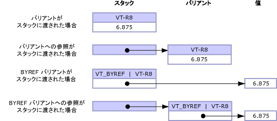

# <a name="default-marshaling-for-objects"></a>オブジェクトに対する既定のマーシャリング
<xref:System.Object?displayProperty=nameWithType> として型指定されているパラメーターおよびフィールドを、次のいずれかの型としてアンマネージ コードに公開できます。  
  
-   オブジェクトがパラメーターの場合にはバリアント。  
  
-   オブジェクトが構造体フィールドの場合にはインターフェイス。  
  
 オブジェクト型のマーシャリングは COM 相互運用機能のみでサポートされます。 既定の動作では、オブジェクトは COM バリアントにマーシャリングされます。 これらの規則は **Object** 型のみに適用され、**Object** クラスから派生した、厳密に型指定されたオブジェクトには適用されません。  
  
 ここでは、オブジェクト型のマーシャリングに関する以下の追加情報を示します。  
  
-   [マーシャリング オプション](#cpcondefaultmarshalingforobjectsanchor7)  
  
-   [インターフェイスへのオブジェクトのマーシャリング](#cpcondefaultmarshalingforobjectsanchor2)  
  
-   [バリアントへのオブジェクトのマーシャリング](#cpcondefaultmarshalingforobjectsanchor3)  
  
-   [オブジェクトへのバリアントのマーシャリング](#cpcondefaultmarshalingforobjectsanchor4)  
  
-   [ByRef バリアントのマーシャリング](#cpcondefaultmarshalingforobjectsanchor6)  
  
<a name="cpcondefaultmarshalingforobjectsanchor7"></a>   
## <a name="marshaling-options"></a>マーシャリング オプション  
 **Object** データ型のマーシャリング オプションを次の表に示します。 <xref:System.Runtime.InteropServices.MarshalAsAttribute> 属性は、オブジェクトをマーシャリングするための <xref:System.Runtime.InteropServices.UnmanagedType> 列挙値をいくつか提供します。  
  
|列挙型|アンマネージ形式の説明|  
|----------------------|-------------------------------------|  
|**UnmanagedType.Struct**<br /><br /> (パラメーターの既定値)|COM スタイルのバリアント。|  
|**UnmanagedType.Interface**|可能な場合は **IDispatch** インターフェイス。それ以外の場合は **IUnknown** インターフェイス。|  
|**UnmanagedType.IUnknown**<br /><br /> (フィールドの既定値)|**IUnknown** インターフェイス。|  
|**UnmanagedType.IDispatch**|**IDispatch** インターフェイス。|  
  
 次の例は、`MarshalObject` のマネージ インターフェイス定義を示しています。  
  
```vb  
Interface MarshalObject  
   Sub SetVariant(o As Object)  
   Sub SetVariantRef(ByRef o As Object)  
   Function GetVariant() As Object  
  
   Sub SetIDispatch( <MarshalAs(UnmanagedType.IDispatch)> o As Object)  
   Sub SetIDispatchRef(ByRef <MarshalAs(UnmanagedType.IDispatch)> o _  
      As Object)  
   Function GetIDispatch() As <MarshalAs(UnmanagedType.IDispatch)> Object  
   Sub SetIUnknown( <MarshalAs(UnmanagedType.IUnknown)> o As Object)  
   Sub SetIUnknownRef(ByRef <MarshalAs(UnmanagedType.IUnknown)> o _  
      As Object)  
   Function GetIUnknown() As <MarshalAs(UnmanagedType.IUnknown)> Object  
End Interface  
```  
  
```csharp  
interface MarshalObject {  
   void SetVariant(Object o);  
   void SetVariantRef(ref Object o);  
   Object GetVariant();  
  
   void SetIDispatch ([MarshalAs(UnmanagedType.IDispatch)]Object o);  
   void SetIDispatchRef([MarshalAs(UnmanagedType.IDispatch)]ref Object o);  
   [MarshalAs(UnmanagedType.IDispatch)] Object GetIDispatch();  
   void SetIUnknown ([MarshalAs(UnmanagedType.IUnknown)]Object o);  
   void SetIUnknownRef([MarshalAs(UnmanagedType.IUnknown)]ref Object o);  
   [MarshalAs(UnmanagedType.IUnknown)] Object GetIUnknown();  
}  
```  
  
 次のコードでは、`MarshalObject` インターフェイスをタイプ ライブラリにエクスポートします。  
  
```  
interface MarshalObject {  
   HRESULT SetVariant([in] VARIANT o);  
   HRESULT SetVariantRef([in,out] VARIANT *o);  
   HRESULT GetVariant([out,retval] VARIANT *o)   
   HRESULT SetIDispatch([in] IDispatch *o);  
   HRESULT SetIDispatchRef([in,out] IDispatch **o);  
   HRESULT GetIDispatch([out,retval] IDispatch **o)   
   HRESULT SetIUnknown([in] IUnknown *o);  
   HRESULT SetIUnknownRef([in,out] IUnknown **o);  
   HRESULT GetIUnknown([out,retval] IUnknown **o)   
}  
```  
  
> [!NOTE]
>  相互運用マーシャラーは、バリアント内に割り当てられたオブジェクトがある場合は、呼び出しの後で自動的にそのオブジェクトを解放します。  
  
 次の例は、フォーマットされた値型を示しています。  
  
```vb  
Public Structure ObjectHolder  
   Dim o1 As Object  
   <MarshalAs(UnmanagedType.IDispatch)> Public o2 As Object  
End Structure  
```  
  
```csharp  
public struct ObjectHolder {  
   Object o1;  
   [MarshalAs(UnmanagedType.IDispatch)]public Object o2;  
}  
```  
  
 次のコードでは、フォーマットされた型をタイプ ライブラリにエクスポートします。  
  
```  
struct ObjectHolder {  
   VARIANT o1;  
   IDispatch *o2;  
}  
```  
  
<a name="cpcondefaultmarshalingforobjectsanchor2"></a>   
## <a name="marshaling-object-to-interface"></a>インターフェイスへのオブジェクトのマーシャリング  
 オブジェクトがインターフェイスとして COM に公開される場合、そのインターフェイスはマネージ型 <xref:System.Object> 用のクラス インターフェイス (**_Object** インターフェイス) となります。 このインターフェイスは、結果のタイプ ライブラリでは、**IDispatch** (<xref:System.Runtime.InteropServices.UnmanagedType>) または **IUnknown** (**UnmanagedType.IUnknown**) として型指定されます。 COM クライアントは、マネージ クラスのメンバー、または派生クラスによって実装されるメンバーを **_Object** インターフェイス経由で動的に呼び出すことができます。 クライアントは **QueryInterface** を呼び出して、マネージ型によって明示的に実装された他の任意のインターフェイスを取得することもできます。  
  
<a name="cpcondefaultmarshalingforobjectsanchor3"></a>   
## <a name="marshaling-object-to-variant"></a>バリアントへのオブジェクトのマーシャリング  
 オブジェクトがバリアントにマーシャリングされる場合、内部バリアント型は次の規則に従って実行時に決定されます。  
  
-   オブジェクト参照が null (Visual Basic では **Nothing**) の場合、オブジェクトは **VT_EMPTY** 型のバリアントにマーシャリングされます。  
  
-   オブジェクトが、次の表にリストされているいずれかの型のインスタンスである場合、結果として生成されるバリアント型は、表に示されている、マーシャラーに組み込まれている規則によって決定されます。  
  
-   マーシャリング動作を明示的に制御する必要があるその他のオブジェクトは、<xref:System.IConvertible> インターフェイスを実装できます。 その場合、バリアント型は <xref:System.IConvertible.GetTypeCode%2A?displayProperty=nameWithType> メソッドから返される型コードによって決定されます。 それ以外の場合、オブジェクトは **VT_UNKNOWN** 型のバリアントとしてマーシャリングされます。  
  
### <a name="marshaling-system-types-to-variant"></a>バリアントへのシステム型のマーシャリング  
 次の表に、マネージ オブジェクト型とそれに対応する COM バリアント型を示します。 これらの型は、呼び出されるメソッドのシグネチャが <xref:System.Object?displayProperty=nameWithType> 型の場合にのみ変換されます。  
  
|オブジェクトの種類|COM バリアント型|  
|-----------------|----------------------|  
|null オブジェクト参照 (Visual Basic では **Nothing**)。|**VT_EMPTY**|  
|<xref:System.DBNull?displayProperty=nameWithType>|**VT_NULL**|  
|<xref:System.Runtime.InteropServices.ErrorWrapper?displayProperty=nameWithType>|**VT_ERROR**|  
|<xref:System.Reflection.Missing?displayProperty=nameWithType>|**VT_ERROR** と **E_PARAMNOTFOUND**|  
|<xref:System.Runtime.InteropServices.DispatchWrapper?displayProperty=nameWithType>|**VT_DISPATCH**|  
|<xref:System.Runtime.InteropServices.UnknownWrapper?displayProperty=nameWithType>|**VT_UNKNOWN**|  
|<xref:System.Runtime.InteropServices.CurrencyWrapper?displayProperty=nameWithType>|**VT_CY**|  
|<xref:System.Boolean?displayProperty=nameWithType>|**VT_BOOL**|  
|<xref:System.SByte?displayProperty=nameWithType>|**VT_I1**|  
|<xref:System.Byte?displayProperty=nameWithType>|**VT_UI1**|  
|<xref:System.Int16?displayProperty=nameWithType>|**VT_I2**|  
|<xref:System.UInt16?displayProperty=nameWithType>|**VT_UI2**|  
|<xref:System.Int32?displayProperty=nameWithType>|**VT_I4**|  
|<xref:System.UInt32?displayProperty=nameWithType>|**VT_UI4**|  
|<xref:System.Int64?displayProperty=nameWithType>|**VT_I8**|  
|<xref:System.UInt64?displayProperty=nameWithType>|**VT_UI8**|  
|<xref:System.Single?displayProperty=nameWithType>|**VT_R4**|  
|<xref:System.Double?displayProperty=nameWithType>|**VT_R8**|  
|<xref:System.Decimal?displayProperty=nameWithType>|**VT_DECIMAL**|  
|<xref:System.DateTime?displayProperty=nameWithType>|**VT_DATE**|  
|<xref:System.String?displayProperty=nameWithType>|**VT_BSTR**|  
|<xref:System.IntPtr?displayProperty=nameWithType>|**VT_INT**|  
|<xref:System.UIntPtr?displayProperty=nameWithType>|**VT_UINT**|  
|<xref:System.Array?displayProperty=nameWithType>|**VT_ARRAY**|  
  
 上の例で定義した `MarshalObject` インターフェイスを使用して、次のコード例ではさまざまな型のバリアントを COM サーバーに渡す方法を示します。  
  
```vb  
Dim mo As New MarshalObject()  
mo.SetVariant(Nothing)         ' Marshal as variant of type VT_EMPTY.  
mo.SetVariant(System.DBNull.Value) ' Marshal as variant of type VT_NULL.  
mo.SetVariant(CInt(27))        ' Marshal as variant of type VT_I2.  
mo.SetVariant(CLng(27))        ' Marshal as variant of type VT_I4.  
mo.SetVariant(CSng(27.0))      ' Marshal as variant of type VT_R4.  
mo.SetVariant(CDbl(27.0))      ' Marshal as variant of type VT_R8.  
```  
  
```csharp  
MarshalObject mo = new MarshalObject();  
mo.SetVariant(null);            // Marshal as variant of type VT_EMPTY.  
mo.SetVariant(System.DBNull.Value); // Marshal as variant of type VT_NULL.  
mo.SetVariant((int)27);          // Marshal as variant of type VT_I2.  
mo.SetVariant((long)27);          // Marshal as variant of type VT_I4.  
mo.SetVariant((single)27.0);   // Marshal as variant of type VT_R4.  
mo.SetVariant((double)27.0);   // Marshal as variant of type VT_R8.  
```  
  
 <xref:System.Runtime.InteropServices.ErrorWrapper>、<xref:System.Runtime.InteropServices.DispatchWrapper>、<xref:System.Runtime.InteropServices.UnknownWrapper>、および <xref:System.Runtime.InteropServices.CurrencyWrapper> などのラッパー クラスを使用すると、対応するマネージ型を持たない COM 型をマーシャリングできます。 次のコード例では、これらのラッパーを使用して、さまざまな型のバリアントを COM サーバーに渡す方法を示します。  
  
```vb  
Imports System.Runtime.InteropServices  
' Pass inew as a variant of type VT_UNKNOWN interface.  
mo.SetVariant(New UnknownWrapper(inew))  
' Pass inew as a variant of type VT_DISPATCH interface.  
mo.SetVariant(New DispatchWrapper(inew))  
' Pass a value as a variant of type VT_ERROR interface.  
mo.SetVariant(New ErrorWrapper(&H80054002))  
' Pass a value as a variant of type VT_CURRENCY interface.  
mo.SetVariant(New CurrencyWrapper(New Decimal(5.25)))  
```  
  
```csharp  
using System.Runtime.InteropServices;  
// Pass inew as a variant of type VT_UNKNOWN interface.  
mo.SetVariant(new UnknownWrapper(inew));  
// Pass inew as a variant of type VT_DISPATCH interface.  
mo.SetVariant(new DispatchWrapper(inew));  
// Pass a value as a variant of type VT_ERROR interface.  
mo.SetVariant(new ErrorWrapper(0x80054002));  
// Pass a value as a variant of type VT_CURRENCY interface.  
mo.SetVariant(new CurrencyWrapper(new Decimal(5.25)));  
```  
  
 ラッパー クラスは、<xref:System.Runtime.InteropServices> 名前空間で定義されます。  
  
### <a name="marshaling-the-iconvertible-interface-to-variant"></a>バリアントへの IConvertible インターフェイスのマーシャリング  
 前のセクションでリストしたもの以外の型は、<xref:System.IConvertible> インターフェイスを実装することにより、型のマーシャリング方法を制御できます。 オブジェクトが **IConvertible** インターフェイスを実装する場合、その COM バリアント型は <xref:System.IConvertible.GetTypeCode%2A?displayProperty=nameWithType> メソッドから返された <xref:System.TypeCode> 列挙体の値によって実行時に決定されます。  
  
 次の表に、**TypeCode** 列挙体に対して有効な値と、それぞれの値に対応する COM バリアント型を示します。  
  
|TypeCode|COM バリアント型|  
|--------------|----------------------|  
|**TypeCode.Empty**|**VT_EMPTY**|  
|**TypeCode.Object**|**VT_UNKNOWN**|  
|**TypeCode.DBNull**|**VT_NULL**|  
|**TypeCode.Boolean**|**VT_BOOL**|  
|**TypeCode.Char**|**VT_UI2**|  
|**TypeCode.Sbyte**|**VT_I1**|  
|**TypeCode.Byte**|**VT_UI1**|  
|**TypeCode.Int16**|**VT_I2**|  
|**TypeCode.UInt16**|**VT_UI2**|  
|**TypeCode.Int32**|**VT_I4**|  
|**TypeCode.UInt32**|**VT_UI4**|  
|**TypeCode.Int64**|**VT_I8**|  
|**TypeCode.UInt64**|**VT_UI8**|  
|**TypeCode.Single**|**VT_R4**|  
|**TypeCode.Double**|**VT_R8**|  
|**TypeCode.Decimal**|**VT_DECIMAL**|  
|**TypeCode.DateTime**|**VT_DATE**|  
|**TypeCode.String**|**VT_BSTR**|  
|サポートされていません。|**VT_INT**|  
|サポートされていません。|**VT_UINT**|  
|サポートされていません。|**VT_ARRAY**|  
|サポートされていません。|**VT_RECORD**|  
|サポートされていません。|**VT_CY**|  
|サポートされていません。|**VT_VARIANT**|  
  
 COM バリアントの値は、**IConvertible.To** *Type* インターフェイスを呼び出すことによって決定されます。この **To** *Type* は、**IConvertible.GetTypeCode** から返された型に対応する変換ルーチンです。 たとえば、**IConvertible.GetTypeCode** から **TypeCode.Double** を返すオブジェクトは、**VT_R8** 型の COM バリアントとしてマーシャリングされます。 バリアントの値 (COM バリアントの **dblVal** フィールド内に格納される) は、**IConvertible** インターフェイスにキャストし、<xref:System.IConvertible.ToDouble%2A> メソッドを呼び出すことで取得できます。  
  
<a name="cpcondefaultmarshalingforobjectsanchor4"></a>   
## <a name="marshaling-variant-to-object"></a>オブジェクトへのバリアントのマーシャリング  
 バリアントをオブジェクトにマーシャリングする場合、マーシャリングされるバリアントの型、および場合によっては値で、生成されるオブジェクトの型が決まります。 次の表に、各バリアント型とそれに対応するオブジェクト型を示します。オブジェクト型はバリアントが COM から .NET Framework に渡されるときにマーシャラーによって作成されます。  
  
|COM バリアント型|オブジェクトの種類|  
|----------------------|-----------------|  
|**VT_EMPTY**|null オブジェクト参照 (Visual Basic では **Nothing**)。|  
|**VT_NULL**|<xref:System.DBNull?displayProperty=nameWithType>|  
|**VT_DISPATCH**|**System.__ComObject**、または (pdispVal == null) の場合は null|  
|**VT_UNKNOWN**|**System.__ComObject**、または (punkVal == null) の場合は null|  
|**VT_ERROR**|<xref:System.UInt32?displayProperty=nameWithType>|  
|**VT_BOOL**|<xref:System.Boolean?displayProperty=nameWithType>|  
|**VT_I1**|<xref:System.SByte?displayProperty=nameWithType>|  
|**VT_UI1**|<xref:System.Byte?displayProperty=nameWithType>|  
|**VT_I2**|<xref:System.Int16?displayProperty=nameWithType>|  
|**VT_UI2**|<xref:System.UInt16?displayProperty=nameWithType>|  
|**VT_I4**|<xref:System.Int32?displayProperty=nameWithType>|  
|**VT_UI4**|<xref:System.UInt32?displayProperty=nameWithType>|  
|**VT_I8**|<xref:System.Int64?displayProperty=nameWithType>|  
|**VT_UI8**|<xref:System.UInt64?displayProperty=nameWithType>|  
|**VT_R4**|<xref:System.Single?displayProperty=nameWithType>|  
|**VT_R8**|<xref:System.Double?displayProperty=nameWithType>|  
|**VT_DECIMAL**|<xref:System.Decimal?displayProperty=nameWithType>|  
|**VT_DATE**|<xref:System.DateTime?displayProperty=nameWithType>|  
|**VT_BSTR**|<xref:System.String?displayProperty=nameWithType>|  
|**VT_INT**|<xref:System.Int32?displayProperty=nameWithType>|  
|**VT_UINT**|<xref:System.UInt32?displayProperty=nameWithType>|  
|**VT_ARRAY** &#124; **VT_**\*|<xref:System.Array?displayProperty=nameWithType>|  
|**VT_CY**|<xref:System.Decimal?displayProperty=nameWithType>|  
|**VT_RECORD**|対応するボックス化された値型。|  
|**VT_VARIANT**|サポートされていません。|  
  
 COM からマネージ コードに渡された後で COM に返されるバリアント型が、呼び出し中に同じバリアント型を維持しないことがあります。 **VT_DISPATCH** 型のバリアントが COM から .NET Framework に渡される場合、どのようになるかを考えてみましょう。 マーシャリング時に、バリアントは <xref:System.Object?displayProperty=nameWithType> に変換されます。 その後、**Object** が COM に返される場合は、**VT_UNKNOWN** 型のバリアントにマーシャリングされます。 オブジェクトをマネージ コードから COM にマーシャリングするときに、生成されるバリアントの型が、最初にオブジェクトを生成するときに使用したバリアントの型と同じになる保証はありません。  
  
<a name="cpcondefaultmarshalingforobjectsanchor6"></a>   
## <a name="marshaling-byref-variants"></a>ByRef バリアントのマーシャリング  
 バリアント自体を値渡し、または参照渡しすることはできますが、**VT_BYREF** フラグを任意のバリアント型と併用した場合は、そのバリアントの内容を値渡しではなく、参照渡しすることを指定できます。 バリアントの参照渡しによるマーシャリングと、**VT_BYREF** フラグの設定によるバリアントのマーシャリングとの違いがわかりづらい場合がああります。 その違いを次の図で明確にします。  
  
   
値渡しされるバリアントと参照渡しされるバリアント  
  
 **オブジェクトとバリアントを値渡しでマーシャリングする場合の既定の動作**  
  
-   オブジェクトをマネージ コードから COM に渡す場合、そのオブジェクトの内容は、「[バリアントへのオブジェクトのマーシャリング](#cpcondefaultmarshalingforobjectsanchor3)」で定義されている規則を使用して、マーシャラーによって作成される新しいバリアントにコピーされます。 アンマネージ側でバリアントに対して行われた変更の内容は、呼び出しから制御が返されるときに、元のオブジェクトには反映されません。  
  
-   バリアントを COM からマネージ コードに渡す場合、そのバリアントの内容は、「[オブジェクトへのバリアントのマーシャリング](#cpcondefaultmarshalingforobjectsanchor4)」で定義されている規則を使用して、新規作成されるオブジェクトにコピーされます。 マネージ側でオブジェクトに対して行われた変更の内容は、呼び出しから制御が返されるときに、元のバリアントには反映されません。  
  
 **オブジェクトとバリアントを参照渡しでマーシャリングする場合の既定の動作**  
  
 変更内容を呼び出し元に反映させるには、パラメーターを参照渡しする必要があります。 たとえば、C# でキーワード **ref** (Visual Basic マネージ コードの場合は **ByRef**) を使用すると、パラメーターを参照渡しできます。 COM の場合、参照パラメーターは **variant \*** などのポインターを使用して渡されます。  
  
-   オブジェクトを COM に参照渡しする場合、マーシャラーは呼び出しを行う前に新しいバリアントを作成し、オブジェクト参照の内容をそのバリアントにコピーします。 このバリアントはアンマネージ関数に渡されます。ここで、バリアントの内容を自由に変更できます。 呼び出しから制御が返されるときに、アンマネージ側でバリアントが変更されている場合には、その内容が元のオブジェクトに反映されます。 バリアントの型が、呼び出しに渡されたバリアントの型と異なる場合、変更内容は別の型のオブジェクトに反映されます。 つまり、呼び出しに渡したオブジェクトの型が、呼び出しから返されるオブジェクトの型と異なることがあります。  
  
-   バリアントをマネージ コードに参照渡しする場合、マーシャラーは呼び出しを行う前に、新しいオブジェクトを作成し、バリアントの内容をそのオブジェクトにコピーします。 オブジェクトへの参照がマネージ関数に渡されます。ここで、オブジェクトを自由に変更できます。 呼び出しから制御が返されるときに、参照先オブジェクトが変更されている場合には、その内容が元のバリアントに反映されます。 オブジェクトの型が、呼び出しに渡されたオブジェクトの型と異なる場合、元のバリアントの型が変更され、値がそのバリアントに反映されます。 ここでも、呼び出しに渡されたバリアントの型が、呼び出しから返されるバリアントの型と異なることがあります。  
  
 **VT_BYREF フラグの設定によるバリアントのマーシャリングの既定の動作**  
  
-   マネージ コードに値渡しされるバリアントに **VT_BYREF** フラグを設定することにより、そのバリアントに値ではなく、参照が含まれることを示すことができます。 この場合でも、バリアントは値渡しされるため、オブジェクトにマーシャリングされます。 呼び出しを行う前に、マーシャラーは自動的にバリアントの内容を逆参照し、その内容を新しく作成されるオブジェクトにコピーします。 その後、オブジェクトはマネージ関数に渡されます。ただし、呼び出しから制御が返されるときに、このオブジェクトは元のバリアントには反映されません。 マネージ オブジェクトに対する変更内容は失われます。  
  
    > [!CAUTION]
    >  バリアントに **VT_BYREF** フラグが設定されていても、値渡しされるバリアントの値を変更する方法はありません。  
  
-   マネージ コードに参照渡しされるバリアントについても、**VT_BYREF** フラグを設定することで、バリアントに別の参照が含まれることを示すことができます。 このようにすると、バリアントは参照渡しされるため、**ref** オブジェクトにマーシャリングされます。 呼び出しを行う前に、マーシャラーは自動的にバリアントの内容を逆参照し、その内容を新しく作成されるオブジェクトにコピーします。 呼び出しから制御が返されるときに、オブジェクトの値が元のバリアント内の参照に反映されるのは、そのオブジェクトの型が渡されたオブジェクトの型と同じ場合に限られます。 つまり、**VT_BYREF** フラグが設定されたバリアントの型が反映によって変更されることはありません。 呼び出しの間にオブジェクトの型が変更された場合、呼び出しから制御が返されるときに <xref:System.InvalidCastException> が発生します。  
  
 バリアントとオブジェクトに関する反映規則を次の表にまとめます。  
  
|From|終了|変更内容の反映|  
|----------|--------|-----------------------------|  
|**Variant**  *v*|**Object**  *o*|Never|  
|**Object**  *o*|**Variant**  *v*|Never|  
|**Variant**   ***\****  *pv*|**Ref Object**  *o*|Always|  
|**Ref object**  *o*|**Variant**   ***\****  *pv*|Always|  
|**Variant**  *v* **(VT_BYREF** *&#124;* **VT_\*)**|**Object**  *o*|Never|  
|**Variant**  *v* **(VT_BYREF** *&#124;* **VT_)**|**Ref Object**  *o*|型が変更されていない場合のみ。|  
  
## <a name="see-also"></a>参照  
 [既定のマーシャリング動作](default-marshaling-behavior.md)  
 [Blittable 型と非 Blittable 型](blittable-and-non-blittable-types.md)  
 [方向属性](https://msdn.microsoft.com/library/241ac5b5-928e-4969-8f58-1dbc048f9ea2(v=vs.100))  
 [コピーと固定](copying-and-pinning.md)
