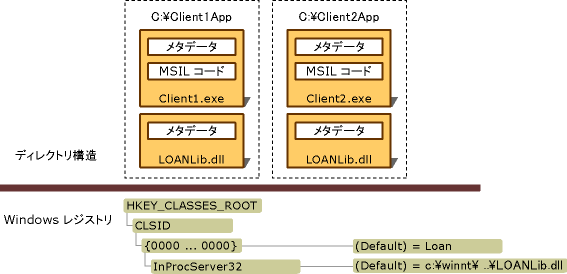

# 相互運用アプリケーションの配置
通常、相互運用アプリケーションには、.NET クライアント アセンブリ、個別の COM タイプ ライブラリを表す 1 つ以上の相互運用機能アセンブリ、および 1 つ以上の登録済み COM コンポーネントが含まれています。  Visual Studio および [!INCLUDE[winsdklong](../../../includes/winsdklong-md.md)] には、タイプ ライブラリを相互運用機能アセンブリにインポートしたり、変換したりするためのツールが用意されています。詳細については、「[タイプ ライブラリのアセンブリとしてのインポート](../../../docs/framework/interop/importing-a-type-library-as-an-assembly.md)」を参照してください。  相互運用アプリケーションを配置する方法には、次の 2 つがあります。  
  
-   埋め込まれた相互運用機能型を使用する: [!INCLUDE[net_v40_long](../../../includes/net-v40-long-md.md)] 以降では、相互運用機能アセンブリから実行可能ファイルに型情報を埋め込むようにコンパイラに指示できます。  コンパイラは、アプリケーションが使用する型情報のみを埋め込みます。  アプリケーションで相互運用機能アセンブリを配置する必要はありません。  この手法を使用することをお勧めします。  
  
-   相互運用機能アセンブリを配置する: 相互運用機能アセンブリへの標準の参照を作成できます。  この場合、アプリケーションで相互運用機能アセンブリを配置する必要があります。  この手法を採用する場合に、プライベートの COM コンポーネントを使用しないときは、必ず、マネージ コードに組み込む COM コンポーネントの作成者が発行したプライマリ相互運用機能アセンブリ \(PIA\) を参照してください。  プライマリ相互運用機能アセンブリの作成と使用の詳細については、「[プライマリ相互運用機能アセンブリ](http://msdn.microsoft.com/ja-jp/b977a8be-59a0-40a0-a806-b11ffba5c080)」を参照してください。  
  
 埋め込まれた相互運用機能型を使用すると、配置を簡単に行うことができます。  特別な操作を実行する必要はありません。  ここからは、アプリケーションで相互運用機能アセンブリを配置するシナリオについて説明します。  
  
## 相互運用機能アセンブリの配置  
 アセンブリには、厳密な名前を付けることができます。  厳密な名前のアセンブリには、一意な識別子を提供する発行者の公開キーが含まれています。  発行者は、**\/keyfile** オプションを使用して、[タイプ ライブラリ インポーター \(Tlbimp.exe\)](../../../docs/framework/tools/tlbimp-exe-type-library-importer.md) で作成されたアセンブリに署名できます。  署名付きアセンブリは、グローバル アセンブリ キャッシュにインストールできます。  署名のないアセンブリは、プライベート アセンブリとしてユーザーのコンピューターにインストールする必要があります。  
  
### プライベート アセンブリ  
 プライベートに使用するアセンブリをインストールするには、アプリケーションの実行可能ファイルと、インポートされた COM 型を格納している相互運用機能アセンブリの両方を同じディレクトリ構造にインストールする必要があります。  別個のアプリケーション ディレクトリに配置された Client1.exe および Client2.exe によってプライベートに使用される、署名のない相互運用機能アセンブリを次の図に示します。  この例で LOANLib.dll として示されている相互運用機能アセンブリは、2 回インストールされています。  
  
   
プライベートに配置する場合のディレクトリ構造とレジストリ エントリ  
  
 アプリケーションに関連付けられたすべての COM コンポーネントを、Windows のレジストリに登録する必要があります。  この図の Client1.exe と Client2.exe が別のコンピューターにインストールされている場合は、COM コンポーネントを両方のコンピューターに登録する必要があります。  
  
### 共有アセンブリ  
 複数のアプリケーションによって共有されるアセンブリは、グローバル アセンブリ キャッシュと呼ばれる集中化されたリポジトリにインストールする必要があります。  .NET クライアントは、署名され、グローバル アセンブリ キャッシュにインストールされた、相互運用機能アセンブリと同一のコピーにアクセスできます。  プライマリ相互運用機能アセンブリの作成と使用の詳細については、「[プライマリ相互運用機能アセンブリ](http://msdn.microsoft.com/ja-jp/b977a8be-59a0-40a0-a806-b11ffba5c080)」を参照してください。  
  
## 参照  
 [.NET Framework への COM コンポーネントの公開](../../../docs/framework/interop/exposing-com-components.md)   
 [タイプ ライブラリのアセンブリとしてのインポート](../../../docs/framework/interop/importing-a-type-library-as-an-assembly.md)   
 [Using COM Types in Managed Code](http://msdn.microsoft.com/ja-jp/1a95a8ca-c8b8-4464-90b0-5ee1a1135b66)   
 [相互運用プロジェクトのコンパイル](../../../docs/framework/interop/compiling-an-interop-project.md)