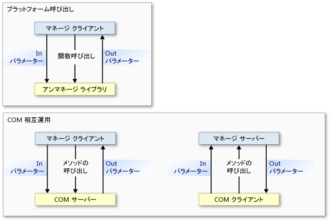
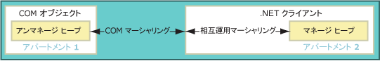
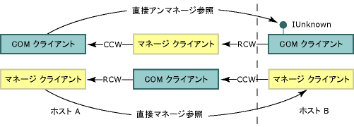

# 相互運用マーシャリング
 相互運用マーシャリングは、メソッド引数と戻り値によって、呼び出し中にマネージ メモリとアンマネージ メモリの間でデータを渡す方法を制御します。 相互運用マーシャリングは、共通言語ランタイムのマーシャリング サービスによって実行される、ランタイム アクティビティです。  
  
 ほとんどのデータ型は、マネージとアンマネージの両方のメモリに共通の表現があります。 相互運用マーシャラーは、これらの型を処理します。 その他の型は、あいまいな型であるか、マネージ メモリでまったく表現されていない型である可能性があります。  
  
 あいまいな型は、複数のアンマネージ表現が 1 つのマネージ型にマップされていたり、配列のサイズなどの型情報が欠落していたりします。 あいまいな型の場合、マーシャラーは、既定の表現と複数の表現が存在するときのための代替表現とを提供します。 あいまいな型をマーシャリングする方法について、マーシャラーに明示的な指示を与えることができます。  
  
 この概要は、次のセクションで構成されています。  
  
-   [プラットフォーム呼び出しと COM 相互運用のモデル](#platform_invoke_and_com_interop_models)  
  
-   [マーシャリングと COM アパートメント](#marshaling_and_com_apartments)  
  
-   [リモートの呼び出しのマーシャリング](#marshaling_remote_calls)  
  
-   [関連トピック](#related_topics)  
  
-   [参照](#reference)  
  
   
## プラットフォーム呼び出しと COM 相互運用のモデル  
 共通言語ランタイムは、アンマネージ コードと相互運用するために、次の 2 つのメカニズムを提供します。  
  
-   プラットフォーム呼び出しにより、マネージ コードは、アンマネージ ライブラリからエクスポートされた関数を呼び出すことができます。  
  
-   COM 相互運用により、マネージ コードは、インターフェイスを介してコンポーネント オブジェクト モデル (COM) オブジェクトと対話できます。  
  
 プラットフォーム呼び出しと COM 相互運用はどちらも、必要な場合に、相互運用マーシャリングを使用して呼び出し元と呼び出し先との間でメソッド引数を正確に移動します。 次の図が示すように、プラットフォーム呼び出しメソッドの呼び出しはマネージ コードからアンマネージ コードにフローして、[コールバック関数](../../../docs/framework/interop/callback-functions.md)が関係していない限りその逆の方向にはフローしません。 プラットフォーム呼び出しの呼び出しはマネージ コードからアンマネージ コードにのみフローしますが、データは入出力パラメーターとして双方向にフローできます。 COM 相互運用のメソッド呼び出しは、どちらの方向にもフローできます。  
  
   
プラットフォーム呼び出しと COM 相互運用の呼び出しフロー  
  
 最下位のレベルでは、どちらのメカニズムも同じ相互運用マーシャリング サービスを使用します。ただし、特定のデータ型は、COM 相互運用またはプラットフォーム呼び出しでのみサポートされます。 詳しくは、「[既定のマーシャリング動作](../../../docs/framework/interop/default-marshaling-behavior.md)」を参照してください。  
  
 [ページのトップへ](#top)  
  
   
## マーシャリングと COM アパートメント  
 相互運用マーシャラーは、共通言語ランタイム ヒープとアンマネージ ヒープの間でデータをマーシャリングします。 呼び出し元と呼び出し先がデータの同じインスタンスで機能できないときには常に、マーシャリングが生じます。 相互運用マーシャラーにより、呼び出し元と呼び出し先がデータの独自のコピーを持っている場合でも、見かけ上は同じデータに対して機能しているようにすることが可能になります。  
  
 COM には、COM アパートメント間や異なる COM プロセス間でデータをマーシャリングするマーシャラーもあります。 同じ COM アパートメント内でマネージ コードとアンマネージ コード間の呼び出しをする場合は、相互運用マーシャラーが関連する唯一のマーシャラーとなります。 異なる COM アパートメントや異なるプロセス内でマネージ コードとアンマネージ コード間の呼び出しをする場合は、相互運用マーシャラーと COM マーシャラーの両方が関連します。  
  
### COM クライアントとマネージ サーバー  
 [Regasm.exe (アセンブリ登録ツール)](../../../docs/framework/tools/regasm-exe-assembly-registration-tool.md) によって登録されたタイプ ライブラリのあるエクスポートされたマネージ サーバーでは、`ThreadingModel` レジストリ エントリが `Both` に設定されています。 この値は、シングルスレッド アパートメント (STA) またはマルチスレッド アパートメント (MTA) で、サーバーをアクティブ化できることを示します。 次の表に示すように、サーバー オブジェクトは、その呼び出し元と同じアパートメント内に作成されます。  
  
|COM クライアント|.NET サーバー|マーシャリングの要件|  
|----------------|-----------------|-----------------------------|  
|STA|`Both` は STA になります。|同じアパートメントでのマーシャリング。|  
|MTA|`Both` は MTA になります。|同じアパートメントでのマーシャリング。|  
  
 クライアントとサーバーが同じアパートメント内にあるため、相互運用マーシャリング サービスはすべてのデータのマーシャリングを自動的に処理します。 次の図は、同じ COM スタイル アパートメント内のマネージ ヒープとアンマネージ ヒープの間で機能している、相互運用マーシャリング サービスを示しています。  
  
   
同じアパートメントでのマーシャリングのプロセス  
  
 マネージ サーバーをエクスポートする予定の場合は、サーバーのアパートメントが COM クライアントによって決定されることに注意してください。 MTA 内で初期化された COM クライアントから呼び出されるマネージ サーバーは、スレッド セーフを確保する必要があります。  
  
### マネージ クライアントと COM サーバー  
 マネージ クライアントのアパートメントの既定の設定は MTA です。ただし、.NET クライアントのアプリケーションの種類によっては、既定の設定が変更されることがあります。 たとえば、[!INCLUDE[vbprvblong](../../../includes/vbprvblong-md.md)] クライアントのアパートメントの設定は STA です。 <xref:System.STAThreadAttribute?displayProperty=nameWithType>、<xref:System.MTAThreadAttribute?displayProperty=nameWithType>、<xref:System.Threading.Thread.ApartmentState%2A?displayProperty=nameWithType> プロパティ、または <xref:System.Web.UI.Page.AspCompatMode%2A?displayProperty=nameWithType> プロパティを使用して、マネージ クライアントのアパートメントの設定を変更できます。  
  
 コンポーネントの作成者は、COM サーバーのスレッド アフィニティを設定します。 次の表は、.NET クライアントと COM サーバーのアパートメント設定の組み合わせを示しています。 また、結果として生じる、組み合わせのためのマーシャリング要件も示しています。  
  
|.NET クライアント|COM サーバー|マーシャリングの要件|  
|-----------------|----------------|-----------------------------|  
|MTA (既定)|MTA   STA|相互運用マーシャリング。   相互運用と COM マーシャリング。|  
|STA|MTA   STA|相互運用と COM マーシャリング。   相互運用マーシャリング。|  
  
 マネージ クライアントとアンマネージ サーバーが同じアパートメント内にあるとき、相互運用マーシャリング サービスはすべてのデータのマーシャリングを処理します。 ただし、クライアントとサーバーが異なるアパートメント内で初期化される場合は、COM マーシャリングも必要となります。 次の図は、アパートメント間の呼び出しの要素を示しています。  
  
   
.NET クライアントと COM オブジェクト間でのアパートメント間の呼び出し  
  
 アパートメント間のマーシャリングでは、次の操作を実行できます。  
  
-   アパートメント間のマーシャリングのオーバーヘッドを受け入れます。これは、境界を越える呼び出しが多くがある場合にのみ認識されます。 呼び出しがアパートメントの境界を正常に越えるようにするためには、COM コンポーネントのタイプ ライブラリを登録する必要があります。  
  
-   クライアント スレッドを STA または MTA に設定して、メイン スレッドを変更します。 たとえば、C# クライアントが多くの STA COM コンポーネントを呼び出す場合には、メイン スレッドを STA に設定してアパートメント間のマーシャリングを回避できます。  
  
    > [!NOTE]
    >  C# クライアントのスレッドを STA に設定すると、MTA COM コンポーネントへの呼び出しにはアパートメント間のマーシャリングが必要となります。  
  
 アパートメント モデルを明示的に選択する方法については、「[マネージとアンマネージ スレッド](http://msdn.microsoft.com/en-us/db425c20-4b2f-4433-bf96-76071c7881e5)」を参照してください。  
  
 [ページのトップへ](#top)  
  
   
## リモートの呼び出しのマーシャリング  
 アパートメント間のマーシャリングの場合と同様に、COM マーシャリングは、オブジェクトが別個のプロセス内に存在するときには常に、マネージ コードとアンマネージ コード間の各呼び出しに関与します。 次に例を示します。  
  
-   リモート ホスト上のマネージ サーバーを呼び出す COM クライアントは、分散 COM (DCOM) を使用します。  
  
-   リモート ホスト上の COM サーバーを呼び出すマネージ クライアントは、DCOM を使用します。  
  
 次の図は、相互運用マーシャリングと COM マーシャリングが、プロセスとホストの境界を越えて通信チャネルを提供する方法を示しています。  
  
   
プロセス間のマーシャリング  
  
### ID の保持  
 共通言語ランタイムは、マネージ参照とアンマネージ参照の ID を保持します。 次の図は、プロセスとホストの境界を越えている、直接アンマネージ参照 (上の行) と直接マネージ参照 (下の行) のフローを示しています。  
  
   
プロセスとホストの境界を越えて渡される参照  
  
 この図では:  
  
-   アンマネージ クライアントは、COM オブジェクトへの参照を、リモート ホストからその参照を取得するマネージ オブジェクトから取得します。 リモート処理のメカニズムは DCOM です。  
  
-   マネージ クライアントは、マネージ オブジェクトへの参照を、リモート ホストからその参照を取得している COM オブジェクトから取得します。 リモート処理のメカニズムは DCOM です。  
  
    > [!NOTE]
    >  マネージ サーバーのエクスポート済みタイプ ライブラリを登録する必要があります。  
  
 呼び出し元と呼び出し先の間のプロセス境界の数は関連していません。同じ直接参照が、イン プロセスおよびアウト プロセスの呼び出しで発生します。  
  
### マネージ リモート処理  
 ランタイムは、プロセスとホストの境界を越えてマネージ オブジェクト間に通信チャネルを確立するために使用できる、マネージ リモート処理も提供します。 次の図に示すように、マネージ リモート処理は、通信コンポーネントの間のファイアウォールに対応できます。  
  
   
SOAP または TcpChannel クラスを使用するファイアウォールを越えたリモート呼び出し  
  
 [サービス コンポーネント](http://msdn.microsoft.com/en-us/f109ee24-81ad-4d99-9892-51ac6f34978c)と COM の間の呼び出しなど、一部のアンマネージ呼び出しは SOAP を介して伝達できます。  
  
 [ページのトップへ](#top)  
  
   
## 関連トピック  
  
|タイトル|説明|  
|-----------|-----------------|  
|[既定のマーシャリング動作](../../../docs/framework/interop/default-marshaling-behavior.md)|相互運用マーシャリング サービスがデータのマーシャリングに使用する規則について説明します。|  
|[プラットフォーム呼び出しによるデータのマーシャリング](../../../docs/framework/interop/marshaling-data-with-platform-invoke.md)|メソッドのパラメーターを宣言してアンマネージ ライブラリによってエクスポートされた関数に引数を渡す方法について説明します。|  
|[COM 相互運用機能によるデータのマーシャリング](../../../docs/framework/interop/marshaling-data-with-com-interop.md)|COM ラッパーをカスタマイズしてマーシャリング動作を変更する方法について説明します。|  
|[方法: マネージ コード DCOM を WCF に移行する](../../../docs/framework/interop/how-to-migrate-managed-code-dcom-to-wcf.md)|DCOM から WCF に移行する方法について説明します。|  
|[方法: HRESULT に例外を割り当てる](../../../docs/framework/interop/how-to-map-hresults-and-exceptions.md)|HRESULT にカスタム例外をマップする方法について説明し、各 HRESULT から .NET Framework での同等の例外クラスへの完全なマッピングを示します。|  
|[ジェネリック型を使用する相互運用](http://msdn.microsoft.com/en-us/26b88e03-085b-4b53-94ba-a5a9c709ce58)|COM 相互運用性のジェネリック型を使用するとき、どのアクションがサポートされるかについて説明します。|  
|[アンマネージ コードとの相互運用](../../../docs/framework/interop/index.md)|共通言語ランタイムが提供する相互運用サービスについて説明します。|  
|[高度な COM 相互運用性](http://msdn.microsoft.com/en-us/3ada36e5-2390-4d70-b490-6ad8de92f2fb)|.NET Framework アプリケーションに COM コンポーネントを組み込む方法についての詳細情報へのリンクを示します。|  
|[相互運用のためのデザインの考慮事項](http://msdn.microsoft.com/en-us/b59637f6-fe35-40d6-ae72-901e7a707689)|統合 COM コンポーネントを記述するためのヒントを示します。|  
  
 [ページのトップへ](#top)  
  
   
## 参照  
 <xref:System.Runtime.InteropServices?displayProperty=nameWithType>  
  
 [ページのトップへ](#top)
