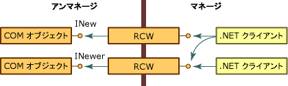
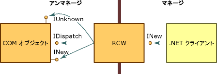

# ランタイム呼び出し可能ラッパー
共通言語ランタイムは、ランタイム呼び出し可能ラッパー (RCW) と呼ばれるプロキシを介して COM オブジェクトを公開します。 .NET クライアントでは RCW が普通のオブジェクトとして示されますが、その主な機能は、.NET クライアントと COM オブジェクトの間で呼び出しをマーシャリングすることです。  
  
 ランタイムは、COM オブジェクトごとに 1 つの RCW を、そのオブジェクトに存在する参照の数に関係なく作成します。 ランタイムは、各オブジェクトで、プロセスごとに 1 つの RCW を保持します。  1 つのアプリケーション ドメインまたはアパートメントで RCW を作成し、別のアプリケーション ドメインまたはアパートメントへの参照を渡すと、最初のオブジェクトへのプロキシが使用されます。  次の図が示すように、任意の数のマネージ クライアントが、INew および INewer のインターフェイスを公開する COM オブジェクトへの参照を保持できます。  
  
   
ランタイム呼び出し可能ラッパーを介して COM オブジェクトにアクセスする  
  
 ランタイムは、タイプ ライブラリから派生したメタデータを使用して、呼び出される COM オブジェクトとそのオブジェクトのラッパーの両方を作成します。 各 RCW は、ラップする COM オブジェクトでインターフェイス ポインターのキャッシュを保持し、RCW が不要になった時点で、COM オブジェクトでのその参照を解放します。 ランタイムは、RCW でのガベージ コレクションを実行します。  
  
 RCW は、他のさまざまなアクティビティも実行しますが、ラップされたオブジェクトのために、マネージ コードとアンマネージ コードの間でデータをマーシャリングします。 具体的には、RCW はクライアントとサーバーの間でデータの異なる表現が渡されるとき、常にメソッド引数やメソッドの戻り値のマーシャリングを提供します。  
  
 標準ラッパーは、組み込みのマーシャリング規則を適用します。 たとえば、.NET クライアントが文字列型を引数の一部としてアンマネージ オブジェクトに渡すとき、ラッパーは文字列を BSTR 型に変換します。 COM オブジェクトが、マネージ呼び出し元に BSTR を返す場合、呼び出し元は文字列を受信します。 クライアントとサーバーはどちらも、それぞれが使い慣れているデータを送受信します。 その他の型は、変換する必要がありません。 たとえば、標準的なラッパーはマネージ コードとアンマネージ コードの間で、型を変換しないで 4 バイトの整数を常に受け渡しします。  
  
## 選択したインターフェイスのマーシャリング  
 [ランタイム呼び出し可能ラッパー](runtime-callable-wrapper.md) (RCW) の主な目標は、マネージとアンマネージのプログラミング モデルの違いを見えなくすることです。 次の図に示すように、RCW は選択された COM インターフェイスを .NET クライアントに公開することなく使用して、シームレスな移行を実現します。  
  
   
COM インターフェイスおよびランタイム呼び出し可能ラッパー  
  
 事前バインディングされたオブジェクトとして作成されると、RCW は特定の型になります。 これは、COM オブジェクトが実装するインターフェイスを実装し、オブジェクトのインターフェイスからのメソッド、プロパティ、およびイベントを公開します。 図では、RCW は INew インターフェイスを公開しますが、**IUnknown** と **IDispatch** インターフェイスを使用します。 さらに、RCW は、INew インターフェイスのすべてのメンバーを .NET クライアントに公開します。  
  
 RCW は、それがラップするオブジェクトによって公開されている、次の表にリストされたインターフェイスを使用します。  
  
|Interface|説明|  
|---------------|-----------------|  
|**IDispatch**|リフレクションによる COM オブジェクトへの遅延バインディングのために使用します。|  
|**IErrorInfo**|エラー、そのソース、ヘルプ ファイル、ヘルプ コンテキスト、およびエラーを定義したインターフェイスの GUID (.NET クラスでは常に **GUID_NULL**) に関する説明文を示します。|  
|**IProvideClassInfo**|ラップされている COM オブジェクトが **IProvideClassInfo** を実装する場合、RCW はこのインターフェイスから型情報を抽出して、より優れた型 ID を提供します。|  
|**IUnknown**|オブジェクト ID、強制型変換、および有効期間管理のために使用します。   -   オブジェクト ID      ランタイムは、各オブジェクトの **IUnknown** インターフェイスの値を比較することによって、複数の COM オブジェクトを区別します。 -   強制型変換      RCW は、**QueryInterface** メソッドによって実行される、動的な型の探索を認識します。 -   有効期間管理      RCW は **QueryInterface** メソッドを使用して、アンマネージ オブジェクトへの参照を取得し、ランタイムがラッパーでガベージ コレクションを実行してアンマネージ オブジェクトが解放されるまでその参照を保持します。|  
  
 必要に応じて、RCW はそれがラップするオブジェクトによって公開されている、次の表にリストされたインターフェイスを使用することもできます。  
  
|Interface|説明|  
|---------------|-----------------|  
|**IConnectionPoint** と **IConnectionPointContainer**|RCW は、接続ポイントのイベント スタイルを公開するオブジェクトを、デリゲート ベースのイベントに変換します。|  
|**IDispatchEx**|クラスが **IDispatchEx** を実装する場合、RCW は **IExpando** を実装します。 **IDispatchEx** インターフェイスは、**IDispatch** インターフェイスの拡張版で、**IDispatch** とは異なり、列挙、追加、削除、および大文字小文字を区別したメンバーの呼び出しが可能になります。|  
|**IEnumVARIANT**|列挙をサポートする COM 型がコレクションとして扱われることを可能にします。|  
  
## 参照  
 [COM ラッパー](com-wrappers.md)  
 [選択したインターフェイスのマーシャリング](https://msdn.microsoft.com/library/fdb97fd0-f694-4832-bf15-a4e7cf413840(v=vs.100))  
 [COM 呼び出し可能ラッパー](com-callable-wrapper.md)  
 [タイプ ライブラリからアセンブリへの変換の要約](https://msdn.microsoft.com/library/bf3f90c5-4770-4ab8-895c-3ba1055cc958(v=vs.100))  
 [タイプ ライブラリのアセンブリとしてのインポート](importing-a-type-library-as-an-assembly.md)
