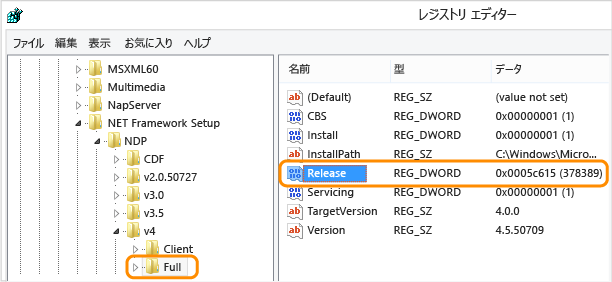

# <a name="how-to-determine-which-net-framework-versions-are-installed"></a>方法: インストールされている .NET Framework バージョンを確認する

ユーザーはコンピューターに複数のバージョンの .NET Framework をインストールして実行できます。 アプリを開発または配置する場合、どのバージョンの .NET Framework がユーザーのコンピューターにインストールされているかを確認しなければならない場合があります。 .NET Framework は、個別にバージョン管理される 2 つの主要コンポーネントで構成されています。  
  
-   アプリに機能を提供する型やリソースのコレクションである一連のアセンブリ。 .NET Framework とアセンブリは同じバージョン番号を共有します。  
  
-   アプリのコードを管理および実行する共通言語ランタイム (CLR)。 CLR は独自のバージョン番号で識別されます (「[バージョンおよび依存関係](~/docs/framework/migration-guide/versions-and-dependencies.md)」を参照してください)。  
  
 コンピューターにインストールされている .NET Framework バージョンの正確な一覧を取得するには、レジストリを表示するか、コードでレジストリを照会することができます。  
  
 [レジストリの表示 (バージョン 1 ～ 4)](#net_a)  
 [レジストリの表示 (バージョン 4.5 以降)](#net_b)  
 [コードによるレジストリの照会 (バージョン 1 ～ 4)](#net_c)  
 [コードによるレジストリの照会 (バージョン 4.5 以降)](#net_d)  
 [PowerShell を使用したレジストリの照会 (バージョン 4.5 以降)](#ps_a)  
  
 CLR のバージョンを検索するには、ツールまたはコードを使用できます。  
  
 [Clrver ツールの使用](#clr_a)  
 [コードによる System.Environment クラスの照会](#clr_b)  
  
 .NET Framework の各バージョン用にインストールされている更新プログラムを検出する方法については、「[方法: インストールされている .NET Framework の更新プログラムを確認する](~/docs/framework/migration-guide/how-to-determine-which-net-framework-updates-are-installed.md)」を参照してください。 .NET Framework のインストールの詳細については、「[開発者向けの .NET Framework のインストール](../../../docs/framework/install/guide-for-developers.md)」を参照してください。  
  
<a name="net_a"></a>   
## <a name="to-find-net-framework-versions-by-viewing-the-registry-net-framework-1-4"></a>レジストリを表示して .NET Framework のバージョンを検索するには (.NET Framework 1 ～ 4)  
  
1.  **[スタート]** ボタンをクリックし、**[ファイル名を指定して実行]** をクリックします。  
  
2.  **[開く]** ボックスに「**regedit.exe**」と入力します。  
  
     regedit.exe を実行するには、管理特権が必要です。  
  
3.  レジストリ エディターで、次のサブキーを開きます。  
  
     `HKEY_LOCAL_MACHINE\SOFTWARE\Microsoft\NET Framework Setup\NDP`  
  
     インストールされているバージョンは NDP のサブキーの下に一覧表示されています。 バージョン番号は、**Version** エントリに格納されています。 [!INCLUDE[net_v40_long](../../../includes/net-v40-long-md.md)] では、**Version** エントリは、Client サブキーまたは Full サブキー (NDP の下)、または両方のサブキーの下にあります。  
  

    > [!NOTE]
    > レジストリの ".NET Framework セットアップ" フォルダーの先頭はピリオドではありません。

<a name="net_b"></a> 
## <a name="to-find-net-framework-versions-by-viewing-the-registry-net-framework-45-and-later"></a>レジストリを表示して .NET Framework のバージョンを検索するには (.NET Framework 4.5 以降)

1. **[スタート]** ボタンをクリックし、**[ファイル名を指定して実行]** をクリックします。

2. **[開く]** ボックスに「**regedit.exe**」と入力します。

     regedit.exe を実行するには、管理特権が必要です。

3. レジストリ エディターで、次のサブキーを開きます。

     `HKEY_LOCAL_MACHINE\SOFTWARE\Microsoft\NET Framework Setup\NDP\v4\Full`

     `Full` サブキーへのパスに `.NET Framework` ではなく `Net Framework` サブキーが含まれていることに注意してください。

    > [!NOTE]
    > `Full` サブキーが存在しない場合は、.NET Framework 4.5 以降がインストールされていません。

     `Release` という名前の DWORD 値を確認します。 `Release` DWORD がある場合は、[!INCLUDE[net_v45](../../../includes/net-v45-md.md)] 以降がコンピューターにインストールされていることを示します。

     

     `Release` の値は、インストールされている .NET Framework のバージョンを示します。

    [!INCLUDE[Release key values note](~/includes/version-keys-note.md)]

    |Release DWORD の値|Version|
    |--------------------------------|-------------|
    |378389|.NET Framework 4.5|
    |378675|Windows 8.1 または Windows Server 2012 R2 でインストールされた .NET Framework 4.5.1|
    |378758|Windows 8、Windows 7 SP1、または Windows Vista SP2 上でインストールされた .NET Framework 4.5.1|
    |379893|.NET Framework 4.5.2|
    |Windows 10 システムのみ: 393295<br /><br /> その他すべての OS バージョン上: 393297|[!INCLUDE[net_v46](../../../includes/net-v46-md.md)]|
    |Windows 10 の 11 月更新版のシステムのみ: 394254<br /><br /> 他のすべての OS バージョンの場合: 394271|[!INCLUDE[net_v461](../../../includes/net-v461-md.md)]|
    |Windows 10 Anniversary Update のみ: 394802<br /><br /> 他のすべての OS バージョンの場合: 394806|[!INCLUDE[net_v462](../../../includes/net-v462-md.md)]| 
    |Windows 10 Creators Update のみ: 460798<br/><br/> その他すべての OS バージョン上: 460805 | .NET Framework 4.7 |
    |Windows 10 Fall Creators Update のみ: 461308<br/><br/> その他のすべての OS バージョン: 461310 | .NET Framework 4.7.1 |
    |Windows 10 April 2018 Update のみ: 461808<br/><br/> その他のすべての OS バージョン: 461814| .NET Framework 4.7.2 |
    
<a name="net_c"></a> 
## <a name="to-find-net-framework-versions-by-querying-the-registry-in-code-net-framework-1-4"></a>コードでレジストリを照会して .NET Framework のバージョンを検索するには (.NET Framework 1 ～ 4)

- <xref:Microsoft.Win32.RegistryKey?displayProperty=nameWithType> クラスを使用して、Windows レジストリの HKEY_LOCAL_MACHINE の下にある Software\Microsoft\NET Framework Setup\NDP\ サブキーにアクセスします。

     このクエリの例を次のコードに示します。

    > [!NOTE]
    > このコードは [!INCLUDE[net_v45](../../../includes/net-v45-md.md)] 以降を検出する方法を示すコードではありません。 前のセクションで説明したように、これらのバージョンを検出するには、`Release` DWORD を確認してください。 [!INCLUDE[net_v45](../../../includes/net-v45-md.md)] 以降のバージョンを検出するコードについては、この記事の次のセクションを参照してください。

     [!code-csharp[ListVersions](../../../samples/snippets/csharp/framework/migration-guide/versions-installed1.cs)]
     [!code-vb[ListVersions](../../../samples/snippets/visualbasic/framework/migration-guide/versions-installed1.vb)]

     この例では次のような出力が生成されます。

    ```
    v2.0.50727  2.0.50727.4016  SP2
    v3.0  3.0.30729.4037  SP2
    v3.5  3.5.30729.01  SP1
    v4
      Client  4.0.30319
      Full  4.0.30319
    ```

<a name="net_d"></a> 
## <a name="to-find-net-framework-versions-by-querying-the-registry-in-code-net-framework-45-and-later"></a>コードでレジストリを照会して .NET Framework のバージョンを検索するには (.NET Framework 4.5 以降)

1. `Release` DWORD がある場合は、.NET Framework 4.5 以降がコンピューターにインストールされています。 キーワードの値はインストールされているバージョンを示します。 このキーワードを確認するには、<xref:Microsoft.Win32.RegistryKey?displayProperty=nameWithType> クラスの <xref:Microsoft.Win32.RegistryKey.OpenBaseKey%2A> メソッドと <xref:Microsoft.Win32.RegistryKey.OpenSubKey%2A> メソッドを使って、Windows レジストリの HKEY_LOCAL_MACHINE の下にある Software\Microsoft\NET Framework Setup\NDP\v4\Full サブキーにアクセスします。

2. `Release` キーワードの値を確認して、インストールされているバージョンを決定します。 上位互換性を確認するには、テーブルに示されている値以上の値があるかを確認します。 .NET Framework のバージョンと関連付けられた `Release` キーワードを次に示します。

    [!INCLUDE[Release key values note](~/includes/version-keys-note.md)]

    |Version|Release DWORD の値|
    |-------------|--------------------------------|
    |.NET Framework 4.5|378389|
    |Windows 8.1 でインストールされた .NET Framework 4.5.1|378675|
    |Windows 8、Windows 7 SP1、または Windows Vista SP2 上でインストールされた .NET Framework 4.5.1|378758|
    |.NET Framework 4.5.2|379893|
    |Windows 10 でインストールされた .NET Framework 4.6|393295|
    |その他のすべての Windows OS バージョンにインストールされた .NET Framework 4.6|393297|
    |Windows 10 にインストールされた .NET Framework 4.6.1|394254|
    |その他のすべての Windows OS バージョンにインストールされた .NET Framework 4.6.1|394271|
    |Windows 10 Anniversary Update にインストールされた .NET Framework 4.6.2|394802|
    |その他のすべての Windows OS バージョンにインストールされた .NET Framework 4.6.2|394806|
    |Windows 10 Creators Update にインストールされた .NET Framework 4.7|460798|
    |その他のすべての Windows OS バージョンにインストールされた .NET Framework 4.7|460805|
    |Windows 10 Fall Creators Update にインストールされた .NET Framework 4.7.1|461308|
    |その他のすべての Windows OS バージョンにインストールされた .NET Framework 4.7.1|461310|
    |Windows 10 April 2018 Update にインストールされた .NET Framework 4.7.2|461808|
    |その他のすべての Windows OS バージョンにインストールされた .NET Framework 4.7.2|461814|
    
     レジストリの `Release` 値を確認して [!INCLUDE[net_v45](../../../includes/net-v45-md.md)] 以降のバージョンの .NET Framework がインストールされているかどうかを判断する例を次に示します。

     [!code-csharp[ListVersions#5](../../../samples/snippets/csharp/framework/migration-guide/versions-installed3.cs)]
     [!code-vb[ListVersions#5](../../../samples/snippets/visualbasic/framework/migration-guide/versions-installed3.vb)]

     この例では、バージョンのチェックで推奨されている方法に従います。

    - `Release` エントリの値が既知のリリース キー値*以上*かどうかをチェックします。

    - 最新バージョンから最も古いバージョンの順にチェックします。

<a name="ps_a"></a> 
## <a name="to-check-for-a-minimum-required-net-framework-version-by-querying-the-registry-in-powershell-net-framework-45-and-later"></a>PowerShell でレジストリを照会して .NET Framework の最低限必要なバージョンを確認するには(.NET Framework 4.5 以降)

- 次の例では、`Release` キーワードの値を確認して、Windows オペレーティング システムのバージョンに関係なく、.NET Framework 4.6.2 以降がインストールされているかどうかを判断します (インストールされている場合は `True` を返し、それ以外の場合は `False`を返します)。

    ```PowerShell
    Get-ChildItem "HKLM:SOFTWARE\Microsoft\NET Framework Setup\NDP\v4\Full\" | Get-ItemPropertyValue -Name Release | ForEach-Object { $_ -ge 394802 } 
    ```

    前の例で、`394802` を次の表の別の値に置き換えて、別の最低限必要な .NET Framework バージョンを確認することができます。
  
    |Version|Release DWORD の最小値|
    |-------------|--------------------------------|
    |.NET Framework 4.5|378389|
    |.NET Framework 4.5.1|378675|
    |.NET Framework 4.5.2|379893|
    |[!INCLUDE[net_v46](../../../includes/net-v46-md.md)]|393295|
    |[!INCLUDE[net_v461](../../../includes/net-v461-md.md)]|394254|
    |[!INCLUDE[net_v462](../../../includes/net-v462-md.md)]|394802|
    |.NET Framework 4.7|460798|
    |.NET Framework 4.7.1|461308|
    |.NET Framework 4.7.2|461808|

<a name="clr_a"></a> 
## <a name="to-find-the-current-runtime-version-by-using-the-clrver-tool"></a>Clrver ツールを使用して現在のランタイムのバージョンを確認する方法

- CLR バージョン ツール (Clrver.exe) を使用して、コンピューターにインストールされている共通言語ランタイムのバージョンを確認します。

     Visual Studio コマンド プロンプトで、「`clrver`」と入力します。 次のような出力が表示されます。

    ```
    Versions installed on the machine:
    v2.0.50727
    v4.0.30319
    ```

     このツールの使用については、「[Clrver.exe (CLR Version Tool)](~/docs/framework/tools/clrver-exe-clr-version-tool.md)」を参照してください。

<a name="clr_b"></a> 
## <a name="to-find-the-current-runtime-version-by-querying-the-environment-class-in-code"></a>コードで Environment クラスを照会して現在のランタイム バージョンを確認するには

- <xref:System.Environment.Version%2A?displayProperty=nameWithType> プロパティを照会して <xref:System.Version> オブジェクトを取得し、現在コードを実行しているランタイムのバージョンを識別します。 メジャー リリースの識別子 (バージョン 4.0 の "4" など) を取得するには <xref:System.Version.Major%2A?displayProperty=nameWithType> プロパティを、マイナー リリースの識別子 (バージョン 4.0 の "0" など) を取得するには <xref:System.Version.Minor%2A?displayProperty=nameWithType> プロパティを、バージョン文字列全体 (次のコードに示すような "4.0.30319.18010" など) を取得するには <xref:System.Object.ToString%2A?displayProperty=nameWithType> メソッドを使用できます。 このプロパティは、現在コードを実行しているランタイムのバージョンを表す単一の値を返しますが、アセンブリのバージョンやコンピューターにインストールされている可能性があるランタイムの他のバージョンは返しません。

     .NET Framework バージョン 4、4.5、4.5.1、および 4.5.2 の場合は、<xref:System.Environment.Version%2A?displayProperty=nameWithType> プロパティから返される <xref:System.Version> オブジェクトの文字列表現が `4.0.30319.xxxxx` という形式になっています。 .NET Framework 4.6 以降の場合は、`4.0.30319.42000` という形式です。

    > [!IMPORTANT]
    > [!INCLUDE[net_v45](../../../includes/net-v45-md.md)] 以降の場合、ランタイムのバージョンの検出に <xref:System.Environment.Version%2A?displayProperty=nameWithType> プロパティを使用することは推奨されません。 代わりに、この記事で前述した「[コードでレジストリを照会して .NET Framework のバージョンを検索するには (.NET Framework 4.5 以降)](#net_d)」に従って、レジストリを紹介することをお勧めします。

     次に、<xref:System.Environment.Version%2A?displayProperty=nameWithType> プロパティを照会してランタイム バージョン情報を取得する例を示します。

     [!code-csharp[ListVersions](../../../samples/snippets/csharp/framework/migration-guide/versions-installed2.cs)]
     [!code-vb[ListVersions](../../../samples/snippets/visualbasic/framework/migration-guide/versions-installed2.vb)]

     この例では次のような出力が生成されます。

    ```
    Version: 4.0.30319.18010
    ```

## <a name="see-also"></a>関連項目

[方法: インストールされている .NET Framework の更新プログラムを確認する](~/docs/framework/migration-guide/how-to-determine-which-net-framework-updates-are-installed.md)  
[開発者向けの .NET Framework のインストール](../../../docs/framework/install/guide-for-developers.md)  
[バージョンおよび依存関係](~/docs/framework/migration-guide/versions-and-dependencies.md)  
