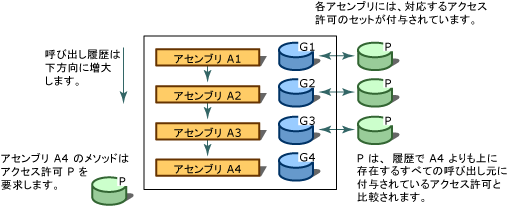

# コード アクセス セキュリティ
[!INCLUDE[net_security_note](../../../includes/net-security-note-md.md)]  
  
 複雑にリンクされた現在のコンピューター システムには、多種多様な、多くの場合は不明なソースからコードが送信されてきます。 コードの電子メールに接続されている、ドキュメントに含まれているまたはインターネットを経由してダウンロードします。 ウイルスやワームのような悪意のあるコードによってコンピューター上のデータを破損または破壊され、時間的にも金銭的にも直接の被害を受けた経験のあるユーザーは少なくありません。  
  
 ほとんどのセキュリティ機構では、ログオン資格情報 (通常はパスワード) に基づいてユーザーに権限を与え、そのユーザーがアクセスできるリソース (多くの場合はディレクトリとファイル) を制限しています。 しかし、この方法では対処できないさまざまな問題が存在します。たとえば、ユーザーはさまざまなソースからコードを入手しますが、中には信頼できない入手先もあります。コードに、悪意のあるコードからねらわれやすいバグがあったり、脆弱性が潜んでいる可能性もあります。また、コードがユーザーの予期しない動作をする場合もあります。 これらの結果、ユーザーが慎重で信頼できるとしても、実行したソフトウェアが悪意のあるソフトウェアやエラーを含むソフトウェアであった場合は、コンピューター システムが損害を受けたり、機密データが漏洩したりする可能性があります。 多くのオペレーティング システムのセキュリティ機構では、Web ページ上のスクリプトなどの場合を除き、コードを実行するためには、その細部にわたるまで完全に信頼されていることが要求されます。 そのため、信頼関係のないコンピューター システム間でも、一方のシステムから送信されたコードをもう一方のシステムで安全に実行できるようにするための、幅広く適用できるセキュリティ機構が必要になります。  
  
 コンピューター システムを悪意のあるコードから簡単に保護できるようにしたり、発生元の不明なコードを安全に実行できるようにしたり、信頼されているコードを故意または過失によって露呈したセキュリティの脆弱性から保護できるようにしたりするために、.NET Framework はコード アクセス セキュリティというセキュリティ機構を提供しています。 コード アクセス セキュリティにより、コードの発生元や、そのコードの身元を示すその他の基準に基づいて、コードをさまざまなレベルで信頼できます。 また、コードに対してさまざまな信頼レベルを強制的に適用することにより、実行するために完全に信頼されていなければならないコードの数は少なくなります。 コード アクセス セキュリティを使用することで、作成したコードが悪意のあるコードやバグのあるコードによって誤用される可能性も低くなります。 コードによって実行できる一連の操作を指定できるため、開発者の責任を軽減できます。 コード アクセス セキュリティは、コードにセキュリティの脆弱性があった場合に、それによって被る可能性のある損害を最小限に抑えるためにも役立ちます。  
  
> [!NOTE]
>  [!INCLUDE[net_v40_long](../../../includes/net-v40-long-md.md)] で、コード アクセス セキュリティ システムに大幅な変更が加えられています。 最も注目すべき変更されて[セキュリティ透過性](../../../docs/framework/misc/security-transparent-code.md)、コード アクセス セキュリティに影響するその他の重要な変更もありますが、します。 これらの変更については、次を参照してください。[セキュリティの変更点](../../../docs/framework/security/security-changes.md)です。  
  
 コード アクセス セキュリティは、主にライブラリ コードと部分的に信頼されたアプリケーションに影響します。 ライブラリ開発者は、部分的に信頼されたアプリケーションによる認証されていないアクセスからコードを保護する必要があります。 部分的に信頼されたアプリケーションは、インターネットなどの外部リソースから読み込まれるアプリケーションです。 デスクトップまたはローカル イントラネットにインストールされているアプリケーションは、完全に信頼されたアプリケーションとして実行されます。 完全に信頼されたアプリケーションは影響を受けませんコード アクセス セキュリティによってとしてマークされている場合を除き、[セキュリティ透過的な](../../../docs/framework/misc/security-transparent-code.md)完全に信頼されているため、します。 完全に信頼されたアプリケーションの唯一の制限事項は、<xref:System.Security.SecurityTransparentAttribute> 属性でマークされているアプリケーションは <xref:System.Security.SecurityCriticalAttribute> 属性でマークされているコードを呼び出すことができない点です。 部分的に信頼されたアプリケーションは、コード アクセス セキュリティを適用できるように、サンドボックス (Internet Explorer など) で実行する必要があります。 インターネットからアプリケーションをダウンロードし、デスクトップから実行しようとすると、<xref:System.NotSupportedException> が返されます。このとき、"ネットワーク上の場所からアセンブリの読み込みを試みました。以前のバージョンの .NET Framework では、これによりアセンブリがサンドボックス化されました。 このリリースの .NET Framework では CAS ポリシーが既定で有効ではないため、この読み込みは危険な場合があります。" というメッセージが表示されます。 アプリケーションが信頼できることを確認したらが有効にした場合を使用して完全な信頼として実行するように、 [ \<loadFromRemoteSources > 要素](../../../docs/framework/configure-apps/file-schema/runtime/loadfromremotesources-element.md)です。 サンド ボックスで、アプリケーションの実行方法の詳細については、次を参照してください。[する方法: 実行部分信頼コードをサンド ボックスで](../../../docs/framework/misc/how-to-run-partially-trusted-code-in-a-sandbox.md)です。  
  
 共通言語ランタイムに対応したマネージ コードすべては、単一コード アクセス セキュリティ呼び出しを行わない場合でも、コード アクセス セキュリティの利点を享受することになります。 詳しくは、「[コード アクセス セキュリティの基礎](../../../docs/framework/misc/code-access-security-basics.md)」をご覧ください。  
  
   
## コード アクセス セキュリティの主な機能  
 コード アクセス セキュリティにより、コードがアクセスする対象を保護されたリソースと保護された操作に制限できます。 .NET Framework では、コード アクセス セキュリティは次の機能を果たします。  
  
-   各種システム リソースにアクセスするための権限や権限セットを定義する。  
  
-   呼び出し元が特定の権限を所有していることをコードから要求できるようにする。  
  
-   呼び出し元にデジタル署名があることをコード自身が要求できるようにします。これにより、特定の組織またはサイトからの呼び出し元だけが、保護されたコードを呼び出すことができます。  
  
-   呼び出し履歴上で、各呼び出し元に付与された権限を、その呼び出し元に求められる権限と比較することにより、コードに対する制限を実行時に強制する。  
  
   
## コール スタック ウォークの実行  
 コードがリソースにアクセスしたり、操作を実行したりすることを許可されているかどうかを判断するために、ランタイムのセキュリティ システムはコール スタック ウォークを行い、コール スタック内の各呼び出し元に与えられているアクセス許可と、確認要求されているアクセス許可とを比較します。 コール スタックに、確認要求されたアクセス許可を持っていない呼び出し元があった場合は、セキュリティ例外がスローされ、アクセスは拒否されます。 スタック ウォークは、信頼レベルの低いコードが信頼レベルの高いコードを呼び出して利用し、承認されていないアクションを実行しようとする攻撃を防止できるようにするために実行します。 コードの呼び出し元すべてに対して実行時にアクセス許可を確認要求することは、確かにパフォーマンスに影響しますが、信頼レベルの低いコードによる攻撃からコードを保護できるようにするためには必要です。 パフォーマンスを最適化するためにコードが実行するスタック ウォークを減らすこともできますが、その場合は、セキュリティの脆弱性を露呈しないように常に注意する必要があります。  
  
 アセンブリ A4 のメソッドが、その呼び出し元にアクセス許可 P が与えられていることを確認要求する場合に、結果として行われるスタック ウォークを次の図に示します。  
  
   
セキュリティ スタック ウォーク  
  
   
## 関連トピック  
  
|タイトル|説明|  
|-----------|-----------------|  
|[コード アクセス セキュリティの基礎](../../../docs/framework/misc/code-access-security-basics.md)|コード アクセス セキュリティとその最も一般的な使用方法について説明します。|  
|[透過的セキュリティ コード、レベル 2](../../../docs/framework/misc/security-transparent-code-level-2.md)|[!INCLUDE[net_v40_short](../../../includes/net-v40-short-md.md)] のセキュリティ透過モデルについて説明します。|  
|[部分信頼コードからのライブラリの使用](../../../docs/framework/misc/using-libraries-from-partially-trusted-code.md)|ライブラリを有効にしてアンマネージ コードと共に使用できるようにする方法と、アンマネージ コードからライブラリを使用する方法について説明します。|  
|[セキュリティの基本概念](../../../docs/standard/security/key-security-concepts.md)|.NET Framework セキュリティ システムで使用されるさまざまな重要用語と概念について、概要を示します。|  
|[ロール ベースのセキュリティ](../../../docs/standard/security/role-based-security.md)|ロールに基づいて、セキュリティを組み込む方法について説明します。|  
|[Cryptographic Services](../../../docs/standard/security/cryptographic-services.md)|アプリケーションに暗号を組み込む方法について説明します。|
