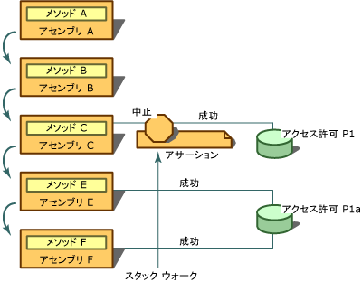

# <a name="using-the-assert-method"></a>Assert メソッドの使用
[!INCLUDE[net_security_note](../../../includes/net-security-note-md.md)]  
  
 <xref:System.Security.CodeAccessPermission.Assert%2A> は、コードのアクセス許可のクラスおよび <xref:System.Security.PermissionSet>クラスで呼び出すことができるメソッドです。 使用することができます**Assert**コードが権限を持つ操作が呼び出し元を実行する、コード (および下流の呼び出し元) を有効にする権限がないためにします。 セキュリティ アサーションは、セキュリティ チェック時にランタイムが実行する正常なプロセスを変更します。 アクセス許可をアサートすると、アサートされたアクセス許可のためにコードの呼び出し元をチェックしないようセキュリティ システムに指示します。  
  
> [!CAUTION]
>  アサーションはセキュリティ ホールを開き、セキュリティの制限事項を適用するランタイムのメカニズムを弱体化させる可能性があるため、慎重に使用してください。  
  
 アサーションは、ライブラリがアンマネージ コードを呼び出す状況、またはライブラリの使用目的と明らかに関係のないアクセス許可を必要とする呼び出しを行う状況に役立ちます。 たとえば、すべてのマネージ コードのあるアンマネージ コードを呼び出す必要があります**SecurityPermission**で、 **UnmanagedCode**フラグを指定します。 ローカルのイントラネットからダウンロードするコードなど、ローカル コンピューターから発生していないコードには、既定でこのアクセス許可は付与されません。 そのため、ローカルのイントラネットからダウンロードするコードがアンマネージ コードを使用するライブラリを呼び出せるようにするには、ライブラリによってアサートされたアクセス許可がコードに指定されている必要があります。 さらに、ライブラリによっては呼び出し元からは見えない呼び出し、および特別なアクセス許可を必要とする呼び出しを行う場合があります。  
  
 また、コードが呼び出し元から完全に非表示にされる方法でリソースにアクセスする状況において、アサーションを使用することもできます。 たとえば、ライブラリがデータベースから情報を取得しますが、プロセス内でコンピューターのレジストリからも情報を読み取ると仮定してください。 ライブラリを使用している開発者はアクセスできないため、ソースに、あるありません、コードが必要であるかを知る方法**RegistryPermission**のコードを使用するためにします。 この場合、コードの呼び出し元がレジストリへのアクセス許可を持つことを求めるのは妥当でないか不必要と判断した場合は、レジストリを読み取るアクセス許可をアサートすることができます。 このような状況であることがなく呼び出し元のため、アクセス許可をアサートするライブラリの適切な**RegistryPermission**ライブラリを使用できます。  
  
 アサーションがスタック ウォークに影響を与えるのは、アサートされたアクセス許可および下流の呼び出し元によって要求されるアクセス許可が同じ型である場合、かつ要求されたアクセス許可がアサートされているアクセス許可のサブセットである場合のみです。 たとえば、アサートする**FileIOPermission**に対して C ドライブとダウン ストリームの要求時にすべてのファイルを読み取ることが行われた**FileIOPermission** C:\Temp 内のファイルを読み取り、アサーションに影響を与える、スタック ウォーク;ただし、要求の対象場合**FileIOPermission** C ドライブに書き込むアサーション効果はありません。  
  
 アサーションを実行する場合、コードにアサートしているアクセス許可と、アサーションを実行する権利を表す <xref:System.Security.Permissions.SecurityPermission> の両方が付与されている必要があります。 コードに付与されていないアクセス許可をアサートすることができますが、アサーションがセキュリティ チェックを成功させようとする前にセキュリティ チェックが失敗するため、アサーションが無意味になってしまいます。  
  
 次の図を使用するときに起こる**Assert**です。 次のステートメントについて、アセンブリ A、B、C、E、および F が true であり、P1 と P1A という 2 つのアクセス許可があると仮定してください。  
  
-   P1A は C ドライブ上の .txt ファイルを読み取る権限を表します。  
  
-   P1 は C ドライブ上のすべてのファイルを読み取る権限を表します。  
  
-   P1A と P1 の両方が**FileIOPermission**型、および P1A は P1 のサブセットです。  
  
-   アセンブリ E と F には P1A のアクセス許可が付与されています。  
  
-   アセンブリ C には P1 のアクセス許可が付与されています。  
  
-   アセンブリ A と B には P1 と P1A のアクセス許可のいずれも付与されていません。  
  
-   メソッド A はアセンブリ A 内にあり、メソッド B はアセンブリ B 内にあり、以下同様です。  
  
   
Assert の使用  
  
 このシナリオ、メソッド A が B を呼び出し、B が C、E、呼び出し、C および E の呼び出しでは、F. メソッド C は、(アクセス許可の P1)、C ドライブにファイルを読み取る権限と、C ドライブ (P1A のアクセス許可) 上の .txt ファイルを読み取るメソッド E 要求権限をアサートします。 F で要求が実行時に発生したときに F のすべての呼び出し元の権限をチェックするスタック ウォークが実行 E から順が与えられて P1A のアクセス、スタック ウォークは処理を C、C のアサーションが検出された場所のアクセス許可を確認するようにします。 要求されたアクセス許可 (P1A) は、アサートされたアクセス許可 (P1) のサブセットであるため、スタック ウォークが停止し、セキュリティ チェックは自動的に成功します。 アセンブリ A と B に P1A のアクセス許可が付与されていないことは関係ありません。 P1 をアサートすることで、メソッド C は、呼び出し元がそのリソースへのアクセス許可を付与されていない場合でも呼び出し元が、P1 で保護されているリソースにアクセスできることを保証します。  
  
 クラス ライブラリをデザインし、クラスが保護されたリソースにアクセスする場合は、ほとんどの場合、呼び出し元のクラスが適切なアクセス許可を持つことを求めるセキュリティの要求を行う必要があります。 呼び出すことによって、アクセス許可をアサートするにはこれらの呼び出し元は、コードを呼び出すことができるようにに関する責任を負う許容できる場合とアクセス許可、その呼び出し元のほとんどがわかっている必要がなくクラスは、の操作を実行する場合、 **Assert**コードを実行して、操作を表すためのアクセス許可オブジェクトのメソッドです。 使用して**Assert**を通常そのようにできなかった呼び出し元がこの方法で、コードの呼び出しです。 そのため、アクセス許可をアサートする場合、自分のコンポーネントが誤使用されるのを防ぐために、必ず事前に適切なセキュリティ チェックを実行する必要があります。  
  
 たとえば、信頼性の高いライブラリのクラスにファイルを削除するメソッドがあると仮定します。 メソッドは、アンマネージ Win32 関数を呼び出してファイルにアクセスします。 呼び出し元を呼び出すコードの**削除**、削除するファイルの名前を引数としてメソッド C:\Test.txt です。 内で、**削除**メソッドは、コードの作成、 <xref:System.Security.Permissions.FileIOPermission> C:\Test.txt への書き込みアクセスを表すオブジェクト。 (ファイルを削除するには書き込みのアクセス権が必要です。)コードを呼び出します強制セキュリティ チェックを呼び出して、 **FileIOPermission**オブジェクトの**デマンド**メソッドです。 コール スタックのいずれかの呼び出し元にこのアクセス許可がない場合は、<xref:System.Security.SecurityException> がスローされます。 例外がスローされない場合、すべての呼び出し元に C:\Test.txt へのアクセス権があることがわかります。 呼び出し元のほとんどがアンマネージ コードにアクセスする権限を持っていないことは、コードを作成しと思われるため、<xref:System.Security.Permissions.SecurityPermission>をアンマネージ コードを呼び出す権限を表すオブジェクトを呼び出すオブジェクト**Assert**メソッドです。 最後に、コードは C:\Text.txt を削除するアンマネージ Win32 関数を呼び出し、呼び出し元にコントロールを返します。  
  
> [!CAUTION]
>  そこで、アサートするためのアクセス許可によって保護されているリソースにアクセスするために自分のコードが他のコードによって使用される状況では、自分のコードでアサーションが使用されていないことを確認する必要があります。 たとえば、コードでは、パラメーターとして呼び出し元によって名前が指定したファイルに書き込む、アサートしないで、 **FileIOPermission**コードがサード パーティによって悪用されるため、ファイルに書き込むためです。  
  
 強制セキュリティ構文を使用するときに呼び出す、 **Assert**同じメソッド内で複数のアクセス許可のメソッドがセキュリティ例外がスローされます。 代わりに、作成する必要があります、 **PermissionSet**オブジェクトを呼び出すには、まずする個々 のアクセス許可を渡す、 **Assert**メソッドを**PermissionSet**オブジェクト。 呼び出すことができます、 **Assert**メソッドの宣言セキュリティ構文を使用する場合に 1 回以上です。  
  
 次の例は、オーバーライド元のセキュリティ チェックの使用に宣言構文を示します、 **Assert**メソッドです。 注意して、 **FileIOPermissionAttribute**構文は次の 2 つの値:<xref:System.Security.Permissions.SecurityAction>列挙型とのファイルまたはディレクトリのアクセス許可が与えられる場所です。 呼び出し**Assert**にアクセスするための要求と、`C:\Log.txt`成功した場合でも、呼び出し元は、ファイルへのアクセス権限はチェックされません。  
  
```vb  
Option Explicit  
Option Strict  
  
Imports System  
Imports System.IO  
Imports System.Security.Permissions  
  
Namespace LogUtil  
   Public Class Log  
      Public Sub New()  
  
      End Sub  
  
     <FileIOPermission(SecurityAction.Assert, All := "C:\Log.txt")> Public Sub   
      MakeLog()  
         Dim TextStream As New StreamWriter("C:\Log.txt")  
         TextStream.WriteLine("This  Log was created on {0}", DateTime.Now) '  
         TextStream.Close()  
      End Sub  
   End Class  
End Namespace  
```  
  
```csharp  
namespace LogUtil  
{  
   using System;  
   using System.IO;  
   using System.Security.Permissions;  
  
   public class Log  
   {  
      public Log()  
      {      
      }     
      [FileIOPermission(SecurityAction.Assert, All = @"C:\Log.txt")]  
      public void MakeLog()  
      {     
         StreamWriter TextStream = new StreamWriter(@"C:\Log.txt");  
         TextStream.WriteLine("This  Log was created on {0}", DateTime.Now);  
         TextStream.Close();  
      }  
   }  
}   
```  
  
 次のコード フラグメントは、オーバーライド元のセキュリティ チェックの使用に強制構文を示します、 **Assert**メソッドです。 この例では、インスタンスでは、 **FileIOPermission**オブジェクトを宣言します。 コンス トラクターに渡されます**FileIOPermissionAccess.AllAccess**を許可、アクセスの種類の定義の後にファイルの場所を説明する文字列。 1 回、 **FileIOPermission**オブジェクトが定義されている、のみを呼び出す必要があるその**Assert**セキュリティ チェックをオーバーライドするメソッド。  
  
```vb  
Option Explicit  
Option Strict  
Imports System  
Imports System.IO  
Imports System.Security.Permissions  
Namespace LogUtil  
   Public Class Log  
      Public Sub New()  
      End Sub 'New  
  
      Public Sub MakeLog()  
         Dim FilePermission As New FileIOPermission(FileIOPermissionAccess.AllAccess, "C:\Log.txt")  
         FilePermission.Assert()  
         Dim TextStream As New StreamWriter("C:\Log.txt")  
         TextStream.WriteLine("This  Log was created on {0}", DateTime.Now)  
         TextStream.Close()  
      End Sub  
   End Class  
End Namespace  
```  
  
```csharp  
namespace LogUtil  
{  
   using System;  
   using System.IO;  
   using System.Security.Permissions;  
  
   public class Log  
   {  
      public Log()  
      {      
      }     
      public void MakeLog()  
      {  
         FileIOPermission FilePermission = new FileIOPermission(FileIOPermissionAccess.AllAccess,@"C:\Log.txt");   
         FilePermission.Assert();  
         StreamWriter TextStream = new StreamWriter(@"C:\Log.txt");  
         TextStream.WriteLine("This  Log was created on {0}", DateTime.Now);  
         TextStream.Close();  
      }  
   }  
}  
```  
  
## <a name="see-also"></a>関連項目  
 <xref:System.Security.PermissionSet>  
 <xref:System.Security.Permissions.SecurityPermission>  
 <xref:System.Security.Permissions.FileIOPermission>  
 <xref:System.Security.Permissions.SecurityAction>  
 [属性](../../../docs/standard/attributes/index.md)  
 [コード アクセス セキュリティ](../../../docs/framework/misc/code-access-security.md)
