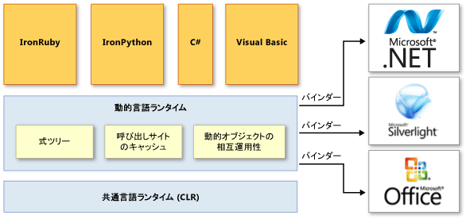

# 動的言語ランタイムの概要Dynamic Language Runtime Overview
*動的言語ランタイム* (DLR) とは、動的言語の一連のサービスを共通言語ランタイム (CLR) に追加するランタイム環境です。The *dynamic language runtime* (DLR) is a runtime environment that adds a set of services for dynamic languages to the common language runtime (CLR). DLR により、.NET Framework 上で実行される動的言語の開発や、静的に型指定された言語への動的機能の追加が簡単になります。The DLR makes it easier to develop dynamic languages to run on the .NET Framework and to add dynamic features to statically typed languages.  
  
 静的に型指定された言語である C# や Visual Basic (`Option Explicit On` を使用する場合) では、オブジェクトの型をデザイン時に指定する必要があるのに対して、動的言語では、オブジェクトの型を実行時に識別できます。Dynamic languages can identify the type of an object at run time, whereas in statically typed languages such as C# and Visual Basic (when you use `Option Explicit On`) you must specify object types at design time. 動的言語の例には、Lisp、Smalltalk、JavaScript、PHP、Ruby、Python、ColdFusion、Lua、Cobra、Groovy などがあります。Examples of dynamic languages are Lisp, Smalltalk, JavaScript, PHP, Ruby, Python, ColdFusion, Lua, Cobra, and Groovy.  
  
 動的言語の多くには、開発者に次の利点があります。Most dynamic languages provide the following advantages for developers:  
  
-   高速フィードバック ループ (REPL、つまり Read-Evaluate-Print Loop) を使用する機能。The ability to use a rapid feedback loop (REPL, or read-evaluate-print loop). この機能により、いくつかのステートメントを入力し、すぐに実行して結果を表示できます。This lets you enter several statements and immediately execute them to see the results.  
  
-   トップダウン式の開発と従来のボトムアップ式の開発の両方に対するサポート。Support for both top-down development and more traditional bottom-up development. たとえば、トップダウン アプローチを使用する場合は、まだ実装されていない関数を呼び出し、後で必要なときに基になる実装を追加できます。For example, when you use a top-down approach, you can call functions that are not yet implemented and then add underlying implementations when you need them.  
  
-   リファクタリングとコード変更の容易さ。コード全体で静的な型宣言を変更する必要がありません。Easier refactoring and code modifications, because you do not have to change static type declarations throughout the code.  
  
 動的言語は、優れたスクリプト言語です。Dynamic languages make excellent scripting languages. 動的言語使用して作成されたアプリケーションは、新しいコマンドや機能を追加してユーザーが簡単に拡張できます。Customers can easily extend applications created by using dynamic languages with new commands and functionality. 動的言語は、Web サイトやテスト ハーネスの作成、サーバー ファームの管理、さまざまなユーティリティの開発、データ変換の実行にもよく使用されます。Dynamic languages are also frequently used for creating Web sites and test harnesses, maintaining server farms, developing various utilities, and performing data transformations.  
  
 DLR の目的は、動的言語のシステムを .NET Framework 上で実行でき、.NET と相互運用できるようにすることです。The purpose of the DLR is to enable a system of dynamic languages to run on the .NET Framework and give them .NET interoperability. DLR は、Visual Studio 2010 の C# と Visual Basic に動的オブジェクトを導入して、これらの言語での動的な動作をサポートし、動的言語との相互運用を可能にします。The DLR introduces dynamic objects to C# and Visual Basic in Visual Studio 2010 to support dynamic behavior in these languages and enable their interoperation with dynamic languages.  
  
 DLR は、動的な操作をサポートするライブラリを作成する場合にも役立ちます。The DLR also helps you create libraries that support dynamic operations. たとえば、XML オブジェクトまたは JavaScript Object Notation (JSON) オブジェクトを使用するライブラリがある場合、DLR を使用する言語では、それらのオブジェクトを動的オブジェクトとして利用できます。For example, if you have a library that uses XML or JavaScript Object Notation (JSON) objects, your objects can appear as dynamic objects to languages that use the DLR. このため、ライブラリ ユーザーは、構文的に簡単でわかりやすいコードを作成して、オブジェクトの操作やオブジェクト メンバーへのアクセスを行うことができます。This lets library users write syntactically simpler and more natural code for operating with objects and accessing object members.  
  
 たとえば、C# では、XML のカウンターをインクリメントするために次のコードを使用します。For example, you might use the following code to increment a counter in XML in C#.  
  
 `Scriptobj.SetProperty("Count", ((int)GetProperty("Count")) + 1);`  
  
 DLR を使用すると、次のコードを代わりに使用して同じ操作を実行できます。By using the DLR, you could use the following code instead for the same operation.  
  
 `scriptobj.Count += 1;`  
  
 CLR と同様に、DLR は .NET Framework の一部であり、.NET Framework および Visual Studio のインストール パッケージに付属しています。Like the CLR, the DLR is a part of the .NET Framework and is provided with the .NET Framework and Visual Studio installation packages. オープン ソース バージョンの DLR は、GitHub の [IronLanguages/dlr](https://github.com/IronLanguages/dlr) リポジトリからダウンロードすることもできます。The open-source version of the DLR is also available for download on the [IronLanguages/dlr](https://github.com/IronLanguages/dlr) repo on GitHub.  
  
> [!NOTE]
>  オープン ソース バージョンの DLR には、Visual Studio および .NET Framework に含まれている DLR の機能がすべて組み込まれています。The open-source version of the DLR has all the features of the DLR that is included in Visual Studio and the .NET Framework. また、言語実装者向けの追加サポートも用意されています。It also provides additional support for language implementers. 詳細については、GitHub の [IronLanguages/dlr](https://github.com/IronLanguages/dlr) リポジトリのドキュメントを参照してください。For more information, see the documentation on the [IronLanguages/dlr](https://github.com/IronLanguages/dlr) repo on GitHub. 
  
 以下は、DLR を使用して開発された言語の例です。Examples of languages developed by using the DLR include the following:  
  
-   IronPython。IronPython. [GitHub](https://github.com/IronLanguages/ironpython2) の Web サイトから、オープン ソース ソフトウェアとして入手できます。Available as open-source software from the [GitHub](https://github.com/IronLanguages/ironpython2) Web site.  
  
-   IronRuby。IronRuby. [RubyForge](http://go.microsoft.com/fwlink/?LinkId=141044) の Web サイトから、オープン ソース ソフトウェアとして入手できます。Available as open-source software from the [RubyForge](http://go.microsoft.com/fwlink/?LinkId=141044) Web site.  
  
## DLR の主な利点Primary DLR Advantages  
 DLR には、次の利点があります。The DLR provides the following advantages.  
  
### 動的言語の .NET Framework への移植を簡略化Simplifies Porting Dynamic Languages to the .NET Framework  
 DLR により、言語実装者は、構文アナライザー、パーサー、セマンティクス アナライザー、コード ジェネレーター、および従来は自身で作成する必要があったその他のツールを作成せずに済みます。The DLR allows language implementers to avoid creating lexical analyzers, parsers, semantic analyzers, code generators, and other tools that they traditionally had to create themselves. DLR を使用する言語では、言語レベルのコードをツリー状の構造で表す*式ツリー*、ランタイム ヘルパー ルーチン、およびオプションとして <xref:System.Dynamic.IDynamicMetaObjectProvider> インターフェイスを実装する動的オブジェクトを生成する必要があります。To use the DLR, a language needs to produce *expression trees*, which represent language-level code in a tree-shaped structure, runtime helper routines, and optional dynamic objects that implement the <xref:System.Dynamic.IDynamicMetaObjectProvider> interface. DLR と .NET Framework により、コード分析タスクやコード生成タスクの多くの部分が自動化されます。The DLR and the .NET Framework automate a lot of code analysis and code generation tasks. このため、言語実装者は固有の言語機能に集中できます。This enables language implementers to concentrate on unique language features.  
  
### 静的に型指定された言語での動的機能を使用が可能Enables Dynamic Features in Statically Typed Languages  
 C# や Visual Basic などの既存の .NET Framework 言語では、動的オブジェクトを作成し、静的に型指定されたオブジェクトと一緒に使用できます。Existing .NET Framework languages such as C# and Visual Basic can create dynamic objects and use them together with statically typed objects. たとえば、C# や Visual Basic で、HTML、ドキュメント オブジェクト モデル (DOM)、および .NET リフレクションの動的オブジェクトを使用できます。For example, C# and Visual Basic can use dynamic objects for HTML, Document Object Model (DOM), and .NET reflection.  
  
### DLR と .NET Framework の将来的な利点の活用Provides Future Benefits of the DLR and .NET Framework  
 DLR を使用して実装された言語は、DLR と .NET Framework で将来的に強化される機能を活用できます。Languages implemented by using the DLR can benefit from future DLR and .NET Framework improvements. たとえば、ガベージ コレクターの強化やアセンブリの読み込み時間の高速化が盛り込まれた .NET Framework の新しいバージョンがリリースされた場合、DLR を使用して実装された言語は、その恩恵をすぐに受けます。For example, if the .NET Framework releases a new version that has an improved garbage collector or faster assembly loading time, languages implemented by using the DLR immediately get the same benefit. 同様に、コンパイルの向上など、DLR の最適化が行われた場合は、DLR を使用して実装されたすべての言語でもパフォーマンスが向上します。If the DLR adds optimizations such as better compilation, the performance also improves for all languages implemented by using the DLR.  
  
### ライブラリとオブジェクトの共有が可能Enables Sharing of Libraries and Objects  
 ある言語で実装されたオブジェクトとライブラリを、他の言語で使用できます。The objects and libraries implemented in one language can be used by other languages. また、DLR では、静的に型指定された言語と動的言語の間の相互運用も可能になります。The DLR also enables interoperation between statically typed and dynamic languages. たとえば、動的言語で記述されたライブラリを使用する動的オブジェクトを C# で宣言できます。For example, C# can declare a dynamic object that uses a library that is written in a dynamic language. 同時に、.NET Framework のライブラリを動的言語で使用できます。At the same time, dynamic languages can use libraries from the .NET Framework.  
  
### 迅速な動的ディスパッチと呼び出しの実現Provides Fast Dynamic Dispatch and Invocation  
 DLR では、高度なポリモーフィック キャッシュをサポートすることで、迅速な動的操作を提供します。The DLR provides fast execution of dynamic operations by supporting advanced polymorphic caching. DLR は、オブジェクトを使用する操作を必要なランタイムの実装にバインドする規則を作成し、それらの規則をキャッシュします。これにより、同じ型のオブジェクトで同じコードが連続的に実行されるときに、リソースを大量に消費するバインド計算の発生を防ぎます。The DLR creates rules for binding operations that use objects to the necessary runtime implementations and then caches these rules to avoid resource-exhausting binding computations during successive executions of the same code on the same types of objects.  
  
## DLR のアーキテクチャDLR Architecture  
 動的言語ランタイムのアーキテクチャを次の図に示します。The following illustration shows the architecture of the dynamic language runtime.  
  
   
DLR のアーキテクチャDLR architecture  
  
 DLR は、動的言語のサポートを強化するために一連のサービスを CLR に追加します。The DLR adds a set of services to the CLR for better supporting dynamic languages. これらのサービスには、次のようなものが含まれます。These services include the following:  
  
-   式ツリー。Expression trees. DLR では、式ツリーを使用して言語のセマンティクスを表します。The DLR uses expression trees to represent language semantics. この目的から、DLR では LINQ の式ツリーが拡張され、制御フロー、代入、およびその他の言語モデリング ノードが追加されています。For this purpose, the DLR has extended LINQ expression trees to include control flow, assignment, and other language-modeling nodes. 詳細については、「[式ツリー](http://msdn.microsoft.com/library/fb1d3ed8-d5b0-4211-a71f-dd271529294b)」を参照してください。For more information, see [Expression Trees](http://msdn.microsoft.com/library/fb1d3ed8-d5b0-4211-a71f-dd271529294b).  
  
-   呼び出しサイトのキャッシュ。Call site caching. *動的呼び出しサイト*とは、動的オブジェクトに `a + b` や `a.b()` などの操作を実行するコード内の場所です。A *dynamic call site* is a place in the code where you perform an operation like `a + b` or `a.b()` on dynamic objects. DLR は、`a` と `b` の特性 (通常はこれらのオブジェクトの型) や操作に関する情報をキャッシュします。The DLR caches the characteristics of `a` and `b` (usually the types of these objects) and information about the operation. 同様の操作が以前に実行されていた場合、DLR は、必要なすべての情報をキャッシュから取得して、高速なディスパッチを実現します。If such an operation has been performed previously, the DLR retrieves all the necessary information from the cache for fast dispatch.  
  
-   動的オブジェクトの相互運用性。Dynamic object interoperability. DLR には、動的オブジェクトと操作を表し、言語実装者や動的ライブラリの作成者が使用できるクラスとインターフェイスのセットが用意されています。The DLR provides a set of classes and interfaces that represent dynamic objects and operations and can be used by language implementers and authors of dynamic libraries. このようなクラスやインターフェイスには、<xref:System.Dynamic.IDynamicMetaObjectProvider><xref:System.Dynamic.DynamicMetaObject><xref:System.Dynamic.DynamicObject> および <xref:System.Dynamic.ExpandoObject> があります。These classes and interfaces include <xref:System.Dynamic.IDynamicMetaObjectProvider>, <xref:System.Dynamic.DynamicMetaObject>, <xref:System.Dynamic.DynamicObject>, and <xref:System.Dynamic.ExpandoObject>.  
  
 DLR では、呼び出しサイトのバインダーを使用して、.NET Framework だけでなく、Silverlight や COM などの他のインフラストラクチャやサービスとも通信します。The DLR uses binders in call sites to communicate not only with the .NET Framework, but with other infrastructures and services, including Silverlight and COM. バインダーは、言語のセマンティクスをカプセル化し、式ツリーを使用して呼び出しサイトの操作を実行する方法を指定します。Binders encapsulate a language's semantics and specify how to perform operations in a call site by using expression trees. これにより、DLR を使用する動的言語および静的に型指定された言語で、ライブラリを共有し、DLR がサポートするすべてのテクノロジを利用できるようになります。This enables dynamic and statically typed languages that use the DLR to share libraries and gain access to all the technologies that the DLR supports.  
  
## DLR に関するドキュメントDLR Documentation  
 言語に動的な動作を追加するためにオープン ソース バージョンの DLR を使用する方法、または .NET Framework で動的言語の使用を有効にする方法については、GitHub の [IronLanguages/dlr](https://github.com/IronLanguages/dlr/tree/master/Docs) のドキュメントを参照してください。For more information about how to use the open source version of the DLR to add dynamic behavior to a language, or about how to enable the use of a dynamic language with the .NET Framework, see the documentation on the [IronLanguages/dlr](https://github.com/IronLanguages/dlr/tree/master/Docs) repo on GitHub.  
  
## 参照See Also  
 <xref:System.Dynamic.ExpandoObject>  
 <xref:System.Dynamic.DynamicObject>  
 [共通言語ランタイムCommon Language Runtime](../../../docs/standard/clr.md)  
 [式ツリーExpression Trees](http://msdn.microsoft.com/library/fb1d3ed8-d5b0-4211-a71f-dd271529294b)  
 [チュートリアル: 動的オブジェクトの作成と使用Walkthrough: Creating and Using Dynamic Objects](~/docs/csharp/programming-guide/types/walkthrough-creating-and-using-dynamic-objects.md)
