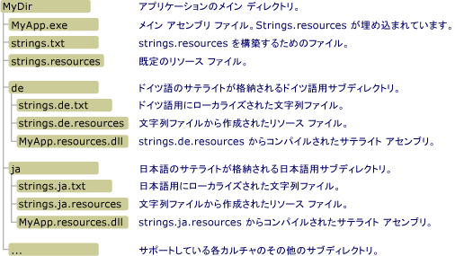

# <a name="creating-satellite-assemblies-for-desktop-apps"></a>デスクトップ アプリケーションに対するサテライト アセンブリの作成
リソース ファイルはローカライズされたアプリケーションの中心的な役割を果たします。 これを使用することで、アプリケーションでは、ユーザー固有の言語とカルチャで文字列、イメージ、およびその他のデータを表示し、ユーザー固有の言語またはカルチャ用のリソースが使用できない場合には代替データを提供できるようになります。 .NET Framework ではハブ アンド スポーク モデルを使用して、ローカライズされたリソースを見つけて取得します。 ハブはニュートラルまたは既定のカルチャと呼ばれる、単一カルチャ用のリソースとローカライズできない実行可能コードを含むメイン アセンブリです。 既定のカルチャはアプリケーションで使用されるフォールバック カルチャです。これは、ローカライズされたリソースが使用できない場合に使用されます。 アプリケーションの既定のカルチャにカルチャを指定するために <xref:System.Resources.NeutralResourcesLanguageAttribute> 属性を使用します。 各スポークは、単一のローカライズされたカルチャ用のリソースを含むがコードは含まないサテライト アセンブリに接続します。 サテライト アセンブリはメイン アセンブリには含まれないため、アプリケーションのメイン アセンブリを置換しなくても、特定のカルチャに対応するリソースを簡単に更新または置換できます。  
  
> [!NOTE]
>  アプリケーションの既定のカルチャのリソースは、サテライト アセンブリにも格納できます。 これを行うには、<xref:System.Resources.NeutralResourcesLanguageAttribute> 属性に <xref:System.Resources.UltimateResourceFallbackLocation.Satellite?displayProperty=nameWithType> の値を割り当てます。  
  
## <a name="satellite-assembly-name-and-location"></a>サテライト アセンブリの名前と場所  
 ハブ アンド スポーク モデルでは、簡単に見つけて使用できるように、リソースを特定の場所に配置する必要があります。 リソースのコンパイルと名前の指定を適切に行わなかった場合や、リソースを適切な場所に配置しなかった場合、共通言語ランタイムはリソースを見つけることができず、代わりに既定のカルチャのリソースを使用します。 <xref:System.Resources.ResourceManager> オブジェクトによって表される .NET Framework リソース マネージャーは、ローカライズされたリソースに自動的にアクセスするために使用されます。 リソース マネージャーでは以下が必要になります。  
  
-   単一のサテライト アセンブリには、特定のカルチャ用のリソースをすべて含める必要があります。 つまり、複数の .txt ファイルまたは .resx ファイルを単一のバイナリ .resources ファイルにコンパイルする必要があります。  
  
-   それぞれのローカライズされたカルチャ用のアプリケーション ディレクトリに個別のサブディレクトリが必要になります。ここには、そのカルチャのリソースが格納されます。 サブディレクトリ名は、カルチャ名と同じである必要があります。 グローバル アセンブリ キャッシュにサテライト アセンブリを格納することもできます。 この場合、アセンブリの厳密な名前のカルチャ情報コンポーネントでそのカルチャを示す必要があります  (このトピックの後半の「[グローバル アセンブリ キャッシュへのサテライト アセンブリのインストール](#SN)」セクションを参照してください)。  
  
    > [!NOTE]
    >  アプリケーションにサブカルチャ用のリソースを含める場合は、アプリケーション ディレクトリの下の個別のサブディレクトリにそれぞれサブカルチャを配置します。 メイン カルチャのディレクトリの下のサブディレクトリにサブカルチャを配置しないでください。  
  
-   サテライト アセンブリはアプリケーションと同じ名前を持つ必要があり、ファイル名拡張子として ".resources.dll" を使用する必要があります。 たとえば、アプリケーションが Example.exe という名前である場合、各サテライト アセンブリの名前は Example.resources.dll でなければなりません。 サテライト アセンブリ名は、リソース ファイルのカルチャを示していないことに注意してください。 ただし、サテライト アセンブリは、カルチャを指定するディレクトリに表示されます。  
  
-   サテライト アセンブリのカルチャに関する情報は、アセンブリのメタデータに含まれている必要があります。 サテライト アセンブリのメタデータにカルチャ名を格納するには、サテライト アセンブリにリソースを埋め込むために [Assembly Linker](../../../docs/framework/tools/al-exe-assembly-linker.md) を使用する際に `/culture` オプションを指定します。  
  
 [グローバル アセンブリ キャッシュ](../../../docs/framework/app-domains/gac.md)内にインストールしないアプリケーションについて、サンプルのディレクトリ構造と位置に関する要件を次の図に示します。 拡張子が .txt および .resources の項目は、最終的なアプリケーションには付属していません。 それらは、最終的なサテライト リソース アセンブリを作成するために使用する中間リソース ファイルです。 この例では、.txt ファイルを .resx ファイルに置き換えることができます。 詳細については、「[リソースのパッケージ化と配置](../../../docs/framework/resources/packaging-and-deploying-resources-in-desktop-apps.md)」を参照してください。  
  
   
サテライト アセンブリ ディレクトリ  
  
## <a name="compiling-satellite-assemblies"></a>コンパイル (サテライト アセンブリの)  
 バイナリ .resources ファイルにリソースを含む XML ファイル (.resx) または、テキスト ファイルをコンパイルするために [リソース ファイル ジェネレーター (Resgen.exe)](../../../docs/framework/tools/resgen-exe-resource-file-generator.md) を使用します。 その後、サテライト アセンブリに .resources ファイルをコンパイルするために [アセンブリ リンカー (Al.exe)](../../../docs/framework/tools/al-exe-assembly-linker.md) を使用します。 Al.exe は、指定された .resources ファイルからアセンブリを作成します。 サテライト アセンブリにはリソースのみを含めることができます。実行可能コードを含めることはできません。  
  
 次の Al.exe コマンドでは、ドイツ語のリソース ファイル strings.de.resources からアプリケーション `Example` 用のサテライト アセンブリを作成します。  
  
```console
al -target:lib -embed:strings.de.resources -culture:de -out:Example.resources.dll  
```  
  
 また、次の Al.exe コマンドでは、ファイル strings.de.resources からアプリケーション `Example` 用のサテライト アセンブリを作成します。 **/template** オプションを指定すると、サテライト アセンブリは親アセンブリ (Example.dll) のカルチャ情報を除き、すべてのアセンブリ メタデータを継承します。  
  
```console
al -target:lib -embed:strings.de.resources -culture:de -out:Example.resources.dll -template:Example.dll  
```  
  
 次の表では、これらのコマンドで使用する Al.exe オプションについてさらに詳しく説明します。  
  
|オプション|説明|  
|------------|-----------------|  
|**/target:** lib|サテライト アセンブリがライブラリ (.dll) ファイルにコンパイルされることを示します。 サテライト アセンブリが実行可能コードを含まず、アプリケーションのメイン アセンブリではないため、サテライト アセンブリは DLL として保存する必要があります。|  
|**/embed:** strings.de.resources|Al.exe でのアセンブリのコンパイル時に埋め込むリソース ファイルの名前を指定します。 サテライト アセンブリに複数の .resources ファイルを埋め込むことはできますが、ハブ アンド スポーク モデルに従う場合は、カルチャごとに 1 つのサテライト アセンブリをコンパイルする必要があります。 ただし、文字列とオブジェクトに対して別の .resources ファイルを作成することができます。|  
|**/culture:** de|コンパイルするリソースのカルチャを指定します。 共通言語ランタイムは、指定されたカルチャ用のリソースを検索するときに、この情報を使用します。 このオプションを省略しても、Al.exe ではリソースがコンパイルされますが、ランタイムはユーザーからの要求時にリソースを見つけられなくなります。|  
|**/out:** Example.resources.dll|出力ファイルの名前を指定します。 名前は命名標準 *baseName*.resources.*extension* に従う必要があります。ここで、*baseName* はメイン アセンブリの名前、*extension* は有効なファイル名拡張子 (.dll など) です。 ランタイムは、出力ファイルの名前でサテライト アセンブリのカルチャを判断することはできないことに注意してください。**/culture** オプションを使用して指定する必要があります。|  
|**/template:** Example.dll|カルチャ フィールドを除く、すべてのアセンブリ メタデータをサテライト アセンブリが継承するアセンブリを指定します。 このオプションがサテライト アセンブリに影響するのは、[厳密な名前](../../../docs/framework/app-domains/strong-named-assemblies.md)を持つアセンブリを指定する場合のみです。|  
  
 Al.exe で使用できるオプションの一覧については、「[アセンブリ リンカー (Al.exe)](../../../docs/framework/tools/al-exe-assembly-linker.md)」を参照してください。  
  
## <a name="satellite-assemblies-an-example"></a>サテライト アセンブリ: 例  
 ローカライズされたあいさつ文を含むメッセージ ボックスを表示する "Hello world" の簡単な例を以下に示します。 この例には、英語 (米国)、フランス語 (フランス)、ロシア語 (ロシア) のカルチャ用のリソースが含まれており、そのフォールバック カルチャは英語です。 例を作成するには、次の手順を実行します。  
  
1.  既定のカルチャのリソースを含める Greeting.resx または Greeting.txt という名前のリソース ファイルを作成します。 値が "Hello world!" の `HelloString` という名前の 1 つの文字列を このファイルに格納します。  
  
2.  英語 (en) がアプリケーションの既定のカルチャであることを示すには、次の <xref:System.Resources.NeutralResourcesLanguageAttribute?displayProperty=nameWithType> 属性をアプリケーションの AssemblyInfo ファイル、またはアプリケーションのメイン アセンブリにコンパイルされるメイン ソース コード ファイルに追加します。  
  
     [!code-csharp[Conceptual.Resources.Locating#2](../../../samples/snippets/csharp/VS_Snippets_CLR/conceptual.resources.locating/cs/assemblyinfo.cs#2)]
     [!code-vb[Conceptual.Resources.Locating#2](../../../samples/snippets/visualbasic/VS_Snippets_CLR/conceptual.resources.locating/vb/assemblyinfo.vb#2)]  
  
3.  次のように、アプリケーションに他のカルチャ (en-US、fr-FR および ru-RU) のサポートを追加します。  
  
    -   en-US、つまり、英語 (米国) カルチャをサポートするには、Greeting.en-US.resx または Greeting.en-US.txt という名前のリソース ファイルを作成し、値が "Hi world!" の `HelloString` という名前の 1 つの文字列を格納します。  
  
    -   fr-FR、つまり、フランス語 (フランス) カルチャをサポートするには、Greeting.fr-FR.resx または Greeting.fr-FR.txt という名前のリソース ファイルを作成し、値が "Salut tout le monde!" の `HelloString` という名前の 1 つの文字列を格納します。  
  
    -   ru-RU、つまり、ロシア語 (ロシア) カルチャをサポートするには、Greeting.ru-RU.resx または Greeting.ru-RU.txt という名前のリソース ファイルを作成し、値が "Всем привет!" の `HelloString` という名前の 1 つの文字列を格納します。  
  
4.  [Resgen.exe](../../../docs/framework/tools/resgen-exe-resource-file-generator.md) を使用して、バイナリ .resources ファイルに各テキストまたは XML リソース ファイルをコンパイルします。 出力は、.resx ファイルまたは .txt ファイルと同じルート ファイル名を持つファイル セットです。ただし、拡張子は .resources になります。 Visual Studio で例を作成する場合は、コンパイル プロセスが自動的に処理されます。 Visual Studio を使用していない場合は、次のコマンドを実行して .resx ファイルを .resources ファイルにコンパイルします。  
  
    ```console
    resgen Greeting.resx  
    resgen Greeting.en-us.resx  
    resgen Greeting.fr-FR.resx  
    resgen Greeting.ru-RU.resx  
    ```  
  
     リソースが XML ファイルではなく、テキスト ファイルにある場合は、.resx 拡張子を .txt に置き換えます。  
  
5.  アプリケーションのメイン アセンブリに、既定のカルチャのリソースと一緒に次のソース コードをコンパイルします。  
  
    > [!IMPORTANT]
    >  Visual Studio ではなく、コマンド ラインを使用して例を作成する場合は、<xref:System.Resources.ResourceManager> クラス コンストラクターの呼び出しを `ResourceManager rm = new ResourceManager("Greetings", typeof(Example).Assembly);` に変更する必要があります。  
  
     [!code-csharp[Conceptual.Resources.Locating#1](../../../samples/snippets/csharp/VS_Snippets_CLR/conceptual.resources.locating/cs/program.cs#1)]
     [!code-vb[Conceptual.Resources.Locating#1](../../../samples/snippets/visualbasic/VS_Snippets_CLR/conceptual.resources.locating/vb/module1.vb#1)]  
  
     アプリケーションが Example という名前で、コマンド ラインからコンパイルする場合、C# コンパイラのコマンドは次のようになります。  
  
    ```console  
    csc Example.cs -res:Greeting.resources  
    ```  
  
     対応する Visual Basic コンパイラのコマンドは次のようになります。  
  
    ```console  
    vbc Example.vb -res:Greeting.resources  
    ```  
  
6.  アプリケーションでサポートされているそれぞれのローカライズされたカルチャのメイン アプリケーション ディレクトリに、サブディレクトリを作成します。 en-US、fr-FR および ru-RU サブディレクトリを作成する必要があります。 Visual Studio では、コンパイル プロセスの一環として、これらのサブディレクトリが自動的に作成されます。  
  
7.  個々のカルチャ固有の .resources ファイルをサテライト アセンブリに埋め込み、適切なディレクトリに保存します。 各 .resources ファイルでこれを行う場合のコマンドは次のようになります。  
  
    ```console
    al -target:lib -embed:Greeting.culture.resources -culture:culture -out:culture\Example.resources.dll  
    ```  
  
     ここで、*culture* はリソースがサテライト アセンブリに含まれるカルチャの名前です。 Visual Studio ではこのプロセスが自動的に処理されます。  
  
 その後、例を実行できます。 サポートされているカルチャのいずれかがランダムに選択され、現在のカルチャになり、ローカライズされたあいさつ文が表示されます。  
  
<a name="SN"></a>   
## <a name="installing-satellite-assemblies-in-the-global-assembly-cache"></a>グローバル アセンブリ キャッシュへのサテライト アセンブリのインストール  
 ローカル アプリケーション サブディレクトリにアセンブリをインストールする代わりに、グローバル アセンブリ キャッシュにインストールすることができます。 これは、複数のアプリケーションで使用されるクラス ライブラリのリソース アセンブリとクラス ライブラリがある場合に特に便利です。  
  
 アセンブリをグローバル アセンブリ キャッシュにインストールするには、アセンブリに厳密な名前が必要です。 厳密な名前のアセンブリには、有効な公開/秘密キーのペアで署名されます。 これらには、バインド要求を満たすために使用するアセンブリを判別するためにランタイムが使用するバージョン情報が含まれています。 厳密な名前とバージョン管理の詳細については、「[アセンブリのバージョン管理](../../../docs/framework/app-domains/assembly-versioning.md)」を参照してください。 厳密な名前の詳細については、「[厳密な名前付きアセンブリ](../../../docs/framework/app-domains/strong-named-assemblies.md)」を参照してください。  
  
 通常、アプリケーションの開発中に、最終的な公開/秘密キーのペアにアクセスすることはありません。 サテライト アセンブリをグローバル アセンブリ キャッシュ内にインストールし、そのアセンブリが確実に予期したとおりに機能するようにするために、遅延署名と呼ばれる技術を使用できます。 アセンブリに遅延署名する場合、厳密な名前による署名のために、ビルド時にファイル内のスペースを予約しておいてください。 実際の署名は、最終的な公開/秘密キーのペアが利用可能になるまで遅延されます。 遅延署名の詳細については、「[アセンブリへの遅延署名](../../../docs/framework/app-domains/delay-sign-assembly.md)」を参照してください。  
  
### <a name="obtaining-the-public-key"></a>公開キーの取得  
 アセンブリに遅延署名するには、公開キーにアクセスする必要があります。 実際の公開キーを取得するには、最終的な署名を行う社内の組織から取得するか、[厳密な名前ツール (Sn.exe)](../../../docs/framework/tools/sn-exe-strong-name-tool.md) を使用して公開キーを作成します。  
  
 次の Sn.exe コマンドでは、テスト用の公開/秘密キーのペアを作成します。 **–k** オプションは、Sn.exe で新しいキー ペアを作成し、TestKeyPair.snk という名前のファイルに格納するように指定します。  
  
```console
sn –k TestKeyPair.snk   
```  
  
 テスト用のキー ペアを含むファイルから公開キーを抽出できます。 次のコマンドでは、TestKeyPair.snk から公開キーを抽出し、PublicKey.snk に保存します。  
  
```console
sn –p TestKeyPair.snk PublicKey.snk  
```  
  
### <a name="delay-signing-an-assembly"></a>アセンブリへの遅延署名  
 公開キーを取得または作成したら、[アセンブリ リンカー (Al.exe)](../../../docs/framework/tools/al-exe-assembly-linker.md) を使用して、アセンブリをコンパイルし、遅延署名を指定します。  
  
 次の Al.exe コマンドでは、strings.ja.resources ファイルからアプリケーション StringLibrary 用の厳密な名前のサテライト アセンブリを作成します。  
  
```console 
al -target:lib -embed:strings.ja.resources -culture:ja -out:StringLibrary.resources.dll -delay+ -keyfile:PublicKey.snk  
```  
  
 **/delay+** オプションは、アセンブリ リンカーがアセンブリに遅延署名することを指定します。 **/keyfile** オプションは、アセンブリへの遅延署名のために使用する公開キーを含むキー ファイルの名前を指定します。  
  
### <a name="re-signing-an-assembly"></a>アセンブリへの再署名  
 アプリケーションを配置する前に、実際のキー ペアで遅延署名されたサテライト アセンブリに再署名する必要があります。 これは Sn.exe を使用して行うことができます。  
  
 次の Sn.exe コマンドでは、ファイル RealKeyPair.snk に格納されているキーのペアで StringLibrary.resources.dll に署名します。 **–R** オプションは、以前に署名または遅延署名されたアセンブリに再署名する必要があることを指定します。  
  
```console
sn –R StringLibrary.resources.dll RealKeyPair.snk   
```  
  
### <a name="installing-a-satellite-assembly-in-the-global-assembly-cache"></a>グローバル アセンブリ キャッシュへのサテライト アセンブリのインストール  
 ランタイムはリソース フォールバック プロセスでリソースを検索するときに、まず、[グローバル アセンブリ キャッシュ](../../../docs/framework/app-domains/gac.md)内を調べます  (詳細については、「[リソースのパッケージ化と配置](../../../docs/framework/resources/packaging-and-deploying-resources-in-desktop-apps.md)」トピックの「リソース フォールバック プロセス」セクションを参照してください)。サテライト アセンブリが厳密な名前で署名されたらすぐに[グローバル アセンブリ キャッシュ ツール (Gacutil.exe)](../../../docs/framework/tools/gacutil-exe-gac-tool.md) を使用して、グローバル アセンブリ キャッシュにインストールできます。  
  
 次の Gacutil.exe コマンドでは、グローバル アセンブリ キャッシュに StringLibrary.resources.dll をインストールします。  
  
```console
gacutil -i:StringLibrary.resources.dll  
```  
  
 **/i** オプションは、Gacutil.exe でグローバル アセンブリ キャッシュに指定されたアセンブリをインストールする必要があることを指定します。 サテライト アセンブリがキャッシュにインストールされた後、中に含まれるリソースは、サテライト アセンブリを使用するようにデザインされたすべてのアプリケーションで使用できるようになります。  
  
### <a name="resources-in-the-global-assembly-cache-an-example"></a>グローバル アセンブリ キャッシュのリソース: 例  
 次の例では、.NET Framework クラス ライブラリのメソッドを使用して、リソース ファイルからローカライズされたあいさつ文を抽出して返します。 ライブラリとそのリソースはグローバル アセンブリ キャッシュに登録されます。 例には、英語 (米国)、フランス語 (フランス)、ロシア語 (ロシア)、および英語カルチャ用のリソースが含まれています。 英語は既定のカルチャです。そのリソースはメイン アセンブリに格納されます。 この例では、最初に公開キーでライブラリとそのサテライト アセンブリに遅延署名してから、公開/秘密キーのペアで再署名します。 例を作成するには、次の手順を実行します。  
  
1.  Visual Studio を使用していない場合は、次の[厳密な名前ツール (Sn.exe)](../../../docs/framework/tools/sn-exe-strong-name-tool.md) コマンドを使用して、ResKey.snk という名前の公開/秘密キーのペアを作成します。  
  
    ```console
    sn –k ResKey.snk  
    ```  
  
     Visual Studio を使用している場合は、プロジェクトの **[プロパティ]** ダイアログ ボックスの **[署名]** タブを使用して、キー ファイルを生成します。  
  
2.  次の[厳密な名前ツール (Sn.exe)](../../../docs/framework/tools/sn-exe-strong-name-tool.md) コマンドを使用して、PublicKey.snk という名前の公開キー ファイルを作成します。  
  
    ```console
    sn –p ResKey.snk PublicKey.snk  
    ```  
  
3.  既定のカルチャのリソースを含める Strings.resx という名前のリソース ファイルを作成します。 値が "How do you do?" の `Greeting` という名前の 1 つの文字列を そのファイルに格納します。  
  
4.  "en" がアプリケーションの既定のカルチャであることを示すには、次の <xref:System.Resources.NeutralResourcesLanguageAttribute?displayProperty=nameWithType> 属性をアプリケーションの AssemblyInfo ファイル、またはアプリケーションのメイン アセンブリにコンパイルされるメイン ソース ファイルに追加します。  
  
     [!code-csharp[Conceptual.Resources.Satellites#2](../../../samples/snippets/csharp/VS_Snippets_CLR/conceptual.resources.satellites/cs/stringlibrary.cs#2)]
     [!code-vb[Conceptual.Resources.Satellites#2](../../../samples/snippets/visualbasic/VS_Snippets_CLR/conceptual.resources.satellites/vb/stringlibrary.vb#2)]  
  
5.  次のように、アプリケーションに他のカルチャ (en-US、fr-FR および ru-RU カルチャ) のサポートを追加します。  
  
    -   "en-US"、つまり、英語 (米国) カルチャをサポートするには、Strings.en-US.resx または Strings.en-US.txt という名前のリソース ファイルを作成し、値が "Hello!" の `Greeting` という名前の 1 つの文字列をそのファイルに格納します。  
  
    -   "fr-FR"、つまり、フランス語 (フランス) カルチャをサポートするには、Strings.fr-FR.resx または Strings.fr-FR.txt という名前のリソース ファイルを作成し、値が "Bon jour!" の `Greeting` という名前の 1 つの文字列をそのファイルに格納します。  
  
    -   "ru-RU"、つまり、ロシア語 (ロシア) カルチャをサポートするには、Strings.ru-RU.resx または Strings.ru-RU.txt という名前のリソース ファイルを作成し、値が "Привет!" の `Greeting` という名前の 1 つの文字列をそのファイルに格納します。  
  
6.  [Resgen.exe](../../../docs/framework/tools/resgen-exe-resource-file-generator.md) を使用して、バイナリ .resources ファイルに各テキストまたは XML リソース ファイルをコンパイルします。 出力は、.resx ファイルまたは .txt ファイルと同じルート ファイル名を持つファイル セットです。ただし、拡張子は .resources になります。 Visual Studio で例を作成する場合は、コンパイル プロセスが自動的に処理されます。 Visual Studio を使用していない場合は、次のコマンドを実行して .resx ファイルを .resources ファイルにコンパイルします。  
  
    ```console
    resgen filename  
    ```  
  
     ここで、*filename* は .resx ファイルまたはテキスト ファイルの省略可能なパス、ファイル名、および拡張子です。  
  
7.  StringLibrary.dll という名前の遅延署名されたライブラリ アセンブリに、既定のカルチャのリソースと一緒に StringLibrary.vb または StringLibrary.cs の次のソース コードをコンパイルします。  
  
    > [!IMPORTANT]
    >  Visual Studio ではなく、コマンド ラインを使用して例を作成する場合は、<xref:System.Resources.ResourceManager> クラス コンストラクターの呼び出しを `ResourceManager rm = new ResourceManager("Strings",` `typeof(Example).Assembly);` に変更する必要があります。  
  
     [!code-csharp[Conceptual.Resources.Satellites#1](../../../samples/snippets/csharp/VS_Snippets_CLR/conceptual.resources.satellites/cs/stringlibrary.cs#1)]
     [!code-vb[Conceptual.Resources.Satellites#1](../../../samples/snippets/visualbasic/VS_Snippets_CLR/conceptual.resources.satellites/vb/stringlibrary.vb#1)]  
  
     C# コンパイラのコマンドは次のようになります。  
  
    ```console
    csc -t:library -resource:Strings.resources -delaysign+ -keyfile:publickey.snk StringLibrary.cs  
    ```  
  
     対応する Visual Basic コンパイラのコマンドは次のようになります。  
  
    ```console  
    vbc -t:library -resource:Strings.resources -delaysign+ -keyfile:publickey.snk StringLibrary.vb  
    ```  
  
8.  アプリケーションでサポートされているそれぞれのローカライズされたカルチャのメイン アプリケーション ディレクトリに、サブディレクトリを作成します。 en-US、fr-FR および ru-RU サブディレクトリを作成する必要があります。 Visual Studio では、コンパイル プロセスの一環として、これらのサブディレクトリが自動的に作成されます。 すべてのサテライト アセンブリが同じファイル名を持つため、公開/秘密キーのペアで署名されるまで個々のカルチャ固有のサテライト アセンブリを格納するためにはサブディレクトリが使用されます。  
  
9. 個々のカルチャ固有の .resources ファイルを遅延署名されたサテライト アセンブリに埋め込み、適切なディレクトリに保存します。 各 .resources ファイルでこれを行う場合のコマンドは次のようになります。  
  
    ```console
    al -target:lib -embed:Strings.culture.resources -culture:culture -out:culture\StringLibrary.resources.dll -delay+ -keyfile:publickey.snk  
    ```  
  
     ここで、*culture* はカルチャの名前です。 この例では、カルチャ名は en-US、fr-FR、および ru-RU です。  
  
10. 次のように、[厳密な名前ツール (Sn.exe)](../../../docs/framework/tools/sn-exe-strong-name-tool.md) を使用して、StringLibrary.dll に再署名します。  
  
    ```console
    sn –R StringLibrary.dll RealKeyPair.snk  
    ```  
  
11. 個々のサテライト アセンブリに再署名します。 これを行うには、各サテライト アセンブリに対して、次のように[厳密な名前ツール (Sn.exe)](../../../docs/framework/tools/sn-exe-strong-name-tool.md) を使用します。  
  
    ```console
    sn –R StringLibrary.resources.dll RealKeyPair.snk  
    ```  
  
12. 次のコマンドを使用して、グローバル アセンブリ キャッシュに StringLibrary.dll とそのサテライト アセンブリをそれぞれ登録します。  
  
    ```console
    gacutil -i filename  
    ```  
  
     ここで、*filename* は登録するファイルの名前です。  
  
13. Visual Studio を使用している場合は、`Example` という名前の新しい**コンソール アプリケーション** プロジェクトを作成し、StringLibrary.dll への参照と次のソース コードを追加してコンパイルします。  
  
     [!code-csharp[Conceptual.Resources.Satellites#3](../../../samples/snippets/csharp/VS_Snippets_CLR/conceptual.resources.satellites/cs/example.cs#3)]
     [!code-vb[Conceptual.Resources.Satellites#3](../../../samples/snippets/visualbasic/VS_Snippets_CLR/conceptual.resources.satellites/vb/example.vb#3)]  
  
     コマンド ラインからコンパイルするには、C# コンパイラの次のコマンドを使用します。  
  
    ```console
    csc Example.cs -r:StringLibrary.dll   
    ```  
  
     Visual Basic コンパイラのコマンド ラインは次のとおりです。  
  
    ```console
    vbc Example.vb -r:StringLibrary.dll   
    ```  
  
14. Example.exe を実行します。  
  
## <a name="see-also"></a>参照  
 [リソースのパッケージ化と配置](../../../docs/framework/resources/packaging-and-deploying-resources-in-desktop-apps.md)  
 [アセンブリへの遅延署名](../../../docs/framework/app-domains/delay-sign-assembly.md)  
 [Al.exe (アセンブリ リンカー)](../../../docs/framework/tools/al-exe-assembly-linker.md)  
 [Sn.exe (厳密名ツール)](../../../docs/framework/tools/sn-exe-strong-name-tool.md)  
 [Gacutil.exe (グローバル アセンブリ キャッシュ ツール)](../../../docs/framework/tools/gacutil-exe-gac-tool.md)  
 [デスクトップ アプリケーションのリソース](../../../docs/framework/resources/index.md)
