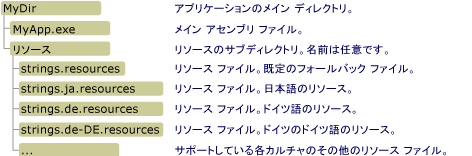

# <a name="retrieving-resources-in-desktop-apps"></a>デスクトップ アプリケーションのリソースの取得
ローカライズされたリソースを NET Framework デスクトップ アプリケーションで使用する場合は、既定カルチャまたはニュートラル カルチャ用のリソースをメイン アセンブリと共にパッケージ化し、アプリでサポートされている言語またはカルチャごとに個別のサテライト アセンブリを作成することが理想的です。 名前付きリソースには、次のセクションで説明する <xref:System.Resources.ResourceManager> クラスを使用してアクセスすることができます。 目的のリソースをメイン アセンブリおよびサテライト アセンブリに埋め込まない場合でも、.resources バイナリ ファイルには直接アクセスすることができます。詳細については、「 [.resources ファイルからのリソースの取得](#from_file) 」セクションを参照してください。  [!INCLUDE[win8_appname_long](../../../includes/win8-appname-long-md.md)] アプリでリソースを取得するには、Windows デベロッパー センターの「 [Windows ストア アプリでのリソースの作成と取得](http://go.microsoft.com/fwlink/p/?LinkID=241674) 」を参照してください。  
  
<a name="from_assembly"></a>   
## <a name="retrieving-resources-from-assemblies"></a>アセンブリからのリソースの取得  
 <xref:System.Resources.ResourceManager> クラスでは、実行時にリソースにアクセスすることができます。 文字列リソースを取得するには <xref:System.Resources.ResourceManager.GetString%2A?displayProperty=fullName> メソッドを使用し、文字列以外のリソースを取得するには <xref:System.Resources.ResourceManager.GetObject%2A?displayProperty=fullName> メソッドまたは <xref:System.Resources.ResourceManager.GetStream%2A?displayProperty=fullName> メソッドを使用します。 各メソッドには、次の 2 つのオーバーロードが含まれます。  
  
-   唯一のパラメーターがリソースの名前を含む文字列であるオーバーロード。 メソッドでは、現在のスレッド カルチャ用にそのリソースの取得を試みます。 詳細については、<xref:System.Resources.ResourceManager.GetString%28System.String%29> メソッド、<xref:System.Resources.ResourceManager.GetObject%28System.String%29> メソッド、および <xref:System.Resources.ResourceManager.GetStream%28System.String%29> メソッドを参照してください。  
  
-   2 つのパラメーターを持つオーバー ロード。1 つは、リソースの名前が含まれる文字列で、もう 1 つは、リソースが取得されるカルチャを表す <xref:System.Globalization.CultureInfo> オブジェクトです。 そのカルチャ用に設定されたリソースが見つからない場合、リソース マネージャーはフォールバック規則を使用して適切なリソースを取得します。 詳細については、<xref:System.Resources.ResourceManager.GetString%28System.String%2CSystem.Globalization.CultureInfo%29> メソッド、<xref:System.Resources.ResourceManager.GetObject%28System.String%2CSystem.Globalization.CultureInfo%29> メソッド、および <xref:System.Resources.ResourceManager.GetStream%28System.String%2CSystem.Globalization.CultureInfo%29> メソッドを参照してください。  
  
 リソース マネージャーでは、アプリケーションでカルチャ固有のリソースを取得する方法を、リソース フォールバック プロセスを使用して制御します。 詳細については、「 [Packaging and Deploying Resources](../../../docs/framework/resources/packaging-and-deploying-resources-in-desktop-apps.md)」の「リソース フォールバック プロセス」セクションを参照してください。 <xref:System.Resources.ResourceManager> オブジェクトをインスタンス化する方法については、<xref:System.Resources.ResourceManager> クラスに関するトピックの「ResourceManager オブジェクトのインスタンス化」セクションを参照してください。  
  
### <a name="retrieving-string-data-an-example"></a>文字列データの取得: 例  
 次の例では、<xref:System.Resources.ResourceManager.GetString%28System.String%29> メソッドを呼び出すことで、現在の UI カルチャの文字列リソースを取得します。 ここでは、英語 (米国) カルチャ用のニュートラル文字列リソースと、フランス語 (フランス) カルチャおよびロシア語 (ロシア) カルチャ用のローカライズされたリソースが対象となります。 次の英語 (米国) リソースは、Strings.txt という名前のファイルに入っています。  
  
```  
TimeHeader=The current time is  
```  
  
 フランス語 (フランス) リソースは、Strings.fr-FR.txt という名前のファイルに入っています。  
  
```  
TimeHeader=L'heure actuelle est  
```  
  
 ロシア語 (ロシア) リソースは、Strings.ru-RU-txt という名前のファイルに入っています。  
  
```  
TimeHeader=Текущее время —  
```  
  
 この例のソース コード (C# バージョンのコードについては GetString.cs という名前のファイルに、Visual Basic バージョンのコードについては GetString.vb という名前のファイルに入っています) では、4 つのカルチャの名前を含む文字列配列が定義されます。具体的には、リソースが提供されている 3 つのカルチャと、スペイン語 (スペイン) カルチャです。 ランダムに 5 回実行されるループでは、これらのカルチャのいずれかを選択し、それを <xref:System.Threading.Thread.CurrentCulture%2A?displayProperty=fullName> プロパティと <xref:System.Globalization.CultureInfo.CurrentUICulture%2A?displayProperty=fullName> プロパティに割り当てます。 次に、<xref:System.Resources.ResourceManager.GetString%28System.String%29> メソッドを呼び出して、ローカライズされた文字列を取得します。この文字列は時刻と一緒に表示されます。  
  
 [!code-csharp[Conceptual.Resources.Retrieving#3](../../../samples/snippets/csharp/VS_Snippets_CLR/conceptual.resources.retrieving/cs/getstring.cs#3)] [!code-vb[Conceptual.Resources.Retrieving#3](../../../samples/snippets/visualbasic/VS_Snippets_CLR/conceptual.resources.retrieving/vb/getstring.vb#3)]  
  
 次のバッチ (.bat) ファイルは、この例をコンパイルし、適切なディレクトリにサテライト アセンブリを生成します。 C# 言語とコンパイラの場合は、コマンドが提供されています。 Visual Basic の場合は、 `csc` を `vbc`に変更し、 `GetString.cs` を `GetString.vb`に変更します。  
  
```  
resgen strings.txt  
csc GetString.cs /resource:strings.resources  
  
resgen strings.fr-FR.txt  
md fr-FR  
al /embed:strings.fr-FR.resources /culture:fr-FR /out:fr-FR\GetString.resources.dll  
  
resgen strings.ru-RU.txt  
md ru-RU  
al /embed:strings.ru-RU.resources /culture:ru-RU /out:ru-RU\GetString.resources.dll  
```  
  
 現在の UI カルチャがスペイン語 (スペイン) である場合、この例で表示されるのは英語リソースです。スペイン語のリソースは利用できず、この例の既定のカルチャは英語であるということが理由です。  
  
### <a name="retrieving-object-data-two-examples"></a>オブジェクト データの取得: 2 つの例  
 オブジェクト データを取得するには、<xref:System.Resources.ResourceManager.GetObject%2A> メソッドと <xref:System.Resources.ResourceManager.GetStream%2A> メソッドを使用します。 プリミティブ データ型、シリアル化可能なオブジェクト、およびバイナリ形式で格納されているオブジェクト (画像など) が取得対象となります。  
  
 次の例では、<xref:System.Resources.ResourceManager.GetStream%28System.String%29> メソッドを使用して、アプリの開始スプラッシュ ウィンドウで使用されるビットマップを取得します。 CreateResources.cs (C# の場合) または CreateResources.vb (Visual Basic の場合) に入っている次のソース コードは、シリアル化された画像を含む .resx ファイルを生成します。 この場合、画像は SplashScreen.jpg という名前のファイルから読み込まれます。ファイル名を変更して、独自の画像に置き換えることができます。  
  
 [!code-csharp[Conceptual.Resources.Retrieving#4](../../../samples/snippets/csharp/VS_Snippets_CLR/conceptual.resources.retrieving/cs/createresources.cs#4)] [!code-vb[Conceptual.Resources.Retrieving#4](../../../samples/snippets/visualbasic/VS_Snippets_CLR/conceptual.resources.retrieving/vb/createresources.vb#4)]  
  
 次のコードでは、リソースを取得して画像を <xref:System.Windows.Forms.PictureBox> コントロール内に表示します。  
  
 [!code-csharp[Conceptual.Resources.Retrieving#5](../../../samples/snippets/csharp/VS_Snippets_CLR/conceptual.resources.retrieving/cs/getstream.cs#5)] [!code-vb[Conceptual.Resources.Retrieving#5](../../../samples/snippets/visualbasic/VS_Snippets_CLR/conceptual.resources.retrieving/vb/getstream.vb#5)]  
  
 次のバッチ ファイルを使用すると、C# の例をビルドできます。 Visual Basic の場合は、`csc` を `vbc` に変更し、さらにソース コード ファイルの拡張子を `.cs` から `.vb` に変更します。  
  
```  
csc CreateResources.cs  
CreateResources  
  
resgen AppResources.resx  
  
csc GetStream.cs /resource:AppResources.resources  
```  
  
 次の例では、<xref:System.Resources.ResourceManager.GetObject%28System.String%29?displayProperty=fullName> メソッドを使用して、カスタム オブジェクトを逆シリアル化します。 この例では、次に示す `PersonTable` という名前の構造体が定義されている UIElements.cs (Visual Basic の場合は UIElements.vb) という名前のソース コード ファイルを使用しています。 この構造体は、ローカライズされたテーブル列名を表示する一般的なテーブル表示ルーチンでの使用を目的としています。 `PersonTable` 構造体は、<xref:System.SerializableAttribute> 属性でマークされています。  
  
 [!code-csharp[Conceptual.Resources.Retrieving#6](../../../samples/snippets/csharp/VS_Snippets_CLR/conceptual.resources.retrieving/cs/example.cs#6)] [!code-vb[Conceptual.Resources.Retrieving#6](../../../samples/snippets/visualbasic/VS_Snippets_CLR/conceptual.resources.retrieving/vb/example.vb#6)]  
  
 CreateResources.cs (Visual Basic の場合は CreateResources.vb) という名前のファイルに入っている次のコードは、UIResources.resx という名前の XML リソース ファイルを作成します。このリソース ファイルには、テーブルのタイトルに加えて、英語にローカライズされたアプリに関する情報を含む `PersonTable` オブジェクトが格納されます。  
  
 [!code-csharp[Conceptual.Resources.Retrieving#7](../../../samples/snippets/csharp/VS_Snippets_CLR/conceptual.resources.retrieving/cs/example1.cs#7)] [!code-vb[Conceptual.Resources.Retrieving#7](../../../samples/snippets/visualbasic/VS_Snippets_CLR/conceptual.resources.retrieving/vb/example.vb#7)]  
  
 GetObject.cs (GetObject.vb) という名前のソース コード ファイルに含まれる次のコードは、リソースを取得し、コンソールに表示します。  
  
 [!code-csharp[Conceptual.Resources.Retrieving#8](../../../samples/snippets/csharp/VS_Snippets_CLR/conceptual.resources.retrieving/cs/example2.cs#8)] [!code-vb[Conceptual.Resources.Retrieving#8](../../../samples/snippets/visualbasic/VS_Snippets_CLR/conceptual.resources.retrieving/vb/example2.vb#8)]  
  
 次のバッチ ファイルを実行することで、必要なリソース ファイルとアセンブリをビルドし、アプリケーションを実行することができます。 `/r` 構造体に関する情報にアクセスできるように、 `PersonTable` オプションを使用して Resgen.exe を指定し、UIElements.dll への参照を含める必要があります。 C# を使用している場合は、 `vbc` コンパイラ名を `csc`に置換し、 `.vb` 拡張子を `.cs`に置換します。  
  
```  
vbc /t:library UIElements.vb  
vbc CreateResources.vb /r:UIElements.dll  
CreateResources  
  
resgen UIResources.resx  /r:UIElements.dll  
vbc GetObject.vb /r:UIElements.dll /resource:UIResources.resources  
  
GetObject.exe  
```  
  
## <a name="versioning-support-for-satellite-assemblies"></a>サテライト アセンブリのバージョン管理  
 既定では、<xref:System.Resources.ResourceManager> オブジェクトは、要求されたリソースを取得するとき、メイン アセンブリのバージョン番号と一致するバージョン番号を持つサテライト アセンブリを検索します。 アプリを展開したら、メイン アセンブリまたは特定のリソース サテライト アセンブリを更新することをお勧めします。 .NET Framework では、メイン アセンブリとサテライト アセンブリのバージョン管理をサポートしています。  
  
 メイン アセンブリのバージョン管理のサポートは、<xref:System.Resources.SatelliteContractVersionAttribute> 属性で指定されます。 この属性をアプリのメイン アセンブリで指定すると、サテライト アセンブリを更新しなくてもメイン アセンブリの更新および再展開を行うことができます。 メイン アセンブリを更新すると、メイン アセンブリのバージョン番号はインクリメントされますが、サテライト コントラクト バージョン番号はそのままで変わりありません。 リソース マネージャーは、要求されたリソースを取得するとき、この属性で指定されたサテライト アセンブリのバージョンを読み込みます。  
  
 発行者ポリシー アセンブリでは、サテライト アセンブリのバージョン管理をサポートしています。 メイン アセンブリを更新することなく、サテライト アセンブリの更新および再展開を行うことができます。 サテライト アセンブリを更新すると、そのバージョン番号はインクリメントされ、発行者ポリシー アセンブリと一緒に出力されます。 発行者ポリシー アセンブリ内では、新しいサテライト アセンブリが旧バージョンと互換性があるように指定します。 リソース マネージャーでは、<xref:System.Resources.SatelliteContractVersionAttribute> 属性を使用してサテライト アセンブリのバージョンを特定しますが、アセンブリ ローダーは、発行元ポリシーで指定されたサテライト アセンブリのバージョンにバインドします。 発行者ポリシー アセンブリの詳細については、「 [発行者ポリシー ファイルを作成する](../../../docs/framework/configure-apps/how-to-create-a-publisher-policy.md)」を参照してください。  
  
 アセンブリの完全なバージョン管理サポートを有効にするには、 [グローバル アセンブリ キャッシュ](../../../docs/framework/app-domains/gac.md) 内に厳密な名前を付けたアセンブリを展開し、アプリケーション ディレクトリ内に厳密な名前を持たないアセンブリを展開することをお勧めします。 厳密な名前を付けたアセンブリをアプリケーション ディレクトリに展開すると、更新時に、サテライト アセンブリのバージョン番号をインクリメントできなくなります。 そのため、インプレース更新を実行する必要があります。インプレース更新では、既存のコードを更新されたコードに置き換えて、同じバージョン番号を維持します。 たとえば、サテライト アセンブリのバージョン 1.0.0.0 を、完全に指定されたアセンブリ名 "myApp.resources, Version=1.0.0.0, Culture=de, PublicKeyToken=b03f5f11d50a3a" で更新する場合は、完全に指定された同じアセンブリ名 "myApp.resources, Version=1.0.0.0, Culture=de, PublicKeyToken=b03f5f11d50a3a" でコンパイルされた更新済みの myApp.resources.dll で上書きします。 サテライト アセンブリ ファイルに対してインプレース更新を使用すると、サテライト アセンブリのバージョンをアプリケーションで正確に特定するのが難しくなります。  
  
 アセンブリのバージョン管理の詳細については、「 [アセンブリのバージョン管理](../../../docs/framework/app-domains/assembly-versioning.md) 」と「 [ランタイムがアセンブリを検索する方法](../../../docs/framework/deployment/how-the-runtime-locates-assemblies.md)」を参照してください。  
  
<a name="from_file"></a>   
## <a name="retrieving-resources-from-resources-files"></a>.resources ファイルからのリソースの取得  
 サテライト アセンブリにリソースを展開しないように選択した場合でも、<xref:System.Resources.ResourceManager> オブジェクトを使用して、.resources ファイルからリソースに直接アクセスすることができます。 そのためには、.resources ファイルを正しく展開する必要があります。 次に、<xref:System.Resources.ResourceManager.CreateFileBasedResourceManager%2A?displayProperty=fullName> メソッドを使用して <xref:System.Resources.ResourceManager> オブジェクトをインスタンス化し、スタンドアロンの .resources ファイルを含むディレクトリを指定します。  
  
### <a name="deploying-resources-files"></a>.resources ファイルの展開  
 アプリケーション アセンブリとサテライト アセンブリに .resources ファイルを埋め込むと、各サテライト アセンブリのファイル名は同じになりますが、各サテライト アセンブリが配置される場所はそれぞれのカルチャを反映するサブディレクトリとなります。 これに対して、.resources ファイルからリソースに直接アクセスする場合は、すべての .resources ファイルを単一のディレクトリ (通常は、アプリケーション ディレクトリのサブディレクトリ) に配置することができます。 アプリの既定の .resources ファイルの名前は、ルート名のみで構成され、カルチャ名はありません (たとえば、strings.resources)。 ローカライズされた各カルチャのリソースが格納されるファイルの名前は、ルート名の後にカルチャが続きます (たとえば、strings.ja.resources または strings.de-DE.resources)。 次の図では、ディレクトリ構造内のどこにリソース ファイルを配置する必要があるかを示しています。  
  
   
ディレクトリ構造と .resources ファイルの名前付け規則  
  
### <a name="using-the-resource-manager"></a>リソース マネージャーの使用  
 リソースを作成し、それを適切なディレクトリに配置したら、<xref:System.Resources.ResourceManager.CreateFileBasedResourceManager%28System.String%2CSystem.String%2CSystem.Type%29> メソッドを呼び出して、リソースを使用する <xref:System.Resources.ResourceManager> オブジェクトを作成します。 最初のパラメーターでは、アプリの既定の .resources ファイルのルート名を指定します (前のセクションの例では、"strings" でした)。 2 番目のパラメーターでは、リソースの場所を指定します (前の例では "Resources")。 3 番目のパラメーターでは、使用する <xref:System.Resources.ResourceSet> 実装を指定します。 3 番目のパラメーターが `null` である場合、既定のランタイム <xref:System.Resources.ResourceSet> が使用されます。  
  
> [!NOTE]
>  ASP.NET アプリを展開する場合には、スタンドアロン .resources ファイルを使用しないでください。 このファイルを使用すると、ロックの問題が生じ、XCOPY 展開が破損する恐れがあります。 ASP.NET リソースの展開先はサテライト アセンブリにすることをお勧めします。 詳細については、「 [ASP.NET Web Page Resources Overview](http://msdn.microsoft.com/library/0936b3b2-9e6e-4abe-9c06-364efef9dbbd)」を参照してください。  
  
 <xref:System.Resources.ResourceManager> オブジェクトをインスタンス化したら、前述したように <xref:System.Resources.ResourceManager.GetString%2A> メソッド、<xref:System.Resources.ResourceManager.GetObject%2A> メソッド、<xref:System.Resources.ResourceManager.GetStream%2A> メソッドを使用してリソースを取得します。 ただし、.resources ファイルからリソースを直接取得することは、アセンブリから埋め込みリソースを取得することとは異なります。 .resources ファイルからリソースを取得する場合、<xref:System.Resources.ResourceManager.GetString%28System.String%29> メソッド、<xref:System.Resources.ResourceManager.GetObject%28System.String%29> メソッド、および <xref:System.Resources.ResourceManager.GetStream%28System.String%29> メソッドは、現在のカルチャに関係なく、常に既定のカルチャのリソースを取得します。 アプリケーションの現在のカルチャまたは特定のカルチャのリソースを取得するには、<xref:System.Resources.ResourceManager.GetString%28System.String%2CSystem.Globalization.CultureInfo%29> メソッド、<xref:System.Resources.ResourceManager.GetObject%28System.String%2CSystem.Globalization.CultureInfo%29> メソッド、または <xref:System.Resources.ResourceManager.GetStream%28System.String%2CSystem.Globalization.CultureInfo%29> メソッドを呼び出して、どのカルチャのリソースを取得するのか指定する必要があります。 現在のカルチャのリソースを取得するには、<xref:System.Globalization.CultureInfo.CurrentCulture%2A?displayProperty=fullName> プロパティの値を `culture` 引数として指定します。 リソース マネージャーは、`culture` のリソースを取得できない場合、標準的なリソース フォールバック規則を使用して適切なリソースを取得します。  
  
### <a name="an-example"></a>例  
 次の例では、リソース マネージャーが .resources ファイルからリソースを直接取得する方法を示しています。 この例は、英語 (米国) カルチャ、フランス語 (フランス) カルチャ、ロシア語 (ロシア) カルチャ用の 3 つのテキスト ベースのリソース ファイルで構成されます。 英語 (米国) は、この例の既定のカルチャです。 このリソースは、次の Strings.txt という名前のファイルに格納されています。  
  
```  
Greeting=Hello  
Prompt=What is your name?  
```  
  
 フランス語 (フランス) カルチャのリソースは、次の Strings.fr-FR.txt という名前のファイルに格納されています。  
  
```  
Greeting=Bon jour  
Prompt=Comment vous appelez-vous?  
```  
  
 ロシア語 (ロシア) カルチャのリソースは、次の Strings.ru-RU.txt という名前のファイルに格納されています。  
  
```  
Greeting=Здравствуйте  
Prompt=Как вас зовут?  
```  
  
 この例のソース コードを次に示します。 この例では、英語 (米国)、英語 (カナダ)、フランス語 (フランス)、およびロシア語 (ロシア) カルチャ用の <xref:System.Globalization.CultureInfo> オブジェクトをインスタンス化し、それぞれを現在のカルチャとします。 次に、<xref:System.Resources.ResourceManager.GetString%28System.String%2CSystem.Globalization.CultureInfo%29?displayProperty=fullName> メソッドで、<xref:System.Globalization.CultureInfo.CurrentCulture%2A?displayProperty=fullName> プロパティの値を `culture` 引数として指定して、カルチャ固有の適切なリソースを取得します。  
  
 [!code-csharp[Conceptual.Resources.Retrieving#9](../../../samples/snippets/csharp/VS_Snippets_CLR/conceptual.resources.retrieving/cs/example3.cs#9)] [!code-vb[Conceptual.Resources.Retrieving#9](../../../samples/snippets/visualbasic/VS_Snippets_CLR/conceptual.resources.retrieving/vb/example3.vb#9)]  
  
 この例の C# バージョンをコンパイルするには、次のバッチ ファイルを実行します。 Visual Basic を使用している場合は、`csc` を `vbc` に置換し、`.cs` 拡張子を `.vb` に置換します。  
  
```  
Md Resources  
Resgen Strings.txt Resources\Strings.resources  
Resgen Strings.fr-FR.txt Resources\Strings.fr-FR.resources  
Resgen Strings.ru-RU.txt Resources\Strings.ru-RU.resources  
  
csc Example.cs  
```  
  
## <a name="see-also"></a>関連項目  
 <xref:System.Resources.ResourceManager>   
 [デスクトップ アプリケーションのリソース](../../../docs/framework/resources/index.md)   
 [リソースのパッケージ化と配置](../../../docs/framework/resources/packaging-and-deploying-resources-in-desktop-apps.md)   
 [ランタイムがアセンブリを検索する方法](../../../docs/framework/deployment/how-the-runtime-locates-assemblies.md)   
 [Windows ストア アプリでのリソースの作成と取得](http://go.microsoft.com/fwlink/p/?LinkID=241674)

