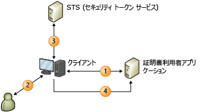

# クレームベースの ID モデルClaims-Based Identity Model
クレーム対応アプリケーションをビルドすると、ユーザー ID はアプリケーションでクレーム セットとして表されます。When you build claims-aware applications, the user identity is represented in your application as a set of claims. たとえば、ユーザーの名前を表すクレームや、電子メール アドレスを表すクレームがあります。One claim could be the user’s name, another might be an e-mail address. これは、ユーザーが要求を行うたびにユーザーの識別に必要なすべての情報がアプリケーションに提供されるように外部 ID システムを構成し、同時に、信頼できるソースから提供される ID データを暗号化によって保護するという考え方です。The idea is that an external identity system is configured to give your application everything it needs to know about the user with each request she makes, along with cryptographic assurance that the identity data you receive comes from a trusted source.  
  
 このモデルでは、シングル サインオンが非常に簡単になり、アプリケーションで次の処理を実行する必要がありません。Under this model, single sign-on is much easier to achieve, and your application is no longer responsible for the following:  
  
-   ユーザーを認証する。Authenticating users.  
  
-   ユーザー アカウントとパスワードを格納する。Storing user accounts and passwords.  
  
-   エンタープライズ ディレクトリを呼び出して、ユーザー ID の詳細を検索する。Calling to enterprise directories to look up user identity details.  
  
-   他のプラットフォームまたは企業の ID システムを統合する。Integrating with identity systems from other platforms or companies.  
  
 このモデルでは、ユーザーを認証したシステムによって提供されたクレームに基づいて、アプリケーションが ID 関連の決定を行います。Under this model, your application makes identity-related decisions based on claims supplied by the system that authenticated your user. たとえば、ユーザーの名前を使用してアプリケーションの簡単なパーソナル化を行ったり、アプリケーションのより重要な機能やリソースへのユーザー アクセスを承認したりできます。This could be anything from simple application personalization with the user’s first name, to authorizing the user to access higher valued features and resources in your application.  
  
 ここでは、次の情報について説明します。This topic provides the following information:  
  
-   [クレーム ベース ID の概要Introduction to Claims-Based Identity](../../../docs/framework/security/claims-based-identity-model.md#BKMK_1)  
  
-   [クレーム ベース ID モデルの基本的なシナリオBasic Scenario for a Claims-Based Identity Model](../../../docs/framework/security/claims-based-identity-model.md#BKMK_2)  
  
   
## クレーム ベース ID の概要Introduction to Claims-Based Identity  
 ここでは、この新しい ID アーキテクチャを理解するうえで役に立つ用語および概念について説明します。The following terminology and concepts can help you understand this new architecture for identity.  
  
### 同一。Identity  
 Windows Identity Foundation (WIF) でプログラミング モデルを説明する目的で、ここでは "ID" という用語を使用して、保護するシステムのユーザーやその他のエンティティを説明する属性のセットを表しています。For the purposes of describing the programming model in Windows Identity Foundation (WIF), we will use the term "identity" to represent a set of attributes that describe a user or some other entity in a system that you want to secure.  
  
### クレームClaim  
 クレームは、販売ロールにおける名前、電子メール アドレス、年齢、メンバーシップなど、ID 情報の一部と考えてください。Think of a claim as a piece of identity information such as name, e-mail address, age, membership in the Sales role. アプリケーションが受け取るクレームが多くなるほど、ユーザーに関して得られる情報が増えます。The more claims your application receives, the more you’ll know about your user. これがエンタープライズ ディレクトリの説明で一般的に使用される "属性" ではなく、"クレーム" と呼ばれているのはなぜでしょうか。You may be wondering why these are called "claims," rather than "attributes," as is commonly used in describing enterprise directories. その理由は、配信方法に関係があります。The reason has to do with the delivery method. このモデルでは、アプリケーションはユーザー属性をディレクトリで検索しません。In this model, your application doesn’t look up user attributes in a directory. 代わりに、ユーザーがクレームをアプリケーションに配信し、アプリケーションはそのクレームを調べます。Instead, the user delivers claims to your application, and your application examines them. 各要求は発行者により作成され、クレームの信頼度は、その発行者の信頼度に基づきます。Each claim is made by an issuer, and you trust the claim only as much as you trust the issuer. たとえば、自分の会社のドメイン コントローラーで作成されたクレームの方が、ユーザーによって作成されたクレームよりも信頼できます。For example, you trust a claim made by your company’s domain controller more than you trust a claim made by the user herself. WIF は <xref:System.Security.Claims.Claim> 型でクレームを表します。この型には、クレームの発行者を見つけるために使用できる <xref:System.Security.Claims.Claim.Issuer%2A> プロパティが含まれます。WIF represents claims with a <xref:System.Security.Claims.Claim> type, which has an <xref:System.Security.Claims.Claim.Issuer%2A> property that allows you to find out who issued the claim.  
  
### セキュリティ トークンSecurity Token  
 ユーザーは、要求と共にクレーム セットをアプリケーションに配信します。The user delivers a set of claims to your application along with a request. Web サービスでは、これらのクレームは、SOAP エンベロープのセキュリティ ヘッダーに含まれます。In a Web service, these claims are carried in the security header of the SOAP envelope. ブラウザー ベースの Web アプリケーションでは、クレームは、ユーザーのブラウザーから HTTP POST 経由で受け取ります。In a browser-based Web application, the claims arrive through an HTTP POST from the user’s browser, and may later be cached in a cookie if a session is desired. これらのクレームは受信方法に関係なく、シリアル化されていなければなりません。ここでセキュリティ トークンが提供されます。Regardless of how these claims arrive, they must be serialized, which is where security tokens come in. セキュリティ トークンは、シリアル化されたクレーム セットであり、発行機関によってデジタル署名されています。A security token is a serialized set of claims that is digitally signed by the issuing authority. 署名は重要です。署名により、ユーザーが単に多数のクレームを作成して送信しただけではないことが保証されます。The signature is important: it gives you assurance that the user didn’t just make up a bunch of claims and send them to you. 暗号化が不要な (要求されない) セキュリティ レベルの低い状況では、署名されていないトークンを使用できますが、このシナリオについてはここでは説明しません。In low security situations where cryptography isn’t necessary or desired, you can use unsigned tokens, but that scenario is not described in this topic.  
  
 セキュリティ トークンを作成して読み取る機能は、WIF の中心的な機能の 1 つです。One of the core features in WIF is the ability to create and read security tokens. WIF および .NET Framework は、すべての暗号化作業を処理し、読み取り可能なクレーム セットでアプリケーションを表します。WIF and the .NET Framework handle all of the cryptographic work, and present your application with a set of claims that you can read.  
  
### 発行機関Issuing Authority  
 発行機関の種類は、Kerberos チケットを発行するドメイン コントローラーから、X.509 証明書を発行する証明機関まで数多くありますが、ここで説明するのは、クレームが含まれるセキュリティ トークンを発行する機関です。There are lots of different types of issuing authorities, from domain controllers that issue Kerberos tickets, to certification authorities that issue X.509 certificates, but the specific type of authority discussed in this topic issues security tokens that contain claims. この発行機関は、セキュリティ トークンの発行方法を認識する Web アプリケーションまたは Web サービスです。This issuing authority is a Web application or Web service that knows how to issue security tokens. 発行機関では、適切なクレームを発行するために、要求を行う対象の証明書利用者およびユーザーに関する十分な情報が必要です。また、ユーザー ストアとやり取りしてクレームを検索し、ユーザー認証を独自に行う場合もあります。It must have enough knowledge to be able to issue the proper claims given the target relying party and the user making the request, and might be responsible for interacting with user stores to look up claims and authenticate the users themselves.  
  
 どの発行機関を選択しても、その機関は ID ソリューションで中心的な役割を果たします。Whatever issuing authority you choose, it plays a central role in your identity solution. クレームを信頼することでアプリケーションから認証を除外すると、その機関に認証機能が委任され、その機関でユーザーの認証が行われます。When you factor authentication out of your application by relying on claims, you’re passing responsibility to that authority and asking it to authenticate users on your behalf.  
  
### STS (セキュリティ トークン サービス)Security Token Service (STS)  
 セキュリティ トークン サービス (STS) は、WS-Trust プロトコルおよび WS-Federation プロトコルに従って、セキュリティ トークンの構築、署名、および発行を行うサービス コンポーネントです。A security token service (STS) is the service component that builds, signs, and issues security tokens according to the WS-Trust and WS-Federation protocols. これらのプロトコルを実装するには多大な労力を伴いますが、必要な作業はすべて WIF が吸収するため、これらのプロトコルに習熟していなくても、無理なく STS を利用し、最小限の作業量で運用することができます。There’s a lot of work that goes into implementing these protocols, but WIF does all of this work for you, making it feasible for someone who isn’t an expert in the protocols to get an STS up and running with very little effort. [Active Directory® フェデレーション サービス (AD FS) 2.0](http://go.microsoft.com/fwlink/?LinkID=247516) などの既成の STS や、[Microsoft Azure のアクセス制御サービス (ACS)](http://go.microsoft.com/fwlink/?LinkID=247517) などのクラウド STS を使用することもできますが、カスタム トークンを発行したり、カスタム認証/承認の機能を実装する必要がある場合には、WIF を使用してカスタム STS を自分で作成することもできます。You can use a pre-built STS such as [Active Directory® Federation Services (AD FS) 2.0](http://go.microsoft.com/fwlink/?LinkID=247516), a cloud STS such as a [Windows Azure Access Control Service (ACS)](http://go.microsoft.com/fwlink/?LinkID=247517), or, if you want to issue custom tokens or provide custom authentication or authorization, you can build your own custom STS using WIF. WIF を使用すると、独自の STS を簡単に作成できます。WIF makes it easy to build your own STS.  
  
### 証明書利用者アプリケーションRelying Party Application  
 クレームに依存するアプリケーションをビルドする場合は、証明書利用者 (RP) アプリケーションをビルドします。When you build an application that relies on claims, you are building a relying party (RP) application. RP は、"クレーム対応アプリケーション"、"クレーム ベースのアプリケーション" とも呼ばれます。Synonyms for an RP include "claims-aware application" and "claims-based application". Web アプリケーションと Web サービスは両方とも RP にできます。Web applications and Web services can both be RPs. RP アプリケーションは STS によって発行されたトークンを使用し、トークンからクレームを抽出して、それを ID 関連のタスクに使用します。A RP application consumes the tokens issued by a STS and extracts the claims from tokens to use them for identity related tasks. WIF には、RP アプリケーションのビルドに役立つ機能が用意されています。WIF offers functionalities to help you build RP applications.  
  
### 標準Standards  
 このすべての相互運用を実現するために、前のシナリオでは WS-* 標準がいくつか使用されています。In order to make all of this interoperable, several WS-* standards are used in the previous scenario. ポリシーは WS-MetadataExchange を使用して取得されますが、そのポリシー自体は WS-Policy 仕様に準拠しています。Policy is retrieved using WS-MetadataExchange, and the policy itself is structured according to the WS-Policy specification. STS では、WS-Trust 仕様が実装されているエンドポイントを公開します。この仕様には、セキュリティ トークンを要求および受信する方法が記述されています。The STS exposes endpoints that implement the WS-Trust specification, which describes how to request and receive security tokens. 現在の STS はほとんどが、SAML (Security Assertion Markup Langauge) で書式設定されたトークンを発行しています。Most STSs today issue tokens formatted with Security Assertion Markup Langauge (SAML). SAML は、相互運用可能な方法でクレームを表現できる、業界で認められた XML ボキャブラリです。SAML is an industry-recognized XML vocabulary that can be used to represent claims in an interoperable way. つまり、マルチプラットフォームでは、まったく異なるプラットフォーム上の STS と通信でき、プラットフォームに関係なくすべてのアプリケーションでシングル サインオンを実現できます。Or, in a multi-platform situation, this allows you to communicate with an STS on an entirely different platform and achieve single sign-on across all of your applications, regardless of platform.  
  
### ブラウザー ベースのアプリケーションBrowser-Based Applications  
 クレーム ベースの ID モデルを使用できるのはスマート クライアントだけではありません。Smart clients aren’t the only ones who can use the claims-based identity model. この ID モデルは、ブラウザーベースのアプリケーション (パッシブ クライアントとも呼ばれます) でも使用できます。Browser-based applications (also referred to as passive clients) can use it as well. 次のシナリオでは、そのしくみについて説明します。The following scenario describes how this works.  
  
 最初に、ユーザーがブラウザーでクレーム対応アプリケーション (証明書利用者アプリケーション) にアクセスします。First, the user points a browser at a claims-aware Web application (the relying party application). Web アプリケーションは、ユーザーを認証できるようにブラウザーを STS にリダイレクトします。The Web application redirects the browser to the STS so the user can be authenticated. STS は単純な Web アプリケーションでホストされています。このアプリケーションで、受信した要求を読み取り、標準的な HTTP メカニズムを使用してユーザーを認証してから、SAML トークンを作成し、JavaScript コードを使用して応答します。このコードによって、ブラウザーで SAML トークンを RP に送り返す HTTP POST が開始されます。The STS is hosted in a simple web application that reads the incoming request, authenticates the user using standard HTTP mechanisms, and then creates a SAML token and replies with a piece of JavaScript code that causes the browser to initiate an HTTP POST that sends the SAML token back to the RP. この POST の本文に、RP が要求したクレームが含まれています。The body of this POST contains the claims that the RP requested. ここでは、一般的に RP ではクレームを Cookie にパッケージ化して、要求が行われるたびにユーザーをリダイレクトする必要がないようにします。At this point, it is common for the RP to package the claims into a cookie so that the user doesn’t have to be redirected for each request.  
  
   
## クレーム ベース ID モデルの基本的なシナリオBasic Scenario for a Claims-Based Identity Model  
 次に、クレーム ベースのシステムの例を示します。The following is an example of a claims-based system.  
  
   
  
 この図は、認証に WIF を使用するように構成された Web サイト (証明書利用者アプリケーション、RP) と、そのサイトを使用するクライアント (Web ブラウザー) を示しています。This diagram shows a Web site (the relying party application, RP) that has been configured to use WIF for authentication and a client, a web browser, that wants to use that site.  
  
1.  認証されていないユーザーがページを要求すると、ブラウザーが、ID プロバイダー (IP) ページにリダイレクトされます。When an unauthenticated user requests a page their browser is redirected to the identity provider (IP) pages.  
  
2.  IP では、ユーザーは、資格情報 (ユーザー名/パスワード、Kerberos など) を提示する必要があります。The IP requires the user to present their credentials, e.g. username/password, Kerberos, etc.  
  
3.  IP はトークンを発行し、それをブラウザーに返します。The IP issues a token back to that is returned to the browser.  
  
4.  ブラウザーは、最初に要求されたページにリダイレクトされます。ここで WIF は、トークンがページにアクセスするための要件を満たしているかどうかを判断します。The browser is now redirected back to the originally requested page where WIF determines if the token satisfies the requirements to access the page. 満たしている場合は、Cookie が発行されてセッションが確立されるため、認証が必要なのは 1 回だけです。その後、コントロールはアプリケーションに渡されます。If so a cookie is issued to establish a session so the authentication only needs to occur once, and control is passed to the application.
