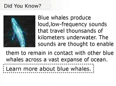

# UI オートメーションを使用した、埋め込みオブジェクトへのアクセスAccess Embedded Objects Using UI Automation
> [!NOTE]
>  このドキュメントは、[!INCLUDE[TLA2#tla_uiautomation](../../../includes/tla2sharptla-uiautomation-md.md)] 名前空間で定義されているマネージ <xref:System.Windows.Automation> クラスを使用する .NET Framework 開発者を対象としています。This documentation is intended for .NET Framework developers who want to use the managed [!INCLUDE[TLA2#tla_uiautomation](../../../includes/tla2sharptla-uiautomation-md.md)] classes defined in the <xref:System.Windows.Automation> namespace. [!INCLUDE[TLA2#tla_uiautomation](../../../includes/tla2sharptla-uiautomation-md.md)]の最新情報については、「 [Windows Automation API: UI Automation (Windows のオートメーション API: UI オートメーション)](http://go.microsoft.com/fwlink/?LinkID=156746)」を参照してください。For the latest information about [!INCLUDE[TLA2#tla_uiautomation](../../../includes/tla2sharptla-uiautomation-md.md)], see [Windows Automation API: UI Automation](http://go.microsoft.com/fwlink/?LinkID=156746).  
  
 このトピックでは、どのように [!INCLUDE[TLA#tla_uiautomation](../../../includes/tlasharptla-uiautomation-md.md)] を使用して、テキスト コントロールのコンテンツ内に埋め込みオブジェクトを公開できるのかを示しています。This topic shows how [!INCLUDE[TLA#tla_uiautomation](../../../includes/tlasharptla-uiautomation-md.md)] can be used to expose objects embedded within the content of a text control.  
  
> [!NOTE]
>  埋め込みオブジェクトには、イメージ、ハイパーリンク、ボタン、テーブル、ActiveX コントロールを含めることができます。Embedded objects can include images, hyperlinks, buttons, tables, or ActiveX controls.  
  
 埋め込みオブジェクトは、 [!INCLUDE[TLA2#tla_uiautomation](../../../includes/tla2sharptla-uiautomation-md.md)] テキスト プロバイダーの子と見なされます。Embedded objects are considered children of the [!INCLUDE[TLA2#tla_uiautomation](../../../includes/tla2sharptla-uiautomation-md.md)] text provider. これにより、他のすべての [!INCLUDE[TLA#tla_ui](../../../includes/tlasharptla-ui-md.md)] 要素と同じ UI オートメーション ツリーの構造を介して公開することができます。This allows them to be exposed through the same UI Automation tree structure as all other [!INCLUDE[TLA#tla_ui](../../../includes/tlasharptla-ui-md.md)] elements. 次に、機能は、埋め込みオブジェクトのコントロール型で通常必要とされるコントロール パターンを通じて公開されます (たとえば、ハイパーリンクはテキスト ベースであるため、 <xref:System.Windows.Automation.TextPattern>をサポートします)。Functionality, in turn, is exposed through the control patterns typically required by the embedded objects control type (for example, since hyperlinks are text-based they will support <xref:System.Windows.Automation.TextPattern>).  
  
 ![テキスト コンテナー内の埋め込みオブジェクト。] (../../../docs/framework/ui-automation/media/uia-textpattern-embeddedobjects.PNG "UIA_TextPattern_EmbeddedObjects")  
サンプル ドキュメントのテキスト コンテンツ、(「ご存知でしたか。」[...])2 つの埋め込みオブジェクト (クジラとテキストのハイパーリンクの画像)、コード例については、ターゲットとして使用します。A sample document with textual content, ("Did You Know?"…) and two embedded objects (a picture of a whale and a text hyperlink), used as a target for the code examples.  
  
## 例Example  
 次のコード例は、 [!INCLUDE[TLA2#tla_uiautomation](../../../includes/tla2sharptla-uiautomation-md.md)] テキスト プロバイダー内から埋め込みオブジェクトのコレクションを取得する方法を示します。The following code example demonstrates how to retrieve a collection of embedded objects from within a [!INCLUDE[TLA2#tla_uiautomation](../../../includes/tla2sharptla-uiautomation-md.md)] text provider. 概要で提供されたサンプルのドキュメントについては、2 つのオブジェクトが返されます (イメージ要素と、テキスト要素)。For the sample document provided in the introduction, two objects would be returned (an image element and a text element).  
  
> [!NOTE]
>  イメージ要素には、画像に関連付けられて説明する組み込みテキストが必要であり、通常は <xref:System.Windows.Automation.AutomationElement.NameProperty> 内にあります (「青いクジラ」など)。The image element should have some intrinsic text associated with it that describes the image, typically in its <xref:System.Windows.Automation.AutomationElement.NameProperty> (for example, "A blue whale."). ただし、イメージ オブジェクトにまたがるテキスト範囲を取得すると、イメージもこの説明のテキストもテキストのストリームで返されません。However, when a text range spanning the image object is obtained, neither the image nor this descriptive text is returned in the text stream.  
  
 [!code-csharp[FindText#StartApp](../../../samples/snippets/csharp/VS_Snippets_Wpf/FindText/CSharp/SearchWindow.cs#startapp)]
 [!code-vb[FindText#StartApp](../../../samples/snippets/visualbasic/VS_Snippets_Wpf/FindText/VisualBasic/SearchWindow.vb#startapp)]  
[!code-csharp[FindText#FindTextProvider](../../../samples/snippets/csharp/VS_Snippets_Wpf/FindText/CSharp/SearchWindow.cs#findtextprovider)]
[!code-vb[FindText#FindTextProvider](../../../samples/snippets/visualbasic/VS_Snippets_Wpf/FindText/VisualBasic/SearchWindow.vb#findtextprovider)]  
[!code-csharp[FindText#GetChildren](../../../samples/snippets/csharp/VS_Snippets_Wpf/FindText/CSharp/SearchWindow.cs#getchildren)]
[!code-vb[FindText#GetChildren](../../../samples/snippets/visualbasic/VS_Snippets_Wpf/FindText/VisualBasic/SearchWindow.vb#getchildren)]  
  
## 例Example  
 [!INCLUDE[TLA2#tla_uiautomation](../../../includes/tla2sharptla-uiautomation-md.md)] テキスト プロバイダー内の埋め込みオブジェクトからテキストの範囲を取得する方法を、次のコード例で示します。The following code example demonstrates how to obtain a text range from an embedded object within a [!INCLUDE[TLA2#tla_uiautomation](../../../includes/tla2sharptla-uiautomation-md.md)] text provider. 取得されるテキストの範囲は空の範囲です。ここで、開始エンドポイントは "…The text range retrieved is an empty range where the starting endpoint follows "… ocean.(space)" の後に続き、終了エンドポイントは、(概要で提供した画像に示されているように) 埋め込みハイパーリンクを表す終了の "." に先行します。ocean.(space)" and the ending endpoint precedes the closing "." representing the embedded hyperlink (as shown by the image provided in the introduction). これは空の範囲ですが、スパンが 0 ではないため、低次元テキスト範囲とはみなされません。Even though this is an empty range, it is not considered a degenerate range because it has a non-zero span.  
  
> [!NOTE]
>  <xref:System.Windows.Automation.TextPattern> はハイパーリンクなどのテキスト ベースの埋め込みオブジェクトを取得することができます。ただし、セカンダリ <xref:System.Windows.Automation.TextPattern> は完全な機能を公開するために、埋め込みオブジェクトから取得する必要があります。<xref:System.Windows.Automation.TextPattern> can retrieve a text-based embedded object such as a hyperlink; however, a secondary <xref:System.Windows.Automation.TextPattern> will have to be obtained from the embedded object to expose its full functionality.  
  
 [!code-csharp[UIATextPattern_snip#GetRangeFromChild](../../../samples/snippets/csharp/VS_Snippets_Wpf/UIATextPattern_snip/CSharp/SearchWindow.cs#getrangefromchild)]
 [!code-vb[UIATextPattern_snip#GetRangeFromChild](../../../samples/snippets/visualbasic/VS_Snippets_Wpf/UIATextPattern_snip/VisualBasic/SearchWindow.vb#getrangefromchild)]  
  
## 関連項目See Also  
 [UI オートメーション TextPattern の概要UI Automation TextPattern Overview](../../../docs/framework/ui-automation/ui-automation-textpattern-overview.md)  
 [UI Automation コントロール パターンの概要UI Automation Control Patterns Overview](../../../docs/framework/ui-automation/ui-automation-control-patterns-overview.md)  
 [クライアントの UI オートメーション コントロール パターンUI Automation Control Patterns for Clients](../../../docs/framework/ui-automation/ui-automation-control-patterns-for-clients.md)  
 [UI オートメーションを使用した、テキスト ボックスへのコンテンツの追加Add Content to a Text Box Using UI Automation](../../../docs/framework/ui-automation/add-content-to-a-text-box-using-ui-automation.md)  
 [UI オートメーションを使用した、テキストの検索と強調表示Find and Highlight Text Using UI Automation](../../../docs/framework/ui-automation/find-and-highlight-text-using-ui-automation.md)
