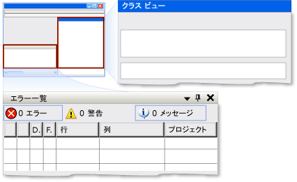

# UI オートメーション Dock コントロール パターンの実装Implementing the UI Automation Dock Control Pattern
> [!NOTE]
>  このドキュメントは、[!INCLUDE[TLA2#tla_uiautomation](../../../includes/tla2sharptla-uiautomation-md.md)] 名前空間で定義されているマネージ <xref:System.Windows.Automation> クラスを使用する .NET Framework 開発者を対象としています。This documentation is intended for .NET Framework developers who want to use the managed [!INCLUDE[TLA2#tla_uiautomation](../../../includes/tla2sharptla-uiautomation-md.md)] classes defined in the <xref:System.Windows.Automation> namespace. [!INCLUDE[TLA2#tla_uiautomation](../../../includes/tla2sharptla-uiautomation-md.md)]の最新情報については、「 [Windows Automation API: UI Automation (Windows のオートメーション API: UI オートメーション)](http://go.microsoft.com/fwlink/?LinkID=156746)」を参照してください。For the latest information about [!INCLUDE[TLA2#tla_uiautomation](../../../includes/tla2sharptla-uiautomation-md.md)], see [Windows Automation API: UI Automation](http://go.microsoft.com/fwlink/?LinkID=156746).  
  
 ここでは、プロパティに関する情報など、 <xref:System.Windows.Automation.Provider.IDockProvider>を実装するガイドラインと規則について説明します。This topic introduces guidelines and conventions for implementing <xref:System.Windows.Automation.Provider.IDockProvider>, including information about properties. その他のリファレンスへのリンクは、トピックの最後に記載します。Links to additional references are listed at the end of the topic.  
  
 <xref:System.Windows.Automation.DockPattern> コントロール パターンは、ドッキング コンテナー内のコントロールのドッキング プロパティを公開するために使用します。The <xref:System.Windows.Automation.DockPattern> control pattern is used to expose the dock properties of a control within a docking container. ドッキング コンテナーは、子要素を互いに水平方向または垂直方向に整列できるコントロールです。A docking container is a control that allows you to arrange child elements horizontally and vertically, relative to each other. このコントロール パターンを実装するコントロールの例については、「 [Control Pattern Mapping for UI Automation Clients](../../../docs/framework/ui-automation/control-pattern-mapping-for-ui-automation-clients.md)」をご覧ください。For examples of controls that implement this control pattern, see [Control Pattern Mapping for UI Automation Clients](../../../docs/framework/ui-automation/control-pattern-mapping-for-ui-automation-clients.md).  
  
 ![ドッキング コンテナーは、ドッキングされた 2 つの子にします。] (../../../docs/framework/ui-automation/media/uia-dockpattern-dockingexample.PNG "UIA_DockPattern_DockingExample")  
"Class View" ウィンドウが DockPosition.Right に "Error List" ウィンドウが DockPosition.Bottom にそれぞれ配置された Visual Studio のドッキングの例Docking Example from Visual Studio Where "Class View" Window Is DockPosition.Right and "Error List" Window Is DockPosition.Bottom  
  
   
## 実装のガイドラインと規則Implementation Guidelines and Conventions  
 Dock コントロール パターンを実装する場合は、次のガイドラインと規則に注意してください。When implementing the Dock control pattern, note the following guidelines and conventions:  
  
-   <xref:System.Windows.Automation.Provider.IDockProvider> は、ドッキング コンテナーのプロパティや、ドッキング コンテナー内の現在のコントロールに隣接してドッキングされるコントロールのプロパティは公開しません。<xref:System.Windows.Automation.Provider.IDockProvider> does not expose any properties of the docking container or any properties of controls that are docked adjacent to the current control within the docking container.  
  
-   コントロールは、現在の重ね順に基づき、互いを基準としてドッキングされます。重ね順が上位であるほど、指定されたドッキング コンテナーの端から離れた位置に配置されます。Controls are docked relative to each other based on their current z-order; the higher their z-order placement, the farther they are placed from the specified edge of the docking container.  
  
-   ドッキング コンテナーのサイズを変更すると、コンテナー内にドッキングされているコントロールは、もともとドッキングされていたのと同じ端に合わせて再配置されます。If the docking container is resized, any docked controls within the container will be repositioned flush to the same edge to which they were originally docked. また、ドッキングされているコントロールは、 <xref:System.Windows.Automation.DockPosition>のドッキング動作に従って、コンテナー内のスペースを埋めるようにサイズ変更されます。The docked controls will also resize to fill any space within the container according to the docking behavior of their <xref:System.Windows.Automation.DockPosition>. たとえば、 <xref:System.Windows.Automation.DockPosition.Top> が指定されている場合は、コントロールの左側と右側が広がって、使用できるスペースを埋めます。For example, if <xref:System.Windows.Automation.DockPosition.Top> is specified, the left and right sides of the control will expand to fill any available space. <xref:System.Windows.Automation.DockPosition.Fill> が指定されている場合は、コントロールの 4 つの側面すべてが広がって、使用できるスペースを埋めます。If <xref:System.Windows.Automation.DockPosition.Fill> is specified, all four sides of the control will expand to fill any available space.  
  
-   マルチモニター システムでは、コントロールは現在のモニターの左側または右側にドッキングする必要があります。On a multi-monitor system, controls should dock to the left or right side of the current monitor. それが不可能な場合は、左端のモニターの左側、または右端のモニターの右側にドッキングする必要があります。If that is not possible, they should dock to the left side of the leftmost monitor or the right side of the rightmost monitor.  
  
   
## IDockProvider の必須メンバーRequired Members for IDockProvider  
 次のプロパティとメソッドは、IDockProvider インターフェイスの実装時に必要です。The following properties and methods are required for implementing the IDockProvider interface.  
  
|必須メンバーRequired members|メンバーの型Member type|メモNotes|  
|----------------------|-----------------|-----------|  
|<xref:System.Windows.Automation.Provider.IDockProvider.DockPosition%2A>|プロパティProperty|なしNone|  
|<xref:System.Windows.Automation.Provider.IDockProvider.SetDockPosition%2A>|メソッドMethod|なしNone|  
  
 このコントロール パターンには、関連するイベントがありません。This control pattern has no associated events.  
  
   
## 例外Exceptions  
 プロバイダーは、次の例外をスローする必要があります。Providers must throw the following exceptions.  
  
|例外の種類Exception type|条件Condition|  
|--------------------|---------------|  
|<xref:System.InvalidOperationException>|<xref:System.Windows.Automation.Provider.IDockProvider.SetDockPosition%2A>   場合、コントロールは、要求されたドッキング スタイルを実行することはできません。-   When a control is not able to execute the requested dock style.|  
  
## 関連項目See Also  
 [UI Automation コントロール パターンの概要UI Automation Control Patterns Overview](../../../docs/framework/ui-automation/ui-automation-control-patterns-overview.md)  
 [UI オートメーション プロバイダーでのコントロール パターンのサポートSupport Control Patterns in a UI Automation Provider](../../../docs/framework/ui-automation/support-control-patterns-in-a-ui-automation-provider.md)  
 [クライアントの UI オートメーション コントロール パターンUI Automation Control Patterns for Clients](../../../docs/framework/ui-automation/ui-automation-control-patterns-for-clients.md)  
 [UI Automation ツリーの概要UI Automation Tree Overview](../../../docs/framework/ui-automation/ui-automation-tree-overview.md)  
 [UI オートメーションにおけるキャッシュの使用Use Caching in UI Automation](../../../docs/framework/ui-automation/use-caching-in-ui-automation.md)
