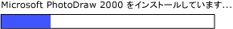

# UI オートメーション RangeValue コントロール パターンの実装Implementing the UI Automation RangeValue Control Pattern
> [!NOTE]
>  このドキュメントは、[!INCLUDE[TLA2#tla_uiautomation](../../../includes/tla2sharptla-uiautomation-md.md)] 名前空間で定義されているマネージ <xref:System.Windows.Automation> クラスを使用する .NET Framework 開発者を対象としています。This documentation is intended for .NET Framework developers who want to use the managed [!INCLUDE[TLA2#tla_uiautomation](../../../includes/tla2sharptla-uiautomation-md.md)] classes defined in the <xref:System.Windows.Automation> namespace. [!INCLUDE[TLA2#tla_uiautomation](../../../includes/tla2sharptla-uiautomation-md.md)]の最新情報については、「 [Windows Automation API: UI Automation (Windows のオートメーション API: UI オートメーション)](http://go.microsoft.com/fwlink/?LinkID=156746)」を参照してください。For the latest information about [!INCLUDE[TLA2#tla_uiautomation](../../../includes/tla2sharptla-uiautomation-md.md)], see [Windows Automation API: UI Automation](http://go.microsoft.com/fwlink/?LinkID=156746).  
  
 このトピックでは、イベントおよびプロパティに関する情報など、 <xref:System.Windows.Automation.Provider.IRangeValueProvider>の実装のためのガイドラインと規則について説明します。This topic introduces guidelines and conventions for implementing <xref:System.Windows.Automation.Provider.IRangeValueProvider>, including information about events and properties. その他のリファレンスへのリンクは、トピックの最後に記載します。Links to additional references are listed at the end of the topic.  
  
 <xref:System.Windows.Automation.RangeValuePattern> コントロール パターンは、一定の範囲内の値に設定できるコントロールをサポートするために使用します。The <xref:System.Windows.Automation.RangeValuePattern> control pattern is used to support controls that can be set to a value within a range. このコントロール パターンを実装するコントロールの例については、「 [Control Pattern Mapping for UI Automation Clients](../../../docs/framework/ui-automation/control-pattern-mapping-for-ui-automation-clients.md)」をご覧ください。For examples of controls that implement this control pattern, see [Control Pattern Mapping for UI Automation Clients](../../../docs/framework/ui-automation/control-pattern-mapping-for-ui-automation-clients.md).  
  
   
## 実装のガイドラインと規則Implementation Guidelines and Conventions  
 Range Value コントロール パターンを実装する場合は、次のガイドラインと規則に留意してください。When implementing the Range Value control pattern, note the following guidelines and conventions:  
  
-   コントロールでは、ロケールまたはユーザー設定に基づいてサポートされているプロパティを再調整できます。Controls allow recalibration of their supported properties based upon locale or user preference. たとえば、温度計コントロールを、華氏または摂氏で温度を表示するように設定できます。An example of this is a thermometer control that can be set to display the temperature in Fahrenheit or Celsius.  
  
-   進行状況バーやスライダーなどのあいまいな範囲の値を持つコントロールでは、それらの値を正規化する必要があります。Controls that have ambiguous range values, such as progress bars or sliders, should have those values normalized.  
  
 ![進行状況バーです。] (../../../docs/framework/ui-automation/media/uia-rangevaluepattern-progress-bar.PNG "UIA_RangeValuePattern_Progress_Bar")  
値が整数型で、最小値と最大値のプロパティ値がそれぞれ 0 と 100 に正規化された進行状況バーの例Example of a Progress Bar Where Value Is of Type Integer and Minimum and Maximum Property Values Are Normalized to 0 and 100, Respectively  
  
   
## IRangeValueProvider の必須メンバーRequired Members for IRangeValueProvider  
  
|必須メンバーRequired member|メンバーの型Member type|ノートNotes|  
|---------------------|-----------------|-----------|  
|<xref:System.Windows.Automation.RangeValuePattern.IsReadOnlyProperty>|プロパティProperty|なしNone|  
|<xref:System.Windows.Automation.RangeValuePattern.ValueProperty>|プロパティProperty|なしNone|  
|<xref:System.Windows.Automation.RangeValuePattern.LargeChangeProperty>|プロパティProperty|なしNone|  
|<xref:System.Windows.Automation.RangeValuePattern.SmallChangeProperty>|プロパティProperty|なしNone|  
|<xref:System.Windows.Automation.RangeValuePattern.MaximumProperty>|プロパティProperty|なしNone|  
|<xref:System.Windows.Automation.RangeValuePattern.MinimumProperty>|プロパティProperty|なしNone|  
|<xref:System.Windows.Automation.RangeValuePattern.SetValue%2A>|メソッドMethods|なしNone|  
  
 このコントロール パターンには、関連するイベントがありません。This control pattern has no associated events.  
  
   
## 例外Exceptions  
 プロバイダーは、次の例外をスローする必要があります。Providers must throw the following exceptions.  
  
|例外の種類Exception type|状態Condition|  
|--------------------|---------------|  
|<xref:System.ArgumentOutOfRangeException>|<xref:System.Windows.Automation.RangeValuePattern.SetValue%2A> は、 <xref:System.Windows.Automation.RangeValuePattern.MaximumProperty> より大きい値または <xref:System.Windows.Automation.RangeValuePattern.MinimumProperty>より小さい値で呼び出されます。<xref:System.Windows.Automation.RangeValuePattern.SetValue%2A> is called with a value that is either greater than <xref:System.Windows.Automation.RangeValuePattern.MaximumProperty> or less than <xref:System.Windows.Automation.RangeValuePattern.MinimumProperty>.|  
  
## 参照See Also  
 [UI Automation コントロール パターンの概要UI Automation Control Patterns Overview](../../../docs/framework/ui-automation/ui-automation-control-patterns-overview.md)  
 [UI オートメーション プロバイダーでのコントロール パターンのサポートSupport Control Patterns in a UI Automation Provider](../../../docs/framework/ui-automation/support-control-patterns-in-a-ui-automation-provider.md)  
 [クライアントの UI オートメーション コントロール パターンUI Automation Control Patterns for Clients](../../../docs/framework/ui-automation/ui-automation-control-patterns-for-clients.md)  
 [UI Automation ツリーの概要UI Automation Tree Overview](../../../docs/framework/ui-automation/ui-automation-tree-overview.md)  
 [UI オートメーションにおけるキャッシュの使用Use Caching in UI Automation](../../../docs/framework/ui-automation/use-caching-in-ui-automation.md)
