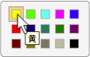

# UI オートメーション Selection コントロール パターンの実装Implementing the UI Automation Selection Control Pattern
> [!NOTE]
>  このドキュメントは、[!INCLUDE[TLA2#tla_uiautomation](../../../includes/tla2sharptla-uiautomation-md.md)] 名前空間で定義されているマネージ <xref:System.Windows.Automation> クラスを使用する .NET Framework 開発者を対象としています。This documentation is intended for .NET Framework developers who want to use the managed [!INCLUDE[TLA2#tla_uiautomation](../../../includes/tla2sharptla-uiautomation-md.md)] classes defined in the <xref:System.Windows.Automation> namespace. [!INCLUDE[TLA2#tla_uiautomation](../../../includes/tla2sharptla-uiautomation-md.md)]の最新情報については、「 [Windows Automation API: UI オートメーション](http://go.microsoft.com/fwlink/?LinkID=156746)」をご覧ください。For the latest information about [!INCLUDE[TLA2#tla_uiautomation](../../../includes/tla2sharptla-uiautomation-md.md)], see [Windows Automation API: UI Automation](http://go.microsoft.com/fwlink/?LinkID=156746).  
  
 このトピックでは、イベントおよびプロパティに関する情報など、 <xref:System.Windows.Automation.Provider.ISelectionProvider>の実装のためのガイドラインと規則について説明します。This topic introduces guidelines and conventions for implementing <xref:System.Windows.Automation.Provider.ISelectionProvider>, including information about events and properties. その他のリファレンスへのリンクは、トピックの最後に記載します。Links to additional references are listed at the end of the topic.  
  
 <xref:System.Windows.Automation.SelectionPattern> コントロール パターンは、選択可能な子項目のコレクションのコンテナーとして機能するコントロールをサポートするために使用します。The <xref:System.Windows.Automation.SelectionPattern> control pattern is used to support controls that act as containers for a collection of selectable child items. この要素の子は <xref:System.Windows.Automation.Provider.ISelectionItemProvider>を実装する必要があります。The children of this element must implement <xref:System.Windows.Automation.Provider.ISelectionItemProvider>. このコントロール パターンを実装するコントロールの例については、「 [Control Pattern Mapping for UI Automation Clients](../../../docs/framework/ui-automation/control-pattern-mapping-for-ui-automation-clients.md)」をご覧ください。For examples of controls that implement this control pattern, see [Control Pattern Mapping for UI Automation Clients](../../../docs/framework/ui-automation/control-pattern-mapping-for-ui-automation-clients.md).  
  
   
## 実装のガイドラインと規則Implementation Guidelines and Conventions  
 Selection コントロール パターンを実装する場合は、次のガイドラインと規則にご留意ください。When implementing the Selection control pattern, note the following guidelines and conventions:  
  
-   <xref:System.Windows.Automation.Provider.ISelectionProvider> を実装するコントロールでは、単一の子または複数の子項目を選択できます。Controls that implement <xref:System.Windows.Automation.Provider.ISelectionProvider> allow either single or multiple child items to be selected. たとえば、リスト ボックス、リスト ビュー、ツリー ビューでは複数の項目を選択できる一方、コンボ ボックス、スライダー、ラジオ ボタン グループでは 1 つの項目だけを選択できます。For example, list box, list view, and tree view support multiple selections whereas combo box, slider, and radio button group support single selection.  
  
-   **音量** スライダー コントロールなど、最小値、最大値、連続した値の範囲を持つコントロールは、 <xref:System.Windows.Automation.Provider.IRangeValueProvider> ではなく <xref:System.Windows.Automation.Provider.ISelectionProvider>を実装する必要があります。Controls that have a minimum, maximum, and continuous range, such as the **Volume** slider control, should implement <xref:System.Windows.Automation.Provider.IRangeValueProvider> instead of <xref:System.Windows.Automation.Provider.ISelectionProvider>.  
  
-   <xref:System.Windows.Automation.Provider.IRawElementProviderFragmentRoot>[画面のプロパティ] **ダイアログ ボックスの** [画面解像度] **スライダーや、** の **カラー ピッカー** 選択コントロールなど (以下を参照)、 [!INCLUDE[TLA#tla_word](../../../includes/tlasharptla-word-md.md)] を実装する子コントロールを管理する単一選択コントロールは <xref:System.Windows.Automation.Provider.ISelectionProvider>を実装する必要があり、その子は <xref:System.Windows.Automation.Provider.IRawElementProviderFragment> と <xref:System.Windows.Automation.Provider.ISelectionItemProvider>の両方を実装する必要があります。Single-selection controls that manage child controls that implement <xref:System.Windows.Automation.Provider.IRawElementProviderFragmentRoot>, such as the **Screen Resolution** slider in the **Display Properties** dialog box or the **Color Picker** selection control from [!INCLUDE[TLA#tla_word](../../../includes/tlasharptla-word-md.md)] (illustrated below), should implement <xref:System.Windows.Automation.Provider.ISelectionProvider>; their children should implement both <xref:System.Windows.Automation.Provider.IRawElementProviderFragment> and <xref:System.Windows.Automation.Provider.ISelectionItemProvider>.  
  
 ![黄色が強調表示されたカラー ピッカー。] (../../../docs/framework/ui-automation/media/uia-valuepattern-colorpicker.png "UIA_ValuePattern_ColorPicker")  
色見本の文字列のマッピング例Example of Color Swatch String Mapping  
  
-   メニューは <xref:System.Windows.Automation.SelectionPattern>をサポートしていません。Menus do not support <xref:System.Windows.Automation.SelectionPattern>. グラフィックスとテキストの両方を含むメニュー項目 ( **の** [表示] **メニューにある** [プレビュー ウィンドウ] [!INCLUDE[TLA#tla_outlook](../../../includes/tlasharptla-outlook-md.md)]項目など) を処理していて、状態を伝える必要がある場合は、 <xref:System.Windows.Automation.Provider.IToggleProvider>を実装する必要があります。If you are working with menu items that include both graphics and text (such as the **Preview Pane** items in the **View** menu in [!INCLUDE[TLA#tla_outlook](../../../includes/tlasharptla-outlook-md.md)]) and need to convey state, you should implement <xref:System.Windows.Automation.Provider.IToggleProvider>.  
  
   
## ISelectionProvider の必須メンバーRequired Members for ISelectionProvider  
 <xref:System.Windows.Automation.Provider.ISelectionProvider> インターフェイスには、次のプロパティ、メソッド、イベントが必要です。The following properties, methods, and events are required for the <xref:System.Windows.Automation.Provider.ISelectionProvider> interface.  
  
|必須メンバーRequired members|型Type|ノートNotes|  
|----------------------|----------|-----------|  
|<xref:System.Windows.Automation.Provider.ISelectionProvider.CanSelectMultiple%2A>|プロパティProperty|<xref:System.Windows.Automation.Automation.AddAutomationPropertyChangedEventHandler%2A> と <xref:System.Windows.Automation.Automation.RemoveAutomationPropertyChangedEventHandler%2A>を使用してプロパティ変更イベントをサポートする必要があります。Should support property changed events using <xref:System.Windows.Automation.Automation.AddAutomationPropertyChangedEventHandler%2A> and <xref:System.Windows.Automation.Automation.RemoveAutomationPropertyChangedEventHandler%2A>.|  
|<xref:System.Windows.Automation.Provider.ISelectionProvider.IsSelectionRequired%2A>|プロパティProperty|<xref:System.Windows.Automation.Automation.AddAutomationPropertyChangedEventHandler%2A> と <xref:System.Windows.Automation.Automation.RemoveAutomationPropertyChangedEventHandler%2A>を使用してプロパティ変更イベントをサポートする必要があります。Should support property changed events using <xref:System.Windows.Automation.Automation.AddAutomationPropertyChangedEventHandler%2A> and <xref:System.Windows.Automation.Automation.RemoveAutomationPropertyChangedEventHandler%2A>.|  
|<xref:System.Windows.Automation.Provider.ISelectionProvider.GetSelection%2A>|メソッドMethod|なしNone|  
|<xref:System.Windows.Automation.SelectionPatternIdentifiers.InvalidatedEvent>|EventEvent|コンテナー内の選択が大幅に変更され、 <xref:System.Windows.Automation.Provider.AutomationInteropProvider.InvalidateLimit> 定数で許可されるよりも多くの追加イベントと削除イベントを送信する必要がある場合に発生します。Raised when a selection in a container has changed significantly and requires sending more addition and removal events than the <xref:System.Windows.Automation.Provider.AutomationInteropProvider.InvalidateLimit> constant permits.|  
  
 <xref:System.Windows.Automation.Provider.ISelectionProvider.IsSelectionRequired%2A> プロパティと <xref:System.Windows.Automation.Provider.ISelectionProvider.CanSelectMultiple%2A> プロパティは、動的に設定できます。The <xref:System.Windows.Automation.Provider.ISelectionProvider.IsSelectionRequired%2A> and <xref:System.Windows.Automation.Provider.ISelectionProvider.CanSelectMultiple%2A> properties can be dynamic. たとえば、既定で初期状態では何も項目が選択されていないコントロールがあるとします。これは、 <xref:System.Windows.Automation.Provider.ISelectionProvider.IsSelectionRequired%2A> が `false`であるということです。For example, the initial state of a control might not have any items selected by default, indicating that <xref:System.Windows.Automation.Provider.ISelectionProvider.IsSelectionRequired%2A> is `false`. しかし、項目が 1 つ選択されると、このコントロールは、項目が常に 1 つ以上選択された状態を保持する必要があります。However, after an item is selected, the control must always have at least one item selected. 同様に、まれなケースとして、初期設定では複数の項目の選択を許可し、以降は 1 項目の選択だけを許可するようにコントロールが設定される場合があります。Similarly, in rare cases, a control might allow multiple items to be selected on initialization, but subsequently allow only single selections to be made.  
  
   
## 例外Exceptions  
 プロバイダーは、次の例外をスローする必要があります。Providers must throw the following exceptions.  
  
|例外の種類Exception Type|状態Condition|  
|--------------------|---------------|  
|<xref:System.Windows.Automation.ElementNotEnabledException>|コントロールが有効でない場合。If the control is not enabled.|  
|<xref:System.InvalidOperationException>|コントロールが非表示の場合。If the control is hidden.|  
  
## 関連項目See Also  
 [UI オートメーション コントロール パターンの概要UI Automation Control Patterns Overview](../../../docs/framework/ui-automation/ui-automation-control-patterns-overview.md)  
 [UI オートメーション プロバイダーでコントロール パターンをサポートします。Support Control Patterns in a UI Automation Provider](../../../docs/framework/ui-automation/support-control-patterns-in-a-ui-automation-provider.md)  
 [クライアントの UI オートメーション コントロール パターンUI Automation Control Patterns for Clients](../../../docs/framework/ui-automation/ui-automation-control-patterns-for-clients.md)  
 [UI オートメーション SelectionItem コントロール パターンの実装Implementing the UI Automation SelectionItem Control Pattern](../../../docs/framework/ui-automation/implementing-the-ui-automation-selectionitem-control-pattern.md)  
 [UI オートメーション ツリーの概要UI Automation Tree Overview](../../../docs/framework/ui-automation/ui-automation-tree-overview.md)  
 [UI オートメーションにおけるキャッシュを使用します。Use Caching in UI Automation](../../../docs/framework/ui-automation/use-caching-in-ui-automation.md)
